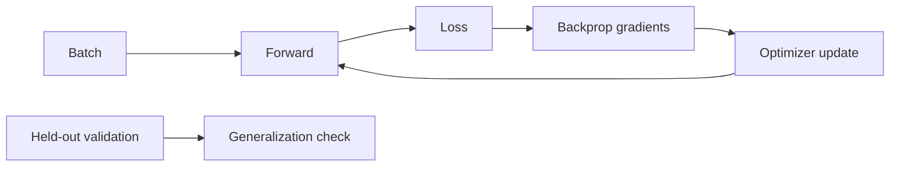

# 01 · 线性代数、概率、信息论与优化

> 一句话点题：AI 数学的目标不是先补完大学教材，而是能读懂“表示怎样变换、概率怎样归一、损失在优化什么、指标为什么可能骗人”，并用小实验验证直觉。

<div class="lesson-meta"><span>AAI01—AAI03</span><span>可选进阶</span><span>预计 10 × 45 分钟</span><span>前置：AI01—02、基础代数与 Python</span></div>

## 解锁与跳过

需要读训练/推理论文、理解相似度/损失/校准或调试模型时解锁。做 API/RAG 产品不必先证明定理；可以把深水推导暂时跳过，保留“能解释＋能算小例子”的主线。

## 本章可观察目标

你能用向量/矩阵解释表示与线性变换；能从条件概率、期望、方差理解不确定性和采样；能解释熵/交叉熵/KL；能手算梯度下降并识别过拟合、学习率与验证泄漏。

## AAI01 · 向量是带方向的表示，矩阵是批量变换

向量可表示一个样本/Token 的特征；点积衡量方向相合并产生标量；矩阵乘法把多个输入维度混合到新空间。形状是首要调试工具：`X [batch, features] × W [features, hidden] = H [batch, hidden]`。

余弦相似度 `a·b/(||a||||b||)` 消除长度影响，但相似不等于蕴含。正交表示方向独立；低秩表示说明变换主要落在较小子空间，这为 LoRA 建立直觉。

```text
输入 x → 线性变换 Wx+b → 非线性 → 新表示 h
矩阵不是“装数字的表”，而是定义空间怎样旋转、缩放、组合。
```

特征值/奇异值在入门可只理解为变换的重要方向与强度；SVD/低秩近似在压缩/适配中有用，不必先做完整证明。

## AAI02 · 概率描述信息不足，不是语气置信

条件概率 `P(A|B)` 表示观察 B 后 A 的分布；Bayes 规则把先验与证据结合；期望是长期加权平均，方差描述波动。语言模型输出的是词表条件分布，采样从中选择。

Softmax 把 logits 变成和为 1 的概率，但概率大小不保证与真实正确率校准。一个模型所有回答都说 0.9，实际只 60% 对，就是过度自信。校准需要可靠标签和 reliability diagram/ECE 等任务级分析，模型自然语言“我 90% 确定”不是概率测量。

统计评测要区分样本噪音与真实提升。100 条上从 80 到 83 可能是随机波动；重复运行、bootstrap/置信区间和分组有助于诚实报告。数据不是独立同分布时，普通公式也会失真。

信息熵衡量分布不确定，交叉熵衡量目标分布下模型分配概率的代价；KL 衡量一个分布相对另一个的差异，非对称。低 perplexity 不自动等于更有用/安全的 Agent。

## AAI03 · 梯度让参数朝局部降低损失的方向走

导数是局部变化率，梯度收集所有参数方向；链式法则把输出误差沿计算图反传。梯度下降：`θ ← θ - η∇L`，学习率太大震荡/发散，太小收敛慢。mini-batch 提供带噪梯度并利用硬件并行。

训练损失下降、验证损失上升是过拟合信号；正则化、更多代表数据、早停/简化模型可能改善。训练/验证泄漏会给虚假成绩；同一用户/文档模板跨切分尤其危险。

优化目标只是代理。若只优化点赞/停留，系统可能学会标题党；偏好模型也会利用 rubric 漏洞。指标设计与数据质量仍是产品判断。



## 贯穿案例：相似度高却检索错

查询与文档 embedding 余弦 0.88，但文档说“不可结转”，查询问“可以结转多久”。表面词/主题相似，语义极性相反。数学没有保证相似度=答案支持；需要重排/交叉编码、否定样本和引用验证。把检索阈值从 0.8 调到 0.9 不解决表示目标错误。

## 会死在哪里

- 只背公式不连接数据/任务；每概念配小实验。
- 形状错误靠试；先写张量维度。
- Softmax 概率当正确率；做校准。
- 小样本 +3% 宣称提升；区间/重复/分组。
- 验证集被调参/同源泄漏；隔离隐藏集。
- 损失下降等于产品价值；检查目标错配。

## 与 AI 协作模板

```text
请用“直觉→形状→最小数字例子→代码实验→产品边界”解释：
- 对每个向量/矩阵写 shape 和运算含义；
- 手算一个 dot/softmax/cross-entropy/gradient step；
- 区分模型概率、校准概率和自然语言置信；
- 给小样本提升的区间/重复方案；
- 检查训练/验证泄漏与优化目标代理问题；
- 标注可跳过的证明，不让深水区阻断主线。
```

## 练习：一个 Notebook 串起数学主线

不用深度框架先用数组：二维向量点积/余弦；手写稳定 softmax；算 3 类交叉熵；对线性回归手算一次梯度并数值差分检查；画不同学习率曲线；制造 train/validation 泄漏；用 bootstrap 比较两个小评测结果。每节写“它能证明/不能证明什么”。

## 常见误区

补完数学才能做 AI；向量相近就事实相同；概率高就正确；熵越低越好；loss 是产品目标；梯度下降找到全局最好；验证集可持续调参；数学公式比数据质量重要。

<Quiz question="检索余弦相似度 0.9，能否证明文档支持答案？" :options="['能，高于阈值就蕴含', '不能，相似度反映表示空间接近，仍需相关/蕴含和引用验证', '只在中文能']" :answer="1" explanation="相似度目标不等于事实支持，尤其否定、数字和多跳关系。" />

## 本章小结

- 向量表示、矩阵变换，shape 是理解和调试第一语言。
- 概率分布不自动校准，模型语气不是可信置信度。
- 熵/交叉熵/KL 描述分布与损失，不等于产品价值。
- 梯度优化代理目标；学习率、数据和泛化决定训练结果。
- 数学服务可验证判断，不必先完成所有证明才做项目。

<EvidenceTracker lesson="advanced-ai-01-math-optimization" />

## 本章完成标准

能手算并代码验证核心运算；解释一次评测波动/校准；发现一个数据泄漏或代理目标风险；把数学结论准确映射到产品边界。最近平均至少 7/10。

<div class="source-note">主要来源（核验于 2026-08-31）：<a href="https://pytorch.org/tutorials/beginner/basics/intro.html">PyTorch Tutorials</a> 与 Goodfellow 等人的 <a href="https://www.deeplearningbook.org/">Deep Learning</a> 开放教材。课程只选后续节点必要数学。</div>
