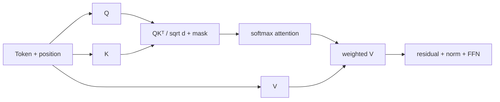

# 02 · Transformer、Tokenization 与训练系统

> 一句话点题：Transformer 的关键不是“注意力很强”，而是每个 Token 根据其他位置构造上下文表示；训练系统则把海量数据、矩阵计算和跨设备通信组织成可优化过程。

<div class="lesson-meta"><span>AAI04—AAI06</span><span>可选进阶</span><span>预计 10 × 45 分钟</span><span>前置：AAI01—03、AI01—04</span></div>

## 解锁与跳过

需要理解模型结构、Tokenizer 边界、训练数据或 GPU/分布式训练约束时解锁。只调用托管模型不必深入并行训练；可先掌握单层 forward 和数据生命周期。

## 本章可观察目标

你能手算小型 self-attention、解释多头/位置/残差/归一化；能分析 Tokenizer 对成本/语言/边界的影响；能画预训练数据到 checkpoint 的管线；能比较数据/张量/流水线并行与通信瓶颈。

## AAI04 · Self-attention 在同一序列内路由信息

输入表示乘权重得到 Q/K/V；相似度 `QKᵀ/√d` 经 mask/softmax 成权重，再加权 V。因果 mask 禁止看到未来 Token。多头允许不同子空间关系；位置编码提供顺序；残差和归一化帮助深层优化；前馈层逐位置变换。



标准 attention 对序列长度的 score 矩阵是 O(n²) 空间/计算因素之一，长上下文昂贵；现代实现用 FlashAttention、稀疏/分块等优化，但“支持 1M context”不表示所有位置检索可靠。

## AAI05 · Tokenization 与训练数据定义模型看见的世界

BPE/Unigram 等从语料学习子词；罕见词/多语言/代码可能被切更多 Token。Tokenizer 是模型词表的一部分，不能随意替换。测试具体业务文本的 Token 分布、截断和成本，而非按字符猜。

数据管线：采集→许可/隐私→去重→质量/安全过滤→格式化/混合→tokenize/shard→训练→验证。去重防止记忆/验证污染；配比决定能力；过滤也可能系统性伤害某些语言/群体。每批数据需来源、许可、版本、删除/追溯能力；“网上公开”不等于可随意训练。

训练自回归目标预测下一个 Token。预训练学通用分布，后训练使其遵循指令/偏好。数据质量、目标与评测共同决定行为，架构名不能替代。

## AAI06 · 训练系统在内存、计算与通信之间切分

模型参数、梯度、optimizer state、activation 占显存。Mixed precision 节省/加速但有数值稳定；gradient accumulation 用多小 batch 模拟大 batch；checkpointing 以重算换显存。

数据并行复制模型、分数据，需聚合梯度；张量并行拆矩阵，层内通信频繁；流水线并行拆层，有 bubble；ZeRO/FSDP 分片参数/梯度/optimizer state。选择取决于模型规模、网络拓扑、batch 和工程能力。

有效吞吐要看 tokens/s、模型 FLOPs 利用、通信、数据加载和 checkpoint；GPU 利用率高也可能在无效 padding。训练需 checkpoint/恢复、实验配置/代码/数据版本、验证和异常检测。checkpoint 不是部署模型前的唯一证据，还要评测/安全。

## 贯穿案例：中文客服微调成本被低估

团队按英文字符估 Token，中文/表格/代码实际 Token 分布不同；上下文 padding浪费显存，数据重复让验证虚高。先用目标 tokenizer 统计分布/截断；按长度 bucket/packing；按来源去重并按文档切分验证；小规模 scaling pilot 测 tokens/s/显存/通信，再估总成本。不要用理论 FLOPs 直接报价。

## 会死在哪里

- attention 权重当因果解释；它只是内部机制信号。
- 长上下文标称=可靠利用；做位置/多跳评测。
- 字符估 Token；用真实 tokenizer。
- train/val 随机行切分导致同文档泄漏。
- GPU 利用高就有效；看 padding/数据/通信/tokens。
- checkpoint 可加载=训练成功；评测和数据追踪。
- 大规模直接开跑，无小 pilot/恢复演练。

## 与 AI 协作模板

```text
请从模型/数据/系统三层审查训练：
- 用小矩阵手算 Q/K/V、mask、softmax、weighted V 和 shape；
- 统计业务文本 Token/截断/长度分布，不按字符猜；
- 画来源/许可/去重/过滤/混合/切分/删除的数据 lineage；
- 估参数/梯度/optimizer/activation 内存；
- 比较数据/张量/流水线/分片的通信和适用规模；
- 用小 pilot 校准 tokens/s、成本、恢复，再决定扩展。
```

## 练习：从单层到小训练

手算 3 Token 单头 attention 并用 PyTorch 对照；比较因果 mask；统计一个中文/代码数据集 tokenizer 长度；训练很小模型/层做 overfit sanity check；记录 loss/validation、显存、tokens/s；中途 checkpoint恢复；改变 packing/长度 bucket 看效率与结果。

## 常见误区

Transformer=attention 一个公式；多头一定可解释；上下文越长越聪明；Tokenizer 无关紧要；数据越多越好；公开=可训练；GPU 数翻倍速度翻倍；checkpoint 就是模型治理；先租大集群再估。

<Quiz question="数据并行增加 GPU 后速度没有线性提升，最可能需检查什么？" :options="['字体大小', '梯度通信、数据加载、batch/拓扑和同步等待', '把 temperature 调高']" :answer="1" explanation="数据并行需要跨设备聚合梯度，通信/输入会限制扩展。" />

## 本章小结

- Attention 用 Q/K/V 在序列内路由信息，长序列有二次型矩阵成本。
- Tokenizer 决定模型输入粒度/成本，是模型不可随意替换的一部分。
- 数据来源、许可、去重、过滤、配比与切分决定能力/风险。
- 分布式训练在显存、计算和通信之间取舍，不会随 GPU 线性扩展。
- 小 pilot、checkpoint恢复与版本 lineage 是大训练前置证据。

<EvidenceTracker lesson="advanced-ai-02-transformer-training" />

## 本章完成标准

手算/实现小 attention；完成业务 Token 统计与数据 lineage；用小训练报告显存/tokens/通信/验证并恢复 checkpoint；能说明扩展瓶颈。最近平均至少 7/10。

<div class="source-note">主要来源（核验于 2026-08-31）：<a href="https://arxiv.org/abs/1706.03762">Attention Is All You Need</a>（2017）与 <a href="https://docs.pytorch.org/docs/stable/">PyTorch Documentation</a>。原论文不代表所有现代架构/实现。</div>
