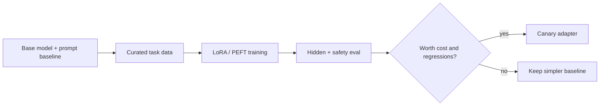

# 03 · PEFT/LoRA、偏好优化与评测数据

> 一句话点题：微调不是“把知识喂给模型”的默认方式，而是在任务稳定、数据可信、Prompt/RAG 基线已达边界时，用受控参数更新改变行为分布，并承担回归与部署治理。

<div class="lesson-meta"><span>AAI07—AAI09</span><span>可选进阶</span><span>预计 10 × 45 分钟</span><span>前置：AAI01—06、AI15—17</span></div>

## 解锁与跳过

必须已有明确任务、代表数据、基线、独立评测；Prompt/RAG/工具无法稳定解决行为/格式/领域模式时才解锁。最新事实/私有文档更新通常优先 RAG，不要用微调当数据库。

## 本章可观察目标

你能比较 full fine-tuning、PEFT/LoRA 与 Prompt/RAG；能设计许可/隐私/去重/切分数据；能解释 SFT 与偏好优化目标；能做 base vs tuned 盲测、回归、安全与回滚。

## AAI07 · LoRA 用低秩增量适配权重

冻结原权重 W，只训练 `ΔW = BA`，rank r 远小于原维度，减少可训练参数/optimizer 状态；推理可合并或加载 adapter。低秩假设是否够由任务验证；rank/target modules/lr 是超参，不是越大越好。

```text
Base W（冻结） + LoRA B·A（可训练低秩） → adapted layer
```



PEFT 降训练成本，不保证数据更少、不遗忘、不安全。不同 base version 的 adapter 未必兼容；多 adapter 路由、合并和生命周期增加服务复杂。全量微调自由度更高但资源/回归/模型存储成本大。

选择：需要最新事实→RAG；稳定输出合同→结构化输出/Prompt；稳定行为/风格/领域映射且有数据→SFT/PEFT；基础能力不足→换更合适模型可能更经济。

## AAI08 · SFT 与偏好优化在优化什么

SFT 用 input→target 模仿高质量示例；数据一致性和覆盖重要。偏好数据是 prompt 下 chosen/rejected；DPO 等直接优化相对偏好，RLHF 还涉及 reward model/强化学习。偏好反映标注政策，可能把风格偏好误当事实/安全。

避免把模型生成输出未经验证再训练自己，错误会放大。难例/边界/拒答/工具参数比海量相似正例有价值。课程级产品先做数百/数千高质量数据的 pilot，而非盲追数量。

训练稳定看 loss、gradient norm、learning rate、过拟合；但最终按任务评测。训练 loss 更低可能只是记住格式。

## AAI09 · 数据与评测是主要工程

数据卡记录来源/许可/隐私/语言/时间/标注指南/过滤/已知偏差/删除。按用户/文档/模板切分，去重，防 test contamination。标注有 rubric、gold/复核、分歧处理和一致性。

对照至少：base+原 Prompt、base+改进 Prompt/RAG、tuned。固定推理设置，盲化/随机顺序；报告任务成功、子组、安全、拒答、格式、成本、延迟。新能力提升可能破坏通用能力，跑 regression suite。

发布保存 base digest、adapter、训练代码/配置/数据版本和评测；canary/回滚 adapter。若模型供应商/基础模型更新，重新兼容评测。

## 贯穿案例：客服分类是否需要 LoRA

200 类工单分类，Prompt baseline 82%；补标签定义/层级两阶段后 90%；RAG 注入最新类目到 92%；LoRA 到 94%，但罕见类下降且基础模型版本升级需重训。业务每提升 2% 节省的人工 vs 数据/训练/运维成本决定是否值得。若类目每周变，RAG/规则可能比把类别固化进权重更可维护。

## 会死在哪里

- 无 baseline 就微调；无法证明价值。
- 用微调存最新事实；更新/删除困难。
- 随机行切分，同模板泄漏。
- 合成输出未验证回灌；错误闭环。
- 只看 train loss/总体准确；忽略子组/安全。
- adapter/base 版本不绑定。
- tuned 模型无回滚/数据删除路径。

## 与 AI 协作模板

```text
请先做“是否需要微调”决策：
- 列 Prompt/Schema/RAG/换模型基线与失败类型；
- 判断是知识更新还是稳定行为适配；
- 设计数据卡、许可/隐私/去重、按主体切分和标注 rubric；
- 比较 full/PEFT/LoRA 的显存、部署、版本和回归；
- 盲测 base vs tuned，报告子组/安全/成本；
- 绑定 base/adapter/data/code/eval 版本与 canary/rollback。
```

## 练习：完成小型 LoRA 决策实验

选稳定分类/结构转换，200—1000 条经过审查数据；先做 Prompt/RAG baseline；按来源组切分；训练小 LoRA pilot；盲测并分错误类；跑注入/拒答/通用回归；报告增益对应业务价值、训练/服务成本和维护触发器。即使结论“不值得微调”也算成功证据。

## 常见误区

微调让模型知道私有知识；LoRA 永远不降能力；数据越多越好；训练 loss 代表上线；随机切分安全；模型自生成标签就够；rank 越大越好；adapter 可跨 base；准确率提升就值回成本。

<Quiz question="公司制度每周更新，希望回答最新条款，首选通常是什么？" :options="['每周 LoRA 微调', '版本化 RAG/事实工具并做引用评测', '提高 temperature']" :answer="1" explanation="高频更新事实更适合外部可更新/可撤销知识源，微调权重难追踪和删除。" />

## 本章小结

- 微调是行为适配方案，不是最新事实存储默认方案。
- LoRA 训练低秩权重增量，省资源但仍有数据/回归/服务成本。
- SFT 模仿目标，偏好优化编码偏好政策；数据质量决定上限。
- 评测必须与 Prompt/RAG/换模型基线对照并看子组与安全。
- base、adapter、数据、代码和评测要绑定版本并可回滚。

<EvidenceTracker lesson="advanced-ai-03-finetuning" />

## 本章完成标准

完成是否微调决策、数据卡/防泄漏切分、base/Prompt/RAG/tuned 对照与安全回归；发布包可追溯/回滚。最近平均至少 7/10。

<div class="source-note">主要来源（核验于 2026-08-31）：<a href="https://arxiv.org/abs/2106.09685">LoRA</a>（2021）与 <a href="https://huggingface.co/docs/peft/">Hugging Face PEFT Documentation</a>。论文结果不可直接外推到任意任务/基础模型。</div>
