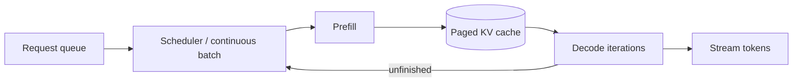

# 04 · 推理系统、KV Cache、量化与服务

> 一句话点题：模型推理服务的核心矛盾是 GPU 显存/算力如何在变化长度和到达率的请求间共享；优化必须同时守住正确性、首 Token、吞吐和成本。

<div class="lesson-meta"><span>AAI10—AAI12</span><span>可选进阶</span><span>预计 9 × 45 分钟</span><span>前置：AAI04—09、Q12—14</span></div>

## 解锁与跳过

自托管数据政策、吞吐、TTFT、TPOT、显存或成本明确排除托管服务时解锁。没有持续负载/GPU 运维能力时，API 常更经济；先算 TCO。

## 本章可观察目标

你能区分 prefill/decode 和 TTFT/TPOT；能解释 KV cache、continuous batching、paged attention；能比较量化/并行；能设计 admission、调度、容量、正确性回归和故障恢复。

## AAI10 · Prefill 与 Decode 使用资源方式不同

Prefill 处理全部输入，矩阵大、并行度高、偏 compute-bound；decode 每步生成一个 Token，反复读参数/KV，偏 memory bandwidth-bound。TTFT 包含排队+prefill，TPOT/生成速度影响流式体验。

KV cache 保存每层过去 Token 的 K/V，避免每步重算，大小随并发、上下文、层/头/精度增长；常成为显存瓶颈。请求结束释放；前缀缓存可复用稳定前缀但有命中/隔离/隐私边界。



## AAI11 · 调度与分页 KV 提高利用率

静态 batch 等所有请求完成，短请求被长请求拖；continuous batching 在 decode 步间加入/移除请求。PagedAttention 类似虚拟内存按块管理 KV，减少连续预留和碎片，提高可服务并发。收益依长度分布/硬件/版本，不等于无上限。

调度要处理 prefill 大请求阻塞 decode、优先级、公平、取消和 SLO。chunked prefill把大 prefill 分块以平衡。过载时 admission/队列上限/Token预算/429，而非把所有请求放 GPU 队列导致 TTFT 无限。

张量并行跨 GPU 拆矩阵，降低单卡容量压力但层内通信；流水线拆层有 bubble；副本数据并行提高吞吐。跨节点互联带宽/拓扑可能让扩 GPU 变慢。

## AAI12 · 量化用数值精度换容量/速度

权重量化 FP16/BF16→INT8/INT4 降显存/带宽，可能提高吞吐；KV量化进一步省并发内存；activation量化更难。PTQ 直接校准，QAT 训练适应。质量影响按任务/语言/长上下文/工具参数评测，不能只看 perplexity。

服务治理：模型/Tokenizer/量化/引擎/driver版本；健康不是进程 alive，而是小推理与 GPU 状态；warmup；权重下载/校验；滚动保容量；请求/Token/显存/queue/TTFT/TPOT/错误/每成功任务成本。GPU 故障/OOM 要隔离重启，长流式请求可重试语义要诚实。

## 贯穿案例：吞吐提升但用户更慢

调大 max batch 后 tokens/s 提升 35%，但队列等待和大 prefill 占用使 TTFT p99 从 1.2s 到 8s。目标是交互产品，优化失败。改用连续 batch＋prefill/token admission＋长度分池/公平；同时报告 throughput 与 TTFT/TPOT。离线批处理可能选择不同策略。吞吐单指标不能决定调度。

## 会死在哪里

- tokens/s 唯一指标；忽略 TTFT/TPOT/错误。
- 最大上下文×最大并发静态预留/OOM。
- 量化只测平均榜单；工具 JSON/语言子集退化。
- GPU 扩展忽略通信拓扑。
- 队列无限；过载延迟雪崩。
- 模型 tag 浮动；不可复现。
- 流式中断自动重试产生重复文本/副作用。

## 与 AI 协作模板

```text
请做推理服务容量/正确性评审：
- 写请求长度/输出/到达/优先级分布和 TTFT/TPOT SLO；
- 分 prefill/decode，估权重/KV/并发显存；
- 比较 continuous batching/paged KV/chunked prefill/并行通信；
- 设计 admission、队列、取消、公平和过载；
- 对每个量化跑任务/语言/长上下文/工具 Schema 回归；
- 绑定模型/Tokenizer/量化/引擎/driver并做 warmup/故障演练。
```

## 练习：建立小型推理基准

用可用开源小模型/vLLM 或模拟器，构造短/长/混合输入；比较 batch/continuous策略；测 TTFT、TPOT、tokens/s、queue、显存；对原精度/量化运行固定 50 条任务；施加过载验证 admission；杀 worker/制造 OOM观察恢复。计算每成功任务成本并与托管方案对照。

## 常见误区

GPU 利用率高就体验好；batch 越大越好；KV cache 很小；长上下文无额外成本；量化无质量损失；多卡线性；vLLM 安装后自动生产级；自托管只算 GPU 租金；无限队列保护请求。

<Quiz question="调大 batch 后 tokens/s 上升、TTFT p99 大幅恶化，对交互产品算成功吗？" :options="['一定成功', '不一定，必须以交互 SLO 和每成功任务成本判断', '只看 GPU 利用率']" :answer="1" explanation="吞吐与首 Token延迟会权衡；用户质量属性决定优化目标。" />

## 本章小结

- Prefill/Decode资源特性不同，TTFT/TPOT与吞吐需同时管理。
- KV cache 随序列和并发增长，paged管理减少碎片但不取消容量上限。
- Continuous batching/调度提高利用，需公平、取消和 admission。
- 量化用精度换显存/带宽，必须做任务与安全回归。
- 推理生产还需版本、容量、故障、成本和托管 TCO 对照。

<EvidenceTracker lesson="advanced-ai-04-inference" />

## 本章完成标准

完成混合长度基准、显存/容量估算、调度/过载实验和量化正确性回归；报告 TTFT/TPOT/吞吐/每成功成本与托管对照。最近平均至少 7/10。

<div class="source-note">主要来源（核验于 2026-08-31）：<a href="https://docs.vllm.ai/en/latest/">vLLM Documentation</a> 与 <a href="https://arxiv.org/abs/2309.06180">Efficient Memory Management for LLM Serving with PagedAttention</a>。性能结论依版本、硬件和 workload，需实测。</div>
