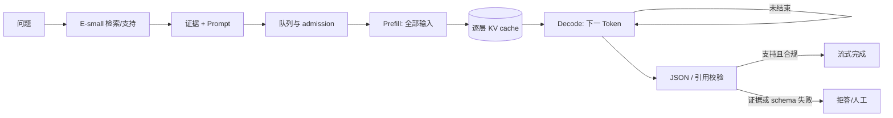

# 04 · 让已验收模型在队列里保持正确

> 第三章交来的不是“更聪明的模型”，而是一个绑定了证据、门禁和回退的 release candidate。本章跟随一条请求穿过排队、prefill、KV cache 与 decode：优化只有在正确性回归不破、交互 SLO 不退化时，才算服务能力。

<div class="lesson-meta"><span>AAI10—AAI12</span><span>第二阶段 · 适配与服务</span><span>8 个标准回合（每回合 45 分钟）</span><span>前置：AAI07—09</span></div>

<KnowledgeFlow
  title="从一条请求建立容量与正确性的共同账本"
  intro="读完以后，你应当能分开测量 prefill 与 decode，按模型结构估算 KV cache，用代表性负载比较 batching 和量化，并以满足质量与延迟门禁的 goodput 放行。"
  what="自回归服务把输入一次编码为 KV 状态，再逐 Token 解码；动态序列、调度与数值精度共同决定显存、延迟、吞吐和输出。"
  why="tokens/s 上升可能伴随队列恶化、长请求阻塞、量化回归或错误回答增加。只优化设备忙碌程度，会把训练阶段守住的产品门禁丢在服务层。"
  how="先固定 release manifest 和负载画像，沿请求拆时延、算 KV、施加调度与量化变式；每次系统改动都重放独立正确性集，最后用 SLO-goodput 与每成功请求成本决定 canary 或回退。"
  terms="prefill | decode | TTFT | TPOT | KV cache | continuous batching | 量化 | admission | SLO-goodput"
/>

## 一条请求先穿过两种模型

沿用政策知识助手。`E-small` 先完成召回与支持判断，给出带版本的政策证据；通过第三章门禁的 `G-base + adapter` 再按 schema 生成引用答案。若第三章最终拒绝了 LoRA，这里的 adapter 字段就是 `none`，其余服务审计不变。我们不会把编码器和 decoder 的耗时、容量或错误混成一个数字。

先看一条**假设追踪**：输入经检索后形成 1,536 Token 的 Prompt，等待调度 40 ms，decoder 用 180 ms 处理整段输入，在第 220 ms 返回首 Token，随后生成 79 个 Token，相邻 Token 中位间隔 28 ms。若客户端在请求进入网关时开始计时，则 TTFT 是约 220 ms；端到端完成时间还包括全部 decode、后处理与网络发送。不同系统可能把网关、检索或网络排除在 TTFT 外，报告必须写测量边界。



这条链有两种拒绝，不应混淆。证据不足或引用矛盾是产品语义上的 `abstain`，可以生成安全回复；队列已越过容量上限则是服务层拒绝，应在占用 GPU 前返回明确的过载状态、重试提示或降级路由。把过载伪装成“模型不知道”，会污染质量统计。

<span id="aai10"></span>

## Prefill 和 decode 使用同一模型却不是同一种工作

Prefill 同时处理整个输入序列，计算每层表示并建立各位置的 key/value。矩阵维度大、并行度通常较高，在一些硬件与批量下更偏计算受限。Decode 每轮只为每个活跃请求产生下一个 Token，却要读取权重及过去的 KV；小批量时常更受内存带宽影响。两者的实际瓶颈会随模型、batch、内核和硬件改变，必须 profile，不能把“prefill compute-bound、decode memory-bound”当永恒定律。

面向交互产品至少分开记录：排队时间；约定入口至首 Token 的 TTFT；首 Token 后相邻输出间隔 TPOT；直到 schema、引用校验和最后字节的端到端时间；以及每请求输入/输出 Token。缺少测量边界的延迟数字不可比较。

DistServe 分开建模 TTFT/TPOT，并探索把 prefill/decode 放在不同 GPU 上以减少干扰。但小模型、低流量或互联不足时，传输和运维成本可能更高；应先测共置基线，再决定是否分离。

一次典型事故是：把最大 batch 调高后，设备 tokens/s 增加 35%，但长 Prompt 的 prefill 挡住已有请求的 decode，TTFT p99 从 1.2 s 升到 8 s。对离线报表可能仍是收益，对交互问答就是失败。吞吐描述设备完成了多少工作，SLO 才描述用户得到的工作是否及时。

## KV cache 是随请求增长的状态，不是免费加速

没有缓存时，第 $t$ 个输出 Token 会反复计算前面位置的 K/V。KV cache 保存每层历史状态，避免这部分重算，但显存随活跃 Token 增长。对采用 grouped-query attention 的假设模型，可先用

$$
\text{KV bytes/token}=2\times L\times H_{kv}\times D_{head}\times B
$$

估算，其中 2 表示 key 与 value，$L$ 是层数，$H_{kv}$ 是 KV 头数，$D_{head}$ 是每头维度，$B$ 是每元素字节数。假设 `L=24`、`H_kv=8`、`D_head=128`、FP16/BF16 为 2 bytes，则每 Token 为 98,304 bytes，即 96 KiB；缓存 2,048 Token 约 192 MiB，一个时刻 16 个这种请求约 3 GiB。

这仍不是峰值显存。还要加权重、adapter、运行时 workspace、临时张量、内存池与碎片；输入长度和已生成长度都占 KV。张量并行会改变每卡分布，量化 KV 会改变元素大小，beam/speculative decoding 和前缀共享也会改变状态。真实模型必须从配置读取 KV 头，而不能拿 attention 总头数代替；多查询注意力的 `H_kv` 可能远小于 query 头数。

PagedAttention 论文指出，KV 长度动态变化会导致预留、碎片与复制浪费，并用分页思想按块管理与共享。它能提高可用率，却没有消除每个有效 KV 元素的容量。论文报告的吞吐提升来自其模型、硬件、序列与对手版本，不是安装某个引擎后的固定倍数。

前缀缓存只有在模型、adapter、tokenizer、系统 Prompt、政策版本和访问域兼容时才可命中；含个人或租户机密的前缀默认隔离。还要审计失效、命中与侧信道，旧政策命中会让低延迟答案变成错误答案。

<span id="aai11"></span>

## Batching 是调度政策，不是一个越大越好的整数

静态 batch 在一组请求上共同运行，短输出可能等待长输出结束。迭代级或 continuous batching 在 decode 步之间加入新请求、移除已结束请求，使动态长度更容易共享设备。Orca 的原始工作提出 iteration-level scheduling 与 selective batching，并在特定 175B 模型系统上报告结果；机制可借鉴，论文中的倍数不可搬到 `G-base`。

调度器至少同时看四种预算：当前 KV blocks、每轮可处理 Token、prefill Token 与活跃序列数。只限制“并发请求数”会把 64 个短问和 64 个超长问视为同一负载。公平策略还要避免一个 20k Token Prompt 长时间阻塞短交互；可比较 length bucket、chunked prefill 或 prefill/decode 分离，但每种方案都要重测尾延迟。

Admission control 是容量设计的一部分。进入队列前检查最大 Prompt、预期输出上限、租户配额和当前排队预算；进入后支持取消，并在客户端断开时及时释放 KV。若预测等待已超过 SLO，就明确拒绝、路由到保守小模型或进入异步通道，而不是建立无限队列。自动重试流式请求还要带幂等标识；已经发出一半文本后静默重放，可能重复内容或下游动作。

从负载画像估容量时，不能只用平均长度。记录到达率及突发、Prompt/output 的 p50/p95/p99、语言、优先级和 adapter 路由。在稳定系统中可用 Little 定律 $N\approx\lambda W$ 做一致性检查：若 4 req/s、平均系统时间 2 s，平均在途约 8 个；尾部长请求、突发、冗余和 SLO 仍须压测。

## 量化先改变数值表示，再可能改变服务表现

“INT4 模型”信息不足。需要说明量化的是权重、activation 还是 KV，组大小与 scale、校准方法、哪些层保留高精度，以及引擎与硬件是否有匹配 kernel。`W4A16` 表示常见的 4-bit 权重/16-bit activation 路径，但模型文件和运行时显存不会精确缩成 FP16 的四分之一：还有 scale、元数据、未量化层、KV、activation 与 workspace。

后训练量化无需重新完成完整训练，但仍可能改变小 logit 差、罕见 Token、长上下文、中文标点、引用 ID 和结构化输出。AWQ 使用 activation 统计寻找并保护显著权重通道，是一种具体权重量化方法；其论文结果不能证明当前 adapter、语言或 GPU 上无损。量化校准集也不能偷看 `test_sealed`，应覆盖真实 Prompt 长度、语言与任务格式。

比较 FP16/BF16、INT8 或 INT4 时，用同一服务门禁而非只看 perplexity：任务成功、无依据接受、schema、拒答、高风险切片、TTFT/TPOT、峰值 KV、SLO-goodput 和每成功请求成本。adapter 是否合并、以何种精度执行、KV 是否量化会随引擎版本变化，必须进入 manifest。硬件不支持高效内核时，位宽更低甚至可能更慢。

只要量化候选在证据支持或拒答门禁上失败，即使吞吐翻倍也要回退。若退化只在一个可隔离低风险语言切片出现，可以先禁止该路由并补证据；不能用总体平均掩盖。

## 用正确性调整后的 goodput 做共同指标

Offered load 是客户端送来的请求率，throughput 是系统完成的请求或 Token，SLO-goodput 是在延迟门限内完成的请求率。本课程再加一项产品门禁：**correctness-adjusted goodput**，只数同时通过 TTFT、TPOT、schema、引用支持与拒答规则的请求。它不能替代逐项指标，却能阻止“更快地产生错误答案”获胜。

下面代码先复算 KV，再对一个 60 秒的**教学用假设压测**计算尾延迟与合格 goodput。`schema_ok` 与 `supported_or_abstain` 来自第三章 rubric，不是线上凭感觉打分。

```python
import math

layers, kv_heads, head_dim, bytes_per_value = 24, 8, 128, 2
bytes_per_token = 2 * layers * kv_heads * head_dim * bytes_per_value
request_bytes = bytes_per_token * 2048
print("KV per token:", bytes_per_token / 1024, "KiB")
print("KV per 2048-token request:", request_bytes / 2**20, "MiB")
print("KV for 16 such requests:", request_bytes * 16 / 2**30, "GiB")

records = [
    # ttft_ms, tpot_ms, schema_ok, supported_or_abstain
    (260, 26, True,  True),
    (320, 31, True,  True),
    (410, 35, True,  True),
    (540, 39, True,  True),
    (700, 42, True,  True),
    (820, 55, True,  True),   # TPOT 超门禁
    (1300, 47, True, True),   # TTFT 超门禁
    (2100, 61, False, False), # 延迟与正确性都失败
]

def nearest_rank(values, percentile):
    ordered = sorted(values)
    return ordered[math.ceil(percentile * len(ordered)) - 1]

qualified = [r for r in records
             if r[0] <= 1000 and r[1] <= 50 and r[2] and r[3]]
print("p95 TTFT:", nearest_rank([r[0] for r in records], 0.95), "ms")
print("p95 TPOT:", nearest_rank([r[1] for r in records], 0.95), "ms")
print("correctness-adjusted goodput:", len(qualified), "req/min")
assert bytes_per_token == 98_304
assert len(qualified) == 5
```

八条样本不足以估计生产 p99，这段程序只验证定义和算术。真实压测需要 warm-up、稳定采样窗口、多轮重复与置信区间，并保存每请求记录。若只报这组数据的平均 TTFT，最后两个严重排队样本会被稀释。

<span id="aai12"></span>

## 三轮实验把速度改动拉回质量门禁

第一轮建立无优化基线。锁定第三章 release candidate、引擎 commit、容器/driver、GPU 型号、采样参数与结构化输出实现；用短、长、混合、突发四类 trace 压测。保存排队、TTFT、TPOT、端到端、输入/输出 Token、KV 使用、取消、OOM 与 `E-small` 检索耗时。健康检查必须真正生成并校验一个小回答，不能只看进程存活。

第二轮一次只改变一个变量：最大 batched tokens、调度策略、KV block 配置或量化格式。每个候选重放同一到达 trace，并随机交换实验顺序，避免温度、缓存和邻居负载偏置。长 Prompt 变式把 p95 输入拉到上限；过载变式逐步增加到达率，观察 admission 是否在队列失控前生效；取消变式在 decode 中途断开客户端，检查 KV 是否释放。

第三轮重放第三章封存的 600 条独立评测及哨兵集。生成模型可能因浮点归约、batch 组成或采样产生非逐字一致；固定 seed 也不保证跨引擎、跨硬件位级相同。评测应先验证 schema、引用 ID、证据支持、拒答动作和关键语义，再对需要确定性的字段使用约束解码。若产品确实要求 batch 不改变结果，则把 batch invariance 作为明确能力测试，并核对当前引擎文档，而不是默认存在。

每轮提交 `run-manifest.json`、原始 per-request JSONL、指标计算脚本、GPU/队列时间序列、正确性差异清单和决定记录。反馈按失败位置分流：TTFT 坏而 TPOT 正常，先查队列与 prefill；TPOT 坏，查 decode batch、带宽和 KV；OOM，降低 Token/admission 预算而非盲重启；schema 或支持率退化，回退量化/引擎并做逐样本差异；只有吞吐未达标但托管服务满足要求时，允许结论是“不自托管”。

## 发布演练必须包含坏路径

上线包应同时绑定 `E-small` 与索引版本、`G-base`、adapter、tokenizer、量化 artifact、引擎/内核、Prompt/schema、采样参数、硬件类、正确性集和容量曲线。先 shadow，再按租户或低风险意图 canary；不能让同一用户的一轮对话在 base 与 adapter 间无记录地漂移。

演练三种故障。其一，用超长 Prompt 与突发到达触发 admission，确认返回可区分的过载响应且没有无限排队。其二，制造 worker OOM，确认新流量被摘除、旧流式响应不会自动重复副作用、KV 释放后健康探针通过。其三，让量化候选在引用 ID 上产生一个已知回归，确认质量告警能先于 tokens/s 仪表盘触发回滚。

回滚后要核对四件事：路由百分比归零、旧 artifact digest 恢复、同一哨兵请求通过、监控中的版本标签没有混写。若错误来自政策证据而非引擎，回退模型可能无效，应转到索引版本回滚与语义拒答。服务手册必须告诉值班人员故障属于哪一层。

## 🎯 随堂检验

<Quiz question="某配置让总 tokens/s 提升 40%，但交互流量的 TTFT p99 越过 SLO，冻结集的引用支持率也下降。应怎样判断？" :options='["吞吐提升足够大，可以上线","失败并回退；分别定位排队/prefill 与正确性回归，不能用吞吐抵消门禁","再增加无限队列保存所有请求"]' :answer="1" explanation="服务优化必须同时满足时延与正确性门禁。吞吐更高不代表用户及时获得了正确结果。" />

<Quiz question="按公式算出 16 个 2,048-Token 请求约占 3 GiB KV，能否直接把最大并发设为 16？" :options='["能，显存只存 KV","不能，还要核算权重、workspace、分配开销、实际长度分布与故障余量，并用压测校准","只要换成更大 batch 就能"]' :answer="1" explanation="公式是容量账的一项和一致性检查，不是完整峰值，也不包含尾部与运行时行为。" />

## 本章小结：推理优化必须让时延、容量与正确性共同过关

推理系统的有效产出是在正确性门禁内满足用户时延的 goodput。本章把请求拆成排队、prefill 与 decode，计算随请求增长的 KV cache，比较 batching 和量化，再用压测与冻结回归共同判定配置。任何引擎、精度或调度变化都会生成新的服务版本，必须重新验证 SLO、schema、支持和拒答。

到这里，第三章的“为何适配”与本章的“怎样服务”应能由同一个 request ID 连起来。它记录请求使用了哪份证据、哪个 base、adapter、量化与引擎版本，经历多少排队、prefill 与 decode，最终是否在 SLO 内通过正确性门禁。没有这条连接，训练分数和服务吞吐只是两套互不负责的报表。

[第二阶段总结](/advanced/ai/stage-2-review)会把方法迁移到一个多语种跨境售后助手：事实来自订单工具与动态规则，稳定行为才可能适配；促销流量又会制造长短不一的队列。你需要在陌生数据与负载上同时做“是否改权重”和“怎样安全扩容”的决定。

<EvidenceTracker lesson="advanced-ai-04-inference" />

## 参考资料

- Gyeong-In Yu 等，[Orca: A Distributed Serving System for Transformer-Based Generative Models](https://www.usenix.org/conference/osdi22/presentation/yu)，OSDI，2022 年。用于 iteration-level scheduling 与 selective batching；其 175B 模型性能数字不能外推到本课程小模型。
- Yinmin Zhong 等，[DistServe: Disaggregating Prefill and Decoding for Goodput-optimized Large Language Model Serving](https://www.usenix.org/conference/osdi24/presentation/zhong-yinmin)，OSDI，2024 年。用于区分 TTFT/TPOT 约束和 prefill/decode 干扰；是否分离仍依本地模型、网络与负载实测。
- Woosuk Kwon 等，[Efficient Memory Management for Large Language Model Serving with PagedAttention](https://arxiv.org/abs/2309.06180)，SOSP，2023 年。用于 KV 动态内存与分页管理机制；论文吞吐倍数只适用于其评测设置，不能直接照搬。
- Ji Lin 等，[AWQ: Activation-aware Weight Quantization for LLM Compression and Acceleration](https://arxiv.org/abs/2306.00978)，MLSys，2024 年。用于 activation-aware 权重量化机制；不能据此假定任意任务、语言、adapter 或硬件无回归。
- vLLM Project，[vLLM 官方文档](https://docs.vllm.ai/en/latest/)，本课程核验于 2026-09-04。用于核对当前 metrics、batch invariance、LoRA 与量化后端；功能和参数随版本变化，实施时必须锁定版本并读对应文档。
