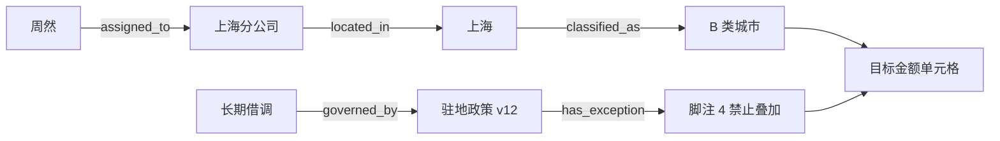

# 05 · 一次召回失败，要不要建图

> 第二阶段交来了一套能服务、能回退的可引用知识助手。多数问题已经由混合检索和重排答对，剩下的失败却集中在两处。一类问题要跨文件接上人物、制度和例外，另一类答案藏在表格的行列与脚注里。本章只处理这两种已被证据确认的缺口。

<div class="lesson-meta"><span>AAI13 至 AAI15</span><span>阶段三 · 检索与协作扩展</span><span>9 个标准回合（每回合 45 分钟）</span><span>硬前置：AI05—08 的检索基线与错误账本</span></div>

<KnowledgeFlow
  title="本章决定复杂检索是否值得"
  intro="读完以后，你应当能从普通检索的逐题失败出发，判断查询分解、关系图或视觉检索修复了哪一层，并提交一份允许拒绝复杂方案的对照实验。"
  what="高级检索把一个查询按证据依赖拆开，并在文本、关系或页面视觉索引中寻找完整证据集合；任何派生实体、关系和描述都要回到原始来源。"
  why="多跳问题缺一跳就无法作答，表格丢掉行列后也可能召回错误数字。增加索引与模型调用同时会带来错链、过期、权限和成本。"
  how="先冻结 hybrid 加重排基线，再标出失败属于哪种证据结构；只给对应切片增加分解、图或多模态路线，最后分层测实体、召回、引用和成本。"
  terms="evidence set | query decomposition | entity resolution | provenance | local/global search | visual retrieval | routed RAG"
/>

进入本章的**硬前置**不是“已经读过 RAG”，而是一份能重放的普通检索基线：版本化语料、必要证据集、ACL、逐题结果和分层错误账本必须齐全。**推荐前置**是 AAI10—12 的服务容量与正确性回归，以及 AI15、AI16、AI18 的评测主张、Trace 与生产指标；缺少它们仍可做离线小实验，但不能作生产采用判断。真正的**解锁证据**是：失败反复集中在多跳依赖或页面/多模态结构，而且增加候选、重排或修正基础解析后仍找不齐必要证据。没有这份证据，就留在普通检索。

## 基线已经很好，四十道题仍然答不稳

贯穿项目继续使用内部政策知识助手。第二阶段留下 `E-small`、`G-base`、索引版本、引用验证器、请求 trace 和服务容量曲线。当前检索基线叫 `hybrid-v7`，它把关键词与向量排名融合，再由交叉编码器重排。政策版本、ACL 和生效时间都已经进入过滤条件。

团队把封存集分成 80 道单段文本题、24 道关系题和 16 道版面题。下面是教学案例的假设结果，数字只用于演示判断，不能当成任何模型或行业成绩。

| 切片 | 一道题通过需要什么 | `hybrid-v7` 找齐必要证据 | 首先要查的失败 |
|---|---|---|---|
| 单段文本 | 一条生效条款 | 75 / 80 | 解析、版本、查询措辞与重排 |
| 跨文件关系 | 两至四条相互依赖的记录 | 9 / 24 | 后一跳是否依赖前一跳得到的实体 |
| 表格与页面 | 表头、目标单元格、脚注或图例 | 4 / 16 | 平文本是否丢了行列和位置 |

这张表没有给 GraphRAG 发通行证。先逐题做一个反事实检查。把 `top_k` 从 5 增到 20，或给重排器更多候选，如果正确证据已经出现，问题仍在基础召回容量、切块或排序。修这些地方通常比另建一套索引便宜。若全文中根本不存在答案，任何检索升级都只能扩大噪声，系统应拒答或请求补资料。

剩下的关系题出现了稳定结构。用户问周然借调上海期间能否同时领取驻地补贴与项目差旅补贴。第一份任职记录只给出借调单位和日期，第二份差旅制度把长期借调指向驻地政策，补贴金额位于一张城市等级表，禁止叠加的条件又写在表下脚注。原问题没有出现制度名、城市等级或脚注措辞，一次相似度查询很难同时命中四处。

这个问题的正确结果可能是 `abstain`。任职记录不可见、借调日期越界、城市别名无法确定、任一必要跳缺失，都会让证据集合不完整。生成器无权用常识补齐。

<span id="aai13"></span>

## 先把“多跳”写成可检查的依赖

多跳指后一步的检索输入依赖前一步得到的结果。四段互相独立、一次查询就能全部召回，只能算多来源；把一个问题拆成四句也不会自动产生多跳能力。

当前问题可以写成一张有类型的查询计划。

```text
q0  周然在目标日期属于哪种派驻状态
 └─ q1  该状态适用哪份补贴制度             depends_on q0.status
     ├─ q2  上海在该制度中属于哪一级         depends_on q1.policy_id
     └─ q3  驻地与差旅补贴能否叠加           depends_on q1.policy_id

answer requires q0 + q1 + q2 + q3
```

**Query decomposition** 给这种依赖一个名字。实现时保存子问题、依赖字段、允许的数据域、预算、返回 Schema 和停止原因。模型可以提议子问题，程序负责检查它有没有越过原任务、重复已有查询或使用尚未证实的中间实体。中间答案只保存短结论和来源引用，无需保存不可验证的思维文本。

IRCoT 在多步问答实验中交替生成推理片段与检索查询，说明后续检索可以受已取回信息引导。它的论文结果来自四个研究数据集，无法直接证明这套政策助手会获益。这里先采用更窄的工程版本。每一步只产生结构化槽位，检索结果经过实体、版本和 ACL 验证后才能进入下一步。

循环要有停点。必要槽位已经齐全就组装证据；连续两轮没有新来源、子问题超过四个、Token 或时限用尽时停止；出现冲突则返回冲突材料并转人工。一次分解生成十条近义查询，随后从同一段落抄出十份报告，只增加了花费。

## 图只保存一条可回到原文的候选路径

关系题中反复出现员工、组织、地点、制度和例外。团队可以先建一个几十个实体的可检查图。图的用途是缩小下一步候选，不负责把模型抽取结果升级为业务事实。



每条边至少携带 `subject_id`、`predicate`、`object_id`、`source_ref`、有效时间、访问域、抽取版本与验证状态。`周然 assigned_to 上海分公司` 若来自人事记录，它只能在获准任务中查询；`上海 classified_as B 类城市` 若来自表格抽取，仍须指向具体页、行列和版本。模型根据一句模糊描述生成的边标为候选，不能参加自动回答。

**Entity resolution** 负责判断两个名字是否指向同一对象。上海分公司、沪分和法人主体名称可能是别名，也可能落在不同权限域。错误合并会把不可见记录接进路径，错误拆分又会丢掉必要跳。评测要把实体链接单独列出来，记录正确、歧义后拒绝和错误放行，不能只看最终回答碰巧是否正确。

GraphRAG 的 local search 与 global search 解决的任务不同。局部路径适合围绕某个实体找关系和原始文本；社区报告适合询问整批材料的主题与变化。周然的补贴资格需要精确条件，没必要让全库社区摘要参与。即便使用微软 GraphRAG 的实体、关系和社区流程，生成的图与摘要仍是派生索引，索引成本、提示版本和原文追踪都要进入实验。

文档更新还要沿图传播。驻地政策 v13 生效后，旧边进入历史状态，新边重新抽取；删除原文时，依赖它的边、路径缓存和社区报告都要失效。无法列出影响集合时，图索引就没有达到生产可撤销要求。

<span id="aai14"></span>

## 一张表不能被压成一串相邻的词

16 道版面题来自 PDF 表格、流程图和扫描页。基础管线把页面 OCR 成平文本后，`B 类城市`、`260 元/天` 和脚注 4 可能进入三个 chunk。召回到了数字也不知道它属于哪一行。

多模态路线可以同时保留三份派生产物。

| 产物 | 用来找什么 | 回答时怎样落回原件 |
|---|---|---|
| OCR 与布局树 | 词语、表头、段落和阅读顺序 | 页码、区域坐标、OCR 版本 |
| 表格结构 | 行列、合并单元格、单位和脚注关系 | 表 ID、行键、列键、单元格坐标 |
| 页面视觉向量 | 图形、版面或 OCR 难以表达的线索 | 原页面、命中 patch 与模型版本 |

ColPali 展示了把文档页面作为图像编码并用 late interaction 检索的路线，也发布了 ViDoRe 评测。其结果受模型、页面分辨率、语言、硬件和测试集合约束。政策表中的金额仍需回看原始单元格，视觉相似度不能承担数值真值。

路由器只把确有版面需求的问题送到视觉索引。问题含明确条款号或文本句子时继续走便宜的混合检索；问题要求读取图例、表格交叉项或扫描章印时才追加页面候选。OCR 与视觉描述冲突时保留两份派生结果，引用原页并拒绝自动下结论。图片、音频和页面向量也继承源文件 ACL，不能借另一种模态越过权限。

<span id="aai15"></span>

## 分层结果决定复杂路线只服务哪些题

团队锁定同一生成器、Prompt、文档快照和总查询预算，比较基础与路由候选。候选仍保留单段文本的旧路径，仅为关系题和版面题增加计算。下面继续使用教学假设数据。

| 检查点 | 分母 | 基础路线 | 路由候选 | 预先门槛 |
|---|---|---|---|---|
| 复杂题路由正确 | 40 题 | 不适用 | 36 | 至少 34 |
| 实体链接正确 | 58 个提及 | 不适用 | 52，另 4 个拒绝 | 错链不得进入答案 |
| 关系题必要证据找齐 | 24 题 | 9 | 18 | 至少 17 |
| 版面题必要单元格找齐 | 16 题 | 4 | 12 | 至少 12 |
| 已发布主张获引用支持 | 各方案实际发布主张 | 121 / 132 | 141 / 145 | 至少 0.96 |
| 平均模型调用 | 120 题 | 1.0 | 1.8 | 不高于 2.0 |
| 查询 p95 | 120 题 | 0.72 秒 | 1.84 秒 | 不高于 2.0 秒 |

`141 / 145` 约为 `0.972`。这个数字不能替代前四行。生成器可能引用了召回材料，却漏掉决定结论的另一跳；citation support 只检查现有引用是否支持主张，**citation completeness** 还要检查所有关键主张是否都被覆盖。ALCE 提供了引用质量评测的研究起点，本项目仍须按政策的必要证据槽位定义完整性。

这组结果支持有限采用。普通 80 题继续走 `hybrid-v7`，复杂问题由路由器进入分解、局部图或视觉分支。四道错路由题保留安全回退；两个错误实体必须被路径验证器拦下。若它们进入了答案，即使最终总分仍高，候选也不放行。

索引账要同时记录图抽取调用、页面向量存储、增量更新、删除传播和人工核对。一次全量重建很贵但查询很少时，摊到每个成功问题的成本可能超过人工查表。此时合法结论是保留基础路线，并改善文档结构或提供确定的表格查询工具。

## 用一段小程序检查“找到一些”与“找齐”

下面的标准库代码只验证集合定义。它用三个微型样本演示必要证据集合，无法代表真实召回模型。

```python
gold = {
    "direct": {"policy-v12#4.1"},
    "multi": {"assignment-218", "policy-v12#7", "table-7#B3", "table-7#footnote-4"},
    "visual": {"table-7#header", "table-7#B3", "table-7#footnote-4"},
}

baseline = {
    "direct": {"policy-v12#4.1"},
    "multi": {"assignment-218", "policy-v12#7"},
    "visual": {"table-7#B3"},
}

routed = {
    "direct": {"policy-v12#4.1"},
    "multi": set(gold["multi"]),
    "visual": set(gold["visual"]),
}

def complete_count(outputs):
    return sum(required <= outputs[qid] for qid, required in gold.items())

def micro_recall(outputs):
    found = sum(len(required & outputs[qid]) for qid, required in gold.items())
    total = sum(len(required) for required in gold.values())
    return found / total

assert complete_count(baseline) == 1
assert complete_count(routed) == 3
assert round(micro_recall(baseline), 3) == 0.5
assert micro_recall(routed) == 1.0
print(complete_count(baseline), complete_count(routed), micro_recall(baseline))
```

`micro_recall=0.5` 仍可能只完成一题。上线判断要保留逐题完整集合、每一跳来源和最终引用，不能让部分命中被平均数遮住。变式可以删除 `table-7#footnote-4`，程序会立即把两道复杂题判为不完整；这正是拒答应出现的位置。

## 九个短回合完成一次采用审理

练习继续使用政策助手。没有向量库或视觉模型时，可以用上面的固定候选集合和十几条 JSON fixture 完成机制验证。九个回合各用约 45 分钟，环境准备与报告也算在内。

第一至第三回合完成跟做。冻结 12 至 30 道小型任务和 `hybrid + rerank` 结果，为每题标必要证据集合、证据类型与 ACL。运行集合检查程序，再从至少三道失败题判断它们属于基础解析、真正多跳或版面丢失。基础错误必须留在原管线修复。

第四至第六回合做一个受限候选。为两道关系题写带依赖的子问题 Schema，构建不超过 40 个实体的图，每条边保留来源；为两张表保留表头、单元格与脚注坐标。记录错误实体、缺跳、冲突、超预算和权限拒绝。程序只能在必要集合齐全时把结果交给生成器。

第七回合加入变式。把上海分公司改成同名但不同法人的组织，删除政策 v12，再让 OCR 把 `260` 读成 `280`。期望结果依次是实体歧义拒绝、依赖边与缓存失效、数值冲突转人工。若系统仍输出原答案，按实体、版本或版面层归因。

第八回合换到设备维护手册。问题要从序列号找到硬件版本，再查公告，最后定位接线图中的端子。先验证普通检索确实缺跳或丢图，再决定复用哪一种高级路线。这个迁移不能沿用政策金额、实体 Schema 或门槛。

最后一回合请另一位评审者从原始结果重算一种实体错误、两项证据完整率与每成功题成本。交付包应包含失败地图、任务与证据集合、基础/候选逐题结果、实体和边账本、页面坐标、查询 trace、成本表、删除与权限测试，以及一页采用或拒绝记录。反馈必须指出失败位于哪一层，并给出可复现的下一次实验。

## 🎯 随堂检验

<Quiz question="普通混合检索在单段问题上稳定通过，剩余错误集中在后一步查询必须使用前一步实体的样本。最有解释力的下一步是什么？" :options='["把所有问题默认送入全库社区摘要","先为该失败切片建立带依赖的查询分解，并逐跳测必要证据召回与引用","直接增加生成温度"]' :answer="1" explanation="失败已经指向多跳依赖。先在限定切片验证分解能否找齐证据，并保留停止、拒答和成本边界。" />

<Quiz question="图中两条路径都引用同一份模型生成摘要，它们能算两份独立证据吗？" :options='["能，路径数量已经是二","不能，先追到原始来源并记录共同祖先；派生路径数量不能增加证据根","只要措辞不同就能"]' :answer="1" explanation="关系和摘要是派生索引。证据强度取决于可核验来源及其依赖，路径或文字数量本身不提供独立观察。" />

## 本章小结：复杂检索只为可定位的证据缺口付费

复杂 RAG 只应针对已经定位的证据结构缺口。本章先从单段基线中分出真正的多跳、关系和表格失败，再让分解、图或视觉路线只服务对应切片。必要证据集合、`source_root`、派生链、拒答和成本共同决定回答能否交付；路径或摘要数量不能制造独立证据，复杂路线也不能凭总体均值掩盖代价。

本章留下 `retrieval-v8` 候选及其退出条件。每个答案都能找到必要证据集合，每个实体、关系、表格单元和页面描述都保存 `source_root` 与派生链。路由记录说明哪些问题留在基础检索，哪些问题才支付分解、图或视觉成本。

下一章会收到一类更宽的请求，例如同时审查多份政策变更及其影响。某些检索分支可以并行，某些数据又属于独立权限域。多个 Agent 只有在同预算对照中带来覆盖、墙钟或权限收益才会进入系统。它们还必须继承本章的证据祖先；同一来源被三个 Agent 改写三次，仍然只有一个来源。

<EvidenceTracker lesson="advanced-ai-05-advanced-rag" />

## 参考资料

- Patrick Lewis 等，[检索增强生成原始研究](https://arxiv.org/abs/2005.11401)，NeurIPS 2020 年。用于检索记忆与生成结合的原始设定；论文的 Wikipedia 与开放域任务不能直接代表内部政策检索。
- Nandan Thakur 等，[BEIR 异构检索基准](https://openreview.net/forum?id=wCu6T5xFjeJ)，NeurIPS Datasets and Benchmarks 2021 年。用于说明词法、稀疏、稠密和重排方法需跨任务比较；公开集合上的平均结果不能替代本项目切片。
- Harsh Trivedi 等，[MuSiQue 多跳问答数据集](https://aclanthology.org/2022.tacl-1.31/)，TACL 2022 年。用于构造真正依赖前序答案的多跳样本；数据集规模与难度不构成生产门槛。
- Harsh Trivedi 等，[IRCoT 交替检索研究](https://aclanthology.org/2023.acl-long.557/)，ACL 2023 年。用于查询随已取回证据继续展开的机制；其自然语言推理轨迹不替代结构化状态和授权验证。
- Darren Edge 等，[GraphRAG 从局部到全局的研究](https://www.microsoft.com/en-us/research/publication/from-local-to-global-a-graph-rag-approach-to-query-focused-summarization/)，TMLR 2024 年。用于实体图、社区报告与全局问答；论文关注约百万 Token 语料上的全局 sensemaking，不能外推到精确资格判断。
- Microsoft，[GraphRAG 索引架构](https://microsoft.github.io/graphrag/index/architecture/)，官方活文档，本课程核验于 2026-09-04。用于核对当前实体、关系、社区与报告流程；接口和默认实现会变化，实践必须锁定版本。
- Manuel Faysse 等，[ColPali 视觉文档检索](https://arxiv.org/abs/2407.01449)，2024 年。用于页面图像、多向量与 late interaction 路线；其 ViDoRe 结果不能证明政策金额无需原件复核。
- Tianyu Gao 等，[ALCE 引用评测](https://aclanthology.org/2023.emnlp-main.398/)，EMNLP 2023 年。用于区分回答质量与引用质量；自动指标仍需映射本项目的必要证据、权限和有效期。
