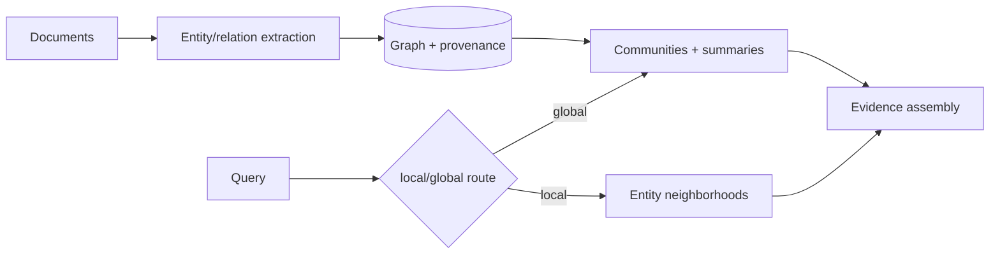

# 05 · Advanced RAG、GraphRAG 与多模态检索

> 一句话点题：当问题需要跨文档实体关系、全局主题或图片/表格证据时，普通 chunk top-k 可能结构性失败；高级 RAG 的价值必须在这些失败子集上证明，而不是因为图更高级。

<div class="lesson-meta"><span>AAI13—AAI15</span><span>可选进阶</span><span>预计 9 × 45 分钟</span><span>前置：AI05—08、AI15—17</span></div>

## 解锁与跳过

普通混合检索＋重排基线已测，失败集中在多跳实体关系、全局主题、结构化表格或跨模态证据时解锁。若失败是解析/ACL/切块/引用，先修基础。

## 本章可观察目标

你能设计 query routing/decomposition、多阶段检索；能解释 GraphRAG entity/relation/community/local/global query；能构建文本/图片/表格统一或分路检索；能做增量、权限、成本与分层评测。

## AAI13 · Advanced RAG 先做查询路由

查询类型不同：精确 ID/数字→结构化/关键词；语义问答→hybrid；多部分→decompose；需要整库主题→摘要/图；需要最新→实时工具。一个 retriever 处理所有问题会妥协。

高级手段：multi-query改写、HyDE假想文档、父子 chunk、小→大上下文、metadata自查询、迭代检索、rerank、context compression。每个增加模型调用、延迟和错误传播；用失败子集逐项 A/B，不堆管线。

## AAI14 · GraphRAG 把实体关系变成可检索结构

典型流程：从文本抽取 entities/relationships/claims，构图；社区发现与摘要；查询可 local（实体邻域）或 global（社区报告）。微软 GraphRAG 明确其索引可能昂贵，适合普通 baseline 不足的场景。



图中的边是模型抽取的假设，不是数据库事实；必须保留 source chunk/provenance、置信/验证和版本。实体消歧（同名/别名）、关系时效、删除传播、增量重建和 ACL 很难。若构图跨租户，社区摘要可能泄露不可见内容；图/摘要同样要权限隔离。

知识图谱也可来自权威结构化数据，不必全部 LLM 抽取。GraphRAG 与图数据库不是同义词；核心是问题是否需要关系路径/全局聚合。

## AAI15 · 多模态检索要保留版面与证据类型

PDF 表格、图、截图和音频不能只 OCR 成平文本。策略：文档布局解析；表格保行列/标题并可 SQL 查询；图像生成 embedding/描述但保原图坐标；音频切段/说话人/时间戳；跨模态 embedding或分路召回后融合。

生成回答引用页码、bbox/表格单元格/时间段；OCR/视觉描述是不可靠派生物，关键数字回看原始证据。权限/敏感识别也适用于图片/音频。多模态成本/延迟大，先按查询路由只在需要时调用视觉模型。

## 贯穿案例：供应链关系问答

问题“哪些供应商同时依赖同一上游且在高风险地区？”普通 top-k 只返回各公司段落，无法稳定连接。Graph：Supplier→depends_on→Upstream、located_in→Region，每条边带来源/日期；查询先结构过滤关系，再取原段落验证；若抽取边仅单一模糊来源，回答标不确定。与 baseline 比较 multi-hop evidence recall、路径正确、引用、成本，而非只看答案流畅。

## 会死在哪里

- 基础 RAG 未评测就 GraphRAG；无法证明增益。
- LLM 抽取边当事实；保 provenance/验证。
- 图构建跨 ACL 泄漏；实体/边/摘要权限化。
- 社区摘要过期且不可追；版本/增量/删除。
- 多模态只 OCR，表格结构丢失。
- 每查询都跑昂贵视觉/全图；路由/缓存。
- 只看最终回答，不测路径/证据。

## 与 AI 协作模板

```text
请从失败子集设计高级检索：
- 先报告 hybrid+rereank baseline 哪些题失败；
- 按 exact/semantic/multi-hop/global/multimodal 路由；
- 若构图，定义 entity/relation/schema、消歧、provenance、version、ACL；
- 区分抽取假设与权威结构数据；
- 为表格/图/音频保结构/坐标/时间戳引用；
- A/B 报告证据召回、路径/引用、答案、延迟、索引/查询成本。
```

## 练习：只在需要处增加图

准备 30 份含实体关系/表格文档和 60 题：普通、20条多跳、10条全局、10条表格/图。先 hybrid baseline；对失败子集构最小图/结构索引；每边保来源；实现 local/global/query route；撤销一文档验证边/摘要失效；测试跨权限。报告增益和不值得用图的题。

## 常见误区

GraphRAG 是 RAG 2.0；图数据库自动理解关系；抽取实体无误；全局摘要永远新；多模态=图片转文字；统一 embedding 解决所有模态；高级管线越长越准；图索引成本忽略。

<Quiz question="什么时候最值得解锁 GraphRAG？" :options="['普通检索还没做', '评测显示主要失败来自多跳实体关系/全局主题，且增益值得索引成本', '为了使用图数据库']" :answer="1" explanation="高级结构应由基础方案的特定失败触发。" />

## 本章小结

- Advanced RAG 先按查询类型路由，不把所有技巧串成默认链。
- GraphRAG 用实体/关系/社区支持 local/global 问题，但抽取图是可错派生物。
- provenance、版本、删除和 ACL 必须延伸到边与摘要。
- 多模态保版面/表格/坐标/时间戳，关键结论回到原始证据。
- 价值在失败子集的证据/答案提升与成本对照中证明。

<EvidenceTracker lesson="advanced-ai-05-advanced-rag" />

## 本章完成标准

完成基础对照、查询路由、最小图/多模态证据和分层评测；通过删除/权限/抽取错误测试；能指出哪些查询不应走高级管线。最近平均至少 7/10。

<div class="source-note">主要来源（核验于 2026-08-31）：<a href="https://microsoft.github.io/graphrag/">Microsoft GraphRAG Documentation</a>。官方明确索引成本较高；方法应在目标数据/任务上与基础 RAG 对照。</div>
