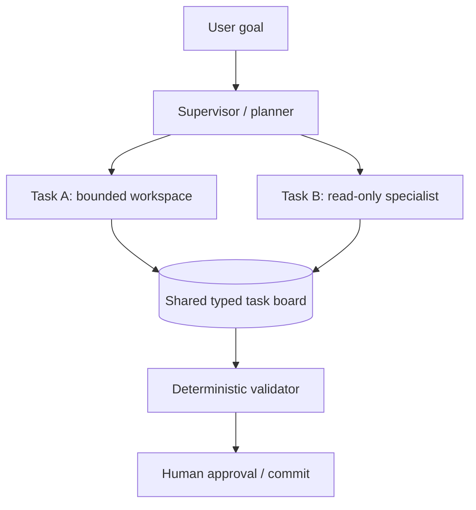

# 06 · 多 Agent、协调协议与自治治理

> 一句话点题：多 Agent 的本质不是让多个角色聊天，而是把工作、上下文、权限和失败拆给多个执行者；只有并行/专业化收益超过协调成本、重复和死锁时才值得。

<div class="lesson-meta"><span>AAI16—AAI18</span><span>可选进阶</span><span>预计 10 × 45 分钟</span><span>前置：AI09—19、Q12—15</span></div>

## 解锁与跳过

单 Agent/确定工作流已有基线；任务含真正独立并行、不同工具权限/专业上下文，并能测到时间/质量收益时解锁。简单顺序任务不要用多个“人格”增加 Token。

## 本章可观察目标

你能比较 supervisor、router、handoff、blackboard/market 等拓扑；能设计任务/消息/所有权/终止协议；能隔离权限与 workspace；能评测 multi vs single 的成功、成本、延迟、重复、循环和安全。

## AAI16 · 拓扑决定信息和责任怎样流动

- Supervisor：中心分解/分配/汇总，控制清晰但瓶颈/单点；
- Router：按任务选专家，简单但分类错会路由错；
- Handoff：Agent 转交会话/所有权，适合阶段流转但上下文易丢；
- Blackboard：共享任务/事实板，异步协作但冲突/一致性治理；
- Debate/critic：多方案互评，可能提升难判断任务，也可能相关错误和成本倍增。



用结构化 task/message：task_id、parent、goal、inputs/refs、allowed tools/resources、owner、lease/version、status、deadline、budget、output schema。自然语言聊天不能承担所有权/并发控制。

## AAI17 · 协调需要分布式系统纪律

任务会重复领取、Agent崩溃、消息乱序、结果冲突、等待循环。使用租约/fencing、幂等提交、DAG依赖、超时/取消、最大 fan-out/深度、无进展检测。共享工作区防文件冲突：每 agent 独立分支/worktree/沙箱，合并前测试；共享事实板 append/version，而非覆盖。

上下文按最小需要传递：发送目标、相关事实/产物引用、合同，不复制完整历史。汇总器必须验证产物而非相信“完成”消息。不同 Agent 的错误高度相关（相同模型/资料），多数投票不自动独立。

终止：全任务验收；预算/时间；重复状态；无人可执行；安全阻断；用户取消。死锁检测任务等待图；孤儿任务/租约过期回收。

## AAI18 · 权限、评测与自治边界

每 Agent 独立身份/作用域：research read-only，coder 仅 workspace，deployer 无权自动生产；supervisor 不应天然拥有所有底层秘密。工具网关仍按最终用户/任务授权；Agent 生成内容不扩大权限。高风险汇总动作审批。

评测至少对照 single-agent/固定 workflow：任务成功、wall-clock、总 Token/费用、工具/步骤、重复工作、循环/死锁、恢复、合并冲突、安全违规、人工负担。并行可能降墙钟却提高总成本；如果质量无增益，可能仍因时延值得，需业务阈值。

故障注入：一个 Agent慢/崩溃/恶意结果；共享板暂不可用；两 Agent写同文件；supervisor失效；预算耗尽。Trace 要串 task lineage 与各 Agent span。

## 贯穿案例：并行代码审查是否值得

单 Agent 10min、发现率 70%、成本 1x。三 Agent（安全/测试/架构）并行 wall-clock 6min、发现率 82%、成本 2.7x，但重复建议 40%、合并器漏去重。加入按文件/风险分工、结构化 finding ID、静态验证和只在高风险 PR 启用后，成本 1.8x、发现率 80%。是否值得取决于高风险缺陷价值；对小 PR 路由单 Agent。

## 会死在哪里

- 多角色 Prompt 就叫多 Agent；无独立状态/权限/任务价值。
- 共享完整上下文/文件；冲突和泄露。
- supervisor 全权限；扩大爆炸半径。
- 自然语言“完成”即接受；验证产物。
- 无限 fan-out/委派；预算/深度/拓扑。
- 多数投票假设独立；同源错误相关。
- 只报速度不报总成本/质量/人工协调。

## 与 AI 协作模板

```text
请先证明多 Agent 值得：
- 给 single-agent/固定 workflow 基线和可独立并行/专业权限任务；
- 选择拓扑，写 task/message/ownership/lease/output schema；
- 限制每 Agent 工具、数据、workspace、预算和委派深度；
- 设计合并/验证/冲突、超时/崩溃/孤儿/死锁恢复；
- trace 记录 task lineage/成本/工具/结果；
- A/B 报告成功、墙钟、总成本、重复、循环、安全和人工负担。
```

## 练习：做一个有基线的并行审查系统

同一批 20 个变更先单 Agent；再让两个 read-only reviewer 按安全/测试分工，独立结构化 finding，supervisor 去重但不能修改代码；验证器运行测试/规则；注入 reviewer 崩溃、重复 finding、恶意工具请求和超时。比较 wall-clock、召回/误报、成本、重复和人工审阅时间，制定只在哪类 PR 启用。

## 常见误区

Agent 越多越聪明；角色名=专业能力；并行一定省钱；共享记忆越多越协作；多数投票=真；supervisor 应拥有一切；子 Agent 可无限生成；最后总结就是验证；没有 single baseline。

<Quiz question="两个相同模型 Agent 给出同一答案，能否当成两份独立证据？" :options="['能，多数即真', '不能，模型/上下文同源使错误高度相关，仍需外部验证', '只有名字不同就能']" :answer="1" explanation="相关错误不会因重复采样自动变成独立证据。" />

## 本章小结

- 多 Agent 拆分工作、上下文和权限，拓扑决定责任/信息流。
- 协调需要结构化任务、租约、幂等、DAG、预算和死锁/恢复。
- 各 Agent 最小权限/独立 workspace，汇总结果必须确定验证。
- 同模型多 Agent 的错误相关，投票不替代证据。
- 价值必须相对 single/workflow 基线同时报告质量、墙钟、总成本和安全。

<EvidenceTracker lesson="advanced-ai-06-multi-agent" />

## 本章完成标准

实现结构化任务/最小权限/可恢复协调；通过崩溃、冲突、重复、越权和死锁测试；与 single baseline 报告质量/时间/总成本并写清启用边界。最近平均至少 7/10。

<div class="source-note">主要来源（核验于 2026-08-31）：<a href="https://arxiv.org/abs/2308.08155">AutoGen: Enabling Next-Gen LLM Applications via Multi-Agent Conversation</a>（2023）。论文展示框架/案例，不证明多 Agent 对所有任务优于单 Agent；生产结论必须对照评测。</div>
