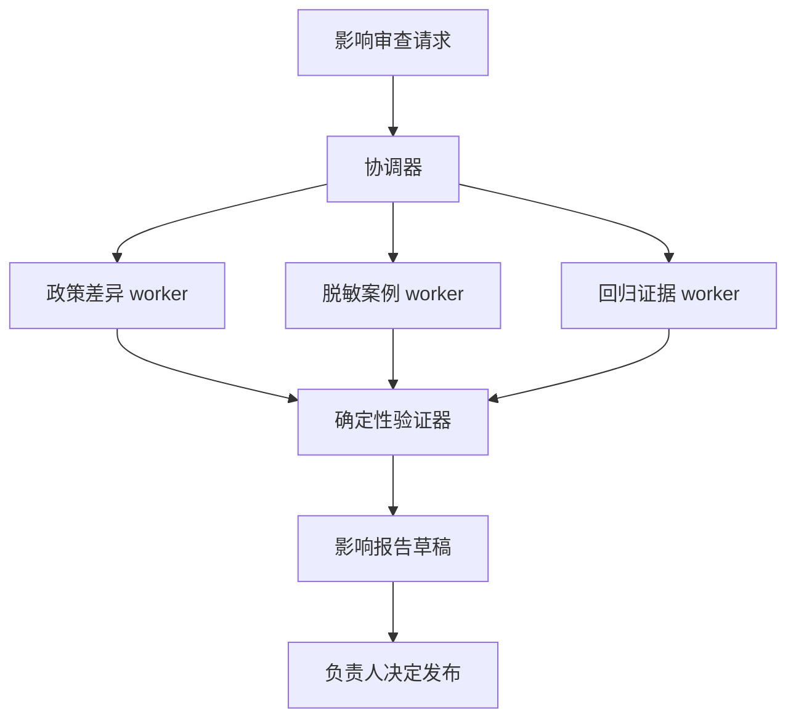

# 06 · 六份报告到手，证据增加了吗

> 高级检索已经能沿关系和页面找到完整证据。一个更宽的政策影响任务随后同时打开多条搜索分支。多个 Agent 可以缩短等待，也能隔开权限；它们还会重复读取同一来源、争抢预算，并把共同错误写成貌似独立的意见。本章要求每个新增执行者交代收益和祖先。

<div class="lesson-meta"><span>AAI16 至 AAI18</span><span>阶段三 · 检索与协作扩展</span><span>10 个标准回合（每回合 45 分钟）</span><span>硬前置：AAI13—15、AI09—19 与单执行者基线</span></div>

<KnowledgeFlow
  title="本章让协作结构接受同预算审理"
  intro="读完以后，你应当能判断一项任务是否值得拆给多个 Agent，选择与依赖相称的协调拓扑，并用共享状态、证据祖先和故障合并提交采用或拒绝记录。"
  what="多 Agent 系统让多个有独立运行状态或权限的执行者协作；协调器分配任务，类型化状态记录所有权与依赖，合并器依据产物和证据完成验收。"
  why="并行可能缩短墙钟时间，权限隔离也能缩小暴露面。额外执行者同时增加 Token、重复工作、相关错误、超时与合并成本。"
  how="先保留确定工作流和单 Agent 基线，只为可并行或独立权限任务建立最小拓扑；随后锁定总预算，注入崩溃、重复证据与权限拒绝，再比较成功、时间、成本和人工负担。"
  terms="coordination topology | task DAG | shared state | ownership | evidence ancestry | epistemic Sybil | budget ledger | failure merge"
/>

本章的**硬前置**是一条可复位的单 Agent 或固定工作流基线，以及类型化工具、权限边界、任务级评测和不可透支的总预算；AAI13—15 提供证据祖先，AI09—19 提供行动、运行与发布边界。**推荐前置**是 Q12—15 的可观测性和生产门禁。多 Agent 的**解锁证据**只有两类：至少两条任务分支能在没有彼此结果时开始，或原始数据确实需要由不同权限主体隔离；随后同预算 pilot 还要在覆盖、墙钟或风险中得到可复算的净改善。角色名更多、报告更长，都不算解锁。

## 上一章的四跳查询仍然交给一个执行者

周然的补贴问题有四个证据槽位，后一跳依赖前一跳得到的派驻状态或制度 ID。把四步各交给一个 Agent，大部分时间仍在等待上一步。四个执行者还要反复加载同一政策背景，传递一个未经验证的实体就会让后续分支一起走错。

这个查询继续使用确定状态机包住一个窄 Agent。程序控制依赖、ACL、必要证据集合和停止；模型只在当前槽位选择下一条检索。若路径固定到几条数据库查询，连这个 Agent 也可以退回普通工作流。

多 Agent 的候选任务来自另一个请求。政策负责人准备发布 `travel-v13`，希望在当天得到一份影响审查。系统要找出 v12 到 v13 的文字与表格变化，追踪哪些关系边和常见问答受影响，检查十二个脱敏在途案例，并重跑引用回归。政策材料、人员案例和评测环境分属不同权限域，其中三条读取分支可以同时进行。所有数字和对象均为教学设定。

团队先写解锁条件。任务至少包含两条无需互相等待的分支，单 Agent 的墙钟或上下文已越过预设门槛，或者同一身份不应同时看到各域原始数据。缺少这些条件时，保留单 Agent 或并行函数调用。给同一模型换三个角色名不产生新的系统价值。

<span id="aai16"></span>

## 拓扑要跟着依赖图走

当前任务适合一层 orchestrator-workers。协调器建立任务 DAG，三个只读 worker 并行产生结构化产物，确定性验证器检查引用、版本与 Schema，最后由协调器合并。它没有生产发布权限。



其他拓扑各有位置。router 把互斥请求送给一个专家，handoff 让某个角色接管后续对话，blackboard 支持异步产生任务的开放调查。当前任务只需要一层扇出和一次合并，递归委派与自由辩论都被禁用。

固定工作流仍是第一个对手。若政策差异可以由结构化 `diff`、图影响遍历和一组回归命令完成，程序并行已经足够。只有每个分支需要根据新发现的交叉引用继续搜索，且搜索路径无法预先枚举，worker 才获得有限 Agent 循环。这个区分把“并行”和“自治”拆开了。

<span id="aai17"></span>

## 消息只负责通知，共享板才负责裁决

自然语言消息很适合告诉同伴发现了什么，却不适合承担所有权、依赖和最终状态。两个 worker 都说“我在处理案例 7”，系统仍不知道谁有提交资格。共享任务板保存可比较字段，消息只携带任务或产物引用。

```json
{
  "task_id": "T-impact-07",
  "parent_id": "RUN-v13-review",
  "depends_on": ["T-policy-diff"],
  "goal": "检查脱敏案例 7 是否受 v13 影响",
  "input_refs": ["case-07@4", "policy-diff@2"],
  "allowed_tools": ["read_case_redacted", "read_policy_public"],
  "owner_role": "case-auditor",
  "lease_generation": 3,
  "status": "running",
  "budget": {"tokens": 6000, "tool_calls": 4, "seconds": 90},
  "output_schema": "impact-finding-v2",
  "artifact_ref": null,
  "attempt": 1
}
```

状态板采用追加事件或带版本的比较后写入。租约到期以后，新 worker 获得更高 generation；存储和产物提交口必须拒绝旧 generation。worker 的“done”消息不改变任务状态，验证器成功读取 artifact、校验 Schema、版本和引用以后才提交 `succeeded`。外部副作用仍须幂等与对账，本练习把所有工具限制为只读，避免把协调实验和业务写入风险混在一起。

共享上下文只传当前任务需要的引用。政策 worker 不接触人员案例，案例 worker 只看到脱敏字段，协调器也没有底层数据库的万能凭据。

## 三个 Agent 引同一页，仍然只有一个证据根

上一章已经为段落、图边、单元格和视觉描述保存 `source_root` 与派生链。本章把这条链继续传过任务、报告和合并。每项 finding 至少记录原始来源根、派生 artifact、抽取模型与版本、访问时间、worker、父任务和验证结果。

```text
policy-v13.pdf#page=8                source root R17
  ├─ OCR chunk c81                   derived from R17
  ├─ graph edge e204                 derived from R17
  └─ worker A finding f12            derived from c81 + e204
       └─ coordinator summary s3     derived from f12

board-minutes-09.pdf#item=4          independent root R29
  └─ worker B finding f19            derived from R29
```

若三个 worker 都从 `R17` 读到同一脚注，三个报告不能按三票独立支持计算。若另一个获准来源 `R29` 独立记录了同一规则，它才增加了一个来源根。文字相似度也无法替代祖先。两个独立来源可能逐字引用同一法规；同一来源又可能被不同 Agent 改写得很不一样。

2026 年 9 月 1 日提交的预印本 *Epistemic Sybil Resistance* 把这个问题形式化。报告数量增加时，底层观察未必增加；只看报告内容的合并器一般无法识别共同祖先。论文还指出，同一根上的重复抽取可能带来一些额外信息，却会受共同来源与相关抽取误差形成的上限约束。工程上需要保存祖先与重叠，已知独立时才完整累积，已知相关时显式降权，依赖未知时采用保守结论。

这篇论文使用合成证据世界、一个主要任务族和一个主要模型开展受控实验，当前仍是预印本。它没有证明 Agent 数量永远无用，也没有提供可直接套用的通用置信公式。这里吸收的是 no-minting 原则。系统不能凭新增 Agent、消息或措辞制造新的证据根，最终权重仍要由本项目校准。

祖先记录无法证明来源本身可靠。错误政策经六个 Agent 转述，谱系只会显示共同的错误根；来源权威性、版本和内容支持仍由验证器判断。

## 预算先分出去，子任务不能自行印钱

并行能缩短 wall-clock，却不会减少总计算。父 Run 先预留总预算，再原子地分给子任务。当前教学实验允许最多 60,000 Token、30 次检索调用、300 秒墙钟、3 个 worker 和 1 层委派。子任务创建前要成功预留份额，未用额度结束后归还；任何 worker 都无权通过再生子 Agent 扩大总额。

终止条件分为局部和全局。局部分支在产物通过、预算耗尽、权限拒绝、连续两轮没有新证据根、查询重复或取消时结束。全局运行在所有必需分支通过后合并；截止时间到达时可以提交明确的 partial，也可以整体拒绝，选择由预先任务合同决定。高风险必需分支失败时，几份成功报告都不能把它平均掉。

故障合并需要保存语义。

| 分支结果 | 合并动作 |
|---|---|
| `succeeded` 且验证通过 | 保留 artifact 与祖先，进入合并 |
| `partial` | 标出缺少的必要槽位，只在合同允许时展示 |
| `denied` | 保留拒绝证据，不切换身份绕过 |
| `timeout` 或 worker 崩溃 | 由同一 task ID 接管，复用已有 artifact |
| `conflict` | 并列来源、版本与分歧，交给有资格的人 |
| 用户取消 | 停止新领取，传播取消并收回预算 |

协调器不能把 `timeout` 改写成“未发现影响”，也不能把 `denied` 改写成“没有风险”。旧 worker 迟到提交由 generation 拒绝；已经落盘的有效中间 artifact 仍可复用。这样一次分支故障不会迫使所有成功搜索重做，也不会把不完整报告伪装成完整答案。

## 权限隔离只有在执行点检查才成立

每个工具调用同时检查最终用户、父任务、worker 身份、资源、动作和输入版本。Prompt 写着“你只能读脱敏案例”只是一条行为提示。工具网关仍须拒绝原始薪酬字段、其他员工记录和越过 `travel-v13` 审查目的的搜索。

Agent 转交产物时重新计算接收方可见字段。案例 worker 可以提交脱敏影响结论与来源引用，协调器无需看到姓名和完整行程。共享缓存、图节点和 trace 同样按访问域隔离。

独立权限有时比速度更能购买多 Agent。一个单 Agent 若必须同时持有人事、财务和发布凭据，失误半径很大；三个窄身份可以把读取面缩小。这个收益也要实测。若协调器最终仍收到全部原始秘密，所谓隔离只发生在架构图上。

<span id="aai18"></span>

## 同一预算下，复杂方案只赢了一类任务

团队比较确定工作流、单 Agent 和三 worker 候选。每种方案使用同一模型、检索版本、任务集和正确性门禁，分别在两个切片运行。简单问答上限为 24,000 Token、12 次工具调用和 180 秒；宽影响任务上限为 60,000 Token、30 次调用和 300 秒。下表仍是教学假设结果。

| 切片与方案 | 任务通过 | 实际 Token | 工具调用 | 墙钟中位数 | 无来源或越权 finding |
|---|---|---|---|---|---|
| 20 道简单问答，确定工作流 | 18 / 20 | 11k | 6 | 31 秒 | 0 |
| 20 道简单问答，单 Agent | 19 / 20 | 18k | 10 | 46 秒 | 0 |
| 20 道简单问答，三 worker | 19 / 20 | 24k | 12 | 44 秒 | 0 |
| 12 个宽影响任务，确定工作流 | 7 / 12 | 34k | 18 | 238 秒 | 0 |
| 12 个宽影响任务，单 Agent | 8 / 12 | 58k | 28 | 226 秒 | 0 |
| 12 个宽影响任务，三 worker | 10 / 12 | 59k | 29 | 142 秒 | 0 |

简单问答没有购买多 Agent。它与单 Agent 同为 19 题通过，却用尽更多预算，墙钟也没有实质改善。宽影响任务出现覆盖和时间收益，可以进入受限 canary。两道未通过任务仍须展开。一道因人员权限被正确拒绝，另一道在政策差异分支超时；报告只能标 partial，不能把十个通过平均成全任务成功。

评测还要报告重复工作、每个成功任务成本、人工合并时间、预算耗尽、租约接管和孤儿任务。若多 Agent 只因偷偷用了更多 Token 获胜，同预算对照会暴露它。Anthropic 公开的多 Agent 研究系统经验同样显示并行研究会显著增加 Token，并更适合高价值、可并行和超出单上下文的任务；其中性能与成本数字属于其模型、产品和评测，不能当作本项目倍数。

## 用代码阻止报告数量冒充来源数量

下面程序检查总预算和证据根。它不计算真实置信度，只保证合并器不会把同根报告当作三份独立观察。

```python
reports = [
    {"id": "f12", "roots": {"R17"}, "status": "verified", "tokens": 6000},
    {"id": "f13", "roots": {"R17"}, "status": "verified", "tokens": 5500},
    {"id": "f19", "roots": {"R29"}, "status": "verified", "tokens": 7000},
]

allocations = {"policy": 18000, "cases": 24000, "eval": 12000, "merge": 6000}
parent_budget = 60000
assert sum(allocations.values()) <= parent_budget

verified = [r for r in reports if r["status"] == "verified"]
naive_report_count = len(verified)
independent_roots = set().union(*(r["roots"] for r in verified))
used_tokens = sum(r["tokens"] for r in verified)

assert naive_report_count == 3
assert independent_roots == {"R17", "R29"}
assert used_tokens <= parent_budget
print({"reports": naive_report_count, "roots": len(independent_roots), "tokens": used_tokens})
```

把 `f13` 改写成完全不同的文字，根数仍为 2。把它改为引用真正独立且获准的 `R31`，根数才会增加。实际系统还需记录一个报告依赖多个根、同一根的不同版本，以及模型参数可能带来的未观察依赖；集合计数只是 no-minting 断言，不能替代统计模型。

## 十个回合做完一次可复位的协调实验

前三个回合完成跟做。选 8 至 12 个宽任务，固定工作流与单 Agent 各跑一遍，保存逐任务成功、必要证据、Token、工具调用、墙钟和人工审阅时间。只有至少两个分支可同时开始，或权限矩阵要求隔离，才画最小 DAG。为任务、artifact 和消息定义 Schema，再运行两个只读 worker。

第四至第六回合加入共享状态与祖先。实现预算预留、任务 lease/generation、append-only 事件和验证后提交。每份 finding 必须引用上一章的 `source_root`。用代码检查三个同源报告只产生一个祖先组，另让一个独立来源增加根。评审者从最终段落反查到原件、worker 和父任务。

第七回合连续注入四个变式。杀掉一个 worker，让旧 generation 迟到；复制一份同源报告并改写措辞；让案例 worker 请求原始薪酬字段；让政策分支耗尽预算。期望结果依次是安全接管、根数不变、执行点拒绝和明确 partial。系统若静默补齐任何一项，实验失败。

第八回合按相同上限重跑三种方案。随机交换运行顺序，报告任务级配对差异、墙钟、总资源、重复工作和人工合并。多 Agent 未越过预设收益门槛时提交拒绝 ADR，并保留简单基线。

第九回合迁移到软件依赖事故。安全公告、代码引用和部署清单可以并行检查，却共享同一公告来源。重新设计权限、DAG 和来源根，不能复用政策字段。最后一回合由不参与实现的人重放一个崩溃、一个权限拒绝和一项预算计算，并对采用范围签字。

可审阅产物包含任务 DAG、拓扑决定、任务与消息 Schema、权限矩阵、共享状态事件、证据祖先图、三方案逐任务结果、故障日志、预算账、合并 runbook 和采用/拒绝 ADR。反馈要落到一个失败位置。路由错回到任务分类，重复劳动回到分工和祖先，超时回到预算与粒度，越权回到身份和工具网关。

## 🎯 随堂检验

<Quiz question="三名相同模型 worker 各写了一份措辞不同的报告，三份都只引用政策 PDF 的同一页。合并器应怎样处理？" :options='["按三票独立支持累计","保留三次抽取及其可能新增的细节，同时标记共同证据根并禁止按独立来源累计","按文字相似度低就认定来源独立"]' :answer="1" explanation="报告表现不同也可能拥有共同祖先。祖先与相关性必须进入合并，新增报告不能凭数量制造新证据。" />

<Quiz question="一个固定 DAG 已能并行完成任务，所有分支使用同一权限，Agent 候选在同预算下没有质量或时间收益。最合理的决定是什么？" :options='["继续增加角色直到出现差异","保留确定工作流，并记录多 Agent 未购买到收益","让子 Agent 无限委派"]' :answer="1" explanation="固定依赖已经由普通并行完成，额外自治只增加协调面。拒绝复杂方案也是本章合格产物。" />

## 本章小结：多 Agent 只有在同预算下带来可验证收益才成立

多 Agent 的成立条件是任务确有可并行或需要权限隔离的分支，并且在同预算对照中改善覆盖、墙钟时间或风险边界。本章把第五章的检索 trace 接成任务 DAG，以共享板、证据根、预算和执行点权限约束 worker 与合并器。一个最终 finding 能回到原始证据根、派生 artifact、执行者、权限决定、预算和合并结果；简单问答继续走确定工作流或单 Agent，复杂任务也保留停止、复位和拒绝采用的出口。

[阶段三总结](/advanced/ai/stage-3-review)会换到风电设备故障调查。你需要分别判断图与视觉检索是否修复证据结构，多个执行者是否修复并行或权限瓶颈。两个决定可以一真一假。阶段出口是一份同预算、能复位、能拒绝复杂度的 ADR。

<EvidenceTracker lesson="advanced-ai-06-multi-agent" />

## 参考资料

- Qingyun Wu 等，[AutoGen 多 Agent 会话框架](https://arxiv.org/abs/2308.08155)，2023 年。用于理解可编排 Agent 交互与工具组合；论文案例不能证明多 Agent 普遍优于单 Agent 或确定工作流。
- Anthropic，[多 Agent 研究系统工程复盘](https://www.anthropic.com/engineering/multi-agent-research-system)，2025 年。用于 orchestrator-workers、并行搜索、成本与适用任务的实践材料；供应商模型和内部评测数字仅代表其设置。
- Anthropic，[有效 Agent 架构指南](https://www.anthropic.com/engineering/building-effective-agents)，2024 年。用于 workflow、routing、parallelization 与 orchestrator-workers 的工程区分；模式目录不能替代本项目对照实验。
- A2A Project，[Agent2Agent 协议规范](https://a2a-protocol.org/latest/specification/)，官方规范，本课程核验于 2026-09-04。用于独立 Agent 的任务、消息与互操作语义；协议解决通信格式，不负责证明任务拆分正确。
- OpenTelemetry，[Tracing API 规范](https://opentelemetry.io/docs/specs/otel/trace/api/)，官方活规范，本课程核验于 2026-09-04。用于父子 span、link 与跨执行者 trace；可观测祖先不能替代业务证据祖先。
- Marc Bara，[Epistemic Sybil Resistance](https://arxiv.org/abs/2609.01873)，2026-09-01 预印本。用于报告数量、证据祖先与相关抽取的 no-minting 边界；论文基于受控合成证据、单一主要任务族和模型，不提供通用合并权重。
