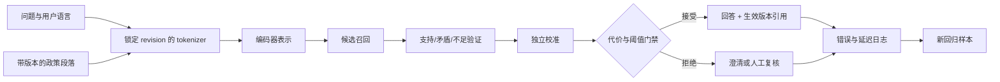

# 第一阶段总结 · 读懂模型机制与训练约束

> 第一阶段没有要求你背完整套线性代数，也没有把 Transformer 拆成一张部件清单。它只建立一项可迁移的能力：遇到一个模型分数时，能够沿输入、表示、目标、数据与系统资源追到证据源头，再决定这个分数是否有资格改变产品动作。

第一阶段复盘AAI01—AAI066 个标准回合（每回合 45 分钟）综合迁移验收

<KnowledgeFlow
  title="阶段出口是一份可审计的模型选择"
  intro="复盘结束后，你应当能把模型判断表与训练约束包组合起来，在陌生文本任务中复建实验，并主动写出不能外推的范围。"
  what="可审计选型把表示、概率、损失、attention、tokenizer、数据谱系和资源测量放进同一条因果链，而不是把几个离线分数并排。"
  why="模型错误可能来自任务定义、表示捷径、误校准、数据切分、截断、padding 或通信。只看最终准确率，团队不知道该修哪里，也无法可靠扩大规模。"
  how="先组装政策助手的两章产物，再迁移到设备手册助手；用故障注入、数值复算与隐藏切片检验每个环节，最后按门禁选择继续、缩小或停止。"
  terms="判断链 | 机制证据 | 数据边界 | 资源预算 | 故障注入 | 迁移 | 放行门禁"
/>

## 两章共同回答的不是“哪个模型最好”

政策知识助手最初只有一个故障：与问题最相似的候选恰好表达相反规定。第一章没有立刻换模型，而是把问题拆成可观察关系。向量召回负责扩大覆盖，支持验证负责区分支持、矛盾与信息不足；softmax 只归一化 logit，独立校准才尝试赋予长期频率含义；错误代价再把概率接到自动接受或拒答。

第二章继续追问这条分数的内部条件。Token 通过 Q、K、V 形成上下文表示，但一张 attention 图不等于语义证明；tokenizer 先规定模型能看到的离散单位，数据版本与切分规定模型可以学习的证据；参数、梯度、优化器状态和 activation 共同形成显存账，pilot 的实测才告诉我们系统能否恢复和扩展。

把两章压成一句话，可以得到第一阶段的核心判断。

> 模型选择不是给架构排名，而是在明确任务、输入、数据和资源边界内，证明某个可重放系统能以可接受代价减少指定错误；边界一变，结论就要重新验证。

这句话不承诺我们已经会预训练大模型。第一阶段只到“小模型/编码器选择”的深度：能够读懂主要计算，设计最小实验，解释训练约束，并拒绝从小实验跳到大规模能力结论。

## 把两份产物接成一条证据链

第一章的最终产物是模型判断表，第二章的最终产物是训练约束包。它们不是两份互不相干的作业。

| 顺序 | 要留下的证据 | 它回答什么 | 缺失时应退回哪里 |
|---:|---|---|---|
| 1 | 任务、错误类型与困难切片 | 模型究竟要减少哪种错误 | 回到产品任务与样本设计 |
| 2 | 表示与打分职责 | 召回、支持判断是否被混用 | 重建双编码器/验证器边界 |
| 3 | 数值前向与梯度检查 | 概率、损失和更新是否算对 | 回到形状、标签和实现 |
| 4 | 独立校准与代价阈值 | 分数能否进入接受/拒绝动作 | 增加校准数据或只做排序 |
| 5 | attention 与 tokenizer 对照 | 输入证据能否到达表示 | 回到 mask、截断与模型候选 |
| 6 | 数据谱系与文档族切分 | 训练和测试是否来自合法过去 | 修版本、许可、去重和切分 |
| 7 | 显存分项与可恢复 pilot | 训练计划能否在预算内执行 | 修 batch、长度、精度或规模 |
| 8 | 隐藏切片与停止条件 | 改进是否稳定且值得继续 | 保留基线、缩小适用范围 |

这条链中没有哪个局部数字拥有最高地位。Recall@5 很高，正确证据仍可能被验证器拒绝；校准很好，召回层仍可能完全找不到现行条款；tokens/s 很高，算力可能都花在 padding；loss 下降，文档模板泄漏仍会让隐藏集失真。

一个可靠的实验记录应当允许后来者从最后决策倒查到具体样本、模型 revision、数据版本和代码输出。若只能复述“我们选了 110M 模型，因为更轻”，第一阶段还没有完成。

## 沿政策助手重放一次完整判断

先用原场景做闭环检查。问题仍是“今年没用完的年假能结转吗”，候选中同时存在现行支持段落、现行矛盾段落和一份过期制度。

重放时要在每条边上问一个可证伪问题。

- Tokenizer 是否保留否定词、日期与条款号，截断策略是否可能丢失例外条件？
- 召回指标是否只看“同主题”，还是确保现行支持段落进入候选？
- 验证器的标签是否把矛盾与信息不足分开，困难负例是否来自真实政策族？
- 校准集是否独立于训练和阈值选择，是否覆盖同一语言、长度和版本分布？
- 接受阈值是否来自明确错误代价与人工容量，还是沿用了一个方便的整数？
- Pilot 是否记录有效非 padding tokens/s、峰值显存与 checkpoint 恢复，而非只留 GPU 利用率？

只要一项答案是“不知道”，最终的自动回答就不能获得比该环节更强的结论。系统仍可以在较低权限下作为搜索建议，但必须缩小动作范围。

## 换到设备手册，重新建立而不是替换名词

现在进行阶段迁移。一家工厂希望建立设备维护手册助手。维修人员输入“E17 报警后能否直接复位”，系统要从中英混合的 PDF 转写文本中找到生效手册段落，返回步骤与页码。错误指令可能造成停机，因此高风险问题允许拒答并转给值班工程师。以下版本、样本量和训练步数都是迁移练习设定，不是生产实测。

资料有四个特点。

1. 同一设备有 2023 与 2025 两版手册，复位步骤曾改变。
2. 型号 `AX-10`、错误码 `E17` 和单位 `10 N·m` 容易被 tokenizer 拆开。
3. 表格转写后列顺序偶尔错乱，句子相似不等于条件一致。
4. 当前只有 180 对人工复核问答；两种候选编码器都没有在这个工厂测试过。

请不要把政策助手的阈值、Token 数或 110M 结论直接搬来。可迁移的是判断过程，不是原数字。

### 先写新的错误与动作

至少区分三类失败：没有召回正确版本、把条件不符段落判成支持、引用正确但生成步骤遗漏。第一阶段只负责前两类模型/数据判断，生成答案仍应受引用约束。为自动展示、拒答和人工复核分别写明成本与容量，再决定概率是否需要校准到某个动作阈值。

如果团队无法为“错误复位”给出可接受风险，就不应假装算出精确金钱。可以先采用保守政策：E17 等高风险错误码一律人工确认，助手只展示候选页。这里的主动降级也是有效设计产物。

### 再建立隐藏切片

把 180 对样本按手册族与版本分组，不能随机拆句。至少保留以下切片：同型号不同版本、同错误码不同前置条件、数字/单位变化、中英混合、表格转写。样本太少时报告区间和单例错误，不用一个总体百分比遮住风险。

候选 A 可能 Token 更少，候选 B 可能在中英混合上保留得更稳定。两者都要走同一 tokenizer 审计和同一支持判断；不能给喜欢的模型更长上下文或更多清洗。

### 最后做一个受限 pilot

先复用第二章的显存分项表，以真实参数量、精度与序列长度重算。训练 50—100 个优化步只用于验证数据流、梯度、日志与恢复，不用于宣称收敛。保存初始 checkpoint，在中间强制停止一次并恢复；若恢复后样本顺序或 loss 轨迹无法解释，扩大训练只会扩大不可复现性。

Pilot 后有三种合法结论：继续扩大、保留冻结编码器只训练小输出头、或停止训练并采用关键词/人工流程。第三种不代表学习失败；它说明现有 180 对样本不足以购买额外复杂度。

## 用故障注入证明你知道每一层在做什么

普通运行只证明代码没有立刻报错。阶段验收应主动制造下列变化，并在运行前写下预测。

| 注入 | 预期观察 | 若没有发生，先检查什么 |
|---|---|---|
| 把“不得复位”改成“可以复位” | 支持判断应明显变化，纯主题召回可能不变 | 困难负例、极性特征与标签 |
| 把 2025 版替换成 2023 版 | 版本切片应报警或拒绝 | 生效日期、文档族切分与元数据 |
| 让截断刚好删除表格最后一列 | 风险切片应恶化 | 截断方向、chunk 策略与日志 |
| 将 attention 的目标位置遮住 | 对应位置权重为零，输出随之变化 | mask 广播维度与 softmax 轴 |
| 把 batch 的 padding 比例翻倍 | 有效 tokens/s 应下降或成本上升 | 统计口径与 length bucketing |
| 从 checkpoint 中断恢复 | 配置、数据位置与指标趋势可追踪 | 随机状态、优化器状态与版本 |

每次注入只改变一个因素。若同时换 tokenizer、模型和训练数据，即使分数提高也无法归因。对模型内部的变更尤其要克制：遮盖一个 Token 导致输出变化，能证明它参与当前计算；不能据此宣布某个 attention 头拥有稳定的人类概念。

## 一份阶段作业应当怎样被验证

提交一个目录或实验报告，包含以下六件材料。

1. **任务与错误卡：**输入、输出、三类失败、允许动作、拒答路径和当前适用人群。
2. **数值复现：**自行选择一对支持/矛盾样本，手算一次 sigmoid/softmax 与交叉熵，再用有限差分检查至少一个梯度。
3. **机制对照：**运行三 Token attention；改变 mask 或 value，记录预期、实际与差异。
4. **Tokenizer 与数据审计：**比较两种真实 tokenizer，锁定 revision；给出版本切分、困难负例和不可使用数据。
5. **预算与恢复：**逐项估算训练状态，测峰值显存、有效 tokens/s，并证明一次 checkpoint 恢复。
6. **选型记录：**在同一隐藏切片上比较候选，写出继续、缩小或停止的理由，以及下一次会使结论失效的变化。

反馈分三轮。第一轮由代码检查形状、行和、有限差分、数据重复和 checkpoint 完整性。第二轮由同伴从原始输出复算一笔损失、一项校准差与一笔显存账。第三轮由不了解当前模型的人阅读选型记录，判断他能否说清适用范围与退路。AI 可以协助发现缺项，但不得代写没有运行过的数字。

下面是一份 10 分制评分表。基础掌握要求总分至少 7 分，且“数值与机制”“边界与退路”都不能为 0。熟练掌握不由同一天多做一遍证明：至少间隔 7 天，在不看原答案的情况下换一组文档与故障重新提交，最近两次相关作业平均至少 8.5 分，并能解释故障注入为何产生当前结果。

| 维度 | 0 分 | 1 分 | 2 分 |
|---|---|---|---|
| 任务与错误 | 只写“提高准确率” | 有任务但动作/错误不全 | 错误、动作、容量与拒答闭合 |
| 数值与机制 | 只贴公式或截图 | 能运行但不能预测变化 | 手算、代码、变式与反例一致 |
| 数据与 tokenizer | 无版本/切分 | 有统计但缺隐藏切片 | revision、谱系、切片与许可完整 |
| 资源与恢复 | 只报参数或利用率 | 有估算但无实测恢复 | 分项账、有效吞吐与恢复证据完整 |
| 边界与退路 | 宣称模型普遍更好 | 提到限制但无动作 | 写明不可外推、停止条件和降级路径 |

## 🎯 随堂检验

<Quiz question="设备手册 pilot 中，训练 loss 降低、GPU 利用率达到 95%，但 2025 版手册的否定句仍经常误接受。哪项阶段结论最合理？" :options='["训练与硬件指标都很好，可以扩大规模","先停止扩大，检查版本切分、否定困难负例、截断与校准切片；必要时保留人工门禁","把模型参数量翻倍即可外推"]' :answer="1" explanation="局部优化和设备忙碌不能覆盖目标切片失败。阶段门禁要求先定位证据链断点，并保持高风险动作的降级路径。" />

## 什么时候可以进入适配与后训练

达到基础掌握时，你应当能在原政策助手上解释从表示到训练系统的完整链条，完成数值/代码复现，并用独立切片写出一个有退路的编码器选择。达到熟练掌握时，你还应当能把方法迁移到设备手册，预测并解释至少三种故障注入，在证据不足时主动缩小结论。

下一阶段不会因为第一阶段完成就自动微调模型。它接过的是冻结测试集、困难负例、数据谱系、模型 revision、校准方案、资源 pilot 和停止条件。只有 Prompt、检索或冻结编码器基线仍未达到明确任务门槛，而且训练数据稳定、合法、可追踪时，PEFT/LoRA、监督微调或偏好优化才有被比较的理由。

还没有学到的内容同样要留白：大规模预训练规律、分布式训练的工程细节、微调数据配方、偏好目标与线上推理优化属于后续阶段。第一阶段的小实验不能替它们作结论。

## 复习入口

- [第 1 章 · 从表示分数走到可用判断](/advanced/ai/01-math-optimization)
- [第 2 章 · 打开编码器，再核算一次训练](/advanced/ai/02-transformer-training)

<EvidenceTracker lesson="advanced-ai-stage-1-review" />

## 参考资料

- Marc Peter Deisenroth 等，[Mathematics for Machine Learning](https://mml-book.github.io/book/mml-book.pdf)，2020 年。用于复查表示、概率与梯度的数学前置；阶段验收仍以可重放实验为准。
- Ashish Vaswani 等，[Attention Is All You Need](https://arxiv.org/abs/1706.03762)，NeurIPS 2017 年，arXiv v7 修订于 2023 年。用于复查 Transformer 原始结构；不把机器翻译结果外推为设备手册能力。
- Chuan Guo 等，[On Calibration of Modern Neural Networks](https://proceedings.mlr.press/v70/guo17a.html)，ICML 2017 年。用于校准问题与温度缩放证据；不把单一后处理当作分布漂移保证。
- Emily M. Bender、Batya Friedman，[Data Statements for Natural Language Processing](https://aclanthology.org/Q18-1041/)，TACL 2018 年。用于迁移任务的数据覆盖与外推审计；不能替代组织自己的许可与安全责任。
