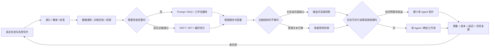

# AI 进阶总结 · 复杂技术先回答它买到了什么

> 进阶路线没有把你送到一张更长的模型清单。六章真正训练的是另一种能力：当数学、训练、推理、检索或多 Agent 被提议时，你能指出它准备修复哪类失败、怎样与简单方案公平比较，以及什么证据会让团队放弃它。

<div class="lesson-meta"><span>AI 进阶板块总结</span><span>AAI01—AAI18</span><span>三阶段综合复盘</span><span>复杂度选择与迁移</span></div>

<KnowledgeFlow
  title="从模型内部一直判断到系统协作"
  intro="读完以后，你应当能从一次真实失败定位瓶颈，选择表示、训练、推理、复杂检索或协作中的最小升级，并写出可复算、可回退的采用决定。"
  what="AI 进阶不是默认采用更复杂模型，而是建立从表示与优化、数据与训练、服务与检索到协作拓扑的一组可证伪工程判断。"
  why="相同的表面错误可能来自数据、校准、证据、容量或协调。跳层升级会让系统更贵，却保留原来的失败原因。"
  how="先保存任务与简单基线，再沿证据链定位责任层；只改变一个主要机制，用任务级质量、成本、延迟和风险共同审理，未达到预设门槛就回退。"
  terms="representation | calibration | data lineage | PEFT | correctness-adjusted goodput | evidence set | routed retrieval | task DAG | evidence ancestry"
/>

## 六章其实只做了三次复杂度审理

第一阶段从一句政策问答进入模型内部。第 1 章没有把向量、logit、交叉熵和梯度做成名词表，而是用一次错引追问：模型比较了什么，分数怎样变成概率，概率是否足以触发业务动作。第 2 章沿同一候选打开 attention、tokenizer、数据谱系与显存账，再用单卡 pilot 判断训练计划能否恢复、能否被别人复算。

这一阶段得到的不是“懂 Transformer”证书，而是一套**模型与训练证据**：表示空间、校准切片、损失曲线、数据来源、资源估算和失败样本彼此能够对上。某个候选在玩具更新里 loss 下降，不等于它在真实任务上可靠；GPU 利用率很高，也不等于数据、目标或外推边界正确。

第二阶段审理是否改变权重，以及改变后的模型是否值得服务。第 3 章要求 Base、Prompt、RAG 与 PEFT 在同一任务、数据和 sealed test 上竞争。只有稳定基线无法修复的行为，才成为训练候选。第 4 章随后把获准模型放进真实请求路径，区分 prefill 与 decode，核算 KV cache、batching、量化、尾延迟和过载拒绝。速度指标只有乘上正确性门禁，才形成可用 goodput。

第三阶段处理系统复杂度。第 5 章先证明普通 hybrid 检索究竟在哪些关系题或版面题上失败，再只为对应切片增加查询分解、图或视觉索引。第 6 章先画任务依赖与权限域，再让确定并行工作流、单 Agent 与多 Agent 在相同总预算下竞争。报告数量、角色数量与图中路径数量都不能自动增加证据。

三次审理共享一个判断：**复杂度必须购买到可定位的净收益**。如果新方案修复不了原失败，或者收益被成本、延迟、维护和风险吃掉，保留简单方案就是完成学习后的专业决定。

## 一张责任图把模型与系统重新接起来



这张图不是要求每个项目走到最右边。多数系统会在某个节点提前停止：一个小编码器已经足够，RAG 修复了知识缺口，单请求服务满足容量，或者固定 DAG 已能并行。路线的意义是让停止有证据，而不是让所有团队拥有同样的技术栈。

## 先定位瓶颈，再选择学习支路

面对一个新问题，可以先看症状落在哪一层。

| 观察到的失败 | 首先检查 | 有资格尝试的升级 | 仍需拒绝升级的证据 |
|---|---|---|---|
| 分数很高但错误也很自信 | 标签、切片、校准与代价阈值 | 校准、目标或表示实验 | 只在同一开发集上改善 |
| loss 下降，关键否定句仍错 | tokenizer、截断、数据覆盖和污染 | 数据修订、小规模训练 | 目标样本泄漏或无 sealed test |
| Prompt/RAG 基线稳定失败同一行为 | 错误是否来自参数化行为而非知识 | LoRA/PEFT，必要时 SFT 或偏好优化 | 没有回退、许可证或独立评测 |
| 单请求正确，生产 p95 与成本失控 | prefill/decode、KV、排队和批处理 | 调度、量化、容量或引擎调整 | 只报 tokens/s，不重放正确性 |
| 单段题稳定，多跳或表格题缺证据 | 必要证据集合、依赖和页面结构 | 查询分解、图或视觉检索 | 所有查询都被默认升级，无法撤销派生索引 |
| 单 Agent 等待长或跨权限域 | 子任务依赖、共享状态和总预算 | 确定并行或最小多 Agent 拓扑 | 分支互相等待，或同预算无净收益 |

表中的“首先检查”故意放在“升级”前。一个旧政策被错误召回，可能是版本过滤问题，不需要微调；一个图表数字丢失，可能是解析破坏了行列，不需要更多 Agent；多语种输出慢，也可能是 tokenizer 让序列变长，而不是 GPU 本身不够。准确定位比熟悉更多框架更稀缺。

## 三本账贯穿全部进阶决策

六章看起来跨越数学、系统和架构，但真正反复维护的是三本账。

第一本是**证据账**。每个主张都要追到任务、样本、原始来源或运行结果。训练样本能追到哪一版政策，图中的实体和边能否回到原文，多名 Agent 的报告是否共享同一个证据祖先，都属于同一问题。派生表示可以帮助搜索，不能把一份来源变成多份独立证据。

第二本是**资源账**。参数量之外还有激活、优化器状态、通信和 checkpoint；单次推理之外还有 KV cache、排队和失败重试；多 Agent 的成本也包含重复读取、协调、合并与人工接管。预算必须在运行前分配，子任务不能自行扩大总额。只比较单次调用价格，会系统性低估长轨迹方案。

第三本是**回退账**。数据集、adapter、模型权重、服务引擎、量化格式、索引和协作拓扑都要有版本与退出条件。复杂检索失败时可以路由回普通 hybrid，而不是重建全库；多 Agent 没有收益时可以退回固定 DAG；候选模型容量不足时可以拒绝流量，而不是牺牲正确性门禁。不能单独回退的升级，很难被可靠审理。

三本账通过同一个 `experiment_id` 连接。评审者应当能从一条采用决定找到输入版本、唯一主要改动、逐任务结果、成本与未覆盖范围，再定位具体回退对象。如果只有一张最终平均表，证据仍然不够。

## 适配训练不能替产品定义做决定

微调常被当成“让模型更懂业务”的通用按钮。进阶路线把这句话拆成几个不同问题。知识会频繁变化时，外部证据与工具通常比写入权重更可维护；输出需要固定格式时，调用合同和结构验证可能已经足够；稳定的风格、分类边界或专门行为在 Prompt/RAG 后仍失败，才可能需要 PEFT 或更深训练。

LoRA 用低秩增量减少需要训练和保存的参数，但它没有自动减少数据污染、许可证、评测或部署责任。SFT 学习示范行为，偏好优化比较候选响应；两者的目标、数据和失败方式不同。把偏好对当事实标签，或者把训练数据与 sealed test 混在一起，会让优化数字变好，却让产品主张失去独立证据。

一份可接受的适配决定至少包含：稳定失败切片、Prompt/RAG 基线、数据谱系、训练配置、独立测试、关键回归、成本和撤销方式。若失败只是来自旧文档、错误 ACL 或解析丢表格，就把问题退回证据链，不用训练掩盖系统缺陷。

## 推理优化只在正确请求完成时创造价值

服务阶段最容易出现另一种偷换：把引擎跑得更忙当成产品更快。Prefill 处理整个输入，decode 逐步生成并不断读写 KV cache；长短请求混排、缓存占用和队列策略共同决定尾延迟。批量更大可能提升设备吞吐，也可能让短请求等在长请求后面。量化减少存储和带宽需求，同时会改变数值表示，必须重跑任务级正确性。

因此课程采用 `correctness-adjusted goodput`：在质量、Schema、安全和截止时间都通过的请求中，每单位时间完成多少。它不是行业唯一指标，而是一种防止局部速度覆盖产品失败的约束。容量计划还应报告 workload 分布、并发、上下文长度、输出长度、缓存政策、拒绝策略与 p95，而不是只给一张峰值吞吐截图。

过载时的专业行为可能是排队、降级或拒绝。让所有请求进入系统再超时，会浪费更多算力并破坏用户预期。候选引擎若只提高 tokens/s，却降低引用支持或关键切片，应该回退；推理层没有资格重写上游正确性门槛。

## 图、多模态和多 Agent 都要先承认自己的派生成分

高级检索里的实体、关系、社区摘要和视觉描述，大多是从原始材料派生的索引。它们能提供路径，不能取代原始证据。实体合并错误会把两个对象连在一起，页面 OCR 会把行列错位，旧文档删除后派生边可能仍残留。索引因此需要 provenance、权限继承、版本和级联撤销。

多 Agent 的中间报告同样是派生产物。三个执行者引用同一页，不是三份独立支持；相同模型、相同检索和相同提示还会产生相关错误。所谓“多数同意”若没有共同祖先与依赖分析，可能只是同一错误被复制多次。

复杂度审理应分别进行。先问图或视觉路线是否让必要证据集合更完整，再问任务是否真的存在可并行分支或独立权限域。不要把 Advanced RAG 与多 Agent 捆成一次发布，否则结果变化时无法归因，也失去独立回退。

## 把六章成果收进一个可接手的实验库

```text
advanced-ai-evidence/
├─ manifest.yaml
├─ 01-representation/
│  └─ task-slices + logits + calibration + finite-difference-check
├─ 02-training-system/
│  └─ tokenizer + data-lineage + memory-ledger + pilot-checkpoint
├─ 03-adaptation/
│  └─ base-prompt-rag-peft + sealed-test + rollback
├─ 04-serving/
│  └─ workload + kv-budget + latency + correctness-goodput
├─ 05-advanced-retrieval/
│  └─ evidence-sets + routed-eval + provenance + cascade-delete
└─ 06-coordination/
   └─ task-dag + budget-ledger + ancestry + topology-adr
```

`manifest.yaml` 至少记录任务版本、数据/语料许可与哈希、模型和 tokenizer、代码提交、环境、预算、每项产物的验证状态及 owner。这里的目录结构可以变化，连接关系不能丢：任何结论都能找到输入和计算，任何升级都能找到基线，任何回退都能定位对象。

项目可以继续使用课程中的政策知识助手，也可以迁移到你熟悉的低风险领域。不要直接用真实医疗、财务、安全设备或生产写权限完成练习。陌生领域缺少合格评审者时，产物只能证明工程流程，不证明领域结论正确。

## 用四轮练习把路线变成判断力

第一轮选择 30—50 个任务，画失败切片，跑简单模型或 API，保存 logit/分数、重复结果和一份校准表。第二轮固定小规模数据和 tokenizer，完成一项可恢复 pilot，再让 Prompt、RAG 与 PEFT 在 sealed test 上竞争。第三轮使用录制负载核算 KV、p50/p95、过载和正确性 goodput。第四轮只挑一种被证据指向的复杂升级：关系题用查询分解或图，版面题用视觉路线，可并行任务才比较多 Agent。

每轮都做一个故障注入和一个“不采用”分支。让训练数据混入一条测试样本，让量化候选在关键否定句上回归，让图中一份原文被撤销，让三个 Agent 共享同一错误来源。修复后重跑原失败，记录机制是否真的改变了目标切片。

第一次完成可以达到 `basic`：能解释责任层，跑通对照，保留一个失败并做出可复算决定。达到 `proficient` 还需要隔周换场景，识别一种看起来先进却没有净收益的方案，并让另一位评审者仅凭 manifest 重算结论。阅读更多论文不能替代这次迁移。

## 🎯 随堂检验

<Quiz question="政策助手的单段问题稳定，剩余错误只发生在扫描表格的行列关系被解析丢失。团队同时提议全库 GraphRAG 和四 Agent 并行。最合理的第一步是什么？" :options='["两项一起上线，复杂度越高越可能修复","保留现有基线，只对版面失败切片比较保留坐标的解析或视觉检索，并先验证必要证据是否找齐","直接微调模型记住表格"]' :answer="1" explanation="失败已经定位在页面结构。先改变对应变量，才能归因收益；图和多 Agent 都没有获得解锁证据。" />

<Quiz question="量化后引擎吞吐提高 35%，但关键拒答切片从 24/25 降到 19/25，整体平均仍上涨。发布决定应是什么？" :options='["按总体平均上线","阻断该候选或缩小适用范围，先定位数值与服务改动造成的回归，再重跑相同门禁","删除拒答切片"]' :answer="1" explanation="推理优化不能改写上游正确性主张。吞吐只在通过任务级门禁的请求上形成有效 goodput。" />

## 下一条路线由未解决的瓶颈决定

如果你仍无法稳定定义任务、权限、运行状态和发布门禁，回到[AI 核心学习总结](/domains/ai/summary)；进阶模型不会替这些边界补课。若瓶颈在张量、训练动态与深度网络本身，进入[深度学习正式路线](/fields/deep-learning/)。若系统已经稳定，而你要追踪规划、记忆、Computer use、Coding agent、轨迹学习、Agent 评测与安全的近三年进展，进入[Agent 前沿](/frontier/agents/)。

也可以在这里停止。一个能解释、能服务、能引用、能回退的单 Agent 系统，可能已经是当前任务的最优解。专业性不体现在采用了路线末端的所有名词，而体现在知道每一项复杂度为什么出现、何时退出。

<EvidenceTracker lesson="advanced-ai-summary" />

## 参考资料

- Deisenroth、Faisal 与 Ong，[Mathematics for Machine Learning](https://mml-book.github.io/book/mml-book.pdf)，2020 年。用于线性代数、概率与优化的系统前置；教材推导不能替代当前任务的经验评测。
- Vaswani 等，[Attention Is All You Need](https://arxiv.org/abs/1706.03762)，NeurIPS 2017 年。用于 Transformer 原始结构；机器翻译实验不能直接推出政策助手表现或现代服务成本。
- Hu 等，[LoRA: Low-Rank Adaptation of Large Language Models](https://arxiv.org/abs/2106.09685)，ICLR 2022 年。用于低秩适配机制和原始实验边界；低可训练参数不等于低数据、评测或治理风险。
- Rafailov 等，[Direct Preference Optimization](https://arxiv.org/abs/2305.18290)，NeurIPS 2023 年。用于偏好优化目标的直接起点；偏好数据不能被当作事实真值，论文结果也不构成所有任务的固定收益。
- Kwon 等，[Efficient Memory Management for Large Language Model Serving with PagedAttention](https://arxiv.org/abs/2309.06180)，SOSP 2023 年。用于 KV cache 管理与服务机制；其硬件、模型和工作负载结果不能直接移作当前容量承诺。
- Edge 等，[From Local to Global: A Graph RAG Approach to Query-Focused Summarization](https://arxiv.org/abs/2404.16130)，2024 年。用于局部/全局图检索的研究入口；特定语料与摘要评测不能证明所有多跳问题都应建图。
- Anthropic，[How we built our multi-agent research system](https://www.anthropic.com/engineering/multi-agent-research-system)，2025 年。用于并行研究拓扑、Token 成本和工程取舍；厂商系统经验不是同预算随机对照，采用前仍需本地基线。
- Marc Bara，[Epistemic Sybil Resistance: Multiplying AI Agents Without Multiplying Evidence](https://arxiv.org/abs/2609.01873)，2026-09-01 预印本。用于共同证据祖先不能按报告数量累计的近期论证；单篇新预印本尚不足以形成通用协调标准。
