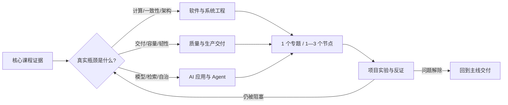

# 可选进阶：让瓶颈决定深度

> 可选进阶不是“高级工程师必背清单”。它是一座完整的工具仓库：平时看得见，但只有当项目、岗位或好奇心提出一个可验证问题时，才取出一件工具。

核心课程回答“怎样把一个系统做对并交付”；进阶课程回答“当系统已经遇到性能、规模、组织或模型能力边界时，下一层机制是什么”。两者的分界不是知识难度，而是**当下是否存在值得支付复杂度的约束**。

## 三大类进阶知识地图

| 大类 | 18 个节点解决什么 | 典型解锁信号 | 入口 |
|---|---|---|---|
| 软件与系统工程 | 性能、运行时、内核、共识、分布式数据与架构演进 | p99、CPU/内存、多副本、跨系统一致性或团队边界成为瓶颈 | [进入软件进阶 →](/advanced/software/) |
| 软件质量与生产交付 | Kubernetes、IaC/GitOps、容量、Chaos、容灾与平台工程 | 多服务运维、环境漂移、资源争用、RTO/RPO 或组织重复劳动 | [进入交付进阶 →](/advanced/quality/) |
| AI 应用与 Agent | 数学与训练、微调、推理系统、GraphRAG、多 Agent | Prompt/RAG 基线已到边界，自托管成本或协调收益可被测量 | [进入 AI 进阶 →](/advanced/ai/) |



## 解锁算法：先写问题，再选知识

把“我想学 Kubernetes / 分布式 / 微调”改写成可证伪的问题。一个合格的问题至少含有**对象、现状、阈值和证据**：

```text
对象：任务运行器的 worker 服务
现状：并发 100 时 p95 从 180ms 升到 2.4s
阈值：p95 必须 < 500ms，错误率 < 1%
证据：CPU 只有 45%，数据库连接池等待占 62%
下一节点：先学 ASW01—03 性能模型，不直接上 Kubernetes
```

满足以下任一条件，才考虑解锁：

1. 当前项目被该机制直接阻塞，且已有观察事实；
2. 目标岗位在真实工作中持续使用它，不只是招聘关键词；
3. 对应核心节点已有解释＋应用证据，继续深入能建立因果模型；
4. 这是主动探索，你明确接受它会延后当前主线产出。

不满足时，把主题留在地图上而不是近期队列里。**同时只激活一个进阶专题，近期全部节点仍控制在 3—5 个。**

## 进阶学习的完成证据

读完、收藏、勾选和跑通官方 quickstart 都不是掌握。每个专题至少交付四件东西：

| 证据 | 要回答的问题 | 示例 |
|---|---|---|
| 机制解释 | 为什么产生这个现象？ | 用排队和饱和解释尾延迟，而不是只说“机器不够” |
| 对照实验 | 改变一个变量后发生什么？ | 固定数据集，对比 batch size 8/32 的吞吐和 p99 |
| 失败边界 | 哪个条件下方案会失效？ | 网络分区时，自动选主会不会让数据分叉 |
| 决策记录 | 为什么现在值得承担复杂度？ | ADR 写出 Kubernetes 相对 PaaS 的收益、代价和退出条件 |

基本掌握要求：能不看正文解释机制，完成一次应用任务，最近三次相关评估平均至少 7/10。熟练还要求在不同日期处理变化任务和失败边界，平均至少 8.5/10。

## 三个常见误区

- **把复杂当深入。** 部署了 Kubernetes、跑起多 Agent，不代表理解调度或协调；复杂工具也可能只是把问题藏深。
- **先选答案再找问题。** “上微服务”不是目标。先写出单体的量化瓶颈、所有权冲突或隔离要求。
- **用实验结果冒充普遍规律。** 一次 benchmark 只说明特定硬件、数据、版本与负载；改变变量后结论可能反转。

## 现在就怎样开始

如果还没有明确瓶颈，继续核心课程或端到端案例。如果有，把问题写成上面的四字段格式，再进入对应大类，从每张地图的第一个匹配专题开始，不需要从 01 顺读到 06。

<div class="source-note">课程组织参考 <a href="https://study8677.github.io/awesome-architecture/">Awesome Architecture</a> 的教程—地图—案例推理方式；学习解锁与证据标准由 Learning 007 独立设计。进阶技术来源统一核验于 2026-08-31，详见三类<a href="../sources/">来源目录</a>。</div>
