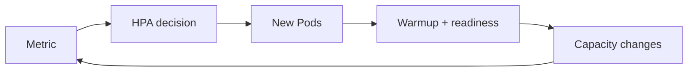

# 02 · 调度、扩缩、RBAC 与集群安全

> 一句话点题：集群稳定性不是 Pod 能跑，而是资源请求能指导调度、过载有边界、扩缩不抖动、身份只拥有必要权限，节点故障不会把关键副本一起带走。

<div class="lesson-meta"><span>AQ04—AQ06</span><span>可选进阶</span><span>预计 8 × 45 分钟</span><span>前置：AQ01—03、Q13—15</span></div>

## 解锁与跳过

共享集群出现 pending、eviction、CPU throttling、噪声邻居、扩缩风暴或越权风险时解锁。单团队本地集群无需过早学习调度插件/多租户平台。

## 本章可观察目标

你能解释 requests/limits、QoS、调度约束与驱逐；能设计 HPA/VPA/节点扩容的指标和稳定性；能实施 ServiceAccount/RBAC、Pod Security、NetworkPolicy 与密钥最小权限。

## AQ04 · Scheduler 根据声明而不是实际愿望放 Pod

requests 用于调度/资源保证，limits 约束最大使用。CPU limit 常通过 CFS throttling 限制，会在节点尚有 CPU 时仍增加延迟；内存超 limit 可能 OOMKill，内存不可像 CPU 那样平滑节流。requests 过低让节点过度承诺，过高浪费/Pod Pending。

节点选择由资源、affinity/anti-affinity、taints/tolerations、topology spread、priority/preemption 等共同影响。关键副本分散到不同节点/zone，避免一个故障域全灭；约束太严会无法调度。

驱逐可能来自内存/磁盘压力、优先级或维护。PDB 约束自愿中断可用数量，但如果 replicas=1 或升级同时无 surge，会阻塞维护；硬故障仍可能失去副本。

## AQ05 · 扩缩是带延迟的反馈控制

HPA 根据 CPU/内存/自定义指标调整副本。CPU utilization 是相对 request；request 错会让扩缩判断错。队列 worker 更适合 queue age/lag、到达率和每副本处理能力，而非 CPU。



反馈有采集、决策、调度、拉镜像、预热延迟。扩容来不及挡瞬时尖峰，需要缓冲/过载保护；缩容太快会抖动/终止在途。设置 stabilization、合理 min/max、冷启动容量。HPA 扩 Pod、cluster autoscaler 扩节点，两者可能串联延迟；VPA 调 requests 可能重建 Pod，与 HPA 同指标会冲突。

扩应用不能超下游：每 Pod 20 DB connections，HPA 2→50 会把潜在连接 40→1000。容量预算要跨层，把全局 semaphore/代理/池限制纳入。

## AQ06 · 集群身份与安全边界

每 workload 使用独立 ServiceAccount；Role/ClusterRole 定义 verbs/resources/scope，RoleBinding 绑定主体。避免默认 ServiceAccount、`cluster-admin`、通配 `*`。短期 projected token，关闭不需要的 automount。

Pod Security Standards（Privileged/Baseline/Restricted）约束 root、capabilities、host namespace/volume、seccomp 等。容器非 root、只读 rootfs、drop capabilities；镜像签名/扫描、admission policy；NetworkPolicy 默认拒绝；Secret at-rest/外部管理和轮换。

多租户仅 namespace＋RBAC 未必足够：共享内核、节点、CRD/controller、网络/存储和资源 DoS 仍是边界。强不信任租户可能需独立集群/节点/沙箱运行时。

## 贯穿案例：HPA 把数据库压垮

API CPU request 50m，正常实际 200m，HPA 看见 400% 利用率扩到 40 副本；每副本连接池 20，数据库连接耗尽，延迟更差，HPA继续扩。修复：基于 profile 设置真实 request；限制全局连接；以请求/延迟/队列综合扩缩；maxReplicas 按下游容量；过载时 429/排队；预热/缩容稳定窗口。问题不是 HPA 失灵，而是控制输入/边界错误。

## 会死在哪里

- requests 全省略/极低，调度过量。
- CPU limit 造成延迟却只看平均 CPU；看 throttling。
- 反亲和强制导致扩容 pending；选择 preferred/故障域权衡。
- HPA 只看 CPU，不看冷启动/下游。
- RBAC 用通配和 cluster-admin；按资源/namespace/verb收缩。
- NetworkPolicy 写了但 CNI 不执行；验证实际流量。
- namespace 当强安全隔离。

## 与 AI 协作模板

```text
请审查共享集群的资源与权限：
- 基于 profile/负载给 requests/limits，检查 throttling/OOM/QoS；
- 设计 topology spread/affinity/PDB 并验证故障域和可调度性；
- 为 HPA 写指标、采样/预热/稳定窗口、min/max 和下游容量；
- 计算副本扩张后的 DB/API 总连接/配额；
- 为 ServiceAccount/RBAC/Pod Security/NetworkPolicy 给最小策略；
- 用 can-i/流量/故障测试验证，不只读 YAML。
```

## 练习：制造并修复共享集群事故

给 API 错配低 request/高连接池，运行负载观察 HPA、throttling、DB 等待；修复并做阶跃/缩容。把副本分布到故障域，drain 节点验证 PDB。创建仅能读一个 namespace ConfigMap 的 ServiceAccount，证明不能读 Secret/其他 namespace；验证默认拒绝网络只放必要依赖。

## 常见误区

requests/limits 是同一值；CPU limit 永远保护延迟；HPA 越快越好；副本无限；PDB 保证硬故障；namespace=租户沙箱；RBAC Role 名称决定权限；NetworkPolicy 自动生效；集群管理员 token 给应用。

<Quiz question="HPA 扩副本后数据库更慢，最关键检查是什么？" :options="['继续提高 maxReplicas', '每副本连接/查询×副本后的下游总容量与等待', '删除所有 metrics']" :answer="1" explanation="扩容可能把瓶颈转移/放大到数据库；容量必须端到端预算。" />

## 本章小结

- requests 指导调度，limits 限制使用；错误声明会制造过量或浪费。
- 调度约束在故障分散和可调度之间权衡，PDB 边界有限。
- HPA 是有延迟的反馈控制，指标/冷启动/下游容量决定稳定性。
- RBAC、Pod Security、NetworkPolicy 和短期身份共同构成最小权限。
- namespace 不自动成为强敌对多租户隔离。

<EvidenceTracker lesson="advanced-quality-02-kubernetes-operations" />

## 本章完成标准

用负载设定并验证资源/扩缩；完成节点故障与 PDB 演练；证明最小 RBAC/网络策略；扩容不超过下游预算。最近平均至少 7/10。

<div class="source-note">主要来源（核验于 2026-08-31）：<a href="https://kubernetes.io/docs/concepts/scheduling-eviction/">Kubernetes Scheduling</a>、<a href="https://kubernetes.io/docs/tasks/run-application/horizontal-pod-autoscale/">HPA</a>、<a href="https://kubernetes.io/docs/concepts/security/">Kubernetes Security</a>。特性成熟度按目标版本核对。</div>
