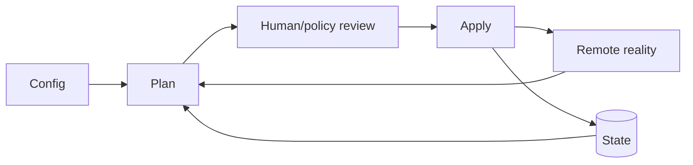

# 03 · IaC、GitOps、策略与漂移

> 一句话点题：基础设施进阶不是把控制台点击翻译成代码，而是让期望状态可审阅、变更可计划、实际状态被持续调和，例外和漂移都有 owner 与证据。

<div class="lesson-meta"><span>AQ07—AQ09</span><span>可选进阶</span><span>预计 7 × 45 分钟</span><span>前置：Q08—11、Q15</span></div>

## 解锁与跳过

环境无法复现、手工变更不可审计、配置漂移或团队需要自助时解锁。单个短期个人环境不必先造模块平台；先从最小声明和远程 state 开始。

## 本章可观察目标

你能解释 Terraform state/plan/apply、依赖图和资源生命周期；能按 GitOps 四原则设计声明/版本/自动拉取/持续调和；能检测漂移并用 policy-as-code 管理约束和例外。

## AQ07 · IaC 维护“声明↔远端对象”的映射

配置描述期望，provider 读取真实 API，state 记录资源身份/属性映射，plan 比较并输出动作，apply 执行。state 可能含敏感值且是并发协调资产，需要远程加密、访问控制、锁和备份；绝不随便手改/公开。



resource dependency 形成图；unknown values 在 apply 才确定。资源重命名/模块重构若不做 moved/import，会被计划成 destroy/create。`prevent_destroy`/ignore_changes 有边界，ignore 可能永久隐藏漂移。

模块应封装稳定组织能力和安全默认，不是把每个资源包一层；版本化输入/输出、升级说明和测试。环境差异用变量/组合，避免复制三份后漂移。

## AQ08 · GitOps 是拉取式持续调和的操作模型

OpenGitOps 原则：声明式；版本化且不可变；自动拉取；持续调和。Git 是期望状态事实源，集群内 agent 拉取并应用，而非 CI 持高权限推送。PR 提供审查/历史，但合并不等于已成功调和；必须看 controller status/健康。

配置仓库与应用制品通过不可变 digest 关联。secret 不能明文进 Git，可使用加密 secret、外部 secret reference；解密权限最小。回退 Git commit 也不自动撤销数据变化/外部副作用。

多环境 promotion 可由更新 digest 的 PR 完成；避免自动追 latest。紧急手工改集群会被 controller 改回或形成漂移，应有 break-glass 流程：临时暂停/记录、事故后回写声明并复盘。

## AQ09 · Policy 与 drift 让边界持续生效

Policy-as-code 在 plan/admission/reconciliation 检查：禁止公网存储、必须标签/加密、镜像来源、资源上限、区域。策略要有测试、版本、owner、严重级别和受控例外（理由/范围/到期）。所有警告不处理会失去信用。

漂移来源：紧急手工、外部 controller、provider 默认变化、资源自动属性、攻击。检测后不是一律覆盖：先判断声明还是现实正确；自动修复低风险漂移，高风险需审批/调查。对 controller 共同管理字段，明确 ownership，避免“打架”。

## 贯穿案例：生产数据库被计划重建

工程师重命名模块资源地址，plan 显示 destroy old/create new；若只看“2 to add”会误删。门禁：保存 full plan；策略阻断生产数据库 destroy；使用 moved block/state move 保持身份；测试恢复；双人审批。这个案例说明 IaC 的最大价值不是自动化速度，而是危险变化在执行前可见。

## 会死在哪里

- state 进 Git/无锁；泄密与并发覆盖。
- 不审 plan 直接 apply；替换/删除被忽略。
- module 过度抽象；升级困难。
- Git merge 等于部署成功；看 reconciliation/health。
- latest/浮动版本破坏可重现。
- 手工紧急改后不回写；长期漂移。
- policy 例外永久；owner/范围/到期。

## 与 AI 协作模板

```text
请审查声明式基础设施变更：
- 标出 state 后端、锁、敏感值、备份与访问；
- 逐项解释 plan 的 create/update/replace/destroy 和不可逆风险；
- 检查资源重命名/import/moved 与模块版本兼容；
- 画 Git→controller→target 的拉取/调和和失败状态；
- 设计 drift ownership、break-glass 回写；
- 写 policy 测试和例外 owner/到期，不自动 apply 生产。
```

## 练习：从手工环境迁到声明式

管理一个小环境：远程 state/锁；导入已有资源；PR 生成 plan；策略阻断公网/无加密/destroy；GitOps controller 部署不可变 digest。手工漂移一个字段，观察检测/调和；执行 break-glass 后回写。故意重命名资源，证明不会重建。

## 常见误区

IaC=脚本；state 可随时删除；plan 一定准确且无副作用；模块越多越复用；Git 是 runtime 真相；GitOps=CI kubectl apply；所有漂移自动覆盖；policy 越严格越安全；紧急手改不留记录。

<Quiz question="Terraform plan 显示生产数据库 replace，第一动作是什么？" :options="['立即 apply 看结果', '阻断并查身份/state/配置变化，确认是否重命名或不可逆替换', '删除 state 重新来']" :answer="1" explanation="replace 可能销毁事实资产；plan 审查和 destroy policy 应先阻断。" />

## 本章小结

- IaC 依赖 config/state/remote reality 三者比较，state 是敏感协调资产。
- Plan 的核心价值是执行前可审查危险动作。
- GitOps 持续调和版本化声明，合并不等于运行健康。
- 漂移需要 ownership、break-glass 和回写，不是一律覆盖。
- Policy 需要测试和有限例外，避免警告噪音/永久豁免。

<EvidenceTracker lesson="advanced-quality-03-iac-gitops" />

## 本章完成标准

完成远程 state/plan 审查、已有资源导入、GitOps 调和、漂移/break-glass 和危险 destroy 阻断；能从证据解释每次变更。最近平均至少 7/10。

<div class="source-note">主要来源（核验于 2026-08-31）：<a href="https://developer.hashicorp.com/terraform/docs">Terraform Documentation</a> 与 <a href="https://opengitops.dev/">OpenGitOps Principles</a>。provider/API 变化快，plan 仍需目标环境验证。</div>
