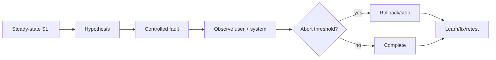

# 05 · Chaos、Game Day 与错误预算治理

> 一句话点题：混沌工程不是随机杀机器，而是在可控爆炸半径内验证一个关于稳态的假设，并把暴露的薄弱点变成设计、监控和恢复改进。

<div class="lesson-meta"><span>AQ13—AQ15</span><span>可选进阶</span><span>预计 7 × 45 分钟</span><span>前置：Q12—14、AQ10—12</span></div>

## 解锁与跳过

已有 SLO、观测、恢复手段和 owner 后解锁。没有监控/停止开关就不在生产注入；先在本地/预发布做确定性故障测试。

## 本章可观察目标

你能写稳态假设、故障变量、blast radius、abort 和回滚；能主持 Game Day；能用错误预算/burn rate决定实验/发布节奏；能把实验发现闭环为可验证改进。

## AQ13 · Chaos 是科学方法，不是破坏表演

原则：建立可测稳态；提出现实事件会破坏它的假设；在生产真实条件下实验（成熟后）；最小化爆炸半径；自动/持续验证。稳态应是用户结果，如“成功任务 99% 在 5min 终态”，不是“3 个 Pod Running”。



故障从依赖延迟/错误、Pod/进程退出、网络丢包/分区、磁盘满、时钟偏差、凭证过期到区域不可用。一次只改变有限变量，先小租户/单实例/短时间。明确 owner、沟通、kill switch、受保护用户/时段。

## AQ14 · Game Day 验证人和系统一起恢复

Game Day 是排练：场景、目标、已知安全边界、观察员、指挥、runbook、不提前透露的 inject、时间线和复盘。验证的不只是冗余，也包括告警是否及时、值班是否理解、权限是否可用、沟通和数据核对。

成功不是“系统没掉”。若实验没产生预期信号，可能注入没生效或监控看不到；这也是发现。记录 MTTD、MTTM、恢复、手工步骤、误导信息和用户影响。

## AQ15 · 错误预算把可靠性变成决策

SLO 允许的失败量是错误预算；multi-window burn rate 告警关注消耗速度。预算充足可做正常发布/实验；快速燃烧暂停高风险变化并修可靠性；长期几乎不消耗也可能 SLO 太松或过度投资。

Chaos 实验也消耗风险预算：低预算时缩小范围/移到预发布，不为“持续实验”牺牲用户。安全、隐私、数据完整性等硬不变量不能用可用性错误预算交换。

## 贯穿 Game Day：消息代理不可用 10 分钟

假设：API 仍接受核心任务到本地 outbox；relay 退避不压垮 DB；恢复后 15 分钟清空，重复效果 0。先预发布，再生产一个内部租户。abort：API error +1pp、DB connection >80%、outbox age >20min。注入断连，观察告警/退避/积压；恢复后验证吞吐、重复、顺序和用户通知。发现 runbook 缺少暂停低优任务命令，补充并再次演练。

## 会死在哪里

- 随机 kill 无假设；无法学习。
- 稳态用内部组件而非用户结果。
- 没有 abort/kill switch；生产实验失控。
- 同时注入多故障；归因困难。
- 只验证技术，不验证人/权限/沟通。
- 实验结束不修/不复测；重复表演。
- 错误预算当允许随便出错，含安全不变量。

## 与 AI 协作模板

```text
请生成安全的故障实验计划：
- 用用户 SLI 写稳态和可证伪假设；
- 定义一个现实故障变量、范围、持续时间和先决条件；
- 写 blast radius、受保护对象、abort、kill switch、恢复；
- 列预期技术/业务信号、负责人、沟通和 runbook；
- 结合当前错误预算决定环境/范围；
- 实验后输出时间线、发现、owner/期限和必须复测项。
```

## 练习：从预发布走到小范围 Game Day

选依赖延迟/进程崩溃；先定义任务完成稳态与 abort；预发布运行并确认注入有效；修一处问题；在内部租户/单实例短时运行；测 MTTD/缓解/恢复；核对数据。复盘产生不超过 3 个高价值 action，并在修复后重复同实验。

## 常见误区

Chaos=kill -9；越随机越真实；生产第一步；系统没挂就成功；没有用户 SLI；Game Day 提前把答案写给所有人；复盘找操作人；错误预算只做报表；安全错误也可预算。

<Quiz question="进行生产 Chaos 实验前最不可缺少的组合是什么？" :options="['随机故障和大范围', '稳态 SLI、可证伪假设、最小爆炸半径、abort/恢复', '只要有管理员权限']" :answer="1" explanation="没有这些就无法安全判断实验是否影响用户或何时停止。" />

## 本章小结

- Chaos 用受控实验验证稳态假设，不是随机破坏。
- 爆炸半径、停止和恢复先于故障注入。
- Game Day 同时验证告警、人、权限、沟通与数据恢复。
- 错误预算将 SLO 消耗连接到发布/实验决策。
- 实验价值来自修复与复测闭环，不是次数。

<EvidenceTracker lesson="advanced-quality-05-chaos-sre" />

## 本章完成标准

完成一份可证伪实验和一次 Game Day；在 abort 内停止/恢复；有用户/系统时间线、数据核对、修复 owner 并复测。最近平均至少 7/10。

<div class="source-note">主要来源（核验于 2026-08-31）：<a href="https://principlesofchaos.org/">Principles of Chaos Engineering</a> 与 <a href="https://sre.google/workbook/table-of-contents/">Google SRE Workbook</a>。生产实验需服从组织变更、安全和用户保护政策。</div>
