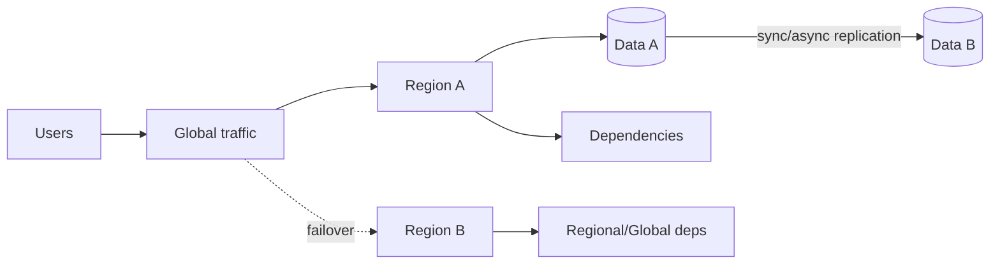

# 06 · 多区域容灾、平台工程与供应链

> 一句话点题：最高阶交付问题不是再加一套工具，而是让区域故障、团队重复和安全控制通过可消费的平台能力被治理，同时不把平台变成新的中央瓶颈。

<div class="lesson-meta"><span>AQ16—AQ18</span><span>可选进阶</span><span>预计 9 × 45 分钟</span><span>前置：Q10—16、AQ07—15</span></div>

## 解锁与跳过

单区域故障损失超出 RTO/RPO、多团队重复搭交付、安全控制无法一致执行时解锁。一个小团队不要先建“内部开发者平台”；用托管服务和模板往往更经济。

## 本章可观察目标

你能按业务 RTO/RPO设计多区域数据/流量/依赖；能比较备份恢复、warm standby、active-passive/active-active；能以平台产品/golden path降低认知负担；能将供应链策略嵌入默认路径并治理例外。

## AQ16 · 多区域首先是数据问题

模式从成本低到高：备份恢复；pilot light/warm standby；active-passive；active-active。每级购买更低 RTO，付出复制、容量、路由、测试和数据冲突。



同步跨区复制延迟高但 RPO 小；异步延迟低但故障可能丢最近写。active-active 要处理并发写、唯一性、冲突、全局配额和用户归属；不是 DNS 两个地址就完成。DNS TTL、连接、缓存和客户端会让切换非瞬时。

依赖故障域也要画：两区域都依赖同一身份/密钥/控制面/第三方，则不真正独立。灾备容量、数据复制 lag、证书/配置、人工权限与回切都要演练。回切往往比切走更危险，需要数据对齐和逐步流量。

## AQ17 · 平台工程把重复能力做成产品

平台的用户是开发团队；从他们最高摩擦旅程开始：创建服务、获得数据库、部署、观测、权限、恢复。Golden path/paved road 提供安全默认和自助，不等于强迫所有应用同技术。

平台产品要有 API/模板/文档、SLO、支持、版本、反馈和 adoption/lead time/失败率指标。先做 thin slice：一类服务从仓库模板到部署/仪表盘/告警；不要一次收编所有云资源。团队保留逃逸路径，例外可审计；否则影子平台出现。

平台应降低认知负荷而不是把 YAML 门户化。自助动作背后仍需所有权、配额、成本和回收生命周期。平台团队不成为所有应用 on-call；责任界面写清。

## AQ18 · 安全供应链成为默认能力

Golden path 内置：可信模板/依赖；短期 CI identity；隔离构建；不可变制品；SBOM/provenance/签名；部署 admission 验证；最小 runtime identity；漏洞定位与修复。Policy-as-code 在开发/plan/admission 多阶段给早反馈，高风险阻断，例外带 owner/期限。

供应链控制本身也需高可用与更新：签名根、策略服务、制品库故障会阻断全公司发布；设计 break-glass、审计、缓存/降级和灾备。安全平台若慢/误报多，团队会绕过。

## 贯穿案例：从复制脚本到最小平台

5 个团队各复制 CI、Dockerfile、监控，修漏洞要改 30 仓库。平台先提供一个版本化 service template＋共享 workflow：非 root镜像、SBOM/sign、部署同 digest、默认 SLO dashboard、namespace/RBAC。选两个团队试点，衡量首个部署时间、失败率、升级耗时；保留扩展点。随后做区域恢复模板：声明 RTO/RPO、备份/恢复 job和演练记录。平台能力由真实摩擦排序，不做工具展览。

## 会死在哪里

- active-active 只考虑流量不考虑写冲突。
- 灾备依赖同一控制面/凭证；共同故障。
- 只演练 failover 不演练 failback/数据核对。
- 平台从技术栈开始不访谈用户；无人采用。
- Golden path 无逃逸；团队绕过。
- 平台替应用承担所有责任；中央瓶颈。
- 安全门禁不可用时全公司停发且无 break-glass。

## 与 AI 协作模板

```text
请把韧性与平台方案写成业务/产品设计：
- 从业务损失定义 RTO/RPO/一致性，比较备份、standby、active-*；
- 画流量、数据、身份、密钥、制品和第三方故障域；
- 写 failover/failback、复制 lag、数据核对和演练；
- 访谈式列开发者摩擦，选择一个 golden path thin slice；
- 定义平台 API/SLO/责任/反馈/adoption/退出路径；
- 将签名/SBOM/policy/身份内置，并给策略服务故障的 break-glass。
```

## 练习：设计一个可验证的最小平台能力

选择“新服务上线”旅程，测当前耗时/失败；做模板＋CI＋制品＋观测＋权限 thin slice，让另一个项目使用。为它定义 SLO/owner/升级。再为关键数据做异地恢复演练，测 RPO/RTO/failback。注入策略/制品库不可用，验证受审计 break-glass 不变成常态。

## 常见误区

多区域=高可用；active-active 最好；RPO/RTO 抄数字；备份跨区就够；平台=门户；统一越多越好；无人采用归咎开发者；安全门禁只会阻断；break-glass 永久开；供应链系统自身不用容灾。

<Quiz question="两区域应用都依赖同一个不可用的全局身份服务，是否算区域独立？" :options="['算，应用有两份', '不算，共同依赖仍是单一故障域', '只要 DNS 正常就算']" :answer="1" explanation="容灾必须沿完整依赖图验证，共享身份/控制面会同时击穿两区域。" />

## 本章小结

- 多区域以业务 RTO/RPO和数据复制/冲突为核心，不只流量路由。
- 完整依赖故障域、failover/failback和数据核对必须演练。
- 平台工程以开发者为用户、以 golden path 降认知负担、以指标迭代。
- 平台保留扩展/退出和责任边界，避免中央瓶颈。
- 供应链安全进入默认路径，其控制面自身也需韧性和受控 break-glass。

<EvidenceTracker lesson="advanced-quality-06-platform-resilience" />

## 本章完成标准

完成带依赖图的 RTO/RPO方案和 failover/failback演练；交付一个被真实项目使用的平台 thin slice；供应链策略与 break-glass 均经故障验证。最近平均至少 7/10。

<div class="source-note">主要来源（核验于 2026-08-31）：Google SRE Workbook、<a href="https://tag-app-delivery.cncf.io/whitepapers/platforms/">CNCF Platforms White Paper</a>、<a href="https://slsa.dev/spec/v1.2/">SLSA v1.2</a>。平台组织设计需结合真实团队研究。</div>
