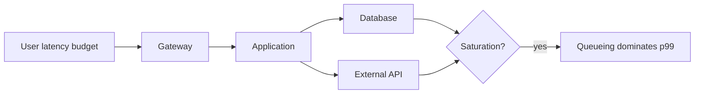

# 01 · 性能模型、基准与 Profiling

> 一句话点题：性能优化不是“让代码更快”的审美竞赛，而是用可重复测量找到用户正在支付的时间/资源，再证明某个改变真的改善了瓶颈而没有破坏正确性。

<div class="lesson-meta"><span>ASW01—ASW03</span><span>可选进阶</span><span>预计 6 × 45 分钟</span><span>前置：SW04—07、Q12</span></div>

## 解锁与跳过

只有当延迟、吞吐、CPU、内存或成本有明确阈值且已成瓶颈时解锁。若只是“听说 Rust 更快”“想把 p95 从 80ms 降到 70ms”却没有用户/成本价值，先跳过。先写基线：环境、版本、数据、负载、p50/p95/p99、吞吐、错误率和资源。

## 本章可观察目标

你能建立延迟/吞吐/利用率/并发的性能模型；能设计控制变量的 micro/macro/load benchmark；能使用 sampling profiler、火焰图、内存与 I/O 证据定位瓶颈；能解释优化的适用边界与回归风险。

## ASW01 · 性能是一组互相影响的量

- **Latency**：单个请求从开始到完成；尾延迟影响最慢用户；
- **Throughput**：单位时间完成多少；
- **Concurrency**：同时在途多少；
- **Utilization/Saturation**：资源有多忙、是否出现等待队列；
- **Cost per result**：每个成功结果消耗多少 CPU、内存和费用。

Little 定律给出稳态直觉：`在途量 L = 到达率 λ × 平均停留时间 W`。每秒 200 请求、平均 0.5 秒，约 100 在途。它不解释分布和爆发，但能帮你检查容量假设。

排队的关键现象是：资源利用率接近上限时，等待时间常非线性上升。CPU 70%→85% 可能平稳，85%→95% 可能让 p99 爆炸；因为突发没有余量。性能预算应从用户端拆分：总 800ms，网关 50、应用 250、数据库 300、外部依赖 150、余量 50，并让超时共享截止时间。



## ASW02 · Benchmark 是实验，不是跑分截图

Microbenchmark 隔离函数/算法，适合比较序列化、数据结构；macrobenchmark 测完整请求；load test 测多并发稳态/阶跃/尖峰/浸泡。三者不能互相替代。

实验记录：硬件/OS/运行时/commit；数据规模与分布；预热；并发/到达模型；持续时间；重复次数；背景噪音；指标和误差。一次结果不够，报告分布/置信范围。开环固定到达率更能暴露排队，闭环“完成一个再发一个”可能在系统变慢时自动降低压力，掩盖过载（coordinated omission）。

基准必须同时检查正确性和错误率。把超时请求丢掉后平均延迟会“更好”；缓存返回旧数据也可能更快。每次优化保留结果校验和资源/成本。

## ASW03 · Profiling 从“慢”定位到证据

先判断 CPU、I/O、锁、内存/GC 还是下游等待，再选工具：CPU sampling profiler 看时间在哪个调用栈；火焰图宽度表示采样占比，不是调用次数；allocation/heap profiler 看谁分配/持有内存；数据库看 plan/locks；网络看连接与重传；eBPF 在下一章深入。

```text
症状 → 分层测量 → 最宽/最长等待 → 提出假设 → 改一个变量 → 同负载复测
```

Sampling 开销通常低于 instrumentation，适合生产短时采样；但采样频率、JIT 符号和异步栈会影响准确性。Profiler 说某函数占 40% CPU，不代表优化它就能整体快 40%：Amdahl 定律提醒，若可优化部分只占总耗时 20%，即使无限快，总体最多约 1.25 倍。

## 贯穿案例：JSON 看起来最宽，却不是根因

任务 API 在 200 并发 p99 2.8s。火焰图显示 JSON 序列化占应用 CPU 35%，团队想换库；但 trace 显示 85% 端到端时间在等连接池，数据库慢查询由缺失复合索引引起。先加索引后 p99 到 420ms，序列化占 CPU 比例反而升到 60%（因为其他等待消失），但用户目标已满足。比例变大不等于绝对变慢。

随后若成本仍高，再以相同响应正确性比较序列化库。性能判断必须同时看绝对值与全链路。

## 会死在哪里

- 本机空载跑一次就下结论；固定环境、多次、真实分布。
- 只看平均；报告尾延迟和错误。
- profiler 比例当因果；结合 wall time、trace 和对照实验。
- 优化后测试数据变了；保存 workload/seed/commit。
- 只提高吞吐不做背压；系统更快耗尽下游。
- 性能测试不校验输出；“快”来自少做/做错。

## 与 AI 协作模板

```text
不要先建议优化。请建立性能调查：
1. 写用户阈值、负载/数据/环境和基线分布；
2. 用 trace/资源/队列判断 CPU、I/O、锁、GC 或下游等待；
3. 为每个假设选 micro/macro/load 实验，只改一个变量；
4. 指出 coordinated omission、预热、缓存和错误过滤偏差；
5. 优化后同时回归正确性、p50/p95/p99、吞吐、资源和成本；
6. 写结论适用条件与停止优化的标准。
```

## 练习：完成一次可反驳优化

给任务列表生成 100k/1m 两档数据，定义 100/300 RPS 阶跃；采集 trace、CPU/heap profile、数据库计划；选一个最大瓶颈做单变量优化；运行至少 5 次前后对照。提交基准脚本、原始数据、火焰图、正确性回归和一页结论。再改变数据分布，证明原结论是否仍成立。

## 常见误区

优化之前无基线；算法复杂度直接等于毫秒；平均代表用户；CPU 低就有容量；火焰图最宽必是根因；更换语言优先；缓存命中不验证新鲜度；benchmark 不保存环境；优化到没有业务价值。

<Quiz question="优化后某函数在火焰图占比从 35% 升到 60%，能否断言它变慢了？" :options="['能，占比升了', '不能，其他瓶颈消失会让比例升高，需看绝对 CPU/延迟', '只能说明内存泄漏']" :answer="1" explanation="火焰图宽度是相对采样占比；必须结合绝对值和端到端指标。" />

## 本章小结

- 性能是延迟、吞吐、并发、饱和、正确性与成本的共同约束。
- 接近饱和时排队使尾延迟非线性恶化，必须留突发余量和背压。
- Benchmark 是控制变量实验，真实负载、重复和偏差说明不可少。
- Profiling 先定位时间/资源，再用对照证明因果；比例不是绝对耗时。
- 优化以达到业务阈值为停止条件，不追逐无价值跑分。

<EvidenceTracker lesson="advanced-software-01-performance" />

## 本章完成标准

交付可复现负载、基线、profile、单变量优化和正确性/性能回归；能解释一个结论在哪些数据/负载下反转。最近三次平均至少 7/10；熟练需不同日期/负载平均至少 8.5/10。

<div class="source-note">主要来源（核验于 2026-08-31）：<a href="https://www.brendangregg.com/flamegraphs.html">Brendan Gregg Flame Graphs</a>、<a href="https://docs.kernel.org/trace/index.html">Linux Tracing Documentation</a>、<a href="https://www.postgresql.org/docs/current/using-explain.html">PostgreSQL EXPLAIN</a>。工具输出受运行时与采样影响，结论必须在目标环境验证。</div>
