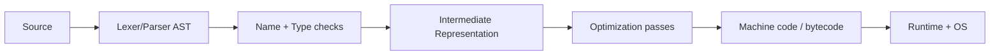

# 02 · 编译器、运行时、GC 与 JIT

> 一句话点题：当停顿、预热、二进制、内存或跨语言边界进入 SLO，你需要看见源码到机器执行的管线，而不是把“运行时开销”当黑盒。

<div class="lesson-meta"><span>ASW04—ASW06</span><span>可选进阶</span><span>预计 7 × 45 分钟</span><span>前置：SW01—06、ASW01—03</span></div>

## 解锁与跳过

GC pause、JIT warmup、编译时间、二进制体积、FFI 或生成代码已影响启动/延迟/成本时解锁。普通业务 API 没有运行时证据时，不必先学编译器理论，更不需要从零造语言。

## 本章可观察目标

你能解释前端解析/类型、中间表示、优化和代码生成；能比较解释、AOT、JIT 的运行特征；能用分配率、存活集和 pause 数据解释 GC；能识别 FFI/ABI、逃逸和优化失效边界。

## ASW04 · 从源码到执行



AST 表达语法结构，IR 提供较稳定的分析/优化表示；优化包括常量折叠、死代码消除、内联、循环优化和向量化；代码生成映射到目标架构。优化必须保持可观察语义，但浮点、未定义行为、并发和外部副作用会限制重排。

LLVM 文档含 IR、优化、JIT、profiling 与 GC 接口。学习重点不是背 pass 名称，而是读一个小程序 IR，比较优化前后为何安全。Debug/Release 行为差异也解释了“调试很慢/线上才出错”。

## ASW05 · 解释、AOT 与 JIT 买不同时间

- Interpreter/bytecode：启动灵活，执行时持续解释/虚拟机开销；
- AOT：部署前生成机器码，启动可预测、分发明确，但缺少真实运行 profile；
- JIT：运行时观察热点并编译优化，峰值可能高，付出预热、代码缓存和去优化。

JIT 会根据类型/分支假设生成专门代码；假设被打破时 deoptimization 回到通用路径。多态对象形状、动态反射、巨型函数可能阻碍优化。短命 CLI/serverless 可能还没预热完就退出，AOT/快照更有价值；长驻服务可享受 JIT 峰值，但发布/扩容后的冷启动要进入容量计划。

## ASW06 · GC 管理可达性，不管理业务资源

Tracing GC 从 roots 追踪可达对象；不可达对象可回收。分代假设多数对象短命；年轻代频繁小回收，晋升对象进入老年代。关键量：分配率、存活集、堆大小、pause、并发 GC CPU、晋升与碎片。

```text
高分配率 + 大量短命 → 频繁 young GC（吞吐税）
大存活集/泄漏引用 → old heap 增长 → 更长/更贵回收
堆调太小 → 回收频繁；堆调太大 → 内存成本/最坏 pause 可能上升
```

GC 只回收内存，不保证及时关闭 socket、文件和锁；资源要显式生命周期。内存泄漏在 GC 语言中通常是“不再需要但仍可达”，用 heap snapshot/retaining path 找谁持有。

FFI 穿过语言边界要遵守 ABI、所有权、线程与错误规则；复制/编码成本可能吞掉算法收益。优化原生库前先测边界成本。

## 贯穿案例：扩容后前 3 分钟 p99 爆炸

Java/JS 类长驻服务扩容，新实例立刻接满流量；JIT 未预热、缓存为空、类加载和连接建立叠加，p99 4s。解决不应只“加机器”：readiness 在预热完成后开放；逐步加权流量；镜像/快照或 AOT 评估；容量保留冷实例开销；benchmark 分 cold/warm 两段。若 GC 同时频繁，先看分配 profile和存活集，而不是盲调最大堆。

## 会死在哪里

- Debug benchmark 代表生产；用相同优化/符号配置。
- 只看 heap 占用不看分配/存活；结合 GC log/heap profile。
- 调大堆掩盖泄漏；用 retaining path 找所有者。
- JIT 峰值代表冷启动；分别测 cold/warm。
- FFI 忽略复制/错误/线程所有权；端到端测边界。
- 编译器优化当魔法；检查 IR/反汇编和语义前提。

## 与 AI 协作模板

```text
基于证据解释运行时问题：
- 画 source→AST/type→IR→optimization→machine/runtime；
- 区分 cold/warm、解释/AOT/JIT 的时间和内存成本；
- 报告 allocation rate、live set、pause、GC CPU、heap retaining path；
- 检查动态形状/反射/FFI 是否破坏优化或增加复制；
- 每个调参先写机制假设、单变量实验和回退；
- 不根据语言刻板印象直接建议重写。
```

## 练习：观察而非造编译器

选一段含循环/分支的小程序，查看无优化与优化 IR/反汇编；解释内联/死代码。再运行一个长驻服务，分别记录冷启动与稳定态；制造短命对象洪峰和保留引用，采集 GC/heap 证据。最后改变一个分配模式并复测 p99/CPU/内存。

## 常见误区

编译语言都快、解释语言都慢；JIT 总胜 AOT；GC 自动管理所有资源；堆越大越好；内存下降就是无泄漏；release 与 debug 可直接比较；原生扩展一定更快；为了学习运行时先写完整编译器。

<Quiz question="GC 语言中内存不断增长，最准确的第一步是什么？" :options="['立刻把最大堆翻倍', '看分配率、存活集与 retaining path，判断是负载、缓存还是仍可达泄漏', '关闭所有类型检查']" :answer="1" explanation="GC 只回收不可达对象；仍被引用的无用对象需要找持有链。" />

## 本章小结

- 编译管线通过 AST/类型/IR/优化/代码生成把源码变为执行。
- AOT/JIT/解释把成本放在不同阶段，选择取决于生命周期与 SLO。
- JIT 有预热和去优化，冷启动必须单独测。
- GC 围绕分配率、存活集和 pause；可达不等于仍有业务价值。
- FFI/ABI 的所有权与复制成本是跨语言优化的重要边界。

<EvidenceTracker lesson="advanced-software-02-runtime-compiler" />

## 本章完成标准

能解释一段 IR 优化；用 cold/warm 基准展示运行时差异；用 GC/heap 证据定位一次分配或保留问题；优化后回归语义与 SLO。最近平均至少 7/10。

<div class="source-note">主要来源（核验于 2026-08-31）：<a href="https://llvm.org/docs/">LLVM Documentation</a>（页面于 2026-08-30 更新）、<a href="https://docs.oracle.com/en/java/javase/25/gctuning/">Java GC Tuning Guide</a>。不同运行时算法和默认值差异大，必须回到目标版本文档与实测。</div>
