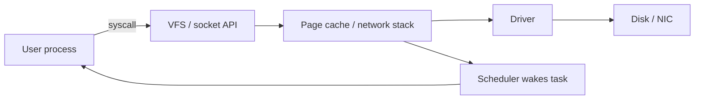

# 03 · Linux 内核、eBPF 与高性能网络

> 一句话点题：当应用日志说“什么都没发生”而请求仍卡住，事实可能在系统调用、调度、页缓存、socket 队列或内核网络路径里；eBPF 让你在不改应用的情况下观测这些边界。

<div class="lesson-meta"><span>ASW07—ASW09</span><span>可选进阶</span><span>预计 7 × 45 分钟</span><span>前置：SW05—07、ASW01—03</span></div>

## 解锁与跳过

应用 trace/profiler 已无法解释 CPU 抖动、I/O、系统调用或网络尾延迟时解锁。能在应用/数据库层定位的问题不要先上 eBPF；没有 Linux 实验环境也可暂留地图。

## 本章可观察目标

你能沿用户态→系统调用→内核子系统→设备解释 I/O；能读调度、页错误、文件与 socket 基本指标；能说明 eBPF verifier/map/hook 的安全与成本；能用分层网络证据定位连接、队列、重传和软中断问题。

## ASW07 · 系统调用是用户态进入内核的门

应用通过 read/write/open/connect/accept 等系统调用请求内核能力。系统调用切换不是“每次都很慢”的简单结论，真正成本常来自阻塞、复制、页错误、调度与设备。



文件读可能命中页缓存而不触盘；首次访问映射页产生 page fault；写成功可能只到缓存，持久性取决于文件系统/flush。CPU 利用率要分 user/system/iowait/steal；大量 context switch 可能来自线程过多或锁等待，但指标本身不是根因。

## ASW08 · eBPF 是受验证的内核可编程观测

eBPF 程序挂在 tracepoint、kprobe/uprobe、网络 hook 等事件，verifier 检查终止、内存访问和约束，JIT/解释执行；通过 maps 与用户态交换聚合数据。它能做低侵入 tracing、网络/安全策略，但不是零开销，也不是所有内核版本/配置一致。

优先稳定 tracepoint，kprobe 依赖内核函数实现更易版本变化；uprobes 观测用户态二进制需符号/偏移。高频事件逐条上报会压垮系统，应在内核端按 key 聚合、采样和限制 map。生产先在小范围、短时间运行并监控探针开销。

典型问题：哪些进程在频繁 open；哪个调用栈导致 TCP connect 慢；调度 off-CPU 时间在哪；块 I/O 延迟分布；DNS/连接错误。工具给证据，不自动给业务解释。

## ASW09 · 网络性能是一连串队列

请求经过应用 accept 队列、socket send/receive buffer、TCP 拥塞窗口、qdisc、NIC ring、交换/网络路径和对端。吞吐受带宽×RTT（带宽时延积）与拥塞控制影响；小包/系统调用/复制和 TLS 也有成本。

连接慢先分 DNS、TCP handshake、TLS、应用等待；传输慢看 RTT、丢包/重传、拥塞、窗口与队列。增加 socket buffer 可能提高长肥网络吞吐，也可能增加 bufferbloat 和延迟。`SO_REUSEPORT`、多队列/RSS、零拷贝、io_uring 等只有在 profile 指向相关边界时才值得深入。

### 分层定位清单

```text
应用：在等 CPU、锁、连接池还是 socket?
主机：run queue、软中断、context switch、page fault?
TCP：连接数、retransmit、RTT、listen/drop、窗口?
接口：drops/errors、ring、带宽、队列?
路径：负载均衡/NAT/防火墙/跨区?
对端：是否慢读、限流或关闭?
```

## 贯穿案例：偶发 3 秒连接建立

应用 trace 只显示“connect 3s”。按层采集发现 DNS 正常、TCP SYN 重传一次后成功；只发生在某节点，接口无物理错误，但 conntrack 表接近上限并丢新连接。继续增加应用超时只会让用户等更久。临时迁流/扩表缓解，长期减少短连接、连接复用、监控 conntrack 和容量。eBPF/TCP 指标把“外部 API 偶尔慢”变成主机网络状态证据。

## 会死在哪里

- 一上来抓所有事件：观测本身压垮主机；聚合/采样/限时。
- kprobe 当稳定 API：内核升级失效；优先 tracepoint/BTF 并测试版本。
- iowait/重传看到相关就定根因；建立时间线和对照。
- 调大 buffer/超时掩盖队列；看队列位置和端到端目标。
- 把容器网络当独立内核；理解 namespace/veth/宿主路径。
- eBPF 工具以 root 运行无治理；最小 capability、可信程序和审计。

## 与 AI 协作模板

```text
请按用户态→syscall→内核→设备/网络分层调查：
- 先写应用层已排除的证据和时间窗口；
- 选择稳定 tracepoint/eBPF hook、聚合 key、采样与开销上限；
- 同步采集调度、page fault、I/O、TCP RTT/retransmit/drop/queue；
- 用同一 request/时间线关联，区分相关与因果；
- 任何内核调参给回退、作用范围和副作用；
- 明确目标内核版本/权限，不生成未知来源生产探针。
```

## 练习：追一次看不见的等待

在 Linux 环境用可控程序制造 CPU 抢占、磁盘等待或 TCP 重传之一；先只看应用，再用系统指标和官方/可信 eBPF 工具定位；限制采样时间并测开销。提交层次图、事件时间线、假设/反证和最小修复。改变内核/容器边界后检查探针是否仍正确。

## 常见误区

system CPU 高等于内核 bug；iowait 是 CPU 忙；eBPF 零开销；kprobe 永久兼容；重传一定是公网差；增大 buffer 永远降低延迟；容器完全隔离网络；先调 sysctl 后找证据。

<Quiz question="eBPF 在高频 syscall hook 上逐事件发送到用户态，主要风险是什么？" :options="['自动提高吞吐', '观测开销和事件洪水反过来影响系统，应内核聚合/采样', '会让 DNS 永久缓存']" :answer="1" explanation="高频事件逐条传输代价很大；应设计 map 聚合、采样与短时运行。" />

## 本章小结

- 系统调用连接用户态与内核，真实成本来自调度、复制、缓存、设备和等待。
- eBPF 受 verifier 约束并可挂多类 hook，但有权限、兼容和开销边界。
- 网络性能由多级队列、RTT、丢包、窗口与对端共同决定。
- 分层证据与统一时间线优先于看到一个指标就下结论。
- 内核调参与高级 I/O 技术只在 profile 指向该层时解锁。

<EvidenceTracker lesson="advanced-software-03-kernel-ebpf" />

## 本章完成标准

用系统/内核证据定位一次应用不可见等待；探针有版本、权限、采样和开销说明；完成修复前后对照并能指出观测可能误导处。最近平均至少 7/10。

<div class="source-note">主要来源（核验于 2026-08-31）：<a href="https://docs.kernel.org/">Linux Kernel Documentation</a>（官方说明整体仍在持续完善）、<a href="https://docs.ebpf.io/">eBPF Docs</a>。内核 ABI/hook 可变，部署以目标内核与 BTF/tracepoint 实测为准。</div>
