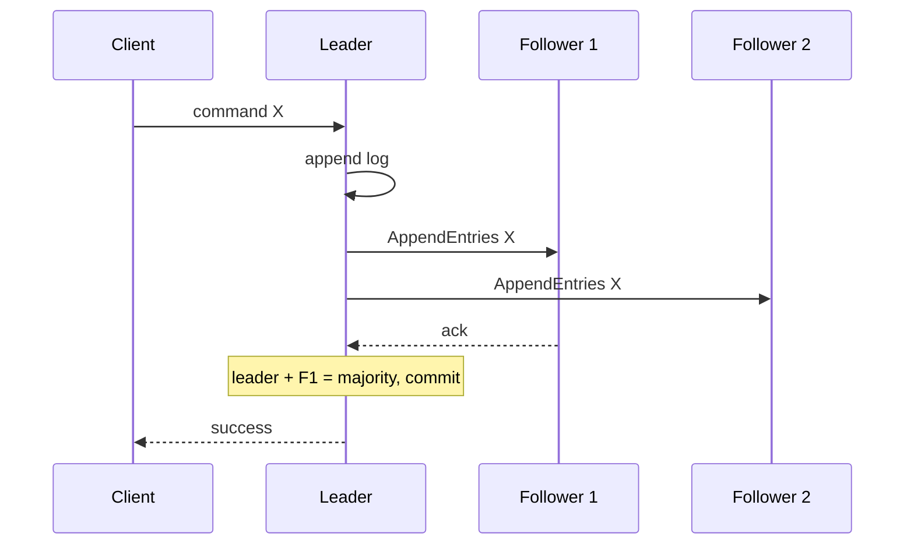

# 04 · 分布式故障、一致性与 Raft

> 一句话点题：跨过两台机器后，调用结果可能未知、时钟不统一、节点可以部分失败；共识不是让网络可靠，而是在有限故障模型下让多数节点对日志顺序保持唯一决定。

<div class="lesson-meta"><span>ASW10—ASW12</span><span>可选进阶</span><span>预计 8 × 45 分钟</span><span>前置：SW06、SW11、SW13、Q13—14</span></div>

## 解锁与跳过

复制、选主、跨节点写、锁/元数据或网络分区已进入系统时解锁。普通单库业务无需实现 Raft；使用托管数据库也应理解其故障承诺，但不需要背证明。

## 本章可观察目标

你能写出 crash/omission/partition/Byzantine 等故障模型边界；能区分线性一致、因果与最终一致；能解释时间/顺序问题；能走通 Raft 选举、日志复制、安全和多数派；能设计分区与恢复实验。

## ASW10 · 分布式最难的是“我不知道”

请求超时可能没到、正在执行、执行成功回包丢失或对端已死。检测器只能基于时间猜测，无法在异步网络中完美区分慢与死。重试带来重复，不重试带来丢失；正确业务效果依赖幂等、状态查询与对账。

故障模型决定结论：crash-stop 节点停后不回；crash-recovery 会带持久状态回来；网络可丢/重/乱/分区；Byzantine 可任意恶意行为，Raft 不解决 Byzantine。不要声称“容错”却不写容什么。

```text
客户端 ─请求→ Leader（写入并提交） ─响应X丢失→ 客户端
客户端看到 timeout，但系统已经成功。下一步应查询/幂等重试。
```

## ASW11 · 一致性是可观察保证，不是数据库开关

线性一致让每个操作看起来在调用与返回之间某一瞬间原子发生，符合实时顺序；顺序一致有共同顺序但不要求实时；因果一致保因果先后；最终一致只承诺无新更新时收敛。事务隔离与分布式副本一致性是相关但不同维度。

CAP 讨论网络分区发生时线性一致与可用响应的冲突；它不是“任意数据库永远三选二”。正常时也在用跨副本协调延迟换更强一致。按数据业务损失选择：唯一主权/余额需要强保证，点赞数可能允许短暂旧值。

物理时钟有偏差。Lamport clock 建立 happens-before 可扩展顺序；vector clock 能识别并发；HLC 结合近似物理时间与逻辑。多数业务只需数据库/消息提供的序列，不要自行实现时钟；但不能用客户端时间裁决抢票先后。

## ASW12 · Raft 如何让复制日志保持安全

Raft 将问题分为 leader election、log replication、safety：节点 follower/candidate/leader；选举超时后 candidate 增 term 并请求投票；获多数成为 leader；所有写由 leader 追加日志并复制，多数确认后提交。多数集合必相交，使两个互斥决定不能都在同一配置被多数提交。



只有日志足够新节点才能赢选举；term/index 检查防止不一致前缀；committed entry 不被未来 leader 覆盖。5 节点容 2 crash，需要 3 多数；分成 2+3 时只有 3 一侧可继续。跨区域多数把 RTT 写进提交延迟。

Raft 给复制状态机日志安全，不自动给：业务请求幂等、线性一致只读（需 read index/lease 等正确机制）、磁盘真实持久、成员变更随意、客户端发现 leader、跨组事务。实现和运维细节非常多，优先成熟系统。

## 贯穿故障：网络分区后的旧主写入

3 节点 A/B/C，A 是 leader。A 与 B/C 分区：B/C 选新 leader 并提交新日志；A 无多数不能提交，但如果应用错误地把“本地 append”返回成功，客户端得到幽灵成功。分区恢复后 A 的未提交尾部被新 leader 覆盖。测试应验证：少数派拒绝/超时；客户端未知结果查询；已提交日志不丢；旧 leader term 更新后降级。

## 会死在哪里

- 超时=失败；它只是未知结果。
- CAP 三选二当标签；先写分区下每种操作保证。
- 用 wall clock 排全局顺序；明确序列/因果来源。
- 多数写入就等于业务 exactly-once；客户端仍会重试。
- 跨区节点越多越可靠；写延迟和多数可达性也变差。
- 自己实现 Raft 上生产；证明、持久化、成员变更和快照坑多。

## 与 AI 协作模板

```text
请先写故障模型与一致性契约：
- 节点/磁盘/网络允许怎样失败，是否 crash-recovery/Byzantine；
- 每类读写在正常、超时、少数派、恢复时承诺什么；
- 画 Raft term/election/log/commit 时序，区分 append 与 committed；
- 构造 leader crash、双向分区、延迟消息、旧 leader 恢复；
- 检查客户端幂等、未知结果查询、read consistency 和成员变更；
- 不用 CAP 口号替代逐操作契约。
```

## 练习：用可视化状态机验证分区

不必手写完整 Raft。使用教学实现/模拟器跟踪 3/5 节点 term、vote、log、commit；注入 leader 在本地 append 后崩溃、多数/少数分区、消息延迟与恢复；写出每步可提交性。再为一个幂等客户端实现 timeout 后查询，证明“不重复业务效果”。

## 常见误区

网络分区很罕见可忽略；节点死/慢可准确区分；CAP 是数据库分类；最终一致等于随便错；Raft 让所有操作 exactly-once；本地写日志等于提交；5 节点随便分布就更可靠；共识组承载所有业务数据。

<Quiz question="5 节点 Raft 集群分成 2 和 3 两侧，哪侧能提交新日志？" :options="['两侧都能', '只有拥有 3 节点多数的一侧', '2 节点侧更快所以能']" :answer="1" explanation="提交需要多数；多数集合相交是安全性的核心。" />

## 本章小结

- 分布式超时产生未知结果，故障检测只能在假设下判断慢与死。
- 一致性是客户端可观察保证；按数据损失选择，不求一律最强。
- 没有可靠全局时钟，顺序来自因果、逻辑时钟或共识日志。
- Raft 通过 term、选举限制、日志匹配和多数提交维护复制状态机安全。
- 共识不替代业务幂等、客户端恢复、持久化与跨系统事务。

<EvidenceTracker lesson="advanced-software-04-distributed-consensus" />

## 本章完成标准

写出一个系统逐操作故障/一致性契约；走通 Raft 关键时序；注入至少四类故障并解释提交/恢复；客户端未知结果不产生重复效果。最近平均至少 7/10。

<div class="source-note">主要来源（核验于 2026-08-31）：Ongaro 与 Ousterhout 的 <a href="https://raft.github.io/raft.pdf">In Search of an Understandable Consensus Algorithm</a>（扩展版，2014-05-20）与 <a href="https://pdos.csail.mit.edu/6.824/">MIT 6.5840</a>。Raft 论文故障模型不含 Byzantine。</div>
