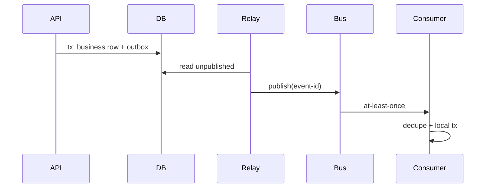

# 05 · 分布式存储、流处理与跨系统事务

> 一句话点题：当数据跨分区、复制和服务流动，难点不再是“发出去”，而是顺序属于谁、重复怎样消解、积压怎样背压、状态怎样在崩溃后重建。

<div class="lesson-meta"><span>ASW13—ASW15</span><span>可选进阶</span><span>预计 8 × 45 分钟</span><span>前置：SW10—13、ASW10—12</span></div>

## 解锁与跳过

单库/普通队列无法满足吞吐、重放、多个消费者或跨系统一致性时解锁。低流量 CRUD 不要为了“事件驱动”引入 Kafka；先证明需要保留日志/分区扩展/独立消费。

## 本章可观察目标

你能设计 key-based partition 与复制/恢复；能解释 append log、offset、consumer group、watermark 和背压；能用 outbox、幂等消费者、Saga/补偿处理跨系统事务；能演练重放、再平衡和毒消息。

## ASW13 · 分区把规模拆开，也把事务拆开

按 key hash/范围将数据分片，每个 key 通常归一个分区，局部顺序和事务容易；跨 key 操作需要协调。选 key 要平衡：均匀负载、共置需要一起处理的数据、查询模式、扩分区成本。热门 tenant/key 会形成热点，平均均匀也掩盖单分区饱和。

复制提高耐故障/读取能力，但复制延迟带来旧读；leader/follower、quorum 与共识决定写/读保证。再平衡要迁移数据、追增量并切所有权；错误切换可能双写/丢写，需版本/fencing。

```text
key → partition → ordered log/storage shard
            ├─ replica A
            ├─ replica B
            └─ replica C
```

## ASW14 · 流是可重放的有序分区日志

生产者追加 record；分区内有 offset；consumer group 通常让一个分区同时由组内一个消费者处理；不同组独立读。全局顺序通常不存在，只有分区顺序。若同一订单事件要有序，partition key 选 order_id；但热门订单/用户会热点。

At-least-once 下消费者处理后、提交 offset 前崩溃会重复；先提交 offset 后处理会丢。用幂等写/事务性 sink、去重表和可重放设计获得业务效果。某些平台的 exactly-once 只覆盖其事务边界，外部邮件/支付仍不自动包含。

背压：到达率长期高于处理率，lag/最老消息年龄增长。扩消费者最多到分区数；若下游数据库是瓶颈，扩消费者更糟。限流、批处理、增加分区/能力、降级或延迟低优先级要结合瓶颈。

事件时间处理要面对迟到/乱序；watermark 表示系统认为某时间前事件大致到齐，允许一定迟到。窗口结果可能更新/撤回，消费者要理解语义。

## ASW15 · 跨系统无法共享一个本地事务

Transactional Outbox：业务行与待发布事件同一数据库事务，relay 至少一次发布，消费者幂等。它解决“库成功但消息没发”，不自动保证顺序、无重复和 relay 运维。



Saga 把长业务拆成本地事务和补偿。编排器显式控制步骤/状态，易观测；事件协同耦合低但全局流程难看。补偿不是物理回滚：退款可能失败、邮件无法收回，需要新状态/人工。

Event Sourcing 把事件作为事实源、投影为读模型，适合强审计/时态/重建价值；代价是事件版本、投影一致性、重放副作用和运维。CQRS 只是读写模型分离，可不使用 Event Sourcing。先用状态表＋审计/outbox通常足够。

## 贯穿案例：任务成功但通知没发

原实现更新任务后同步发通知，网络 timeout 导致接口 500；数据库已 succeeded，重试又发通知。改为事务写 task＋outbox；relay 发布 `TaskSucceeded(event_id, task_id, version)`；通知消费者以 event_id 去重；失败进入有限重试和 DLQ，修复后可重放。监控 outbox 最老未发布年龄、consumer lag、DLQ 和重复率。重放时禁用非幂等外部副作用或用原 idempotency key。

## 会死在哪里

- partition key 热点；看单分区而非平均。
- 认为多分区仍全局有序；只承诺 key/partition 顺序。
- consumer 先提交 offset；失败丢消息。
- 无限重试毒消息阻塞分区；有限次数、隔离、DLQ/人工。
- DLQ 成垃圾桶；owner、告警、重放/丢弃流程。
- Outbox 只写表不监控 relay；积压同样是故障。
- 重放再次发邮件/扣款；业务幂等与回放模式。

## 与 AI 协作模板

```text
请设计可重放的数据流：
- 写 partition key、顺序范围、热点与扩分区策略；
- 写复制/一致性与再平衡时所有权/fencing；
- 画 producer→log→consumer→sink，定义 offset 与失败窗口；
- 为重复、迟到、乱序、毒消息、lag 和重放写语义；
- 用 outbox/Saga 列本地事务、补偿、人工状态；
- 明确任何 exactly-once 声明覆盖到哪里、哪里仍需幂等。
```

## 练习：构建可重放任务事件流

业务事务写 outbox，relay 发布，两个 consumer 分别投影状态/发送模拟通知。杀 relay/consumer 于不同窗口；制造重复、乱序、毒消息和热点 key；观察 lag/DLQ；从 offset 0 重建投影但不重复通知。提交故障矩阵和重放 runbook。

## 常见误区

消息队列自动解决一致性；Kafka 就是更快 RabbitMQ；全局顺序默认存在；消费者越多越快；exactly-once 无边界；DLQ 放着就好；Saga 补偿等于回滚；Event Sourcing 是高级系统标配；重放无副作用风险。

<Quiz question="消费者处理成功后、提交 offset 前崩溃，恢复后会怎样？" :options="['消息必丢', '消息可能重复投递，因此业务处理需幂等', '自动全局 exactly-once']" :answer="1" explanation="这是 at-least-once 典型重复窗口。" />

## 本章小结

- 分区扩规模但把顺序/事务限制在局部，key 与热点决定上限。
- 流系统提供分区日志与重放，offset/consumer group 不等于全局顺序。
- At-least-once 配合幂等让重复安全；平台 exactly-once 有边界。
- Outbox 连接本地事务与消息，Saga 用补偿协调长业务。
- 重放、DLQ、lag 和再平衡必须成为日常可观测/可演练能力。

<EvidenceTracker lesson="advanced-software-05-storage-streaming" />

## 本章完成标准

实现 outbox＋幂等 consumer；注入四个崩溃窗口；演练重放/DLQ/热点并证明无重复业务效果；能写清顺序和 exactly-once 边界。最近平均至少 7/10。

<div class="source-note">主要来源（核验于 2026-08-31）：<a href="https://kafka.apache.org/documentation/">Apache Kafka Documentation</a>、<a href="https://microservices.io/patterns/data/transactional-outbox.html">Transactional Outbox</a>、<a href="https://martinfowler.com/eaaDev/EventSourcing.html">Event Sourcing</a>。平台语义须按当前版本与配置验证。</div>
