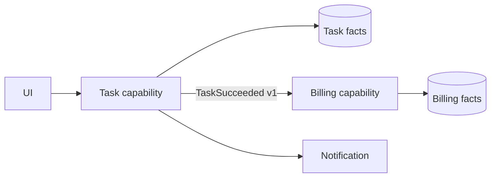

# 06 · 服务边界、事件架构与演进

> 一句话点题：拆分不是把目录变网络；只有独立所有权、伸缩、合规或故障半径的收益超过分布式事务、版本、观测与运维税，服务化才是进步。

<div class="lesson-meta"><span>ASW16—ASW18</span><span>可选进阶</span><span>预计 8 × 45 分钟</span><span>前置：SW12—16、Q10—14</span></div>

## 解锁与跳过

团队发布互相阻塞、模块需独立伸缩/隔离、合规要求物理边界，且数据证明问题时解锁。单团队小系统默认模块化单体；“想用微服务/Service Mesh/CQRS”不是信号。

## 本章可观察目标

你能用业务能力/所有权/数据不变量划服务边界；能比较同步、异步与 mesh；能设计事件版本与读写模型；能用绞杀、影子、双读/写核对和可逆 ADR 演进。

## ASW16 · 服务边界首先是所有权和事实边界

按数据库表/技术层拆（user-service、controller-service）常导致每个请求跨多服务。更好的边界围绕业务能力和共同不变量：任务生命周期由 Task 能力拥有，计费由 Billing 拥有；服务拥有其事实源，其他服务通过契约读取/订阅，不共享任意写表。



边界判断：变化是否由同一团队承担；是否需独立部署/扩缩；故障能否隔离；数据是否需同一强事务；调用频率/延迟是否承受网络。若每次任务更新都要同步调用五服务才能提交，边界可能切穿了一个不变量。

## ASW17 · 同步、异步与 Service Mesh

同步 RPC 简单直观、立即结果，但时间耦合和级联失败；异步事件削峰/解耦时间，却有最终一致、重复、顺序和观测复杂。命令有明确目标/期望结果；事件描述已发生事实，避免把“事件”当远程命令绕过所有权。

Service Mesh 用 sidecar/ambient 等数据面统一 mTLS、流量策略和遥测，控制面下发配置。它不修复糟糕服务边界、业务超时/幂等，也增加代理资源、版本、证书和故障排查层。只有多服务/团队的网络策略重复且平台能运营时才值得。

事件 Schema 要有稳定名称、ID、发生时间、producer、subject、version；兼容新增字段，避免把内部数据库行直接广播。消费者按自己的需求维护投影，处理重复/乱序。敏感数据最少化，删除/保留要求要跨派生数据治理。

## ASW18 · 演进是迁移剧本，不是重写发布日

Strangler：在边缘路由新能力，旧系统逐步缩小。抽取前先建立模块边界/契约和观测；影子流量对比新旧但不产生副作用；双写风险高，需事务/outbox、核对和明确事实源；读切换可分租户/比例，保留回退。

```text
识别量化痛点 → 模块内隔离 → 契约/观测 → 新实现影子
→ 数据回填/核对 → 小流量切读/写 → 观察 → 删除旧路径
```

每阶段有进入、成功、停止、回退条件。迁移中的“临时”同步/双写要有 owner 和删除日。ADR 记录为何现在、替代、代价、最大风险和触发复审。

CQRS 在读写模型差异巨大时有用，例如写守不变量、读需多维报表；可以仍在单体/单库。Event Sourcing 仅在完整历史为事实源的价值明确时使用。不要把三者与微服务捆绑套餐。

## 贯穿案例：只拆 worker，不拆任务事实

CPU 密集 worker 拖慢 API。先让 worker 独立部署但保留同一代码库和任务数据库，通过租约 claim；这解决资源隔离。若之后独立团队/不同伸缩需要，再引入队列/outbox。任务状态仍由 Task 模块拥有，worker 只提交 attempt 结果，不任意改表。相比立即拆 Task/Billing/Notification 五服务，这条路径每步可验证且保留事务简单性。

## 会死在哪里

- 按表/技术层拆服务；请求变分布式聊天。
- 共享数据库任意写；所有权名存实亡。
- 全同步链路；一个慢依赖级联超时/重试。
- 事件直接复制内部行；消费者耦合/泄敏感。
- Mesh 当可靠性魔法；业务幂等/截止时间仍缺。
- 大爆炸重写；无影子、核对和回退。
- 双写永久存在；事实源漂移。

## 与 AI 协作模板

```text
请用约束而非潮流审查服务化：
- 列当前量化痛点、团队所有权、独立伸缩/合规/故障边界；
- 按业务不变量和事实源画候选边界，标共享事务被切断处；
- 为每条调用选择同步/异步，写超时、幂等、顺序、降级；
- 若用 mesh，列其统一控制价值和新增运维故障；
- 设计 strangler/影子/回填/核对/小流量切换与回退；
- 每阶段定义 success/abort 和删除临时桥的日期。
```

## 练习：为单体写一份“不急着拆”的演进 ADR

测量一个模块的发布/资源/故障问题；画当前事务和所有权；提出三种最小方案；先完成进程级隔离/模块接口；用故障/负载证明是否解决。若仍需服务化，再做影子和小租户切换，核对数据。ADR 必须列不拆的理由与未来触发器。

## 常见误区

微服务等于先进；代码库拆分等于边界；每服务一个表就独立；事件驱动无耦合；Mesh 自动容错；CQRS/Event Sourcing/DDD 必须一起用；双写最终会自然删；重写比迁移简单；只画终态不写过程。

<Quiz question="worker CPU 抢占 API，但仍由同一小团队维护。最小优先方案通常是什么？" :options="['立刻拆五个微服务', '先独立进程/部署隔离资源，保留清晰模块与事实源', '全面引入 Service Mesh']" :answer="1" explanation="先解决已知资源问题；网络和组织复杂度需要额外触发信号。" />

## 本章小结

- 服务边界围绕业务能力、事实源、不变量和所有权，不按技术层切。
- 同步买直接结果，异步买时间解耦；两者都需失败语义。
- Service Mesh 统一跨服务网络控制，但不替代业务可靠性。
- CQRS/Event Sourcing 各有独立解锁条件，不是微服务套餐。
- 演进通过可观测、可核对、可回退的小步骤完成，不靠大爆炸重写。

<EvidenceTracker lesson="advanced-software-06-architecture-evolution" />

## 本章完成标准

交付服务边界/事实源图、同步异步故障契约和演进 ADR；完成至少一个影子/核对/回退阶段；能证明为什么拆或不拆。最近平均至少 7/10。

<div class="source-note">主要来源（核验于 2026-08-31）：<a href="https://istio.io/latest/docs/">Istio Documentation</a>、<a href="https://martinfowler.com/bliki/StranglerFigApplication.html">Strangler Fig Application</a>、<a href="https://martinfowler.com/bliki/BoundedContext.html">Bounded Context</a>。模式用于表达取舍，不是默认技术组合。</div>
