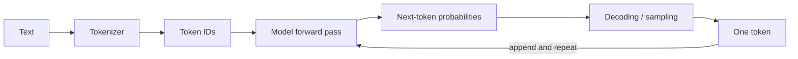

# 01 · 模型、Token、Context 与不确定性

> 一句话点题：大语言模型不是“会查事实的大脑”，而是根据上下文生成下一个 Token 的概率系统；只有接受它的能力和不确定性来源，才能设计可靠产品。

<div class="lesson-meta"><span>AI01—AI02</span><span>必修核心</span><span>预计 4 × 45 分钟</span><span>前置：能调用一个模型 API</span></div>

## 本章可观察目标

你能解释 Token 化、上下文窗口、生成采样和训练知识的边界；能把模型失败分为任务定义、上下文、知识、推理、工具和安全问题；能设计“允许不确定、要求引用、必要时拒答/升级”的产品路径。

## AI01 · 模型实际在做什么

输入文本先被 tokenizer 切成 Token ID；模型根据前文计算下一个 Token 的概率分布；解码策略选择一个 Token，再把它加入上下文重复。模型看见的不是汉字/单词本身，而是 Token 序列。



这解释了几个产品事实：

- 同样字符长度可能消耗不同 Token，代码、表格、多语言成本不同；
- 输出是逐 Token 生成，长答案增加延迟与成本；
- 模型目标是生成在上下文中“像正确答案”的序列，不天然执行事实核验；
- 同一输入可因采样、模型版本和服务实现得到不同输出；
- 训练中见过的知识被压缩在参数里，不带可查询来源与更新时间保证。

Temperature/top-p 改变抽样分布，不是“聪明度旋钮”。结构化抽取、分类等确定任务通常降低随机性；创意发散可提高，但仍要评测。即便 temperature 设为 0，也不能承诺跨版本/硬件绝对一致。

### 能力不是一个总分

模型可能很会总结，却在精确计数、长上下文定位、最新事实、私有知识或工具副作用上失败。选模型要按任务、语言、输入长度、延迟、成本、安全和数据政策评估，不把排行榜总分直接当产品表现。

## AI02 · Context 是工作记忆，不是无限硬盘

上下文通常包含系统规则、用户输入、历史消息、检索材料、工具结果和输出预算。窗口有上限，且“放得下”不等于“用得好”：信息位置、冲突、噪音和提示注入都会降低质量。

```text
[系统目标/不可违反边界]
[任务与输出合同]
[必要业务状态]
[检索证据：带来源/权限]
[工具结果：标记可信度]
[用户输入：不可信]
[输出预算]
```

上下文工程的第一原则是相关和可区分：规则与资料分层；不可信内容明确标记；只取当前任务需要的状态；旧对话压缩后保留关键决定与未决问题；敏感信息不因“可能有用”全塞进去。

### 六类失败先分类，再换方案

| 失败 | 典型信号 | 首选修复 |
|---|---|---|
| 任务定义 | 人也无法判断好坏 | 补验收例/rubric |
| 上下文 | 资料给了但冲突/淹没 | 精简、分层、结构化 |
| 知识 | 私有/最新事实缺失 | RAG/工具查询 |
| 推理 | 证据齐全仍算错/漏约束 | 分解、验证器、模型对照 |
| 工具 | 参数/权限/副作用错误 | Schema、授权、幂等、审批 |
| 安全 | 被不可信内容改指令 | 信任边界、最小权限、检测 |

“换更大模型”只可能改善其中一部分，而且会增加成本与延迟。先分类能避免所有问题都用 Prompt 调参。

## 不确定性必须进入产品设计

可靠系统不会要求模型“永远正确”，而是定义：何时回答、必须给什么证据、置信不足怎样处理、谁承担最终决定。

例如知识助手：有可验证来源才回答；每个关键结论绑定段落引用；来源冲突时列冲突；检索不到时明确“不足以回答”；高风险法律/财务/生产操作交给人工或确定工具。模型自报“置信度 95%”通常不是校准概率，不能直接作放行标准。

### 成本和延迟预算

一次请求成本大致由输入/输出 Token、模型单价、检索/工具、重试和缓存共同决定。示例（非实时价格）：若输入 8k、输出 1k，一次 Agent 循环调用 5 次，那么实际 Token 量可能远超一次聊天。必须记录每步 Token、延迟和成功贡献，避免“效果似乎更好”却成本十倍。

## 贯穿案例：员工制度问答为什么胡编

用户问“年假能结转多久”。模型参数知识里可能有一般规则，却没有公司 2026 制度；系统仍要求“必须回答”，于是生成听起来合理的数字。正确架构：

1. 把公司制度视为外部事实源，不要求参数记忆；
2. 检索带版本、生效日、权限的段落；
3. 回答必须引用具体条款；
4. 多份制度冲突时按生效日/部门范围解释；
5. 无证据时拒答并提供 HR 入口；
6. 评测分别测检索命中、引用正确和答案忠实。

这不是“提示词写得不够强”，而是系统没有把知识与证据边界设计出来。

## 决策与权衡

<DecisionCard title="让模型直接回答，还是要求证据后回答？" left="直接回答：延迟低、实现简单，适合低风险创意与一般解释。" right="证据后回答：可追溯、可更新，但增加检索、权限、延迟和评测复杂度。" verdict="事实时效、私有知识或决策风险越高，越应要求外部证据；不要对纯创意任务强加无意义引用。" />

## 会死在哪里

- 把模型知识当数据库：最新/私有事实无来源；接外部事实源。
- 上下文越多越好：噪音、冲突、成本上升；按任务检索和压缩。
- temperature=0 就确定：版本仍会变；关键结果用验证器/测试。
- 强迫必须回答：证据不足时幻觉；允许拒答与升级。
- 用模型自报置信度放行：未校准；用任务级评测与外部证据。
- 忽略循环成本：Agent 多次调用放大 Token；逐步记录贡献。

## 与 AI 协作模板

```text
请先做失败归因，不要直接改 Prompt：
1. 明确任务、可验收输出和风险等级；
2. 列当前上下文各段来源、信任级别、时效和权限；
3. 把失败归入任务/上下文/知识/推理/工具/安全，可多选；
4. 给最小修复和对照实验，保持模型/数据集不变；
5. 设计证据不足、来源冲突、超出权限时的拒答/升级；
6. 报告每步 Token、延迟、成本与质量贡献。
```

## 练习：做一份模型行为剖面

选一个模型和 30 条任务，包含事实、私有资料、算术、长文本、模糊问题、恶意指令。固定版本/参数运行三次，记录成功、失败类型、输出差异、Token/延迟。再分别只改上下文、检索和验证器，比较哪类修复有效。产出“这个模型在本产品中能做/不能独立做什么”，而不是泛泛模型评测。

## 常见误区

模型是搜索引擎；上下文窗口等于可靠记忆；提示词越长越专业；temperature 控制事实正确；榜单高就适合所有任务；模型自报置信度可信；不允许说不知道；只统计平均延迟不看多步调用。

<Quiz question="制度问答没有检索到公司条款，但模型凭常识给出具体天数。首要问题是什么？" :options="['温度太高', '系统把私有/时效事实交给参数记忆且强迫回答', '输出太短']" :answer="1" explanation="缺少权威证据与拒答路径是架构问题；调温度不能补回不存在的事实源。" />

## 本章小结

- 模型逐 Token 预测与生成，不天然进行事实核验或携带来源。
- Context 是有限工作记忆；相关性、层次、信任和时效比塞满更重要。
- 失败要区分任务、上下文、知识、推理、工具和安全，再选修复。
- 不确定性通过引用、拒答、验证与人工升级进入产品，而不是靠语气隐藏。
- 模型选择和多步设计必须同时报告任务质量、延迟、Token 与成本。

<EvidenceTracker lesson="ai-01-models" />

## 本章完成标准

能不用拟人化语言解释一次生成；为真实产品完成 30 条行为剖面和失败分类；设计有证据、拒答与升级的回答策略；记录质量/成本对照。最近平均至少 7/10。

<div class="source-note">主要来源（核验于 2026-08-31）：<a href="https://developers.openai.com/api/docs/">OpenAI API Documentation</a> 用于具体接口示例；通用机制参考 <a href="https://arxiv.org/abs/1706.03762">Attention Is All You Need</a>。模型版本、上下文和价格实时变化，使用时回到供应商当前官方文档，详见<a href="../../sources/ai">来源目录</a>。</div>
