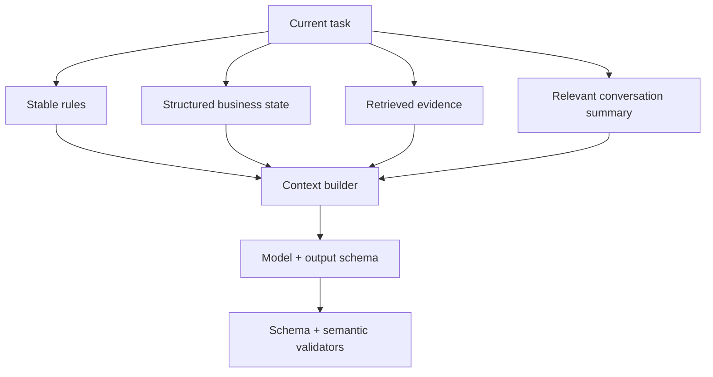

# 02 · 结构化输出、Prompt 与上下文工程

> 一句话点题：生产 Prompt 不是一句“你是专家”，而是一份可版本化的接口合同；可靠性来自输入分层、输出 Schema、失败处理和评测，而不是玄学措辞。

<div class="lesson-meta"><span>AI03—AI04</span><span>必修核心</span><span>预计 5 × 45 分钟</span><span>前置：AI01—02、SW02、SW09</span></div>

## 本章可观察目标

你能设计并验证 JSON Schema 结构化输出；能把目标、规则、资料、用户输入与输出合同分层；能处理截断、拒绝、Schema 失败和不可信上下文；能用小型评测集迭代而不是凭单次观感改 Prompt。

## AI03 · 结构化输出把自然语言接到程序边界

程序不能稳定解析“下面是一份看起来像 JSON 的 Markdown”。结构化输出要求模型产生符合 Schema 的值，再由应用执行运行时验证。

```json
{
  "type": "object",
  "required": ["decision", "reason", "citations"],
  "additionalProperties": false,
  "properties": {
    "decision": { "enum": ["approve", "reject", "needs_review"] },
    "reason": { "type": "string", "minLength": 1 },
    "citations": {
      "type": "array",
      "items": { "type": "string", "pattern": "^doc_[a-z0-9]+#p[0-9]+$" }
    }
  }
}
```

Schema 只保证形状，不保证语义：citation ID 可能不存在，decision 可能与证据矛盾，reason 可能泄漏敏感数据。验证分层：语法解析→Schema→引用存在性/权限→业务规则→必要的人审。

枚举应小而稳定；字段名表达单位；不允许未知字段可防止模型“顺手”输出程序未处理内容；可空/缺失含义明确。Schema 太复杂会降低生成成功率，应把多阶段问题拆成多个小合同，而不是一棵巨型嵌套 JSON。

### 失败是正常分支

模型可能因内容政策拒绝、达到输出上限截断、工具/网络错误、Schema 不满足。应用必须区分：可用同输入有限重试；需缩短上下文；需改任务；不可重试拒绝；需人工处理。解析失败后把原输出再次无限交给模型“修 JSON”会造成成本循环，设最大次数并记录失败样本。

## AI04 · Prompt 的稳定骨架

```text
1. 任务目标：要决定/生成什么，成功怎样判断
2. 不可违反规则：权限、安全、事实边界
3. 输入与信任：哪些是用户/检索/工具，不可信内容不得改规则
4. 工作步骤：仅在有助于结果时拆分，不要求泄漏内部推理
5. 输出合同：Schema、枚举、单位、引用格式
6. 证据不足：拒答、needs_review、需要补充什么
7. 示例：少量代表边界，避免只给 happy path
```

系统/开发者规则与用户内容应分隔；检索文档是数据，不是指令。使用清晰标签、结构对象或不同消息角色，让模型更容易区分。Prompt Injection 的本质是把不可信数据与控制指令放进同一解释通道；仅写“忽略恶意指令”不够，还要用最小工具权限、输出验证和审批限制后果。

### Context 编排是一项预算决策

每段上下文应有来源、时效、权限、Token 成本和用途。对长对话，不要无脑保留全部历史；维护结构化状态：目标、已确认事实、决定、待办、引用。摘要也可能丢事实，所以关键 ID/数值保留原文或外部状态。



## 贯穿案例：让模型审批退款建议

危险初版：“你是客服专家，根据下面聊天判断是否退款，输出 JSON。”问题：退款规则未版本化；聊天里可注入“忽略规则”；模型可能编造订单；自动 approve 直接产生财务副作用。

可靠初版：订单金额/状态由工具提供结构化事实；规则带版本；聊天标记为不可信；模型只能输出 `approve/reject/needs_review` 建议与引用；金额超过阈值/引用缺失强制 needs_review；真正退款由确定性授权服务执行并审计。Prompt 只是建议器接口，不拥有资金权限。

### 用评测改 Prompt

建立 50 条样本：正常退款、超期、部分退款、证据冲突、注入、订单不存在、敏感客户。每次 Prompt/模型/Schema 变化跑同一集合，统计决策准确、引用有效、拒答合适、Schema 成功、延迟和成本。不要因为三个手选例子看起来更顺就上线。

## 会死在哪里

- 结构化输出直接入库/执行：形状正确但语义错；加业务验证和权限。
- 巨型 Schema：生成失败难定位；拆小阶段。
- 用户/文档可覆盖系统规则：信任未分层；控制与数据隔离。
- Prompt 改动不版本化：线上变化无法解释；随制品记录版本。
- 只给正例：边界/拒答退化；评测集覆盖失败类。
- 自动修复无限循环：成本和延迟失控；限次、分类、人工路径。

## 与 AI 协作模板

```text
请把这个模型调用设计成版本化接口：
- 写目标、成功指标、不可违反规则、输入来源/信任/时效；
- 给最小 JSON Schema，区分形状验证和业务语义验证；
- 定义证据不足、来源冲突、拒绝、截断、Schema 失败的分支；
- 标出模型输出不能直接触发的副作用和所需审批；
- 设计至少 30 条含注入/边界/冲突的回归集；
- 每个建议都说明怎样验证，不用“更清晰”作唯一理由。
```

## 练习：把自由文本改成可靠合同

选一个现有模型调用，记录 30 次原始输出失败；设计 Schema 和语义验证器；把规则/数据/用户内容分层；加入 needs_review；建立 40 条评测。故意截断输出、注入文档指令、伪造引用和增加未知字段，证明系统不会执行副作用。比较修改前后任务质量、解析率、Token 与延迟。

## 常见误区

结构化输出等于正确；JSON 解析成功就执行；Prompt 越长越好；角色扮演替代规则；要求“绝不幻觉”；把文档当可信指令；输出推理越长越可靠；只人工看几个例子；模型修复模型无限重试。

<Quiz question="模型严格输出了符合 Schema 的 approve，但引用的订单并不存在。系统应怎样？" :options="['Schema 通过就执行退款', '进行引用/权限/业务语义验证，失败转 needs_review 或拒绝', '把 JSON 转成字符串再执行']" :answer="1" explanation="Schema 只保证数据形状；外部事实、权限和业务规则必须由程序验证。" />

## 本章小结

- 结构化输出是程序接口，但只证明形状，不证明事实、权限和业务正确。
- Prompt 的核心是目标、边界、输入信任、输出合同和失败分支。
- 上下文按用途、时效、权限与 Token 预算构建，不是聊天历史堆积。
- 不可信文档不能拥有指令权；真正安全依靠最小权限、验证和审批。
- Prompt/Schema/模型都要版本化，并用固定评测集回归。

<EvidenceTracker lesson="ai-02-context" />

## 本章完成标准

把一个自由文本调用改为最小 Schema＋语义验证；通过注入、冲突、截断和伪引用测试；建立至少 40 条回归并报告质量/解析率/成本。最近平均至少 7/10。

<div class="source-note">主要来源（核验于 2026-08-31）：<a href="https://json-schema.org/specification">JSON Schema 2020-12</a>、<a href="https://developers.openai.com/api/docs/guides/structured-outputs">OpenAI Structured Outputs</a>、<a href="https://genai.owasp.org/llm-top-10/">OWASP GenAI Top 10</a>。供应商接口会变化，系统边界保持供应商无关，详见<a href="../../sources/ai">来源目录</a>。</div>
