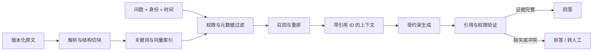

# 03 · 让知识助手只在证据范围内回答

> 知识助手最危险的时刻，往往不是“一条资料也没找到”，而是找到了几段看起来都相关的文字，随后把不同版本、不同人群和不同权限的规则拼成了一个流畅答案。

<div class="lesson-meta"><span>AI05—AI08</span><span>阶段二 · 证据与行动</span><span>6 个标准回合（每回合 45 分钟）</span><span>前置：完成一份模型调用合同</span></div>

<KnowledgeFlow
  title="本章沿一条证据链追查答案"
  intro="读完以后，你应当能把一次知识问答拆成可定位的环节，并用一组小型评测判断错误来自资料、检索还是生成。"
  what="RAG 是从权威原文中寻找证据，再让模型在证据边界内组织答案的流水线。"
  why="向量相似只说明文字在表示空间里接近，不能证明条款有效、用户有权阅读，也不能证明答案得到原文支持。"
  how="先治理原文与权限，再建立混合召回和重排，用预期证据评测检索，最后约束引用、冲突处理与拒答。"
  terms="Embedding | Chunk | 元数据过滤 | 混合检索 | Reranker | Recall@k | MRR | 引用验证 | Abstention"
/>

## 两份制度都找到了，答案仍然错了

上一章留下了一份模型调用合同。它允许员工询问公司制度，输出必须包含答案、引用和 `needs_review` 状态。现在产品团队接入了文档库，准备回答第一个真实问题。

上海员工林清问：“今年没休完的年假，最多能结转几天？”系统检索到两段文字。

```text
doc_policy_2024#annual-leave
适用范围：全体员工
内容：未使用年假最多结转 5 天，次年 3 月 31 日前使用。

doc_shanghai_2026#annual-leave
适用范围：上海地区正式员工
生效日：2026-01-01
内容：经直属负责人确认，可结转最多 10 天，次年 6 月 30 日前使用。
```

两个块都与问题高度相似。第一版系统把它们压进同一个上下文，模型回答：“年假最多结转 5 天；特殊情况下可以到 10 天。”这句话没有凭空捏造数字，每个数字都能在资料里找到，却依然不能指导林清。系统没有判断哪份制度对她生效，也没有解释“直属负责人确认”是不是必需条件。

这次失败把 RAG 的真实任务暴露出来。它要交付的不是若干相似文本，而是一条可以追溯的证据链：提问者是谁，哪份规则在此刻对她有效，答案的每个关键判断由哪一段原文支持，证据不足或冲突时系统怎样停下来。



箭头上的每一步都可能让答案失真。接下来不从“选哪家向量库”开始，而是沿林清的问题逐步固定这些边界。

<span id="ai05"></span>

## 先规定什么样的答案有资格出现

知识助手需要一份比“尽量准确”更具体的回答合同。对当前制度问答，团队先写下四条硬约定。

1. 关键结论必须绑定系统提供的原文片段，模型不能自由编写链接或文档编号。
2. 检索范围必须符合当前用户、租户、地域和资料密级；越权内容不能先进入上下文再靠提示词隐藏。
3. 多份规则同时命中时，系统按适用范围、层级和生效时间处理；无法确定优先级就列出冲突并转人工。
4. 没有足够证据时输出 `needs_review`，不能用模型参数里的常识补齐公司规则。

这份合同改变了后面的实现顺序。团队首先需要保存可核验原文、版本和权限，其次才是做向量表示。若产品允许“没有企业证据时提供一般常识”，它也应成为一个明显分开的模式，让用户知道那部分回答不受公司制度背书。

还要确定问题的评价单位。林清关心的是“当前身份下能否得到可执行答案”，因此一次成功至少包含三件事：找到有效条款，引用确实支持结论，回答没有超出条款。只看最终文字与参考答案是否相似，会把碰巧说对和真正有证据混在一起。

<span id="ai06"></span>

## 一份文档进入索引前，要先经历五次决定

产品团队拿到一份 PDF 时，很容易直接调用解析器、按 500 字切块再生成 embedding。这个动作很快，却把最重要的决定藏进默认参数。

第一项决定是**原文身份**。每份资料至少保留 `document_id`、版本、哈希、生效日、失效日、发布主体和原始位置。索引只是可以重建的派生物，原文与版本记录才是证据。制度撤回以后，系统需要写入 tombstone 或失效状态，并确保查询层立即拒绝旧版本，不能等下一次批量重建才停止引用。

第二项决定是**解析是否可信**。扫描 PDF 经过 OCR 后可能把“10 天”识别成“1O 天”，表格还可能丢失表头。入库任务应保存解析器版本与失败队列，对数字、表格和标题抽样核对。解析错误发生在最上游，换更大的生成模型无法把丢掉的列找回来。

第三项决定是**在哪里切开**。一个 chunk 要小到能被精确检索，又要保留完成判断所需的语境。当前制度按“标题—适用范围—正文—例外”形成自然单元。若把“经直属负责人确认”切到上一块，把“最多 10 天”留在下一块，任何单块都不足以回答问题。固定字符长度可以作为实现起点，最终边界要服从文档结构与评测结果。

第四项决定是**哪些关系写进元数据**。当前块需要携带地区、员工类型、生效区间、政策层级、语言、父标题和引用定位。元数据不是装饰标签，它让系统先排除明显不适用的资料，再做语义检索。过滤条件来自权威身份与业务状态，不能由模型从问题里随意猜出。

第五项决定是**谁能够读取**。ACL 要在召回前或召回过程中强制执行。缓存键也应包含主体、租户与权限版本，否则管理员问过的内容可能从缓存泄漏给普通员工。零权限结果与零相关结果要分别记录：前者说明内容存在但用户不可访问，后者说明当前语料没有找到证据。对外回答通常都不暴露被拒绝资料的存在。

入库完成后，可以留下这样一条可检查记录。

| 字段 | 当前值 | 它保护什么 |
|---|---|---|
| `chunk_id` | `doc_shanghai_2026#annual-leave` | 引用能回到稳定片段 |
| `source_hash` | `sha256:…` | 原文改变可被发现 |
| `valid_from` | `2026-01-01` | 过滤尚未生效的规则 |
| `region` | `CN-SH` | 匹配员工所属地区 |
| `audience` | `regular_employee` | 避免把实习生规则混入 |
| `acl_policy` | `hr_policy_read_v3` | 在检索层执行授权 |
| `parser_version` | `pdf-layout-2.4` | 解析退化时可重建 |
| `embedding_version` | `embed-zh-v2` | 防止新旧向量混用 |

当 embedding 模型、归一化方法或向量维度变化时，应建立新索引并做影子对照。两个版本输出的数字维度碰巧相同，也不代表它们处在同一个表示空间。

<span id="ai07"></span>

## 相似度只能负责找候选

Embedding 把文本映射成向量。余弦相似度较高，通常表示两段文字在模型学到的表示空间中方向接近。它没有证明一段话蕴含另一段，也没有理解公司制度的法律层级。

林清的问题同时包含语义和精确约束。“年假结转”适合语义召回；“上海”“2026”“10 天”更适合关键词或结构化过滤。团队让三条路径分工。

```text
身份与时间过滤：只保留当前用户可读、当前有效且地区匹配的资料
关键词召回：保护制度名、编号、日期、错误码和专有名词
向量召回：吸收“年假顺延”“剩余假期带到明年”等表达变化
```

关键词与向量各返回一组候选，再用 rank fusion 合并、去重。随后 reranker 同时阅读问题与候选块，重新判断相关顺序。召回阶段宁可多保留几个可能正确的块，重排阶段再减少噪音。把 `top-k` 一味调大并不会自动提高答案质量，它还会增加上下文冲突、延迟和 Token 成本。

下面是假设性小实验，不是某个产品的公开基准。

| 候选 | 向量相似 | 关键词命中 | 元数据是否适用 | 重排结果 |
|---|---:|---:|---|---:|
| 上海 2026 补充制度 | 0.82 | 2 | 是 | 1 |
| 全国 2024 总制度 | 0.91 | 2 | 范围较宽 | 2 |
| 上海病假说明 | 0.76 | 1 | 是 | 3 |
| 取消订阅帮助 | 0.79 | 0 | 否 | 已过滤 |

单看向量分数，全国制度会排在前面；加上用户地域、当前生效时间和块间层级，上海补充制度才成为首要证据。这个例子也说明“混合检索一定更好”不是定律。融合权重、候选数和 reranker 都要在真实问题集上比较，不能凭一个演示问题确定。

查询改写同样只是候选生成工具。系统可以把“剩下的假能留多久”扩展成“年假结转期限”，但必须保存原问题。改写若擅自加入“上海正式员工”，就把一个尚待确认的身份变成了检索事实。

## 用五个问题算一次检索质量

最终答案错了以后，团队先检查预期证据有没有进入候选。假设 golden set 有五个问题，正确片段在前三名中的首次位置分别是 `1、2、未命中、1、1`。

`Recall@3` 在这里可以按“有多少问题的必要证据出现在前三名”理解。五个问题中四个命中，所以结果是 $4/5=0.8$。这说明还有一个问题无论怎样修改生成提示都无法答好，因为模型根本没有拿到证据。

MRR 关心首次正确证据排得多靠前。五个问题的 reciprocal rank 分别是 $1、1/2、0、1、1$，平均得到 $0.7$。两个系统可能拥有相同 Recall@3，但把正确条款稳定排在第一的系统更少受到上下文噪音影响。

一个问题需要两份证据时，“命中任意一份”仍不够。比如“上海员工可以结转多少天，是否需要批准”同时需要额度与条件。golden set 应记录必要证据集合和可接受替代，而不是只存一段标准答案。

检索指标也有边界。相关性标签来自某一批问题、某种用户身份和某个时间点。公开检索榜单不能替代企业语料测试；自动生成的测试问题容易复制文档措辞，让关键词检索显得异常容易。至少保留真实问法、改写问法、不可答问题、版本冲突、跨权限和解析故障。

## 找到原文后，生成仍可能越过证据

系统把候选送给模型时，为每块附上不可由模型创造的 `chunk_id`、适用范围和原文。输出合同只允许选择已提供 ID。模型生成结束后，程序再次检查引用存在、当前可访问且仍未失效。

引用有效还不等于引用支持。模型可能引用一段“最多 10 天”，却继续写出原文没有的“无需审批”。评测时应拆开三项。

- **引用精确率**检查被引用片段中有多少真正支持相邻结论。
- **关键结论覆盖率**检查答案里需要证据的判断是否都绑定了来源。
- **忠实度**检查答案有没有加入、夸大或改写成原文不允许的含义。

当两份有效资料冲突，系统不能用向量分数替代规则层级。若业务已经给出“地区补充优先于全国总则”，上下文组装器可以明确写出这一关系。若优先级本身不确定，正确结果是展示冲突、说明缺少什么并转 HR，而不是让模型挑一份更像答案的文本。

知识助手还需要有节制地拒答。检索分数低不是唯一拒答依据；分数在不同查询间通常不可直接当概率。更可靠的门槛来自必要证据缺失、权限不明、版本冲突、引用验证失败或问题超出已声明语料范围。

<span id="ai08"></span>

## 一张错误账本比一个总分更有用

林清的问题修复后，团队把评测拆成六层。每次发布只改一个主要变量，并保存失败样本。

| 层次 | 先问什么 | 可检查证据 | 失败后退回哪里 |
|---|---|---|---|
| 原文 | 当前有效版本是否齐全 | 文档清单、哈希、撤销记录 | 内容治理 |
| 解析 | 标题、表格、数字是否保真 | 抽样对照、解析失败队列 | 解析器与人工修订 |
| 召回 | 必要证据是否进入候选 | Recall@k、失败查询 | 过滤、切块、检索 |
| 排序 | 正确证据是否足够靠前 | MRR、相关性标注 | 融合与 reranker |
| 生成 | 是否严格使用给定证据 | 忠实度、引用精确率、覆盖率 | 上下文与输出合同 |
| 产品 | 是否在正确权限下帮助用户 | 任务成功、拒答、延迟、成本、安全违规 | 产品边界或整条链 |

总分只告诉团队系统变了，错误账本告诉团队该回到哪里。若 Recall@5 从 0.86 降到 0.64，答案偶尔仍能碰巧正确，也不能把发布视为安全。若检索指标不变而忠实度下降，优先检查上下文格式、模型与输出验证，不要重建索引。

## 用三次练习做出最小证据系统

选 10～15 份你确实有权使用的文档，其中至少包含两个版本、一张表格和一份应当撤销的资料。主路线使用 6 个标准回合：1 回合准备和冻结环境，3 回合完成语料、必要证据与检索对照，1 回合做删除/权限变式，1 回合复算报告。扩大语料属于额外练习，不计入本章标准成本。

第一次建立语料清单和切块规则。每个块保留版本、生效区间、标题路径、引用定位与 ACL。人工抽查全部数字块和至少 20% 的普通块。产物是一份 corpus manifest 与解析问题清单。

第二次制作 18 个问题。至少 5 个改写原文措辞，3 个需要精确编号，3 个跨版本或范围，3 个不可回答，2 个模拟越权，其余自定。为每题标出必要证据与允许身份。先跑关键词基线，再加向量与重排，计算 Recall@3 和 MRR。产物是一张可复跑的 retrieval report。

第三次生成带受控引用的答案。验证引用 ID、权限与有效期，人工标注关键结论覆盖和忠实度。随后撤销一份文档、修改一个用户身份、破坏一个表格解析，确认错误会落到预期层。产物是一份 error ledger，至少包含症状、失败层、修复、回归测试和仍不能推出的结论。

没有现成向量服务时，可以只用关键词检索完成第一次基线；这比复制一个无法解释的框架示例更有学习价值。反馈可以来自单元测试、同伴对必要证据的复标，以及你对五个失败问题的盲审。若连预期证据都无法一致标注，应先缩小问答范围，不急着优化模型。

<details class="ai-workbench">
<summary>让 AI 帮你找评测遗漏，而不让它代写答案</summary>

~~~~text
下面是我的语料清单、18 个问题和人工标注的必要证据。请只做测试设计审查：
1. 找出缺少的版本、权限、不可答、精确 ID、表格和冲突类型；
2. 为每个新增类型给一个问题草案，并注明它想暴露哪一层失败；
3. 不替我判断公司规则，不虚构文档内容；
4. 将事实缺口标为“待人工确认”。
~~~~
</details>

## 🎯 随堂检验

<Quiz question="系统回答错了，检查发现正确条款从未进入 top-5。此时最先应该改什么？" :options='["继续增加生成提示中的警告语","回到权限过滤、切块与召回，确认必要证据为何缺失","让模型自行编写更可信的引用"]' :answer="1" explanation="下游模型无法使用没有进入上下文的证据。先定位上游召回缺失，才能判断应调整过滤、文档、切块还是检索。" />

## 本章小结：RAG 的交付物是可验证证据

本章留下三份材料：版本化 corpus manifest、带预期证据的 retrieval report，以及能定位失败层的 error ledger。知识助手现在可以在授权范围内说明事实，却仍不能替用户改变任何系统状态。

下一章会让林清继续说一句：“那就帮我提交结转申请。”这一步会把问题从证据检索推向真实副作用。届时模型的输出只是行动提议，权限、审批、幂等和结果确认必须由确定程序接管。

<EvidenceTracker lesson="ai-03-rag" />

## 参考资料

- Patrick Lewis 等，[Retrieval-Augmented Generation for Knowledge-Intensive NLP Tasks](https://arxiv.org/abs/2005.11401)，NeurIPS 2020。用于理解参数记忆与外部检索结合；论文中的端到端 RAG 配方不等于现代企业知识库的完整工程流程。
- Vladimir Karpukhin 等，[Dense Passage Retrieval for Open-Domain Question Answering](https://arxiv.org/abs/2004.04906)，EMNLP 2020。用于理解双编码器密集召回；开放问答结果不能直接外推到权限、版本和专有名词密集的企业语料。
- Nandan Thakur 等，[BEIR: A Heterogeneous Benchmark for Zero-shot Evaluation of Information Retrieval Models](https://arxiv.org/abs/2104.08663)，NeurIPS Datasets and Benchmarks 2021。用于说明检索器跨任务表现会变化；公开数据集不能替代本地问题分布。
- Keshav Santhanam 等，[ColBERTv2](https://aclanthology.org/2022.naacl-main.272/)，NAACL 2022。用于理解候选表示与后期交互重排的取舍；本章不要求实现其训练与压缩方法。
- OWASP GenAI Security Project，[Vector and Embedding Weaknesses](https://genai.owasp.org/llmrisk/llm082025-vector-and-embedding-weaknesses/)，2025。用于校准多租户、访问控制和知识库投毒边界；它是风险指南，不提供具体产品的合规结论。
- Christopher D. Manning、Prabhakar Raghavan、Hinrich Schütze，[Introduction to Information Retrieval](https://nlp.stanford.edu/IR-book/information-retrieval-book.html)，在线教材。用于 Recall、排序和倒排检索基础；现代神经重排仍需结合后续论文与本地实验。
