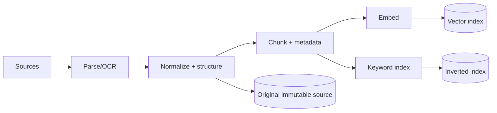

# 03 · Embedding、RAG 与检索评测

> 一句话点题：RAG 不是“接一个向量库就不幻觉”，而是一条从文档治理、切块、召回、重排到引用生成的证据流水线；任何一环错，答案都可能流畅但无根据。

<div class="lesson-meta"><span>AI05—AI08</span><span>必修核心</span><span>预计 7 × 45 分钟</span><span>前置：AI01—04、SW09—11</span></div>

## 本章可观察目标

你能解释 embedding 相似度与边界；能设计版本化、权限感知的入库/切块；能组合关键词与向量检索、过滤和重排；能把检索、引用忠实度与最终答案分层评测，并定位失败发生在哪一层。

## AI05 · Embedding 把语义位置压进向量

Embedding 模型把文本映射为固定维度向量，语义相近内容通常距离更近。余弦相似度比较方向，但“相近”由模型训练任务决定，不等于事实蕴含或业务相关。

```text
查询“怎么取消运行中的任务”
  ↕ 高相似：任务取消、运行状态、撤销
  ↕ 可能误召：取消订阅、删除任务、终止账户
```

数字 ID、精确错误码、罕见产品名和否定关系往往适合关键词；语义改写适合向量。混合检索把 BM25/倒排与向量召回合并，通常比单一路径稳，但需要评测和融合策略。

向量模型或归一化策略变化后，新旧向量不可随意混用；索引需记录 embedding 模型/版本/维度，升级时影子重建与对照。

## AI06 · 入库决定检索上限



切块不是固定 500 字万能规则。按标题、段落、表格、代码和语义边界切；保留文档 ID、版本、生效日、页码/段落、租户、ACL、语言与父章节。块太大带噪音和成本，太小丢上下文；overlap 能补边界，却产生重复召回。

原文必须可追溯，索引是可重建派生物。文档更新/删除时，需要版本、软删除/失效和重建策略；否则模型继续引用已撤回制度。OCR/解析质量也要抽样验证，表格行列错位会让后续再强的模型无能为力。

权限应在检索阶段过滤，而不是先取全库再让模型“别说”。共享索引可带 ACL filter，但要防元数据漏配；高隔离场景可分命名空间/索引。缓存键也要包含身份/权限版本。

## AI07 · 召回与重排解决不同问题

典型查询流程：查询规范化/改写→关键词/向量并行召回→元数据/ACL 过滤→融合去重→reranker 精排→上下文组装。

初始召回追求别漏，重排从较多候选中挑真正相关。`top-k` 越大不一定更好：增加噪音和 Token；越小可能漏证据。query rewrite 可能改善口语查询，也可能改变原意，必须保留原查询并在测试集中验证。

对多条件问题，先过滤结构化元数据再语义检索；对精确 ID 直接查；对跨文档比较可分解子查询；不要把所有问题都硬塞同一向量查询。

## AI08 · 评测必须把“没找到”和“找到没用好”分开

| 层 | 指标/问题 | 失败例 |
|---|---|---|
| 入库 | 解析完整、元数据/ACL 正确 | 表格丢列、旧版本未撤销 |
| 召回 | Recall@k、MRR、命中证据 | 正确条款没进 top-k |
| 重排 | NDCG/人工相关性 | 正确块被排到后面 |
| 上下文 | 证据覆盖、冲突处理 | 只给例外没给主规则 |
| 生成 | 忠实、引用准确、完整 | 有证据却编造额外结论 |
| 端到端 | 任务成功、拒答、安全、成本 | 越权回答、无证据仍答 |

Golden set 至少保存问题、允许身份、预期证据 ID/版本、关键答案点、不可接受回答和难度标签。最终答案错时先查检索命中，再看模型是否忠实；否则会错误地调 Prompt 来修检索缺失。

引用不能只是模型生成一个 URL。系统应给每个 chunk 不可伪造引用 ID，模型只能选择已提供 ID；输出后验证 ID 存在、当前用户可访问、引用内容支持结论。UI 展示原文片段、文档版本和定位。

## 贯穿案例：两份年假制度冲突

知识库同时有 2024 总制度和 2026 上海分部补充。简单向量检索可能同时召回；模型随机选一句。正确处理：元数据含生效日、适用地域、文档层级；查询从用户身份得到上海；过滤有效版本；若总则与补充冲突，组装上下文时标注层级并要求解释；引用两个来源。测试集必须包含跨版本/地域问题，而不只问文档原句。

## 会死在哪里

- 只存向量不保原文版本：无法重建/审计。
- 固定字符切块破坏表格/代码：按结构解析并抽样。
- 先召回全库后 Prompt 控权限：越权内容已进入上下文；检索前/中强制 ACL。
- top-k 调大解决一切：噪音与成本上升；分层评测。
- 最终答案准确率掩盖召回退化：分别测各层。
- 模型自由生成引用：可能伪造；只能引用系统给定 ID 并验证。

## 与 AI 协作模板

```text
请设计 RAG 为可评测证据流水线：
1. 列源、版本、生效/撤销、解析、chunk、metadata、ACL 和重建策略；
2. 按查询类型选择精确查找、过滤、关键词、向量、混合与重排；
3. 定义 chunk ID/引用验证，模型不得生成未提供来源；
4. 建 golden set：身份、预期证据、答案点、拒答和冲突样本；
5. 分别报告入库、召回、重排、忠实、引用、端到端与成本；
6. 每个参数变化只改一个变量并保留基线。
```

## 练习：从十份文档建立最小 RAG

选择 10—30 份含版本/表格的文档，保存原文与元数据；实现结构切块、关键词＋向量召回和 ACL；制作 50 条 golden set，其中至少 10 条应拒答/越权、10 条跨版本/冲突。先测 Recall@k，再加重排，最后生成带受控引用答案。故意撤销文档和更换 embedding，验证索引可重建且旧引用失效。

## 常见误区

向量相似等于事实支持；所有块 500 字；top-k 越大越好；RAG 自动解决幻觉；权限交给 Prompt；只测答案不测检索；引用由模型自由写；embedding 升级原地混用；删除源文档不删索引。

<Quiz question="答案错误时，为什么要先检查预期证据是否进入 top-k？" :options="['因为检索比模型便宜', '若证据没召回，继续调生成 Prompt 无法利用不存在的上下文', '为了让答案更长']" :answer="1" explanation="分层诊断避免用下游手段修上游缺失；先定位失败层再改。" />

## 本章小结

- Embedding 表示训练得到的相似性，不等于蕴含；精确与语义检索应按查询组合。
- 入库的解析、结构、版本、元数据和 ACL 决定检索上限。
- 召回追求覆盖，重排追求相关；top-k 和改写必须用真实问题验证。
- RAG 分层评测入库、召回、重排、忠实、引用和端到端。
- 引用必须绑定系统提供且经权限验证的原文 ID，不能让模型自由编造。

<EvidenceTracker lesson="ai-03-rag" />

## 本章完成标准

实现可重建、版本化、权限感知的最小 RAG；完成 50 条分层评测；证明撤销/冲突/越权/伪引用被正确处理；能从错误答案定位具体失败层。最近平均至少 7/10。

<div class="source-note">主要来源（核验于 2026-08-31）：<a href="https://arxiv.org/abs/2005.11401">RAG 原始论文</a>、<a href="https://www.elastic.co/guide/en/elasticsearch/reference/current/semantic-text-hybrid-search.html">Elastic Hybrid Search 文档</a>。原始论文不覆盖现代 RAG 全部实践；具体检索引擎行为以当前官方文档和本项目评测为准，详见<a href="../../sources/ai">来源目录</a>。</div>
