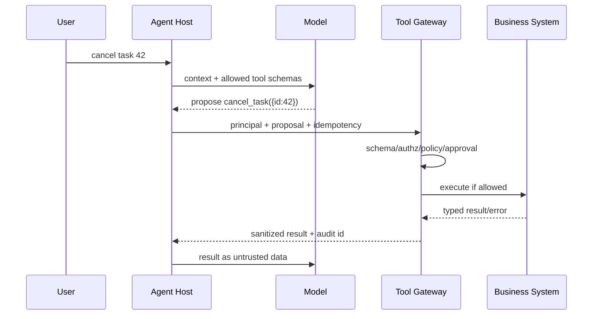

# 04 · Tool Calling、权限与 MCP

> 一句话点题：模型一旦能调用工具，错误就从“说错一句话”升级为“真的改数据、发消息、花钱”；工具系统首先是权限与事务系统，其次才是函数调用体验。

<div class="lesson-meta"><span>AI09—AI11</span><span>必修核心</span><span>预计 6 × 45 分钟</span><span>前置：AI01—04、SW09、SW13—14</span></div>

## 本章可观察目标

你能设计小而明确的工具 Schema 与稳定错误语义；能在执行点做主体/资源授权、幂等、审批和审计；能解释 MCP Host/Client/Server、能力协商和生命周期；能把不可信工具结果与系统指令隔离。

## AI09 · Tool Calling 是“模型提议，程序裁决”

模型生成工具名和参数只是候选命令。应用必须验证：工具存在、Schema 合法、主体有权、资源范围正确、预算未超、是否需审批、幂等键和前置状态有效。



工具要以业务能力命名，如 `cancel_task`，而不是暴露任意 `execute_sql`/`run_shell`。参数使用枚举、单位和上限；输出结构化、可分页；错误区分可重试、需要用户修正、权限拒绝和未知结果。读工具和写工具风险不同，删除/支付/外发需要更强确认。

### 幂等与未知结果

工具超时后不能假设没执行。传递稳定幂等键；下游记录效果并支持查询；重试有预算。对不可幂等动作，在执行前持久化计划，执行后对账，必要时人工介入。模型不应自己决定“再试十次”。

审批要绑定具体计划：谁、工具、参数、资源、预计影响、有效期。用户批准“发送给 A 的这封邮件”，不能被解释成之后任意发送权限；参数变化需重新审批。

## AI10 · 权限在工具网关执行，不在 Prompt 里祈祷

Prompt 中写“不要访问别人的数据”不是安全控制。真正授权在确定程序中以 `(principal, action, resource, context)` 裁决；模型只能看见当前允许的工具或由网关拒绝。

最小权限包括：每会话/任务短期凭证；租户/资源作用域；读写分离；费用/次数/数据量预算；网络出口 allowlist；敏感动作审批；完整审计。工具返回也可能含恶意文本或密钥，进入模型前要截断、脱敏并标记为数据。

“Confused deputy” 场景：用户无权读文件，但诱导拥有高权限 token 的 Agent 调工具。若网关只看 Agent 身份，不传递最终用户主体，就会越权。因此审计和授权必须保留 on-behalf-of 链路。

## AI11 · MCP 是能力连接协议，不替你做业务治理

MCP 中 Host 承载用户/模型与安全策略；Client 连接一个 Server；Server 暴露 tools/resources/prompts 等能力。初始化阶段协商协议版本和 capabilities；会话/传输故障、取消与关闭要正确处理。

```text
Host（产品、模型、审批、权限策略）
  ├─ MCP Client A ── Server: files/search
  ├─ MCP Client B ── Server: task system
  └─ MCP Client C ── Server: observability
```

协议让能力发现和调用标准化，但不会自动提供：业务资源级授权、租户隔离、工具幂等、审批、输出可信、审计合规。Server 描述文字也是不可信供应链输入；客户端必须固定/信任来源、限制能力、让用户看见敏感权限。

资源适合读取上下文，工具适合执行动作；不要把超大资源全文塞入上下文，应分页/检索。Server 断线或升级时 Host 要有明确降级，不让 Agent 把“工具不可用”误报成业务不存在。

## 贯穿案例：Agent 发送项目周报

朴素工具 `send_message(channel, text)` 让模型可向任意群发送。可靠设计：先 `draft_weekly_report(project_id)` 只读生成草稿；程序解析项目允许的 channel；用户看到收件人/内容/敏感提示后批准；`send_project_report(project_id, approved_draft_id, idempotency_key)` 只能发送已批准快照；执行记录 message_id；超时后先查询；任何参数变化重新批准。

这个流程让模型擅长的内容组织与程序擅长的权限/状态裁决分工。

## 会死在哪里

- 万能 shell/SQL 工具直接给模型；改为窄业务能力＋沙箱/审批。
- Prompt 承担授权；执行点强制身份/资源策略。
- 工具超时自动重试；查询结果/幂等/预算。
- 审批只写“允许吗”；展示参数、影响、有效期。
- 工具结果当系统指令；标记不可信、脱敏、验证。
- MCP Server 可接入就默认可信；来源、版本、权限和输出都需治理。

## 与 AI 协作模板

```text
请对工具能力做安全设计：
- 把万能底层操作重构为窄业务工具，写输入/输出/错误 Schema；
- 列 principal、on-behalf-of 用户、action、resource、tenant 和预算；
- 区分读/写/删除/外发/付费，定义每类审批与确认；
- 为超时、重复、部分成功写幂等、查询和对账；
- 画 Host/Client/Server 与信任边界，列 MCP 能力协商/断线处理；
- 设计审计字段和工具结果脱敏，不把 Prompt 当安全控制。
```

## 练习：构建有审批的工具 Agent

实现读取任务和取消任务两个工具。服务端用 JSON Schema、主体/租户授权、状态条件更新和幂等键；取消必须先返回执行计划并由用户批准。模拟参数篡改、审批过期、工具超时但已成功、重复调用、Server 断线、工具结果注入。证明系统不会跨租户、重复副作用或把结果文本当新指令。

## 常见误区

工具描述写清楚就安全；Agent 身份等于用户权限；所有工具都给模型；审批一次永久有效；工具 timeout 等于失败；MCP 自动解决认证/幂等；Server 返回可信；审计只记工具名不记参数/主体/结果。

<Quiz question="模型调用取消工具超时，最安全的下一步通常是什么？" :options="['立刻无限重试', '用幂等键查询原操作状态，再在有限预算内决定重试', '假设没执行并告诉用户成功']" :answer="1" explanation="超时意味着结果未知；查询与幂等把未知状态变回可判断状态。" />

## 本章小结

- Tool Call 是模型提议，程序在 Schema、授权、预算和审批后裁决。
- 写工具必须考虑未知结果、幂等、查询、对账和审计。
- 权限在网关按最终用户/资源执行，Prompt 不是控制面。
- MCP 标准化能力连接和协商，但不自动提供业务治理。
- 工具描述和结果都可能不可信，必须限制来源、脱敏和隔离指令权。

<EvidenceTracker lesson="ai-04-tools-mcp" />

## 本章完成标准

实现至少一读一写工具，具备运行时 Schema、资源/租户授权、幂等、审批和审计；通过超时已成功、参数篡改、跨租户和结果注入测试；能画 MCP 信任边界。最近平均至少 7/10。

<div class="source-note">主要来源（核验于 2026-08-31）：<a href="https://modelcontextprotocol.io/specification/2025-11-25">MCP Specification 2025-11-25</a>、<a href="https://developers.openai.com/api/docs/guides/function-calling">OpenAI Function Calling</a>、<a href="https://genai.owasp.org/llm-top-10/">OWASP GenAI Top 10</a>。协议事实按稳定版本核对，业务授权/幂等不由协议自动提供，详见<a href="../../sources/ai">来源目录</a>。</div>
