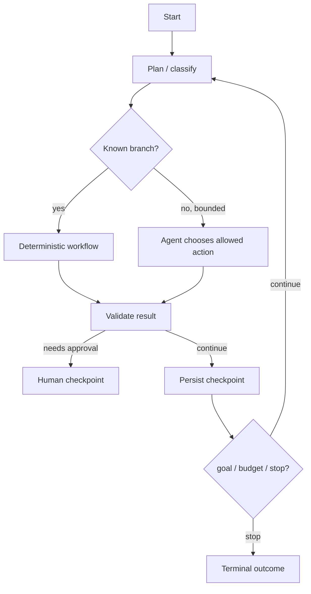

# 05 · 工作流、Agent Runtime 与记忆

> 一句话点题：Agent 不是 while 循环里不断问模型；生产 runtime 是一个有状态、可暂停、可恢复、有预算和终止条件的工作流引擎。

<div class="lesson-meta"><span>AI12—AI14</span><span>必修核心</span><span>预计 6 × 45 分钟</span><span>前置：AI01—11、SW12—13</span></div>

## 本章可观察目标

你能判断固定工作流与动态 Agent 的边界；能设计显式状态、检查点、租约、重试、补偿和人工中断；能区分工作状态、对话摘要、情节记录和长期知识，并为写入/检索/遗忘建立治理。

## AI12 · 先用工作流，只有必要时才给模型决策权

固定步骤、可枚举分支和高风险流程适合确定工作流；任务路径真的依赖开放环境、无法预先列举且模型决策带来可测收益时，才使用 Agent。



Agent 决策空间越大，评测和安全成本越高。把确定部分固化：身份、权限、计费、状态转移、重试、审批和最终写入由程序控制；模型用于分类、计划、内容与有限工具选择。

停止条件必须显式：成功验收、最大步骤、Token/费用/时间、重复状态、无进展、用户取消、安全策略拒绝。只写“直到完成”会产生循环和账单事故。

## AI13 · Runtime 把每一步变成可恢复状态

长任务会跨分钟/小时，进程和依赖必然失败。状态不能只保存在内存对话里：

```text
Run
  id, owner, goal, status, budget, policy_version
Step
  index, input_ref, model/tool version, proposal, result_ref, cost, trace
Checkpoint
  state snapshot, pending action, approvals, lease/version
Artifact
  generated file/report/patch + hash
```

每步先持久化意图/状态，再执行；完成记录结果和下一状态。工具幂等，重试只针对可重试错误，退避并有上限。worker 使用租约与 fencing token，避免旧执行者恢复后覆盖新执行者。

人工审批是可持久化状态 `waiting_approval`，不是进程阻塞等待。审批包含计划快照和过期时间；恢复时验证工具参数未变化。用户取消要传播到模型调用、工具和 worker，并定义不可取消副作用怎样呈现。

补偿不是回滚时间：发出的邮件无法撤回，只能发送更正；外部写失败的补偿也可能失败，因此本身是可观察、可重试的步骤。

### ReAct 是一种循环，不是完整生产架构

推理/行动交替有助于动态任务，但生产还需要权限、状态、预算、并发、恢复、观测与评测。不要把论文示例的文字轨迹直接存成无限记忆，也不要要求暴露私有链式思考；保存可审计的决策摘要、工具参数和结果足够。

## AI14 · 记忆不是一个向量库

| 类型 | 内容 | 生命周期 | 风险 |
|---|---|---|---|
| 工作状态 | 当前目标、步骤、变量 | 单次 run | 丢失导致不可恢复 |
| 对话摘要 | 已确认事实、决定、未决项 | 会话 | 摘要误写/丢关键数值 |
| 情节记录 | 过去一次任务与结果 | 一段时间 | 错误经验被复用 |
| 长期知识 | 稳定偏好、SOP、领域事实 | 版本化长期 | 隐私、过时、投毒 |

写入记忆要有策略：来源、主体、置信/验证、敏感分类、有效期、可修改/删除。不要让模型把自己刚生成的猜测自动写成“长期事实”，形成自我强化。用户应能查看、更正和删除其记忆；组织知识要有 owner/版本。

检索记忆按当前任务和权限，不能把另一个用户经历召回。摘要压缩前保留不可丢字段；对关键事实引用外部事实源，而不是仅信自然语言摘要。

## 贯穿案例：代码审查 Agent 中途崩溃

Agent 已读取 diff、运行测试、生成两个建议，准备创建评论时进程崩溃。若只有内存对话，重启会重跑测试并可能重复评论。可靠 runtime：run/step/checkpoint 已持久化；测试结果作为 hash artifact；创建评论计划等待审批；恢复后加载 checkpoint，验证 commit SHA 未变；用 `(repo, commit, finding_id)` 幂等；若代码已更新，旧审批失效并重新审查。

## 会死在哪里

- 无限 Agent 循环：无成功/预算/无进展条件；显式 stop policy。
- 状态只在 prompt：崩溃后无法恢复；外部持久化检查点。
- 整步重试重复工具副作用；每工具幂等和步骤状态。
- 审批后参数变化；绑定计划 hash 和有效期。
- 自动把输出写长期记忆；验证、权限、TTL 和用户治理。
- 摘要替代关键事实；结构化状态/引用事实源。

## 与 AI 协作模板

```text
请把这个 Agent 设计为可恢复状态机：
- 区分确定工作流与模型可决策节点，缩小 action space；
- 定义 Run/Step/Checkpoint/Artifact schema 与状态转移；
- 写成功、步骤、时间、费用、重复/无进展和取消终止条件；
- 为每个工具列幂等、超时、重试、未知结果和补偿；
- 把审批做成持久状态并绑定计划 hash；
- 将记忆分工作/摘要/情节/知识，定义写入、权限、TTL、更正与删除。
```

## 练习：让三步 Agent 从任意点恢复

实现“读取 issue→生成修复计划→经审批创建任务”的 runtime。每步持久化；在模型后、工具前、工具后分别杀进程；恢复后不重复副作用。加最大 8 步/5 分钟/预算、重复动作检测和用户取消。再让模型提议一条长期记忆，系统必须先展示来源/有效期并由用户确认。

## 常见误区

Agent 等于循环；步骤越多越聪明；所有状态塞对话；失败从头重跑；审批只是 UI 弹窗；补偿等于事务回滚；向量库等于记忆；模型输出自动沉淀 SOP；摘要永远准确；没有成本/终止策略。

<Quiz question="长任务在工具成功后、记录结果前崩溃，恢复时最关键的设计是什么？" :options="['重新从第一步全部执行', '工具幂等/可查询，步骤状态与检查点持久化', '让 Prompt 更长']" :answer="1" explanation="崩溃窗口产生未知结果；外部状态、幂等和查询使恢复能判断而非盲目重复。" />

## 本章小结

- 固定流程优先确定工作流，只有开放路径带来可测收益时使用 Agent 决策。
- Runtime 是显式状态机，Run/Step/Checkpoint/Artifact 在外部持久化。
- 长任务必须有预算、终止、取消、租约、幂等和恢复。
- 审批绑定具体计划，补偿是新的业务动作而非时光倒流。
- 记忆按用途和生命周期分层，写入需来源、权限、验证、TTL 与用户治理。

<EvidenceTracker lesson="ai-05-agent-runtime" />

## 本章完成标准

实现一个 3 步可恢复 runtime；在三个崩溃点证明无重复副作用；具备预算/终止/取消/审批；展示一条记忆从提议到确认/删除的治理流程。最近平均至少 7/10。

<div class="source-note">主要来源（核验于 2026-08-31）：<a href="https://arxiv.org/abs/2210.03629">ReAct</a> 用于推理—行动模式；生产状态/恢复原则结合数据库事务、工作流与安全边界独立推导。论文不等于完整 runtime 规范，详见<a href="../../sources/ai">来源目录</a>。</div>
