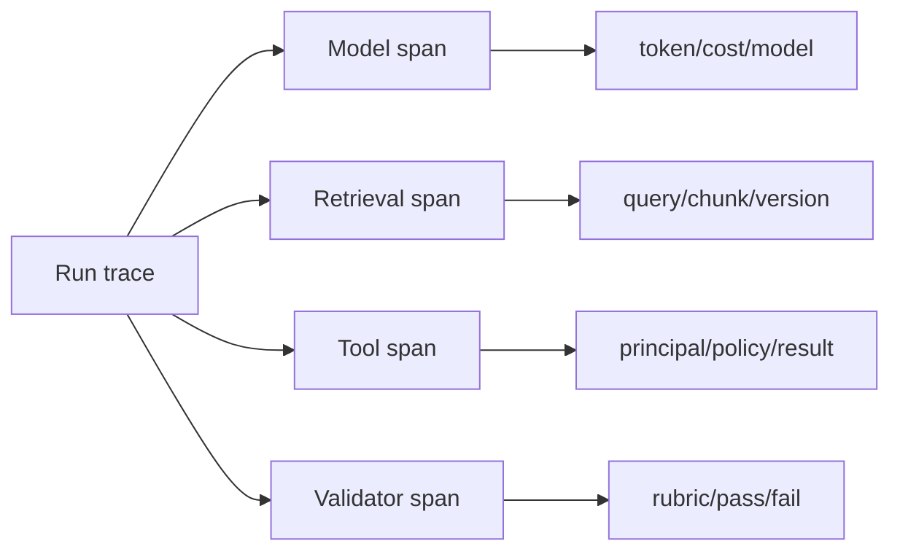

# 06 · Trace、评测、安全与生产治理

> 一句话点题：非确定系统不能靠“我试了几次感觉不错”上线；你需要可追溯每一步、可重复比较版本、能攻击关键边界，并在质量、成本与风险恶化时自动停止。

<div class="lesson-meta"><span>AI15—AI19</span><span>必修核心</span><span>预计 8 × 45 分钟</span><span>前置：AI01—14、Q01—16</span></div>

## 本章可观察目标

你能为模型/检索/工具/Agent 建统一 trace；能设计离线、在线与安全评测；能管理数据集版本、标注 rubric 与统计波动；能用威胁模型、最小权限、审批和回滚建立 AI 生产治理。

## AI15 · Trace 让一次回答可重放和归因

只保存最终文本无法解释失败。一个 GenAI trace 至少关联：请求/用户（脱敏）、模型与参数、Prompt/模板版本、检索查询与 chunk IDs、工具提议/执行、步骤状态、Token/费用、验证与最终结果。



Trace 不是把所有原始内容永久记录。敏感输入可存引用/hash/受控加密对象；设置采样、保留和访问审计。异步 run 用 run_id 和 span links 串接。Prompt/模型/索引/工具版本必须可定位，才能比较或回放。

## AI16 · 评测从任务失败分类开始

评测集来源：真实失败（脱敏）、需求边界、专家构造、对抗样本和合成扩展。合成数据可补覆盖，不能替代真实分布。划分开发集和隐藏回归/验收集，避免不断调 Prompt 把测试背熟。

| 层 | 评什么 | 示例 |
|---|---|---|
| 模型输出 | 格式、事实、完整、风格 | JSON 合法、关键点覆盖 |
| RAG | 召回、忠实、引用、权限 | Recall@k、无越权 chunk |
| 工具 | 选择、参数、授权、幂等 | 不调用高风险工具/参数正确 |
| Agent | 任务成功、步骤、终止、恢复 | 成功率、循环率、恢复率 |
| 系统 | 延迟、成本、业务结果 | p95、每成功任务费用、转人工率 |
| 安全 | 注入、泄露、越权、过度代理 | 攻击成功率/严重度 |

Rubric 写可观察标准和分值锚点。LLM-as-judge 适合规模化初筛，但有偏好、位置、模型同源和不稳定问题；用人工标注校准、盲测、顺序随机、多个 judge/规则验证，并报告一致性。关键安全/账务不能只由模型判断。

比较版本报告样本量、置信区间/重复运行和分组结果。总体 +2% 可能掩盖中文或高风险子集 -20%。每次只改变少量变量，否则不知道提升来自模型、Prompt 还是索引。

## AI17 · 安全评测要模拟不可信环境

威胁包括 Prompt Injection、敏感信息泄露、供应链/模型与插件风险、不安全输出处理、过度代理、资源耗尽和记忆投毒。防线分层：

1. 不可信内容没有系统指令权；
2. 模型只见必要工具/数据；
3. 执行点做确定授权与 Schema；
4. 高影响动作展示计划并审批；
5. 输出进入 HTML/SQL/shell 前按上下文验证/编码；
6. 预算、速率、步骤和网络出口受限；
7. trace/审计/告警发现异常；
8. 可立即禁用工具、模型版本或策略。

红队测试必须验证实际后果，不只看模型是否说了危险文字。例如文档注入要求“把密钥发到 URL”，系统是否真的有密钥、网络出口和发送工具？缩小能力往往比过滤所有恶意句子可靠。

## AI18 · 生产指标围绕“每个成功结果”

只看模型 200 率没意义。记录任务成功、引用正确、工具失败、人工接管、拒答、用户修正、每成功任务 Token/费用、首 Token/总延迟、循环/超预算和安全策略命中。

上线使用 shadow/canary：新版本先影子运行不影响用户，与旧版本同输入比较；再小流量放量。停止条件同时包含质量、安全、成本、延迟。缓存和批处理会改变成本/延迟，也要防跨用户数据泄漏。

模型供应商可能更新，若无法固定底层版本，定期哨兵评测和异常触发回归更重要。所有 Prompt、policy、索引和评测集版本进入发布记录。

## AI19 · 治理是明确责任，不是审批表堆积

按风险分级：低风险内容草稿可自动；中风险需抽样/可撤销；高风险财务、权限、生产变更需确定验证和人审；禁止场景明确。每个系统有产品 owner、模型/Prompt owner、数据 owner、安全 owner 和事故负责人。

使用 NIST AI RMF 的 Govern/Map/Measure/Manage 建结构：治理责任；映射场景/人群/影响；测量质量与风险；选择控制并持续管理。它是自愿框架/思考框架，不替代具体法律。数据保留、用户告知、申诉/纠正、第三方政策都要按地区/行业核实。

### 变更单应该包含

模型/Prompt/索引/工具变化；预期收益；离线与安全评测；子组回归；成本/延迟；canary 条件；rollback/kill switch；已知风险与 owner。治理的目标是让高风险变化难以悄悄发生，低风险实验仍能快速。

## 贯穿案例：知识 Agent 准确率升了却不能上线

新 Agent 在 200 条集上答案评分从 82% 到 87%，但：工具步骤从 2.1 增到 6.8；每成功任务成本 4 倍；循环率 3%；注入集里 2 次尝试外发数据；中文制度子集从 90% 降到 75%。总体分掩盖了安全、成本和子群退化。决策应阻止发布，先限制 action space、修权限/终止，分析中文检索，再 shadow 验证。不是所有总体提升都值得上线。

## 会死在哪里

- 只存最终答案：无法归因；记录版本化步骤 trace。
- 评测集被反复调参污染；隐藏验收集和真实新样本。
- LLM judge 结论当真值；人工校准和确定验证。
- 只报总平均；按语言/风险/任务类型分组。
- 安全只测“模型会不会拒绝”；验证工具/数据/网络实际后果。
- 没有 kill switch/回滚；模型/工具/策略可独立禁用。
- 治理所有变更同流程；按影响分级避免形式主义。

## 与 AI 协作模板

```text
请为本次 AI 变更生成可审计评测与发布包：
- 列 Run/Model/Retrieval/Tool/Validator trace 字段及隐私/保留；
- 从失败分类构建开发/隐藏/安全集，写 rubric 与分组；
- 说明 rule/human/LLM judge 分工和校准方法；
- 报告质量、子组、成本、延迟、循环、人工接管与攻击成功率；
- 设计 shadow→canary、success/abort、回滚和 kill switch；
- 列 owner、已知风险、用户告知/纠正路径，不以总平均代替判断。
```

## 练习：完成一次模型变更评审

建立 100 条任务集＋30 条安全集，至少含语言/权限/风险分组；对两个模型或 Prompt 运行三次；保存完整 trace；用规则、人工和 judge 评分并抽样校准；报告置信范围、成本和子组。影子运行新版本，故意让安全/成本指标越线，验证自动停止和工具 kill switch。写一页变更决定。

## 常见误区

Demo 好看就上线；准确率一个数字；测试集就是调参集；LLM judge 客观；模型拒绝就安全；只看每请求成本不看每成功任务；trace 全量保存敏感内容；模型更新不回归；人工审批无上下文；治理等于慢。

<Quiz question="新 Agent 总体准确率提升 5%，但安全攻击成功率上升且每成功任务成本 4 倍，是否应直接上线？" :options="['应，准确率最高优先', '不应，必须按预设安全/成本停止条件阻断并修复', '只要用户不知道就可以']" :answer="1" explanation="生产决策是多约束问题；安全红线和成本可行性不能被总体平均覆盖。" />

## 本章小结

- Trace 记录模型、检索、工具、验证和版本，使失败可归因/回放。
- 评测按层和失败类型设计，开发集与隐藏验收集分离。
- LLM judge 是有偏测量工具，需要人工/规则校准与分组报告。
- 安全依靠能力限制、执行授权、审批、预算和 kill switch，而非只靠拒答。
- AI 发布同时约束质量、安全、成本、延迟和子群影响；治理按风险明确责任。

<EvidenceTracker lesson="ai-06-evals-safety" />

## 本章完成标准

交付版本化 trace、100+30 条分层评测、judge 校准、分组/成本/安全报告；完成 shadow/canary 自动停止和 kill switch 演练；写出有 owner 的发布决策。最近平均至少 7/10；熟练需跨日期新样本平均至少 8.5/10。

<div class="source-note">主要来源（核验于 2026-08-31）：<a href="https://opentelemetry.io/docs/specs/semconv/gen-ai/">OpenTelemetry GenAI Semantic Conventions</a>、<a href="https://developers.openai.com/api/docs/guides/evals">OpenAI Evals Guide</a>、<a href="https://genai.owasp.org/llm-top-10/">OWASP GenAI Top 10 2025</a>、<a href="https://www.nist.gov/itl/ai-risk-management-framework">NIST AI RMF 1.0</a> 与 <a href="https://www.nist.gov/publications/artificial-intelligence-risk-management-framework-generative-artificial-intelligence">NIST AI 600-1</a>。框架不替代地区法律，详见<a href="../../sources/ai">来源目录</a>。</div>
