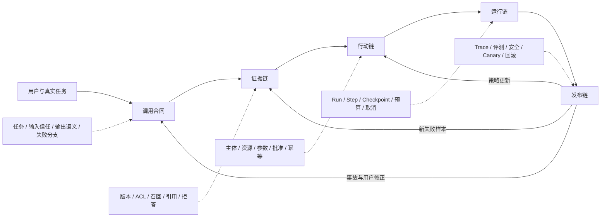

# 核心学习总结 · 把 AI 能力变成一条可审计的系统链

> 七章学完以后，最重要的变化不是你记住了多少模型名，而是面对一个“加 AI”的需求时，你能把它拆成不同责任层，知道哪一层需要概率能力，哪一层必须由确定程序、人和组织规则接管。

<div class="lesson-meta"><span>AI 应用与 Agent 核心总结</span><span>AI01—AI19</span><span>三阶段综合复盘</span><span>路线选择</span></div>

<KnowledgeFlow
  title="用一张系统图收回十九个知识节点"
  intro="完成本页以后，你应当能从一个真实需求选择最小 AI 形态，画出证据、行动、运行和发布边界，并判断下一步该补工程、模型还是 Agent 前沿。"
  what="AI 应用是一套由概率模型参与、但不把事实、权限和责任全部交给模型的社会技术系统。"
  why="模型能力只是系统成功的一项条件。输入含糊、证据失效、工具越权、状态丢失或评测偏差，都能让更强模型产生更昂贵的错误。"
  how="按调用合同、证据链、行动链、运行链和发布链逐层增加能力；每次升级都保留更简单基线、失败分支、可审阅产物和退出条件。"
  terms="Behavior Profile | Call Contract | Evidence Chain | Action Boundary | Durable Runtime | Evaluation Claim | Progressive Delivery | System Governance"
/>

## 先把完整系统看成五条相接的链

课程从一次模型调用出发，最后走到可以上线和停止的 Agent。十九个节点并不是十九项平行功能，它们沿着同一条控制链形成五组依赖。阶段总结会换场景检验迁移，但迁移样本只作为带独立分母的平行回归；供应商准入、采购与报销的规则不能混成一份看似更大的通过率。



调用合同回答“模型在这项任务里应该交付什么”；证据链回答“这个结论凭什么成立”；行动链回答“谁有权对哪个对象做什么”；运行链回答“任务跨过等待与故障以后怎样保持同一事实”；发布链回答“我们凭什么相信这套系统值得继续运行”。

后面的链不能修复前面的含糊。一个任务没有定义清楚，增加 RAG 只会更有依据地回答错问题；错误答案获得了写工具，权限设计再严也可能合法执行错误计划；没有版本和 Trace，线上结果好坏又无法送回正确层。系统设计的顺序因此很重要。

## 三个阶段分别拿回一种控制权

第一阶段处理模型行为与调用合同。模型输出来自给定上下文下的概率分布，解码、上下文位置、服务版本和输入细节都会改变结果。产品不能把一次漂亮演示当作稳定承诺。行为剖面用代表性输入和重复运行描述实际波动；调用合同再固定任务、输入信任、版本、输出 Schema、语义验证和失败分支。

这个阶段拿回的是**接口控制权**。模型可以生成候选结果，但程序知道什么结果可以进入下一步。Schema 通过只证明结构可解析；事实、业务语义和授权仍需后续验证。

第二阶段把外部知识与真实动作接进来。版本化原文、解析、切块、ACL、混合召回、重排和引用验证组成证据链；窄工具、主体传递、资源授权、绑定批准、幂等键和结果查询组成行动链。模型在两条链之间翻译，却不能凭自己的文字修改资料有效性或扩大权限。

这个阶段拿回的是**事实与行动控制权**。系统只有在回答得到证据支持、动作得到权限支持时，才把自然语言请求推进成真实结果。

第三阶段面对时间。Runtime 用状态机、Run、Step、Checkpoint、Event、lease、fencing、取消和补偿承载长任务；Trace、分层评测、安全攻击、shadow、canary、回滚和 kill switch 管理多个版本。记忆进入生命周期以后，也必须有来源、范围、权限、有效期和删除。

这个阶段拿回的是**运行与发布控制权**。系统不仅能够继续，还要在证据不足、成本失控和风险越线时停止。

## 选择 AI 形态时，从最小能力阶梯向上走

面对一个新需求，不需要默认从 Agent 开始。可以沿下面的阶梯逐级增加不确定性与权限。

| 层级 | 适合的问题 | 升级前必须出现的证据 | 新增责任 |
|---|---|---|---|
| 确定程序 | 规则明确、输入结构化、结果可计算 | 规则本身无法覆盖开放文本时再升级 | 普通软件测试与运维 |
| 单次模型调用 | 改写、分类、抽取、候选草稿 | 行为剖面证明在任务分布上有可用价值 | 调用合同、语义验证、拒绝分支 |
| RAG | 答案依赖私有、版本化或可引用知识 | 错误确实来自知识缺失，而非任务定义 | 语料治理、权限检索、引用与冲突 |
| 确定工作流＋工具 | 步骤可枚举，需要读取或写入系统 | 工具带来明确业务价值并有最小权限 | 授权、批准、幂等、最终状态 |
| 单 Agent | 下一步真的依赖开放环境，无法预写全部路径 | 与固定工作流同预算比较有稳定收益 | 状态、预算、终止、恢复与记忆 |
| 多 Agent / 学习型 Agent | 可并行子任务、独立权限或轨迹学习有可测收益 | 单 Agent 基线与专门评测已稳定 | 协调、证据去重、信用分配与更大风险面 |

上升不是成熟度勋章。若一个确定工作流在质量、成本和维护上更好，它就是当前正确答案。降低能力也不是失败：工具临时降级为草稿、RAG 证据不足时转人工、Agent 无进展时停下，都是系统兑现边界的方式。

每次升级都问三件事：现有方案具体在哪些样本失败；新能力预计修复哪一类失败；如果没有修复或带来新代价，怎样退回。答不出这三问，技术选择仍是偏好而不是决策。

## 一项新需求先经过九个问题

可以把核心课程压缩成九个顺序问题。它们不是会议清单，而是后续产物的入口。

1. **谁在什么时刻做什么决定？** 如果没有具体使用者、对象和动作，先不要讨论模型。
2. **输入里哪些内容可信，哪些只是数据？** 用户文字、网页、文档和工具结果都可能包含指令样文本，却没有系统权限。
3. **什么输出可以被程序验证？** 写 Schema、字段语义、拒绝状态和人类看到的反馈，不把自由文本直接接到执行。
4. **结论依赖哪份权威事实？** 保存原文、版本、时点、ACL 和预期证据；相似内容不等于适用证据。
5. **系统究竟获准做什么？** 权限绑定主体、资源、动作、参数、数量与期限，高影响批准绑定不可变计划。
6. **外部写入超时后怎样知道发生了什么？** 使用稳定幂等键、结果查询和诚实的 `outcome_unknown`。
7. **任务等待或崩溃以后怎样恢复？** 状态在外部持久化，检查点划分安全边界，并发接管拒绝旧执行者。
8. **哪项证据会阻止上线？** 从产品主张建立数据、rubric、分组和安全门槛，不能等结果出来再改标准。
9. **谁能停止、回滚和处理事故？** 工具与版本有独立 kill switch，变更、剩余风险和用户纠正都有 owner。

九问之间可以往返。安全测试发现越权内容进入上下文，要退回第四问的 ACL，而不是只在第八问调分数；事故发现重复写入，要退回第六问的外部效果协议；用户不断误解确认界面，则第三和第五问都要重做。

## 看见一种失败，就把它送回正确的责任层

AI 系统最浪费时间的调试方式，是所有问题都通过改 Prompt 处理。下面这张路由表帮助先找责任边界，再选择手段。

| 现象 | 首先检查 | 不要急着做 |
|---|---|---|
| 同一请求有时格式不同 | 输出合同、Schema 支持范围、结束原因 | 直接微调模型 |
| 引用存在但不支持结论 | 必要证据、切块、重排、引用验证 | 增加一条“不要幻觉”指令 |
| 找到两版互相冲突的制度 | 元数据、生效范围、冲突与拒答政策 | 让模型自行选择看起来新的 |
| 工具参数合法但对象不对 | 主体传递、资源授权、业务状态 | 把对象 ID 藏进更长 Prompt |
| 超时后出现两份记录 | 幂等键、结果查询、未知状态 | 无限增加重试次数 |
| 崩溃恢复后旧计划继续执行 | 输入版本、批准 hash、checkpoint、fence | 只补一句“重新确认” |
| 记忆把一次例外当成永久规则 | 来源、scope、有效期、supersedes、删除 | 只调向量相似阈值 |
| 总分提高但高风险子组变差 | claim、分组、逐样本配对和安全门槛 | 用总体平均投票上线 |
| 线上成本突然翻倍 | 步骤数、重试、上下文、工具和每成功任务成本 | 只看单次模型价格 |

Prompt 当然有用。它能让模型遵循任务表达、减少明显错误，也能作为版本化系统输入接受评测。它不能成为唯一权限系统、事实数据库、事务日志、幂等协议或发布负责人。

## 一套真正可积累的项目产物

完成核心路线后，最好不要把成果散落成七篇读书笔记。选择一个真实但权限可控的项目，维护一份顶层 manifest，把各章产物连接起来。

```text
ai-system-evidence/
├─ 01-behavior-profile/
│  └─ representative-inputs + repeated-runs + failure-taxonomy
├─ 02-call-contract/
│  └─ schema + semantic-validator + regression-set
├─ 03-evidence-chain/
│  └─ corpus-manifest + golden-evidence + retrieval-report
├─ 04-action-boundary/
│  └─ tool-contracts + policy + approvals + idempotency-tests
├─ 05-runtime/
│  └─ state-machine + checkpoints + crash/cancel/concurrency-tests
├─ 06-evaluation/
│  └─ claims + traces + eval-results + judge-calibration + canary/rollback
├─ 07-governance/
│  └─ threat-model + safety-results + owners + kill-switch + incident-receipts
└─ manifest.yaml
```

`manifest.yaml` 记录每份材料的版本、哈希、owner、对应系统主张、验证日期和当前状态。这样一次 Prompt 改动不只是“改了几句话”，而是能指出影响哪个合同、需要重跑哪些样本；一次制度更新也能定位需重建的索引、失效引用和相关回归。

工作复利来自这些可维护产物。下一个 AI 功能可以复用行为剖面脚本、工具网关、故障注入器、评测框架和发布模板，同时仍要根据新任务重新决定对象、权限与失败代价。SOP 的价值是保留判断过程，不是让所有文章或所有系统长得一样。

## 你现在还没有学到什么

核心路线刻意没有深入训练底座模型、分布式训练、量化内核、GraphRAG、多模态检索、多 Agent 协调和 Agent RL。这些内容重要，却不该被伪装成所有产品的前置。

如果当前问题是模型为什么产生某种分布、微调数据怎样改变参数、显存和吞吐怎样约束自托管，进入 **AI 进阶**。那里会从数学、Transformer、适配训练走到推理系统，再讨论 Advanced RAG 与多 Agent。

如果当前问题是最新论文中的规划、长时记忆、computer use、coding agent、研究 Agent、信用分配、评测和安全，进入 **Agent 前沿**。前沿证据更新快，需要同时保留稳定机制、近期论文、反例和复现边界。

如果你连权限、事务、测试、可观测性或发布恢复都很难实现，应先回补 **软件与系统工程** 和 **质量与生产交付**。AI 不会消除这些基础；模型越能行动，工程边界越重要。

如果项目仍不知道用户为何需要它、现有流程和成功代价是什么，回到产品问题。此时研究更多模型通常只会推迟验证。

## 用四周把阅读转成第一轮能力证据

不需要等全部理解后才实践。下面是 **16 个 45 分钟标准回合**的首次证据通路，不等于完成 66 回合的正式路线：先用 1 回合搭环境，四周每周完成 3 回合，三个阶段再各保留 1 回合做至少 7 天后的延时复测。它只帮助尽快得到第一套可审阅产物，不能替代阶段迁移和完整故障覆盖。

| 周 | 主要工作 | 周末可审阅结果 |
|---|---|---|
| 1 | 固定 30 个代表问题，重复调用，写失败分类和调用合同 | 行为剖面、Schema、语义验证器、第一批回归 |
| 2 | 建立小型版本化语料与必要证据集，做关键词/向量对照 | corpus manifest、检索报告、引用/拒答失败样本 |
| 3 | 只接一个读工具和一个可撤销写工具，加入批准与幂等 | 工具合同、授权矩阵、未知结果测试、审计记录 |
| 4 | 把任务做成可恢复状态机，建立 claim card 与发布演练 | 崩溃/取消测试、分层评测、no-go 或 canary 决定 |

精力不足时缩小语料、任务数和工具数量，不删除失败分支、版本、练习和证据。五份写得清楚、能重放的样本，比复制一套庞大框架更能形成判断。第二轮再把真实事故加入回归、换一个陌生场景迁移，并在 1 / 3 / 7 / 14 / 30 天复述关键边界。

达到基础掌握，不是“所有 Quiz 都点对”，而是能够独立画出五条链，做一个窄工具系统，并用故障注入证明它会停。达到熟练掌握，还需要跨日期迁移、解释反例、作出一次有证据的 no-go，并让他人从 manifest 接手项目。

## 🎯 随堂检验

<Quiz question="一个团队的主要问题是知识文档版本混乱、用户权限没有进入检索，但负责人希望直接升级为多 Agent。最合理的下一步是什么？" :options='["先增加多个 Agent 互相检查","先修复原文版本、ACL 与必要证据评测，并保留简单检索基线","让所有 Agent 共用管理员权限以减少失败"]' :answer="1" explanation="当前瓶颈在证据与权限链。多 Agent 不会修复上游事实边界，反而会扩大读取、协调和评测成本。" />

## 复习与下一路线

- [阶段一总结 · 从一次模型调用到一份可验证合同](/domains/ai/stage-1-review)
- [阶段二总结 · 让“知道”与“做到”共用一条审计链](/domains/ai/stage-2-review)
- [阶段三总结 · 让一个能继续运行的 Agent 变成可放行的系统](/domains/ai/stage-3-review)
- [AI 进阶学习](/advanced/ai/)
- [Agent 前沿强化](/frontier/agents/)
- [AI 应用与 Agent 来源目录](/sources/ai)

<EvidenceTracker lesson="ai-core-summary" />

## 参考资料

- Anthropic，[Building Effective Agents](https://www.anthropic.com/engineering/building-effective-agents)，2024。用于 workflow/agent 与从简单组合逐级增加自治的工程观点；厂商经验不能替代你的同预算对照。
- Lewis 等，[Retrieval-Augmented Generation for Knowledge-Intensive NLP Tasks](https://arxiv.org/abs/2005.11401)，NeurIPS 2020。用于参数记忆与外部检索的原始框架；现代权限、引用和治理需要额外系统设计。
- Yao 等，[ReAct](https://arxiv.org/abs/2210.03629)，ICLR 2023。用于推理与行动交替的研究起点；论文循环不是完整 Runtime。
- Model Context Protocol，[Specification 2026-07-28](https://modelcontextprotocol.io/specification/2026-07-28)。用于当前 Host、Client、Server 和协议边界；互操作性不会自动提供业务授权与幂等。
- NIST，[AI Risk Management Framework 1.0](https://www.nist.gov/itl/ai-risk-management-framework)，2023。用于治理、场景映射、测量与风险管理；具体合规义务仍需另行核实。
- OWASP GenAI Security Project，[LLM Top 10 2025](https://genai.owasp.org/llm-top-10/)，用于应用风险入口；清单不能替代具体资产、能力和攻击路径的威胁建模。
