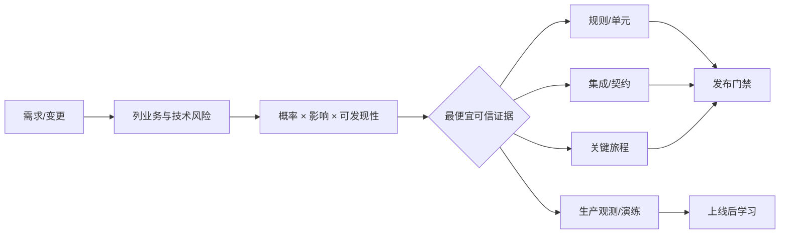

# 01 · 需求、风险与测试策略

> 一句话点题：测试不是上线前“多点几下”，而是先判断什么错误最昂贵，再用最便宜、最可信的证据把它拦在合适的位置。

<div class="lesson-meta"><span>Q01—Q02</span><span>必修核心</span><span>预计 4 × 45 分钟</span><span>前置：能描述一个产品流程</span></div>

## 本章可观察目标

你能把模糊需求改写成可验收行为；能按发生概率、业务影响和可发现性排风险；能设计覆盖规则、边界、集成、关键旅程和生产信号的分层测试策略，并明确哪些风险暂时接受。

## Q01 · 需求先变成例子，测试才知道证明什么

“用户可以取消任务”不是可执行需求。至少还缺：哪些状态允许取消、谁有权限、正在执行时怎样处理、重复取消返回什么、外部副作用能否撤销、多久可见。

使用 Given–When–Then 把讨论落到行为：

```gherkin
Given 任务属于 workspace-A 且状态为 pending
And 当前用户拥有 task:cancel 权限
When 用户以相同 idempotency-key 连续取消两次
Then 第一次把状态改为 cancelled
And 第二次返回同一个任务结果
And 只产生一条取消业务效果
```

好的验收标准包含输入、前置状态、动作、可观察结果和边界。它不规定内部必须有多少类/函数，但会约束外部行为。若需求中出现“应该、尽量、快速、合理、支持”，先追问阈值和反例。

### 用例之外还要写不变量

示例只能覆盖有限路径，不变量表达永远不能被破坏的规则，例如：

- 任一任务在任何时刻只有一个终态；
- 用户永远不能读写其他工作区任务；
- 同一幂等键和同一请求体最多产生一个任务；
- API 返回 succeeded 前，结果已经持久化。

不变量适合属性测试、模型测试和数据库约束；具体旅程适合场景测试。两者结合比堆许多重复示例更强。

## Q02 · 风险决定测试投资，不是代码行数

风险可以粗略看成：`发生概率 × 业务影响 × 难以发现程度`。不必迷信数字精确，评分的价值是迫使团队比较。

| 风险 | 概率 | 影响 | 发现难度 | 优先证据 |
|---|---:|---:|---:|---|
| 跨租户读取 | 2 | 5 | 5 | 授权集成测试＋生产审计 |
| 重复扣费/重复副作用 | 3 | 5 | 4 | 并发幂等测试＋对账 |
| 按钮颜色错误 | 3 | 1 | 1 | 视觉/人工检查 |
| worker 崩溃后任务永久 running | 3 | 4 | 4 | 故障注入＋恢复测试 |

即使跨租户 bug 概率低，影响与隐蔽性让它优先。反过来，UI 间距问题发生概率高但恢复便宜，不值得与数据隔离投入相同自动化。



### 测试策略不是“金字塔数量配方”

底层测试快、定位准，适合大量业务规则；集成测试证明数据库、队列、文件等真实边界；契约测试证明服务间消息形状/兼容；端到端证明少数关键用户旅程；生产指标和演练证明真实环境。每层回答的问题不同，不能拿 90% 单元覆盖率证明迁移安全，也不能用 500 条脆弱 E2E 穷举所有规则。

建立“风险—证据”矩阵：每个高风险至少有预防、检测、恢复中的两类控制。比如重复副作用：唯一约束预防，幂等并发测试检测，对账/补偿恢复。

## 贯穿案例：新增“重试失败任务”

先列需求分歧：重试是复用同一 task 还是创建 attempt？只有 failed 可重试，还是 timeout 也行？原输入是否可修改？谁有权限？外部动作若第一次其实成功怎么办？

风险排序后得到：

1. **重复副作用（最高）**：模拟外部成功但响应丢失，验证查询/幂等；
2. **状态被覆盖**：并发重试与取消，验证条件更新；
3. **跨租户**：用户重试另一工作区 task 必须 404/403 且无信息泄漏；
4. **重试风暴**：限制次数、退避、队列压力告警；
5. **UI 文案**：人工/组件测试即可。

测试策略由风险长出来，而不是先宣布“我们要 80% 覆盖率”。

## 决策与权衡

<DecisionCard title="更多 E2E，还是更多规则/集成测试？" left="E2E 更接近用户旅程，但慢、脆弱、失败定位难。" right="规则/集成测试快且定位准，但不能单独证明浏览器到部署环境的整条链。" verdict="把不变量下沉到规则/数据库测试，只保留少量高价值 E2E 证明关键旅程连通。" />

## 会死在哪里

- 验收标准复述实现：重构就全坏；以外部行为和不变量描述。
- 只测 happy path：越权、重复、并发、超时、回滚没证据。
- 覆盖率当质量：执行一行不代表断言正确；审查风险与变异存活。
- 测试与需求分离：需求变更后旧断言继续“绿”；验收标准版本化。
- 所有风险都自动化：低价值测试拖慢反馈；明确接受和人工控制。

## 与 AI 协作模板

```text
针对这个需求先做风险与验收分析，不生成实现：
1. 把含糊词改写成 Given/When/Then，列正常、边界、错误和恢复场景；
2. 提炼至少三个必须永远成立的不变量；
3. 按概率、影响、可发现性排序风险，并说明评分理由；
4. 为每个高风险选择最便宜可信的测试层和生产控制；
5. 列出本次明确不测/接受的风险、理由和复审条件。
```

## 练习：写一页测试策略

选择一个当前功能，采访自己/需求方补全歧义；写 6—10 条代表性验收例和 3 个不变量；制作风险矩阵；把每个高风险映射到规则、集成、契约、E2E、观测或演练；删掉无法对应风险的测试。最后让 AI 扮演攻击者/故障注入者补漏洞，再由你决定哪些确实值得投入。

## 常见误区

需求写“功能正常”；把测试等同测试代码；按代码行平均分配测试；只看覆盖率；每个页面都写大量 E2E；忽略恢复和生产检测；把“暂不测试”藏起来；让 AI 根据实现反推测试导致同源偏差。

<Quiz question="一个跨租户数据泄漏概率低但影响极高、线上又难发现，测试优先级应怎样？" :options="['低，因为概率低', '高，需要授权集成测试和生产审计等多层证据', '只做 UI 测试']" :answer="1" explanation="风险不仅看概率；影响和可发现性会让低概率安全问题仍成为最高优先级。" />

## 本章小结

- 可验收需求由前置、动作、结果和边界组成；不变量补足有限示例。
- 风险决定测试投资，高影响且难发现的问题优先。
- 单元、集成、契约、E2E 和生产证据回答不同问题，不能互相冒充。
- 高风险应同时考虑预防、检测和恢复；低风险可以明确接受。
- 测试策略是一份可讨论的决策记录，不是一串框架名单。

<EvidenceTracker lesson="quality-01-strategy" />

## 本章完成标准

为一个真实变更交付验收例、不变量、风险排序和分层证据矩阵；能解释删掉了哪些低价值测试、仍接受什么风险。最近评估平均至少 7/10。

<div class="source-note">主要来源（核验于 2026-08-31）：<a href="https://martinfowler.com/articles/practical-test-pyramid.html">Practical Test Pyramid</a>、<a href="https://csrc.nist.gov/pubs/sp/800/30/r1/final">NIST SP 800-30 Risk Assessment</a>。风险评分是排序工具，不冒充精确概率；实现框架见<a href="../../sources/quality">来源目录</a>。</div>
