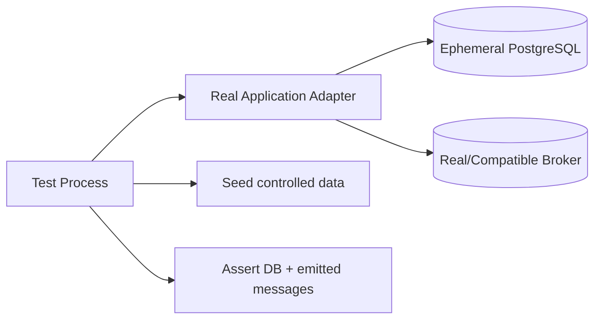

# 02 · 单元、集成、契约与端到端测试

> 一句话点题：一条测试的价值不在于“绿了”，而在于失败时能否准确告诉你哪项承诺被破坏，并且成本足够低，团队愿意一直运行它。

<div class="lesson-meta"><span>Q03—Q06</span><span>必修核心</span><span>预计 6 × 45 分钟</span><span>前置：Q01—Q02、SW01—13</span></div>

## 本章可观察目标

你能为纯规则、真实依赖、服务契约和用户旅程选择合适测试层；能识别脆弱 mock、测试污染和不稳定 E2E；能构建一个快速反馈到生产相似性的证据组合。

## Q03 · 单元测试：证明规则，而不是复述实现

单元是一个可独立验证的行为边界，不一定等于一个函数/类。状态机转移、价格计算、授权决策都适合单元测试。好测试包含清楚的 Arrange–Act–Assert，并从外部可观察结果断言。

```ts
it("rejects cancelling a succeeded task", () => {
  const task = taskWith({ status: "succeeded" });
  expect(() => task.cancel(user)).toThrow(InvalidTransition);
  expect(task.status).toBe("succeeded");
});
```

不要断言“内部调用了私有函数三次”，除非调用本身就是合同；否则重构内部实现会让行为未变、测试全坏。对时间、随机数、ID 等非确定性依赖，通过显式接口注入可控值，不要在测试里到处 sleep。

表驱动测试适合枚举边界；属性测试适合不变量，例如对任意操作序列，终态不能转回 running；变异测试可检查断言是否真能杀死错误，但成本更高，按关键模块使用。

## Q04 · 集成测试：让真实边界说话

mock 数据库只能证明你对 mock 的想象。SQL 约束、隔离、时区、序列化、队列确认和文件权限必须在真实实现或足够等价环境中测试。



每个测试要隔离数据：事务回滚、每例独立 schema/database 或唯一命名空间。并行运行时尤其不能共享固定用户/端口。测试容器/临时服务提高真实性，但要锁版本、等待 readiness、收集失败日志并确保清理。

集成测试应覆盖：约束冲突怎样映射；事务回滚；并发条件更新；迁移从上一个版本升级；序列化兼容；外部超时和断连。不要为了速度把所有真实边界替换掉，再把“集成测试”写在名字里。

## Q05 · 契约测试：服务演进时谁承诺什么

服务间故障常不是“服务挂了”，而是一方改字段、枚举、默认值或错误语义。Schema/OpenAPI 能验证形状，但语义还需例子：空列表与 404 区别、字段缺失与 null、重试语义、排序稳定性。

契约可由提供者验证：每次构建证明自己满足已发布契约；消费者驱动契约记录消费者实际依赖，防止提供者做破坏性改变。不要为所有内部函数做契约测试，它用于独立部署/版本演进边界。

兼容矩阵：

| 变化 | 通常兼容？ | 风险 |
|---|---|---|
| 响应新增可选字段 | 通常是 | 严格反序列化客户端可能失败 |
| 请求新增可选字段 | 是 | 服务端必须忽略/处理未知策略明确 |
| 删除字段/枚举值 | 否 | 老消费者仍依赖 |
| 改字段含义/单位 | 否且隐蔽 | 形状测试可能仍通过 |
| 新增错误码 | 取决于约定 | 客户端默认分支是否安全 |

## Q06 · E2E：只证明最关键的整条旅程

E2E 从用户入口穿过部署的系统，能发现路由、静态资源、Cookie、前后端契约、迁移和权限组合问题。它最接近用户，也最慢、最难定位。

选择少量核心旅程：登录→创建任务→看到状态；取消任务；跨租户不可见；服务失败后展示可恢复信息。定位元素优先可访问角色/稳定测试标识，不使用易变 CSS 层级。等待业务条件，不 sleep 固定秒数。

失败时自动保留 screenshot、trace、console、network 和服务日志。若只得到“按钮没出现”，E2E 的诊断价值很低。对外部支付/模型可用受控 sandbox/stub，但要另外有少量真实兼容烟测。

## 贯穿案例：同一个“取消任务”怎样分层证明

```text
规则测试：pending 可取消；succeeded 拒绝；终态不可逆
数据库集成：并发取消/完成只提交一个终态；审计同事务写入
契约测试：409 INVALID_TRANSITION 形状与 retryable=false
E2E：用户取消后界面最终显示 cancelled，刷新仍一致
生产控制：取消失败率、卡在 cancelling 的年龄、重复事件数告警
```

同一风险在不同层不是重复浪费：规则证明逻辑，集成证明持久化裁决，E2E 证明接线，生产指标覆盖测试环境无法复制的现实。

## 测试替身怎样不骗你

- Stub 返回预设值，适合控制罕见错误；
- Fake 是简化可用实现，如内存仓储，但可能与真实事务不同；
- Mock 验证交互，适合必须发生的外部命令，但易耦合实现；
- Spy 记录真实对象调用。

使用替身时明确它不证明什么。内存仓储不会重现 SQL 唯一约束和隔离；模型 API stub 不证明真实配额/Schema 变化。边界越关键，越需要至少一层真实集成/契约证据。

## 会死在哪里

- 测试互相污染：依赖执行顺序；每例独立事实并随机顺序验证。
- 全部 mock：系统只证明自己会调用假对象；保留真实边界测试。
- E2E 固定 sleep：快慢环境随机失败；等待明确 UI/网络状态。
- 测试和实现同一 AI 同时生成：可能共享误解；先由需求/不变量独立定义预期。
- 快照巨大：任何小变都批准，真正差异被淹没；只快照稳定合同。
- 失败不留证据：CI 只能重跑碰运气；收集 trace、日志、制品和 seed。

## 与 AI 协作模板

```text
基于既定验收标准，为每个风险选择测试层：
- 规则/状态不变量放单元或属性测试；
- 数据库约束、事务、迁移用真实集成环境；
- 独立部署边界写提供者/消费者契约；
- 只保留关键用户旅程为 E2E；
- 对每个替身说明它隐藏了哪些真实行为；
- 为失败自动收集可诊断制品，并检查测试能否并行、重复运行。
不要根据现有实现细节生成断言。
```

## 练习：搭一条四层证据链

选择取消或幂等创建：写 6 条规则/属性测试；用真实数据库写并发与约束测试；导出并验证 API 契约；写一条浏览器 E2E。故意破坏状态规则、数据库约束、字段名和前端路由，确认每种错误在哪一层最快暴露。记录各层耗时与诊断信息，删掉重复且无新增证据的测试。

## 常见误区

一个函数一个测试就完整；mock 越多越快越好；把 SQLite 内存库当 PostgreSQL 等价；E2E 数量代表质量；sleep 等待异步；只断言状态码；共享测试账号；失败后只点 rerun；追求 100% 覆盖而不测不变量。

<Quiz question="哪类问题最应该用真实数据库集成测试？" :options="['纯函数字符串拼接', '唯一约束与并发事务冲突', '按钮颜色']" :answer="1" explanation="mock/内存实现很难忠实复现具体数据库的约束、锁和隔离语义。" />

## 本章小结

- 单元测试证明规则和不变量，避免耦合内部步骤。
- 集成测试使用真实边界证明约束、事务、迁移与序列化。
- 契约测试保护独立部署服务的形状与语义演进。
- E2E 只保留关键旅程，并为失败保存完整诊断证据。
- 替身是有边界的工具；每个假对象都应说明它隐藏了什么现实。

<EvidenceTracker lesson="quality-02-testing" />

## 本章完成标准

为一个高风险能力完成规则、真实集成、契约和关键 E2E；能故意注入四类错误并说明哪层最先发现；测试可独立、并行、重复且失败有证据。最近平均至少 7/10。

<div class="source-note">主要来源（核验于 2026-08-31）：<a href="https://docs.pytest.org/en/stable/">pytest</a>、<a href="https://playwright.dev/docs/intro">Playwright</a>、<a href="https://spec.openapis.org/oas/latest.html">OpenAPI Specification</a>、<a href="https://martinfowler.com/articles/mocksArentStubs.html">Mocks Aren’t Stubs</a>。框架可替换，证据分层原则不绑定语言，详见<a href="../../sources/quality">来源目录</a>。</div>
