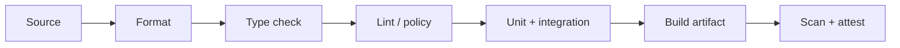

# 03 · 静态检查、制品与容器

> 一句话点题：源码通过测试不等于“可部署”；生产运行的是某个具体制品，真正的交付问题是它能否被重复构建、准确识别、验证来源并在受限环境里运行。

<div class="lesson-meta"><span>Q07—Q09</span><span>必修核心</span><span>预计 5 × 45 分钟</span><span>前置：Q01—06、SW01—06</span></div>

## 本章可观察目标

你能建立格式、lint、类型、安全和依赖检查的快速门禁；能解释版本、锁文件、哈希、SBOM 与 provenance；能构建非 root、最小、可重复、具健康信号的容器镜像，并证明同一制品从测试环境晋级到生产。

## Q07 · 静态检查把便宜错误尽早拦截

反馈越早越便宜：编辑器/提交前运行格式与类型，CI 运行完整 lint、依赖和安全检查，部署后再验证运行时事实。



格式化消除风格噪音；lint 找危险模式和一致性问题；类型检查验证静态关系；秘密扫描防止凭证入库；依赖扫描匹配已知漏洞；静态安全分析尝试发现数据流风险。它们都不能证明业务正确，误报/漏报也存在，因此规则要有 owner、理由和受控例外，而不是警告永久积压。

门禁顺序应快失败：几十秒的静态检查先于十分钟 E2E。开发本地与 CI 用同一命令和版本，避免“本地绿 CI 红”。对自动修复要审查 diff，格式器可以批量运行，安全规则不应被 AI 静默忽略。

## Q08 · 制品是发布的身份

同一 Git commit 在不同时间重新安装浮动依赖，可能得到不同结果。可重复构建需要锁文件、固定工具链/基础镜像、声明环境和尽量确定的构建步骤。

制品可以是包、二进制或容器镜像，应该有：

- 不可变版本/内容哈希（镜像 digest 比 tag 更准确）；
- 源 commit、构建时间、工具链与依赖信息；
- 测试/扫描结果；
- SBOM（包含哪些组件）；
- provenance/attestation（由什么受控流程从哪些输入构建）；
- 签名或可信发布身份。

Semantic Versioning 表达公开 API 兼容意图，不自动证明兼容。`1.2.3` 中 major/minor/patch 只有团队真的定义公开契约并执行时才有意义。内部部署更应以 commit 和 digest 追踪，避免 `latest` 到底指什么无人知道。

“build once, promote many”意味着测试、预发布和生产使用同一 digest，只改变外部配置；如果每个环境重建一次，测试通过的不是生产运行的字节。

## Q09 · 容器是进程打包与隔离边界

镜像是只读层和元数据，容器是镜像启动后的进程。它与宿主共享内核，namespace 隔离视图，cgroup 约束资源；因此容器不是安全沙箱的同义词。

一个实用 Dockerfile 原则：

```dockerfile
FROM node:24-alpine AS build
WORKDIR /app
COPY package*.json ./
RUN npm ci
COPY . .
RUN npm run build

FROM node:24-alpine AS runtime
ENV NODE_ENV=production
WORKDIR /app
COPY --from=build /app/dist ./dist
COPY --from=build /app/node_modules ./node_modules
USER node
CMD ["node", "dist/server.js"]
```

多阶段构建把编译工具留在 build 层；`.dockerignore` 避免密钥、`.git` 和大文件进入上下文；非 root 降低突破后的权限；固定基础镜像版本/最好 digest；只把运行需要内容复制进去；配置和密钥运行时注入，不烘焙进镜像。

容器必须正确处理 PID 1 信号：收到终止后停止接新请求、等待在途任务/保存检查点，并在截止前退出。健康检查要区分 liveness（是否卡死）和 readiness（是否能接流量）；把数据库短暂抖动直接变成 liveness 失败可能引发重启风暴。

## 贯穿案例：为什么“本地能跑”的镜像线上崩

AI 生成镜像在本地 root 运行，写 `/app/tmp`；生产设置只读文件系统和非 root，于是启动失败。另一个问题是镜像 tag `v1` 被覆盖，预发布和生产实际 digest 不同。修复过程：

1. 测试容器在非 root、只读 rootfs、明确 tmp volume 下运行；
2. 记录并部署 digest，不覆盖 tag；
3. CI 构建一次、扫描一次、生成 SBOM/provenance；
4. 集成测试同一 digest；
5. 晋级生产只更新部署引用和环境配置；
6. 发布记录保存 commit↔digest↔配置版本。

## 决策与权衡

| 选择 | 收益 | 代价/边界 |
|---|---|---|
| 极小基础镜像 | 攻击面/传输小 | 调试工具少，兼容性可能复杂 |
| 固定 digest | 字节确定 | 需要自动更新与漏洞响应流程 |
| 非 root＋只读 | 限制入侵影响 | 应用必须正确处理文件路径 |
| 每次重建 | 得到新补丁 | 不再是原测试制品，需重新验证 |

## 会死在哪里

- lint 警告太多被全忽略；新增问题零容忍，存量有计划偿还。
- lockfile 存在但 CI 用普通 install；强制 immutable/frozen 安装。
- tag 可变导致环境不一致；发布以 digest 识别。
- 密钥进入镜像层，后来删除仍在历史层；扫描上下文并轮换密钥。
- 容器 root/无限资源；非 root、限额、只读和最小 capability。
- readiness/liveness 混用；依赖抖动触发重启雪崩。

## 与 AI 协作模板

```text
请审查构建与制品链：
- 列出格式、类型、lint、秘密、依赖与安全检查的执行顺序/失败策略；
- 检查锁文件、工具链、基础镜像和构建输入是否确定；
- 生成最小多阶段 Dockerfile，非 root、信号处理、readiness 分离；
- 说明镜像 digest、SBOM、provenance 和签名怎样关联源 commit；
- 证明同一 digest 在集成、预发布、生产晋级，不重新构建；
- 为例外写 owner、原因、到期日，不静默关闭规则。
```

## 练习：构建一个可追溯制品

为任务 API 建镜像：用锁文件构建；记录 digest、commit 与依赖清单；以非 root、只读 rootfs、CPU/内存限制运行；发送终止信号验证优雅退出；故意把密钥放进构建上下文，确认扫描能拦截后轮换。最后从同一 digest 启动两个环境，证明字节一致、配置不同。

## 常见误区

静态检查等于测试；警告不失败就等于通过；版本号等于可追溯；tag 等于不可变；容器等于虚拟机/安全沙箱；把密钥写 ENV/Dockerfile；每环境重新 build；健康检查只返回 200 不检查接流量能力。

<Quiz question="为什么生产应部署预发布验证过的同一镜像 digest，而不是用同一源码重新构建？" :options="['为了少运行一次命令', '重新构建可能因依赖/环境变化产生不同字节，证据不再对应', 'digest 只是更短的版本号']" :answer="1" explanation="构建本身是变化来源；build once、按 digest 晋级才能让测试证据绑定生产制品。" />

## 本章小结

- 静态门禁尽早拦便宜错误，但不替代行为与运行时证据。
- 制品需要不可变身份、源与构建关联、SBOM 和 provenance。
- 锁版本是为了可重复，不等于永不升级；升级需要重新构建与验证。
- 容器是共享内核的进程隔离，仍需最小权限、资源限制和信号处理。
- 同一 digest 跨环境晋级，才能保证生产运行的是已经验证的对象。

<EvidenceTracker lesson="quality-03-build" />

## 本章完成标准

建立快失败静态门禁；产出可追溯 digest/SBOM/构建记录；镜像能在非 root、只读与限额下运行并优雅退出；证明同一制品晋级。最近平均至少 7/10。

<div class="source-note">主要来源（核验于 2026-08-31）：<a href="https://docs.docker.com/build/building/best-practices/">Docker Build Best Practices</a>、<a href="https://semver.org/">Semantic Versioning 2.0.0</a>、<a href="https://slsa.dev/spec/v1.2/">SLSA v1.2</a>。SLSA 逐级采用，不把生成文件清单冒充完整供应链保证；详见<a href="../../sources/quality">来源目录</a>。</div>
