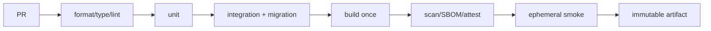

# 04 · CI/CD、迁移、发布与回滚

> 一句话点题：发布不是把代码送上服务器，而是一次受控实验——用最小爆炸半径把已验证制品交给真实流量，并在坏信号出现时停止或恢复。

<div class="lesson-meta"><span>Q10—Q11</span><span>必修核心</span><span>预计 5 × 45 分钟</span><span>前置：Q01—09、SW11</span></div>

## 本章可观察目标

你能设计快速、可诊断、最小权限的 CI；能把 schema 与代码发布拆成兼容阶段；能选择滚动、蓝绿或金丝雀策略；能定义自动停止、回滚/前滚、数据库恢复和发布证据。

## Q10 · CI 是持续合并的证据管道

CI 的目标是让小改动频繁进入共享主线，并快速告诉作者哪项承诺被破坏。



快速任务并行，昂贵任务按风险触发；缓存要按锁文件/工具链键控，不能用旧缓存掩盖依赖变化。CI 失败必须保留测试报告、日志、trace 和制品元数据。门禁对所有人一致，不能让管理员习惯性 bypass。

权限遵循最小化：普通 PR 只读仓库、不拿生产密钥；来自 fork 的代码尤其不能接触 secrets；部署使用短期身份/环境保护与审批，而不是长期云密钥。第三方 Action 固定可信版本/commit，审查其权限和供应链。

## Q11 · CD 把变更分批交给真实环境

部署与发布可以分开：代码先部署但 feature flag 关闭，随后按租户/比例开启。flag 是临时控制面，需要 owner、默认值、审计和清理日；永久 flag 会形成无法测试的组合爆炸。

| 策略 | 机制 | 优点 | 风险 |
|---|---|---|---|
| 滚动 | 分批替换实例 | 成本低、常用 | 新旧版本共存，必须兼容 |
| 蓝绿 | 两套环境切流量 | 切换/回退快 | 双倍资源、数据库仍共享 |
| 金丝雀 | 小比例真实流量验证 | 限制爆炸半径 | 指标分流与样本量要求高 |
| Feature flag | 同代码切能力 | 业务级控制 | 状态组合、清理与权限复杂 |

发布前写 success/abort 条件，例如 10 分钟窗口内错误率不高于基线 0.5 个百分点、p95 不恶化 20%、关键业务成功率不下降；指标要有足够流量，低流量需结合烟测/延长窗口。

### 数据库让“回滚”变难

代码可以切回旧镜像，数据却可能已按新格式写入。使用 expand–contract 保证新旧版本共存；破坏性变化最后做。迁移独立执行、可重复/可恢复，有锁超时和观察点。回滚前问：旧代码能读新数据吗？如果不能，优先修复前滚或使用预先设计的双写/转换，而不是仓促还原数据库快照覆盖新业务数据。

```text
兼容 schema → 部署可兼容代码 → 回填/核对 → 切读写 → 观察 → 删除旧结构
```

### 回滚不是唯一恢复手段

- 纯代码回归：回旧 digest；
- 配置错误：回配置版本；
- feature 问题：关 flag；
- 数据已变化：前滚修复/补偿/恢复特定记录；
- 外部协议破坏：恢复兼容适配并通知消费者。

恢复步骤要演练，不能只在 runbook 写“必要时回滚”。

## 贯穿案例：发布任务优先级

1. PR 先加可空 `priority` schema 和兼容读取，迁移测试从旧版本升级；
2. CI 构建镜像 digest D1，运行完整证据；
3. 先部署 D1 但 flag 关闭，确认旧行为；
4. 后台小批回填并核对 null、任务顺序与队列年龄；
5. 对内部工作区开启 5%，观察错误、p95、低优先级饥饿；
6. 逐步 25%→100%，异常立即关 flag；
7. 稳定一个窗口后加约束并删除旧兼容路径。

如果排序导致普通任务饥饿，回滚不是只切镜像：先关闭 flag恢复 FIFO，检查已排队任务顺序，再修改公平策略。

## 会死在哪里

- CI 全串行且 40 分钟：开发者减少提交/频繁 bypass；按反馈价值并行分层。
- 失败只有红叉：无日志/trace；每个 job 输出诊断制品。
- 部署用 latest：无法确认/回退；只用不可变 digest。
- 金丝雀只看 CPU：业务错误漏掉；同时看技术与业务 SLI。
- 迁移与代码同时破坏旧版本：滚动中失败；expand–contract。
- 回滚脚本从未演练：事故中权限/参数失效；定期恢复演习。

## 与 AI 协作模板

```text
请设计本次变更的交付计划：
- CI 阶段、并行关系、缓存键、失败制品和最小权限；
- 唯一 artifact digest 怎样生成、签名并跨环境晋级；
- schema/代码兼容矩阵与 expand–contract 步骤；
- 滚动/蓝绿/金丝雀选择及为什么；
- 发布 success/abort 指标、观察窗口、样本量不足时怎么办；
- 对代码、配置、flag、数据分别写恢复步骤并指出不可逆点。
```

## 练习：做一次可中止发布

给任务 API 加一个受 flag 控制的小能力。CI 构建一次并部署同一 digest；先 5% 金丝雀；故意注入 5xx 或 p95 恶化，验证流水线自动停止；关闭 flag/回旧 digest；检查在途请求和数据兼容。记录检测时间、决策时间、恢复时间和人工步骤，再把最慢环节自动化。

## 常见误区

CI 等于跑单元测试；CD 等于自动上线；管理员可随便跳门禁；每环境重建；金丝雀按实例不按用户导致状态漂移；只看基础设施指标；数据库 rollback 当普通文件恢复；feature flag 永不清理。

<Quiz question="代码已回滚，但新版本已写入旧版本无法解析的数据。下一步最合理是什么？" :options="['继续重启旧版本', '执行预先设计的兼容/前滚修复或转换，不能假设代码回滚等于数据回滚', '删除所有新数据']" :answer="1" explanation="数据演进通常不可随镜像一起逆转；恢复策略必须在发布前设计兼容与前滚路径。" />

## 本章小结

- CI 让小改动持续合并，重点是快速、可诊断、权限最小的证据。
- 构建一次、按 digest 晋级，保证生产对象与测试证据一致。
- 滚动、蓝绿、金丝雀和 flag 控制不同爆炸半径，各有成本。
- 数据库迁移要求新旧版本兼容；代码回滚不等于数据回滚。
- 发布前必须定义成功、停止和恢复条件，并在真实演练中验证。

<EvidenceTracker lesson="quality-04-delivery" />

## 本章完成标准

交付一条含诊断制品/最小权限的 CI；按不可变 digest 做一次分阶段发布；注入坏信号触发停止并完成代码/配置/数据恢复演练。最近平均至少 7/10。

<div class="source-note">主要来源（核验于 2026-08-31）：<a href="https://docs.github.com/en/actions">GitHub Actions</a>、<a href="https://sre.google/workbook/canarying-releases/">Google SRE Workbook: Canarying Releases</a>、<a href="https://martinfowler.com/bliki/BlueGreenDeployment.html">Blue-Green Deployment</a>。平台命令会变化，策略以质量属性和证据为准，详见<a href="../../sources/quality">来源目录</a>。</div>
