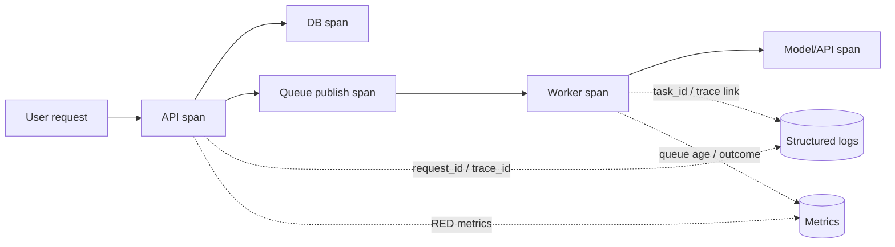

# 05 · 可观测性、SLO 与故障恢复

> 一句话点题：系统“能启动”只是开发完成；生产完成的标准是你能从外部知道用户是否受损、从内部解释为什么，并在压力下按演练过的路径恢复。

<div class="lesson-meta"><span>Q12—Q14</span><span>必修核心</span><span>预计 6 × 45 分钟</span><span>前置：Q01—11、SW07—13</span></div>

## 本章可观察目标

你能设计 logs/metrics/traces 的关联语义；能从用户旅程定义 SLI/SLO 与错误预算；能建立有 owner、阈值、runbook 的告警；能完成一次从发现、缓解、恢复到无责复盘的故障演练。

## Q12 · 遥测不是“多打日志”，而是能回答未知问题

三类信号：

- **Metrics**：聚合趋势和告警，如请求率、错误率、延迟分位、队列年龄；
- **Logs**：离散事件的上下文，如授权拒绝、状态转移、异常堆栈；
- **Traces**：一次请求跨服务/数据库/队列的因果路径和耗时。



结构化日志使用稳定字段：timestamp、level、service、environment、trace_id、request_id、tenant/task（脱敏）、event、error_code。不要把完整 Prompt、Token、密码和个人数据默认写入。高基数字段（user_id/task_id）不适合作为 metric label，会让时序数量爆炸；它们适合日志/trace。

采样会影响证据：低比例 trace 可能漏掉罕见错误；错误/慢请求可提高采样，但仍要明确隐私和成本。异步队列需要传播 trace context 或使用 span link，否则 HTTP 和 worker 会断成两段。

## Q13 · SLO 从用户结果倒推，不从监控工具倒推

SLI 是被测指标，SLO 是目标，SLA 是对外承诺/后果。任务创建可定义：

```text
有效请求中，在 500ms 内返回成功或明确业务拒绝的比例 ≥ 99.9% / 30天
成功接受的任务中，在 5分钟内进入终态的比例 ≥ 99% / 7天
跨租户错误读取 = 0（安全不变量，不用错误预算交换）
```

错误预算是允许失败量，用于平衡发布速度与可靠性。如果 30 天 SLO 99.9%，预算为 0.1% 合格事件；消耗过快就暂停高风险发布、优先可靠性。不要把所有指标都定 100%，也不要给安全/账务不变量随意设“允许错一点”。

尾延迟比平均更接近用户痛苦。平均 100ms 可能掩盖 1% 请求 10s；至少看 p50/p95/p99 和分布。分位数聚合也有技术边界，跨实例计算要使用合适 histogram/后端语义。

### 告警只在需要行动时叫人

好告警包含：影响、阈值/窗口、当前值、owner、仪表盘、runbook、最近变更。优先基于用户症状和多窗口 burn rate，避免每个 CPU 波动都叫醒人。CPU 高但用户无损可以工时处理；任务成功率骤降必须立即响应。

## Q14 · 故障恢复先止血，再解释

事故过程：检测→分级→指挥→缓解→恢复→验证→沟通→复盘。处理中不要一群人同时改系统；明确 incident commander、操作/沟通角色，记录时间线和每个动作。

缓解可包括回滚、关 flag、限流、降级、隔离坏依赖、暂停消费者。先减少用户损失，再做根因实验。每次操作要可逆且观察一个结果，避免同时改五项后无法归因。

恢复不只服务返回 200：检查数据一致性、队列积压、延迟任务、重复副作用和用户补偿。复盘不是找“谁犯错”，而是问为什么一个普通错误能穿过设计、测试、发布和监控多层防线。

## 贯穿故障：队列积压但 CPU 很低

症状：API 正常，任务完成 SLO burn rate 飙升；队列最老消息从 20s 升到 18min；worker CPU 25%。调查 trace 发现外部 API p99 由 1s 升到 25s，worker 连接都在等待。

响应顺序：

1. 宣布事件并冻结发布；
2. 对低优先任务限流/延迟，保护关键任务；
3. 降低外部调用超时并使用 fallback，注意重试不能放大；
4. 按外部配额安全扩 worker，不能只看 CPU；
5. 监控到达/完成率和最老消息年龄，确认积压开始下降；
6. 恢复后核对重复/失败任务并通知受影响用户；
7. 复盘增加依赖延迟 SLI、队列年龄告警和受控降级。

关键判断：CPU 低不代表有容量，I/O 等待和外部配额才是瓶颈。

## 会死在哪里

- 日志只有自然语言：无法聚合/关联；使用稳定事件与字段。
- metric label 放用户 ID：基数爆炸；移到日志/trace。
- SLO 从已有图表挑指标：与用户结果脱节；先写旅程和合格事件。
- 告警全是基础设施阈值：噪音使人麻木；按症状与行动设计。
- 事故中直接查根因不止血；先控制影响。
- 服务恢复就关事件：积压和数据损坏未处理；定义完整恢复清单。

## 与 AI 协作模板

```text
请为这个用户旅程设计可观测与恢复方案：
- 写 SLI 分子/分母、窗口、SLO、不可预算的不变量；
- 画同步/异步 trace，列必要日志字段和禁止记录的敏感数据；
- 选择 RED/USE、队列年龄和业务结果指标，避免高基数标签；
- 写两个基于用户影响的告警，含 owner、runbook、停止条件；
- 构造依赖慢/数据库满/队列积压事故，按检测→缓解→验证→复盘列步骤；
- 明确恢复后数据核对与用户补偿。
```

## 练习：从黑盒到可恢复

给任务 API/worker 加 trace 与结构化日志；定义创建/完成两个 SLO；用故障代理让外部依赖延迟 5 秒，观察 p99、队列年龄和 burn rate；触发告警，按 runbook 限流/降级；恢复后清理积压并做 30 分钟复盘。统计 MTTD、MTTM（缓解）和恢复总时间，找一项最值得自动化的步骤。

## 常见误区

日志越多越可观测；所有请求永久全量 trace；平均延迟代表体验；SLO 等于 SLA；100% 才专业；CPU 高就告警；告警没有 owner/runbook；事故中多人同时操作；复盘写“加强责任心”。

<Quiz question="任务队列持续积压、worker CPU 只有 25%，最合理的第一判断是什么？" :options="['CPU 低说明系统健康', '可能在等待外部 I/O/配额，应看在途、依赖延迟和到达/完成率', '立刻把 CPU limit 降低']" :answer="1" explanation="I/O 密集系统可在 CPU 很低时完全饱和；队列与依赖信号更接近实际瓶颈。" />

## 本章小结

- metrics 看趋势，logs 给上下文，traces 给跨组件因果，三者用共同标识关联。
- SLO 从用户结果定义分子/分母和窗口，错误预算连接可靠性与发布决策。
- 告警应代表需要行动的用户影响，而不是所有资源波动。
- 事故先止血、再恢复、再解释；操作要单一、可逆、可观察。
- 恢复包含数据、积压、重复副作用和用户影响，不止 HTTP 200。

<EvidenceTracker lesson="quality-05-operations" />

## 本章完成标准

为一个真实旅程实现跨同步/异步 trace、结构化日志和 SLI/SLO；注入故障触发可行动告警并完成止血、恢复、核对和复盘。最近平均至少 7/10。

<div class="source-note">主要来源（核验于 2026-08-31）：<a href="https://opentelemetry.io/docs/">OpenTelemetry</a>、<a href="https://sre.google/sre-book/table-of-contents/">Google SRE Book</a>、<a href="https://sre.google/workbook/table-of-contents/">Google SRE Workbook</a>。遥测字段需按隐私和成本裁剪，详见<a href="../../sources/quality">来源目录</a>。</div>
