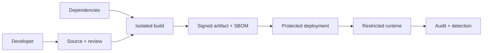

# 06 · 安全供应链与生产验收

> 一句话点题：上线许可不是“CI 全绿”的情绪，而是一组关于身份、依赖、数据、恢复、观测和责任边界的证据；安全也不是最后一台扫描器能补出来的。

<div class="lesson-meta"><span>Q15—Q16</span><span>必修核心</span><span>预计 5 × 45 分钟</span><span>前置：Q01—14、SW14—16</span></div>

## 本章可观察目标

你能为源码、依赖、构建和部署建立最小供应链控制；能做资产/信任边界驱动的威胁建模；能用生产就绪评审证明 owner、SLO、容量、降级、备份恢复、runbook 和安全响应已经可用。

## Q15 · 安全从数据流和供应链两端进入

应用威胁模型先问：保护什么资产、谁会攻击、从哪里进入、最坏影响、已有控制、残余风险。对任务 Agent：凭证、租户数据、工具执行权限和审计记录都是资产；入口不仅是 HTTP，还包括模型输出、上传文档、消息队列、CI 依赖和管理员后台。



供应链防线：分支保护和审查；依赖锁定/自动更新；最小权限 CI；隔离构建；秘密不进入仓库；生成 SBOM/provenance；制品签名与部署验证；运行时最小权限；漏洞发现后的可定位与更新流程。

漏洞扫描结果要结合可达性、暴露面和影响排序，不能只按 CVSS 数字机械阻塞，也不能因为“开发依赖”就全忽略。例外必须有 owner、补偿控制、到期日和复审。

### 常见 Web/服务风险落到边界

- 输入不是只有用户表单：模型输出、文件、Webhook 都不可信；
- 输出到 HTML/SQL/shell/工具参数时按目标上下文编码或参数化；
- SSRF 通过服务端访问内网/云元数据，需要 URL allowlist、网络出口与解析后 IP 检查；
- 权限必须资源级、租户级，敏感操作二次确认/审批；
- 错误与日志不泄漏密钥、内部路径和个人数据；
- 密钥短期化、轮换、分环境，不由模型读取不必要的凭证。

## Q16 · 生产就绪评审回答“出事时谁做什么”

上线清单不能只检查功能：

| 领域 | 必须有的证据 |
|---|---|
| Ownership | 服务 owner、值班/联系人、依赖 owner |
| Reliability | SLI/SLO、容量基线、过载与降级策略 |
| Observability | 仪表盘、可行动告警、trace/log 关联 |
| Delivery | 不可变制品、分阶段发布、停止/恢复步骤 |
| Data | 迁移、备份、恢复实测、保留/删除策略 |
| Security | 威胁模型、最小权限、秘密/依赖/审计 |
| Operations | runbook、常见故障、手工操作审计 |
| Product | 关键旅程、支持/沟通、数据修复与补偿 |

备份成功日志不等于能恢复。必须在隔离环境恢复，验证数据时间点、完整性、权限和应用能否启动。RPO 表示可接受丢失多近的数据，RTO 表示多快恢复服务；两者来自业务损失，不是云服务默认值。

生产验收也是边界声明：当前支持多少吞吐/数据量/租户；依赖故障时降级什么；哪些手工步骤仍存在；已接受哪些风险；什么信号触发扩容或重新评审。

## 贯穿案例：知识型任务 Agent 上线前评审

Agent 能读取文档并调用“发送通知”工具。评审发现：

1. 上传文档可能含 Prompt Injection，检索内容不能提升为系统指令；
2. 工具令牌拥有全租户发送权限，需按用户/租户收缩并对批量发送审批；
3. trace 记录完整文档段落，需脱敏/采样/保留期限；
4. 队列备份了，但从未恢复，RTO/RPO 只是猜测；
5. 模型供应商不可用时没有降级，任务无限重试；
6. CI 使用长期云密钥，第三方 Action 未固定 commit。

这时不应因“功能测试全绿”上线。最小修复：工具网关做资源级授权和幂等；高风险动作审批；检索内容标记不可信；短期部署身份；恢复演练；有限重试和暂停队列；定义模型依赖 SLO/降级。

## 上线决策不是二元情绪

可以是：批准；带条件批准（低风险、明确 owner/期限）；限制流量/租户；只读/无副作用模式；延期。决定要写证据和残余风险。阻塞项应聚焦不可接受用户损失，不让清单变成官僚仪式。

## 会死在哪里

- 扫描器绿就宣称安全；威胁模型和权限边界仍缺失。
- 依赖漏洞例外永久存在；设到期/补偿/owner。
- SBOM 生成但漏洞时找不到部署实例；建立制品—环境清单。
- 备份从未恢复；定期隔离恢复并计时。
- runbook 只有作者能执行；让不熟悉者演练。
- Agent 工具使用管理员 token；按主体/动作/资源下放最小凭证。
- 上线评审只列 Yes/No，不附链接证据和残余风险。

## 与 AI 协作模板

```text
请对上线候选做安全与生产就绪评审：
1. 画资产、数据流、信任边界和攻击入口（含 CI、模型输出、文件、Webhook）；
2. 检查身份、资源/租户授权、秘密、输出上下文、网络出口和审计；
3. 追踪 source→dependency→build→artifact→deploy 的身份、SBOM/provenance 和权限；
4. 按 owner、SLO、容量、观测、发布、数据恢复、runbook、用户补偿核对证据链接；
5. 为阻塞/条件批准/接受风险分别说明影响、owner、到期和复审信号；
6. 不得用“遵循最佳实践”替代可执行验证。
```

## 练习：主持一次生产就绪演练

选一个可部署服务：画威胁模型；生成并定位 SBOM；轮换一个测试密钥；从备份恢复到隔离环境并测 RPO/RTO；让不熟悉项目的人按 runbook 处理依赖故障；完成评审表，所有结论链接到 commit、测试、仪表盘或演练记录。至少保留一个被接受风险并写清为什么现在接受、何时必须解决。

## 常见误区

安全等于扫描；内网等于可信；管理员 token 最省事；备份等于恢复；SLO/RTO/RPO 抄行业数字；runbook 写完不演练；所有清单项同等重要；风险接受不留 owner/期限；功能完成即生产完成。

<Quiz question="数据库每天显示备份成功，是否足以证明灾难时可恢复？" :options="['足够，日志显示 success', '不够，必须在隔离环境恢复并验证时间点、完整性、权限和应用可用', '只要文件存在就够']" :answer="1" explanation="备份链可能损坏、缺密钥或不兼容；只有恢复演练能证明恢复能力。" />

## 本章小结

- 安全覆盖源码、依赖、构建、制品、部署和运行时，不是单点扫描。
- 威胁模型从资产、入口、信任边界和业务影响出发。
- 生产就绪需要 owner、SLO、容量、观测、恢复、数据与安全证据。
- 备份必须通过隔离恢复证明，RPO/RTO 由业务损失定义。
- 上线可以限制流量或带条件批准，但残余风险必须有 owner、期限和触发器。

<EvidenceTracker lesson="quality-06-production" />

## 本章完成标准

交付一份含供应链的数据流/威胁模型；能从 SBOM 定位部署制品；完成计时恢复和陌生人 runbook 演练；用证据主持一次生产就绪决策。最近平均至少 7/10。

<div class="source-note">主要来源（核验于 2026-08-31）：<a href="https://slsa.dev/spec/v1.2/">SLSA v1.2</a>、<a href="https://owasp.org/www-project-web-security-testing-guide/">OWASP WSTG</a>、<a href="https://csrc.nist.gov/pubs/sp/800/218/final">NIST SSDF 1.1</a>、<a href="https://sre.google/sre-book/table-of-contents/">Google SRE Book</a>。控制应按风险和组织规模裁剪，详见<a href="../../sources/quality">来源目录</a>。</div>
