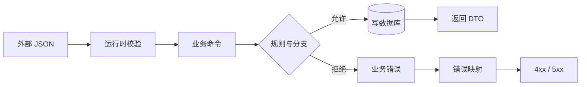

# 01 · 程序、类型、模块与 Git

> 一句话点题：AI 能在几秒内生成几百行代码，但如果你不能沿执行路径回答“输入去了哪里、状态在哪改变、失败怎样传播”，你就只能用“看起来没问题”验收它。

<div class="lesson-meta"><span>SW01—SW03</span><span>必修核心</span><span>预计 4 × 45 分钟</span><span>前置：无</span></div>

## 本章可观察目标

学完后，你能不运行程序先画出一段业务代码的主要执行路径；能区分静态类型、运行时 Schema 和业务不变量；能用模块边界与 Git diff 把 AI 的一次大改动收缩成可审查的小改动。

## 先建立整张图：代码不是文字，是运行中的因果链

以“创建任务”为例，用户提交 JSON 后，程序不会神奇地“创建任务”，而是经过一系列可观察动作：



读代码时永远先追四件事：**数据从哪来、控制流往哪走、状态在哪里改变、错误由谁接住**。变量名和语法只是表面，真正决定系统行为的是这条因果链。

## SW01 · 从输入追到副作用

先看一个库存预留函数：

```ts
type ReserveResult = { remaining: number };

function reserve(stock: number, count: number): ReserveResult {
  if (!Number.isInteger(count) || count <= 0) {
    throw new InvalidCount(count);
  }
  if (stock < count) throw new OutOfStock(stock, count);
  return { remaining: stock - count };
}
```

只说“它扣减库存”远远不够。完整解释至少包括：输入允许哪些值；两个分支怎样被触发；函数没有直接写数据库，因此返回值是否落库由调用者负责；异常会沿调用栈向上传播，直到被某层捕获；若调用者捕获后仍提交了其他写入，会不会留下半成品。

### 调用栈、堆与副作用

函数调用时，运行时需要记住局部变量、返回位置和异常路径，这形成调用栈。对象、集合等生命周期更灵活的数据通常位于堆上。初学阶段不必背内存布局，但要知道：局部变量的名字消失，不代表它引用的对象立刻消失；多个模块可能持有同一可变对象，修改它会产生“远处也变了”的效果。

副作用是函数之外可被观察的改变，例如写数据库、改文件、发网络请求、发送消息、更新全局变量。副作用不是坏事，业务系统离不开它；危险的是副作用被藏在名字无害的函数里：`formatOrder()` 内部偷偷发通知，会让测试、重试和回滚都变得困难。

### 异步不等于另一种语法

`await` 表示当前任务在等待外部结果时把执行机会让出。等待期间，别的请求可能改变共享状态。因此“先读库存，再 await 支付，再写库存”并不是一个原子动作。只要中间让出执行权，就要重新问：状态会不会过期、操作能否取消、超时后远端是否仍然成功。

```text
请求 A：读到库存 1 ──等待支付──────── 写成 0
请求 B：      读到库存 1 ──等待支付── 写成 0
结果：两个请求都认为自己成功，超卖 1 件
```

这不是“异步有 bug”，而是跨越了一个会变化的状态边界。正确性通常要靠数据库条件更新、事务或唯一约束，而不是把代码写得更像同步。

## SW02 · 类型、Schema 与业务不变量是三道不同的门

| 层次 | 它能拦住什么 | 它拦不住什么 |
|---|---|---|
| 静态类型 | 代码内部明显的字段/参数错配 | 网络 JSON、数据库脏数据、业务规则 |
| 运行时 Schema | 字段缺失、类型、格式、范围 | “这个用户能否取消该任务”等上下文规则 |
| 业务不变量 | 状态与权限必须永远成立的约束 | 外部系统最终是否成功、所有并发时序 |

TypeScript 的 `CreateTaskInput` 不会随 HTTP 请求传到服务器。攻击者、旧客户端或模型输出都可以发送任意 JSON，所以边界必须重新校验。`null`、字段缺失和空字符串也不能随意互换：它们可能分别表示“明确清空”“没有修改”“值为空”。

```ts
type TaskStatus = "pending" | "running" | "succeeded" | "failed";

// 形状正确仍不代表业务正确：running 任务不能再次 start。
function start(task: Task) {
  if (task.status !== "pending") throw new InvalidTransition();
}
```

单位也属于契约。`timeout: number` 是毫秒还是秒？金额是浮点元还是整数分？时间是本地时间还是 UTC？很多 AI 生成代码在“类型正确”的情况下仍会把这些语义弄错。更稳的做法是用命名、封装和 Schema 把单位写进系统，例如 `timeoutMs`、`amountCents`、带时区的 ISO 8601。

契约还需要版本意识。新增可选字段通常兼容旧客户端；删除字段、改变枚举或把可选变必填可能破坏它们。对外边界要把“怎样演进”写进测试，而不是等线上报错才发现有人依赖旧形状。

## SW03 · 模块边界决定改动会不会扩散

模块的目标不是把文件放进不同文件夹，而是把**共同变化的规则放在一起**，并让依赖方向可解释：

```text
HTTP 适配器 ─┐
CLI 适配器  ─┼──▶ 应用用例 ──▶ 业务规则
定时任务    ─┘         │
                       └──▶ 仓储接口 ◀── PostgreSQL 适配器
```

业务层定义“我需要保存任务”的接口，数据库适配器实现它。这样更换数据库不会迫使业务规则跟着改。反过来让业务层直接导入 ORM、HTTP SDK 和模型供应商，短期省几个文件，长期会让任何外部变化穿透全系统。

判断模块边界可以问三组问题：

1. **变化原因**：价格规则和数据库连接配置会因同一个原因变化吗？不会，就不该绑在一起；
2. **公开表面**：外部真的需要访问所有内部函数吗？只暴露稳定能力；
3. **依赖方向**：核心规则是否知道外部框架？如果知道，测试与替换成本会上升。

### Git 是审查与恢复工具，不是云盘

一次好提交应只有一个可解释目的，包含对应测试，并能独立回退。AI 工作流尤其要坚持：改动前列出允许修改的文件；改动后先看 `git diff --stat` 判断范围，再读 `git diff` 逐段审查；不要只看 AI 的总结。

```bash
git status --short
git diff --stat
git diff
git diff --check
```

如果“增加任务优先级”同时重写目录、升级依赖、格式化全仓库和修改部署脚本，就算测试通过也难以审查。先拆出纯重命名/机械改动，再提交行为变化，才能看清真正的风险。

## 贯穿案例：审查 AI 增加“取消任务”

假设 AI 一次生成了取消接口。不要先问代码优不优雅，按顺序核对：

1. 输入是否在边界验证 `taskId` 与当前租户；
2. `pending → cancelled` 允许，`succeeded → cancelled` 是否拒绝；
3. API 写状态后，正在运行的 worker 是否能收到取消信号；
4. 用户重试取消请求时是否幂等；
5. 数据库写成功、通知失败会不会把接口报成失败，诱导用户重复操作；
6. diff 是否只修改取消能力相关模块；
7. 是否包含正常、非法状态、越权、重复请求和并发完成五类测试。

这个清单把“审代码”从审美变成了行为证据。

## 会死在哪里：四种生产失败

- **静态类型制造安全幻觉**：直接把请求体断言成类型，非法枚举进入数据库；边界加运行时 Schema。
- **共享可变对象泄漏**：缓存返回对象被调用者修改，后续请求读到污染状态；返回不可变值或复制。
- **异常被统一吞掉**：所有错误都变成 500，客户端无法区分重试与修正输入；建立错误分类和映射。
- **AI 改动范围失控**：功能改动夹杂升级/格式化，回归时无法定位；限定文件、分提交、用 diff 审查。

## 与 AI 协作：把解释任务写成可验收规格

```text
请不要直接修改代码。先对这个功能做执行路径审计：
1. 从外部输入开始，列出调用链、分支、await 点和所有副作用；
2. 区分静态类型、运行时校验和业务不变量；
3. 列出异常类型、捕获位置、最终 HTTP 映射与可否重试；
4. 标出跨模块依赖和建议修改的最小文件集合；
5. 给出正常、边界、并发、重复请求和越权测试。
任何不确定结论标为“待验证”，并指出验证命令或文件位置。
```

## 练习：做一次 90 分钟的代码考古

选择项目中一个写操作（创建、取消、付款均可）：

1. 画出输入到持久化的调用图，标出每个 `await` 和副作用；
2. 写一张契约表：字段、类型、单位、可空语义、运行时规则；
3. 写出至少两个必须永远成立的不变量；
4. 查看一次相关 Git 提交，把行为变化与机械变化分开；
5. 制造一个非法输入和一个重复请求，观察错误怎样传播；
6. 产出一份不超过一页的审查记录，并让 AI 找遗漏，你再逐项验证。

## 常见误区

把能编译当成正确；把文件夹数量当成模块化；为了“复用”建立没有业务含义的 `utils`；在工具函数里偷偷访问数据库；把异常全部捕获后返回 `null`；让 AI 修改几十个文件后只阅读摘要；把一次大提交当成效率高。

<Quiz question="一个 HTTP 请求体已经有 TypeScript 类型，服务端还需要运行时验证吗？" :options="['不需要，类型会随请求传输', '需要，外部 JSON 在运行时不受 TypeScript 保证', '只有生产环境需要']" :answer="1" explanation="静态类型只约束编译期代码；来自网络、文件、数据库或模型的值必须在边界重新验证。" />

## 本章小结

- 程序是输入、分支、调用、副作用和错误组成的执行链；读代码先追因果，不先看语法风格。
- 类型、运行时 Schema、业务不变量分别守不同的门，不能互相替代。
- `await` 让共享状态有机会变化；跨等待点的正确性需要并发与持久化约束。
- 模块把共同变化放在一起，核心规则应依赖抽象而不是外部框架细节。
- Git diff、原子提交和可回退历史，是 AI 生成大量代码后仍能保持判断力的基础设施。

<EvidenceTracker lesson="software-01-programming" />

## 本章完成标准

不看正文解释一个真实写操作的完整执行链；为其写出运行时 Schema 与两个业务不变量；用 diff 说明一次提交改了什么、没改什么、怎样验证和怎样回退。解释、应用、迁移题最近三次平均至少 7/10，才记为基本掌握。

<div class="source-note">主要来源（核验于 2026-08-31）：<a href="https://www.typescriptlang.org/docs/handbook/intro.html">TypeScript Handbook</a>、<a href="https://git-scm.com/book/en/v2">Pro Git</a>、<a href="https://martinfowler.com/articles/injection.html">Dependency Injection（Martin Fowler）</a>。语言示例用于解释机制，不把 TypeScript 当作唯一实现。版本与边界见<a href="../../sources/software">来源目录</a>。</div>
