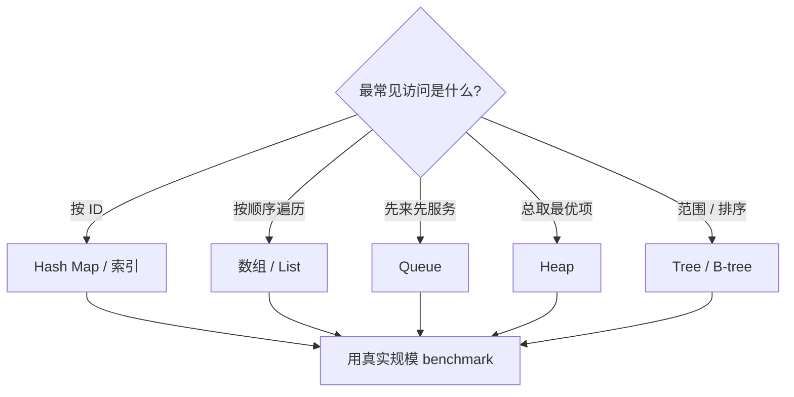

# 02 · 数据结构、操作系统与并发

> 一句话点题：很多“代码逻辑没错但系统会卡死”的问题，发生在语言看不见的下一层——数据怎样被组织、程序怎样占用资源、多个任务怎样争用同一状态。

<div class="lesson-meta"><span>SW04—SW06</span><span>必修核心</span><span>预计 5 × 45 分钟</span><span>前置：SW01</span></div>

## 本章可观察目标

你能根据访问模式选择列表、映射、队列或堆；能解释进程、线程、内存、文件描述符与事件循环的关系；能识别竞态、死锁、饥饿和无界并发，并为任务运行器设计有上限、可取消、可恢复的并发模型。

## SW04 · 数据结构不是面试题，是访问模式的价格表

同一批数据，用不同结构组织，操作成本完全不同：

| 结构 | 擅长 | 典型代价 | 任务系统用途 |
|---|---|---|---|
| 数组/列表 | 顺序遍历、按位置访问 | 中间插入/删除可能搬移 | 展示任务页、批处理 |
| 哈希映射 | 按唯一键近似常数查找 | 内存开销、无天然顺序 | `taskId → Task` 缓存 |
| 集合 | 去重、成员判断 | 不保存重复/业务顺序 | 已处理幂等键 |
| 队列 | 先进先出、削峰 | 头部阻塞、积压 | 待执行任务 |
| 堆/优先队列 | 快速取最高/最低优先级 | 任意查找不快 | 定时/高优任务调度 |
| 树/索引 | 有序范围与层级 | 更新和维护成本 | 数据库 B-tree、目录 |

复杂度 `O(n)` 描述输入增大时的增长趋势，不等于实际毫秒。遍历 100 个内存对象可能比一次网络查找快得多；哈希表理论上快，却可能因内存布局和缓存局部性输给小数组。正确方法是先用复杂度排除会爆炸的方案，再用真实数据基准验证常数与资源。

### 一个可量化例子

假设调度器每秒要从 100,000 个等待任务中找最早到期项。每次完整排序大约是 `O(n log n)`，而维护最小堆的插入/弹出是 `O(log n)`。但如果队列永远只有 20 个任务，先引入复杂堆结构没有价值。**规模和访问模式先于名称。**



## SW05 · 操作系统在替你管理四种稀缺资源

程序不是飘在代码编辑器里。运行后，它成为进程：拥有虚拟地址空间、文件描述符、线程和由内核调度的执行时间。

- **CPU 时间**：线程只有被调度到核心上才真正执行；CPU 密集任务会与其他任务争用时间片。
- **内存**：虚拟内存让每个进程感觉自己有连续空间；常用页面在 RAM，不活跃页面可能被换出。内存泄漏最终触发频繁回收或 OOM。
- **I/O**：文件、网络 socket、管道通常通过文件描述符访问；描述符不关闭会耗尽进程上限。
- **持久化**：写入用户态缓冲不等于数据已安全落盘；崩溃一致性要考虑 flush、原子替换和数据库 WAL。

```text
应用代码
  ├─ CPU 计算 ─────────────▶ 线程由调度器分配时间片
  ├─ 分配对象 ─────────────▶ 虚拟内存 → 物理页 / swap
  ├─ await 网络/文件 ───────▶ 系统调用 → 驱动/网络栈
  └─ 写数据库 ─────────────▶ 缓冲 → WAL/数据页 → 持久介质
```

进程提供故障与权限隔离，线程共享同一进程内存。进程崩溃通常不会直接破坏另一个进程的地址空间；线程之间通信便宜，却也更容易因共享可变状态产生竞态。容器仍然是宿主机上的进程集合，使用命名空间和 cgroup 做隔离与资源约束，不是更轻的虚拟机魔法。

### 事件循环为什么能处理很多连接

网络服务多数时间在等待数据库或远端响应。若每个连接都占一个阻塞线程，大量线程会带来内存和上下文切换成本。事件循环把“等待 I/O”的任务登记给操作系统，完成后再恢复对应协程。因此它适合 I/O 密集工作；若在事件循环里做 500ms 的 CPU 计算，所有其他请求都会被堵住。CPU 密集任务要分块、交给工作线程/进程或独立 worker。

## SW06 · 并发的核心是交错，不是“同时”

并发表示多个任务的执行区间重叠；并行表示它们真的在多个核心同时执行。即使单线程事件循环也有并发：每次 `await` 都可能让另一个任务推进，形成不可预测的交错。

### 竞态：结果取决于时序

```text
初始 count = 0
A 读取 0          B 读取 0
A 计算 1          B 计算 1
A 写入 1          B 写入 1
期望 2，实际 1
```

解决竞态不是“到处加锁”。先缩小共享状态，再选约束：

1. 单进程内的小临界区可用 mutex；
2. 数据库事实优先用条件更新、唯一约束或事务；
3. 可交换/可合并的数据可用原子计数或 CRDT 思路；
4. 长任务用消息和状态机，把共享写入串行化；
5. 锁覆盖网络调用会放大等待，尽量让临界区只包含必要内存操作。

两个锁以不同顺序获取会死锁；某类任务总抢不到资源是饥饿；不断重试但没有进展是活锁。统一锁顺序、超时/取消、有限重试和公平队列是常见防线。

### 无界并发会把“快”变成雪崩

一次性 `Promise.all` 10,000 个数据库请求不会让数据库快 10,000 倍，只会耗尽连接池、内存和下游配额。并发需要预算：worker 数、连接池、队列长度、每租户配额、超时和取消信号必须协调。

用 Little 定律建立直觉：系统中平均在途数量约等于吞吐率乘平均停留时间。若每秒进入 100 个任务，平均执行 5 秒，稳定状态约有 500 个任务在途。只配置 20 个并发槽并不自动错误，但队列会积压；若入口继续无限接收，等待时间和内存会不断上涨。

## 贯穿案例：设计一个不会自我压垮的 worker

任务运行器的数据库最多稳定支持 40 个并发查询，外部 API 允许每秒 20 次。一个合理的初版不是“worker 越多越好”，而是：

```text
入口限流 30 req/s
    ↓
有界队列 1,000（满则 429 / 延迟接收）
    ↓
20 个 worker 槽
    ├─ DB semaphore: 30
    ├─ External API token bucket: 20/s
    └─ 每任务 timeout + cancellation
```

若任务平均 2 秒，20 个槽理论上只能提供约 10 task/s 的完成能力。入口长期 30/s 必然积压，这不是通过调大队列能解决的；要么增加执行能力、降低任务时间，要么在入口削减/延迟需求。队列只是把压力从“立即失败”换成“延迟等待”。

## 决策与权衡

| 决策 | 买到什么 | 付出什么 | 何时选 |
|---|---|---|---|
| 单线程事件循环 | I/O 并发简单、共享竞态少 | CPU 工作会阻塞全局 | 大量短 I/O |
| 多线程 | 共享内存通信快 | 竞态、锁、调试复杂 | 可控 CPU/阻塞库 |
| 多进程/worker | 故障与内存隔离 | IPC、部署与状态协调 | CPU 密集或任务隔离 |
| 队列串行化 | 顺序与削峰 | 延迟、积压、重复投递 | 长任务/外部副作用 |

## 会死在哪里

- 队列无限增长：观察队列深度、最老任务年龄和到达/完成率，不只看 CPU。
- 连接池耗尽：请求都在等连接，扩容应用反而增加争用；先看等待时间。
- CPU 工作堵塞事件循环：延迟整体台阶式上升；移出事件循环并限制并行度。
- 锁跨越网络：慢下游让所有持锁请求串行；缩短临界区或改变状态模型。
- 取消只停前端：用户点取消后 worker 仍写结果；让取消成为可持久化状态并在安全点检查。

## 与 AI 协作模板

```text
请审查这个 worker 的资源与并发模型，不要只看业务逻辑：
- 列出 CPU、内存、文件描述符、数据库连接、外部 API 配额；
- 标出所有并发入口、共享状态、await 点、锁和无界集合；
- 用到达率、平均处理时间估算在途量与稳定吞吐；
- 构造竞态、队列满、连接池耗尽、取消与进程崩溃测试；
- 提议最小修复，并说明它把压力转移到了哪里。
```

## 练习：从失控并发改成有界系统

实现一个同时执行 1,000 个模拟任务的程序。第一版直接全部并发，记录峰值内存、完成时间和错误；第二版限制 10/20/50 个并发槽；第三版加入有界队列、超时和取消。画出并发度—吞吐—p95—错误率曲线，并解释拐点。再制造一个共享计数竞态，用数据库条件更新或单 writer 修复，而不是只加任意 sleep。

## 常见误区

背复杂度却不看数据规模；把缓存当成永远更快；把异步等同并行；认为单线程没有竞态；把增加 worker 当万能扩容；用无限队列隐藏过载；锁住整个请求；只测试最终结果，不控制并发交错。

<Quiz question="数据库最多稳定处理 40 个并发查询，把应用副本从 2 扩到 20 且每副本连接池仍为 20，最可能发生什么？" :options="['吞吐稳定提升 10 倍', '总连接争用放大，延迟和错误可能更差', '数据库会自动忽略多余连接']" :answer="1" explanation="扩应用同时把潜在连接从 40 放大到 400，瓶颈没有消失，只是更多请求一起争用数据库。" />

## 本章小结

- 数据结构是访问模式的价格表，复杂度用于看增长，benchmark 用于验证真实常数。
- 操作系统管理 CPU、内存、I/O 和持久化；容器仍建立在进程、namespace 与 cgroup 上。
- 并发难在执行交错和资源预算；异步并不取消共享状态问题。
- 队列能削峰但不能创造吞吐；长期到达率高于完成率，积压必然增长。
- 有界并发、背压、超时、取消与持久化状态共同决定 worker 是否可控。

<EvidenceTracker lesson="software-02-runtime" />

## 本章完成标准

为一个真实任务解释其数据结构选择和资源路径；重现并修复一次竞态；用负载实验找出稳定并发上限，并说清瓶颈转移。三项证据最近平均至少 7/10。

<div class="source-note">主要来源（核验于 2026-08-31）：<a href="https://pages.cs.wisc.edu/~remzi/OSTEP/">OSTEP</a>、<a href="https://docs.python.org/3/library/asyncio.html">Python asyncio</a>、<a href="https://nodejs.org/en/learn/asynchronous-work/event-loop-timers-and-nexttick">Node.js Event Loop</a>。具体运行时行为以所用语言当前文档为准，机制边界见<a href="../../sources/software">来源目录</a>。</div>
