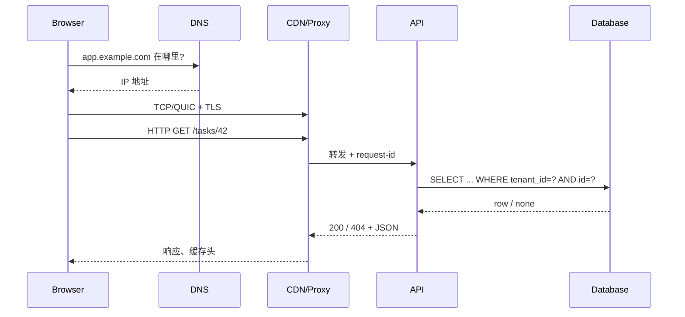

# 03 · 网络、浏览器与 API

> 一句话点题：一次“点按钮没反应”可能坏在 DNS、连接、TLS、代理、缓存、跨域、服务端契约或客户端状态；只有看见整条请求路径，才能停止盲猜。

<div class="lesson-meta"><span>SW07—SW09</span><span>必修核心</span><span>预计 5 × 45 分钟</span><span>前置：SW01、SW05</span></div>

## 本章可观察目标

你能按层定位一次 Web 请求；能解释浏览器同源、Cookie、CORS 和缓存的安全边界；能设计含方法、状态码、幂等、分页、错误和版本策略的 API 契约，并用 trace/request ID 串起客户端与服务端证据。

## SW07 · 一次请求穿过了哪些层

在浏览器输入 `https://app.example.com/tasks/42`，至少发生：



DNS 把名字解析为地址；传输层建立可靠字节流或 QUIC 连接；TLS 验证服务身份并加密；HTTP 定义请求/响应语义；代理可能终止 TLS、缓存、限流或路由；应用再访问数据库。不同层的超时和重试会叠加，因此 2 秒的前端超时并不意味着后端 2 秒后停止。

### TCP 可靠，不等于业务操作只执行一次

TCP 保证一个连接内字节有序重传，但连接断开后，客户端不知道服务端是否已经完成写入。用户点击“创建任务”，服务端写库成功，响应却丢失；客户端重试会再次创建。网络层的可靠传输无法替代业务幂等键。

HTTP 方法表达意图：GET/HEAD 应安全且不改变业务状态；PUT/DELETE 按语义应幂等；POST 不天然幂等，但可通过 `Idempotency-Key` 和服务端唯一约束实现效果幂等。不能只依赖前端禁用按钮，因为请求可以来自脚本、重试代理或恶意客户端。

### 超时要有预算，不要层层拍脑袋

若用户总预算 2 秒，可以拆成 DNS/连接 200ms、代理 100ms、应用 1.4s、余量 300ms。数据库查询又要在应用截止时间之前取消。若外层 1 秒、内层默认 30 秒，外层早已返回失败，内层仍占资源；大量“幽灵工作”会制造雪崩。

## SW08 · 浏览器既是运行时，也是安全边界

浏览器解析 HTML 构建 DOM，执行 JavaScript，计算样式和布局，再绘制页面。长时间 JavaScript 会阻塞主线程，造成输入无响应；网络很快也不能保证交互快。

“同源”由协议、主机和端口共同决定。页面不能随意读取其他源响应，是为了防止恶意网站带着你的登录状态窃取银行/邮箱数据。CORS 不是服务端访问控制，而是服务器通过响应头告诉浏览器哪些跨源页面可读取响应；curl/Postman 不受浏览器 CORS 限制，所以后端仍必须做身份与权限校验。

| 机制 | 解决什么 | 常见误解 |
|---|---|---|
| Cookie `HttpOnly` | 降低脚本读取会话的风险 | 不能阻止 CSRF 自动携带 Cookie |
| `SameSite` | 限制跨站请求携带 Cookie | 不是所有跨域场景都自动安全 |
| CORS | 控制浏览器跨源读取 | 不是认证，也挡不住非浏览器客户端 |
| CSP | 限制脚本/资源来源 | 不能替代输出编码与依赖治理 |
| Cache-Control | 定义缓存与复用 | 私有数据误设 public 会泄漏 |

缓存存在浏览器、Service Worker、CDN、反向代理和应用层。排查“为什么还是旧数据”要看响应头、缓存键和失效策略。带用户身份的响应必须确保缓存按身份隔离，或明确设为 private/no-store。

## SW09 · API 是跨团队、跨时间的合同

一个可用 API 不只列字段，还要定义：

- 资源和动作的业务语义；
- 方法、路径、认证和权限；
- 请求/响应 Schema、单位、可空含义；
- 正常与错误状态码；
- 幂等、重试和并发更新策略；
- 排序、过滤、分页与一致性；
- 版本、弃用和兼容窗口；
- 限流、超时与观测字段。

### 错误必须让调用者知道下一步

`400` 输入形状/语义错误，修正后再试；`401` 未认证；`403` 已认证但无权；`404` 不存在或为防泄漏隐藏存在性；`409` 当前状态冲突；`422` 可用于语义验证失败；`429` 过载/配额，通常配合 `Retry-After`；`500/503` 表示服务端或依赖故障。团队可以选择细节，但必须一致。

```json
{
  "error": {
    "code": "INVALID_TRANSITION",
    "message": "running task cannot return to pending",
    "requestId": "req_01...",
    "retryable": false,
    "details": { "current": "running", "requested": "pending" }
  }
}
```

机器稳定处理 `code`，人用 `message/requestId` 定位；不要让客户端解析自然语言判断逻辑。

### 分页不是加两个参数

Offset 分页容易理解，但数据持续插入/删除时会重复或漏项，深页也可能慢。Cursor 分页把稳定排序键编码为游标，更适合不断变化的大列表；代价是不能随意跳页，排序策略要稳定。无论哪种，必须定义确定顺序，例如 `(created_at DESC, id DESC)`，只按可能重复的时间会产生不稳定结果。

### 并发更新

两个用户同时编辑同一任务，最后写入者覆盖前者可能丢数据。可使用版本号/ETag：客户端读取 `version=7`，更新时要求仍为 7；若已变 8，返回 409/412，让用户合并或重试。不要用“最后保存时间”作粗糙并发锁，时钟和精度都可能出错。

## 贯穿案例：取消请求为什么显示失败但任务已取消

示例链路：API 在 300ms 内将任务写成 cancelled；向 worker 发布消息耗时 1.8s；代理总超时 1s，于是返回 504。用户看到失败再次点击，服务端又发一次取消消息。定位顺序：

1. 浏览器 Network 面板确认请求、状态与总耗时；
2. 用响应 `requestId` 查代理与服务日志；
3. 查数据库状态与提交时间，证明写入已成功；
4. 查消息发布 span，发现外部等待跨过代理截止时间；
5. 修改设计：事务内只写状态和 outbox；后台异步发布；取消接口对重复幂等；客户端按状态查询而非把 504 等同“没执行”。

关键不是“把超时调大”，而是承认跨网络调用存在未知结果，并把副作用设计成可重试、可查询。

## 决策与权衡

<DecisionCard title="列表 API 选 Offset 还是 Cursor？" left="Offset：简单、可跳页，适合小而稳定的数据集。" right="Cursor：持续写入下更稳定，深页性能好，但实现和调试更复杂。" verdict="先看数据是否持续变化、是否需要深页与跳页；不是因为 Cursor 更高级就默认使用。" />

## 会死在哪里

- 代理和应用各自重试，让一次请求指数放大；只在明确幂等、共享截止时间和有限预算下重试。
- CORS 配成 `*` 并允许凭证，或把它误当权限；后端始终校验主体、动作和资源。
- 列表无稳定排序，分页重复/漏项；加入唯一 tie-breaker。
- 错误全返回 200 或全是 500；调用者无法选择修正、重试或停止。
- 客户端升级后旧客户端立刻坏；使用兼容字段演进和弃用窗口。
- 敏感响应被 CDN 共享缓存；明确缓存可见范围与键。

## 与 AI 协作模板

```text
请对这个 API 做端到端契约审查：
1. 画 DNS/TLS/代理/应用/数据库路径和每层超时；
2. 列出方法语义、运行时 Schema、身份、权限、幂等与并发更新；
3. 为每类失败给出稳定错误码、HTTP 状态、是否可重试；
4. 检查 CORS、Cookie、CSRF、缓存是否被误当成同一问题；
5. 为分页写出稳定排序和插入/删除期间的测试；
6. 给出最小 OpenAPI 变更与向后兼容说明。
```

## 练习：追踪一次真实请求

选择一个写接口：在浏览器记录请求头、响应头和 timing；在代理/服务/数据库加入同一 request ID；制造非法输入、越权、资源冲突、下游超时和重复请求；写一份错误矩阵。随后把 Offset 列表改为稳定 Cursor，证明连续插入数据时不会重复/漏项。最后写一个 5 分钟内能执行的故障定位 SOP。

## 常见误区

把 HTTP 当函数调用；认为 TCP 可靠就不会重复业务操作；把 CORS 当认证；在 GET 中修改状态；所有错误都 200；用前端类型替代服务端校验；分页没有稳定顺序；每层独立重试；只看服务端日志不看浏览器和代理证据。

<Quiz question="浏览器报 CORS 错误，最准确的判断是什么？" :options="['后端一定没有权限校验', '浏览器不允许页面读取该跨源响应，但服务端是否已执行要另查', '网络请求一定没有发出']" :answer="1" explanation="CORS 是浏览器读取边界；某些请求可能已发送并在服务端产生效果，必须结合 Network、服务日志和幂等设计判断。" />

## 本章小结

- Web 请求跨越 DNS、传输、TLS、HTTP、代理、应用和数据库，多层证据才能定位。
- 网络超时产生“结果未知”，业务写入必须可查询、可幂等，不能把无响应等同未执行。
- 浏览器同源/CORS/Cookie/缓存各解决不同问题，不能替代服务端认证授权。
- API 合同包含语义、错误、幂等、分页、并发与版本，不只是 JSON 字段。
- request ID、trace 和统一截止时间把分散证据串成一次可解释请求。

<EvidenceTracker lesson="software-03-web-api" />

## 本章完成标准

独立画出一次请求全链路；设计并验证一个写 API 的错误、幂等和并发策略；在持续插入数据时证明分页稳定；能用 request ID 定位一次跨层失败。最近评估平均至少 7/10。

<div class="source-note">主要来源（核验于 2026-08-31）：<a href="https://www.rfc-editor.org/rfc/rfc9110.html">RFC 9110 HTTP Semantics</a>、<a href="https://developer.mozilla.org/en-US/docs/Web/HTTP/Guides/Overview">MDN HTTP Overview</a>、<a href="https://spec.openapis.org/oas/latest.html">OpenAPI Specification</a>、<a href="https://developer.mozilla.org/en-US/docs/Web/Security/Same-origin_policy">MDN Same-origin Policy</a>。浏览器活文档会更新，协议争议回到 RFC，详见<a href="../../sources/software">来源目录</a>。</div>
