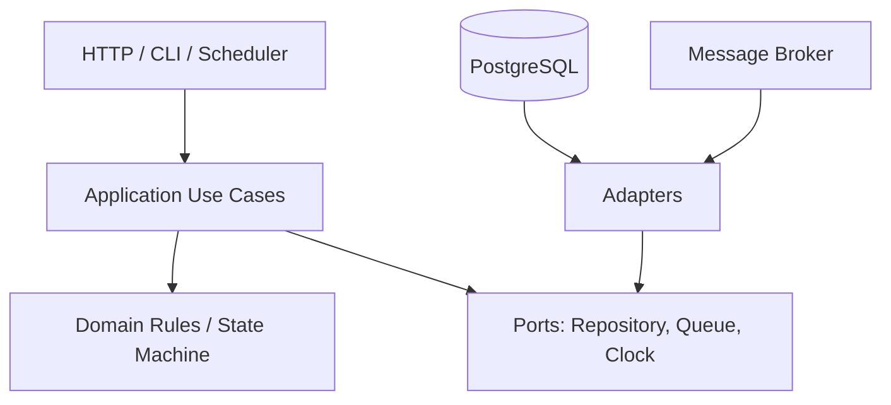
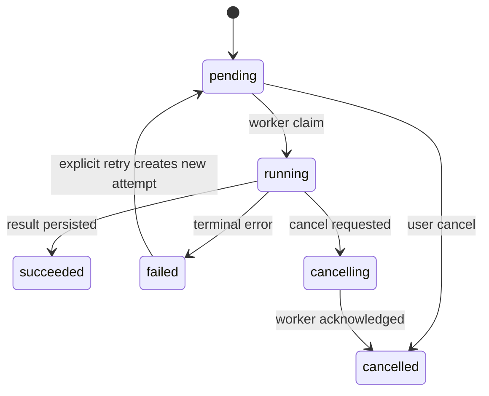
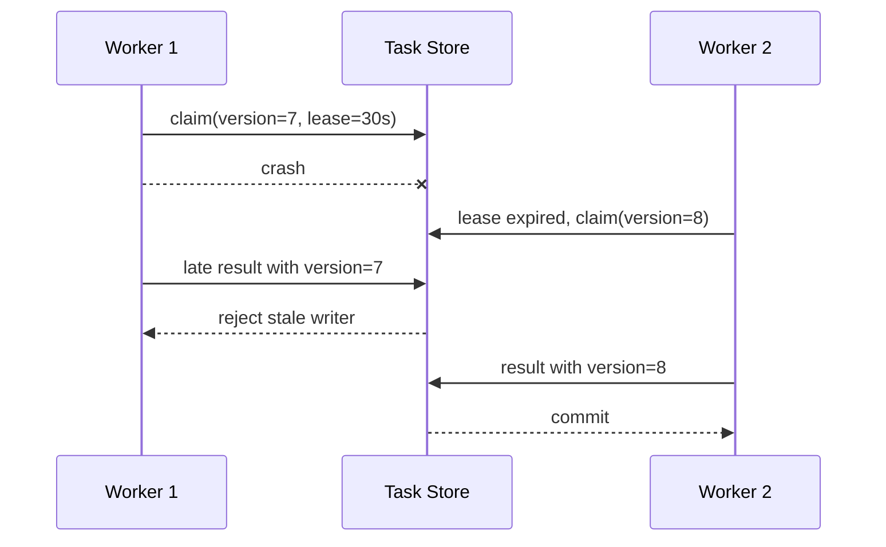

# 05 · 分层、状态机与幂等

> 一句话点题：业务系统最难维护的不是代码多，而是规则散落、状态可随意跳转、一次重试能重复产生副作用；设计的任务是让这些约束有明确住所。

<div class="lesson-meta"><span>SW12—SW13</span><span>必修核心</span><span>预计 5 × 45 分钟</span><span>前置：SW01—11</span></div>

## 本章可观察目标

你能把传输、用例、领域规则和外部适配分开；能把隐含状态画成显式状态机并列出不变量；能为重试、消息重复和长任务设计幂等键、检查点与恢复语义。

## SW12 · 分层不是目录仪式，而是隔离变化

任务运行器会同时面对 HTTP 变化、数据库变化和业务规则变化。如果所有代码都写在 controller：解析 JSON、查库、判断状态、调用模型、发消息、返回响应，那么任何一个变化都会触碰同一大块代码。



- **传输层**把 HTTP/CLI 输入转成命令，把业务结果映射成响应；
- **应用层**编排一个用例和事务边界，例如“取消任务”；
- **领域层**保存不依赖框架的业务不变量与状态转移；
- **适配器**处理数据库、队列、邮件、模型 API 等外部细节。

依赖箭头指向更稳定的规则。领域层不应知道 FastAPI、Express 或 ORM；应用层通过接口表达它需要的能力。这样测试“running 不能回 pending”不需要启动数据库，集成测试再证明适配器遵守接口。

但不要为每个函数创造接口。分层的收益来自隔离真实变化；只有一个实现、不会替换、没有测试隔离价值的简单纯函数，不必套工厂和抽象基类。过度抽象会让一条业务路径跨十几个文件，理解成本反而上升。

### 用例是很好的改动单位

`CancelTask` 应明确：输入、授权主体、读取哪些事实、允许哪些状态、写哪些数据、产生什么事件、如何处理重复。它比“Service 里一个任意函数”更适合写测试和交给 AI 修改，因为边界清楚。

## SW13 · 状态机把“不能发生”写出来

状态不是一个随便赋值的字符串，而是系统对已经发生事实的压缩表示。任务状态机：



图上没有的边就是不允许的，例如 succeeded 不能回 running。状态转移需要同时定义：谁能触发、前置条件、副作用、可否重试、超时怎样处理、审计什么。只写一张图还不够，转移最好由一个函数/表统一裁决，避免 controller、worker 和定时器各写一套规则。

### 状态、事件和尝试次数不要混为一谈

“任务 failed 后重试”可以把同一任务改回 pending，也可以保留任务状态并创建新的 attempt。后者能保存每次输入、worker、错误和耗时，更适合审计：

```text
Task: 用户意图与最终状态
  ├─ Attempt 1: timeout, worker-3, 30s
  ├─ Attempt 2: model_rate_limit, worker-1, 12s
  └─ Attempt 3: succeeded, worker-2, 8s
```

事件是“发生过什么”，状态是“现在是什么”。事件日志可以帮助审计和恢复，但不是所有系统都需要完整 Event Sourcing。

## 幂等：让重复发生但结果不重复

网络重试、消息至少一次投递、worker 崩溃恢复都可能重复执行。幂等不是禁止重复请求，而是同一业务意图多次到达时只产生一次业务效果。

一个可靠幂等方案包括：

1. **键的作用域**：`workspace + operation + key`，避免不同租户冲突；
2. **请求指纹**：同一键若换了请求体，应返回冲突而不是悄悄复用；
3. **原子记录**：幂等记录与业务写入同一事务，否则会记录成功但业务失败；
4. **结果重放**：重复请求返回原始资源/结果，不重新执行；
5. **生命周期**：键保存多久，长任务和支付通常不能过早过期；
6. **并发裁决**：依赖唯一约束/锁，不能只用进程内 Map。

```text
请求(key=K) → 尝试插入 idempotency(K, fingerprint, in_progress)
  ├─ 成功：执行业务，同事务记录 result
  ├─ 已存在且 fingerprint 相同：返回已完成结果/处理中
  └─ 已存在但 fingerprint 不同：409 冲突
```

外部副作用更难。如果调用支付后进程在记录结果前崩溃，重试时不知道支付是否成功。要使用下游幂等键和查询接口；若下游不支持，就需要业务对账/补偿，不能用本地事务制造虚假确定性。

## 长任务：检查点、租约与恢复

worker 领取任务后永久标记 running，如果进程崩溃，任务会卡死。更稳的是租约：worker 获得一段时间所有权并续租；过期后其他 worker 可以接管。处理必须可重复或从检查点恢复，且旧 worker 醒来时不能覆盖新 worker 结果——可以用 fencing token/attempt version 拒绝过期写入。



## 贯穿案例：取消与完成同时发生

用户在 worker 即将完成时点击取消。不能靠“谁最后写谁赢”模糊处理，先定义语义：

- 若结果已经原子提交，取消返回 409/当前 succeeded；
- 若取消先从 running 转为 cancelling，worker 在提交前检查版本，拒绝结果并清理；
- 如果外部动作不可取消，任务可标记 `cancel_requested`，但实际副作用可能完成，UI 必须诚实展示；
- 所有转移写审计事件，便于解释最终状态。

实现可用条件更新：`UPDATE ... WHERE id=? AND status='running' AND version=?`。影响行数为 0 说明有人先改变状态，调用者读取最新事实再决定，而不是覆盖。

## 决策与权衡

<DecisionCard title="用状态字段，还是完整事件溯源？" left="状态字段＋审计表：简单、查询直接，适合大多数业务。" right="Event Sourcing：保留全部事件并重建状态，审计/时态能力强，但版本、投影和运维复杂。" verdict="先用显式状态机和必要审计；只有重建、时态查询或多投影价值明确超过复杂度时再进入事件溯源。" />

## 会死在哪里

- 状态被任意赋值：不同入口规则不一致；统一转移函数和数据库条件更新。
- 幂等记录与业务写分离：出现“记录成功但没创建资源”；同事务提交。
- 同键不同请求体被复用：用户收到错误旧结果；保存指纹并冲突。
- worker 租约过期后仍写：旧结果覆盖新执行；使用版本/fencing token。
- 补偿被当回滚：外部世界无法真正撤销；把补偿视为新的业务动作并处理失败。
- 分层过度：一条规则跨十层包装；按变化与测试价值保留最少层次。

## 与 AI 协作模板

```text
请先输出状态与副作用设计，不要直接生成 controller：
1. 列出状态、允许转移、触发主体、前置条件和终态；
2. 为取消/完成、重复请求、worker 崩溃构造时序；
3. 设计幂等键作用域、请求指纹、原子记录和结果重放；
4. 标出本地事务边界与外部副作用，说明未知结果如何查询/补偿；
5. 给出最小模块依赖图和条件更新 SQL；
6. 生成模型测试：遍历所有合法/非法转移，并验证终态不可逆。
```

## 练习：把布尔字段重构成可恢复状态机

找一个包含 `isRunning/isCancelled/isDone` 的对象，列出可能出现的矛盾组合；重构为单一状态＋attempt；实现原子 claim、租约过期接管、取消与完成竞态；加入幂等创建。用并发测试重复 100 次，证明不会同时得到 cancelled 和 succeeded 两个终态，并模拟 worker 在外部调用后崩溃。

## 常见误区

把 controller 当业务层；一个接口对应一个 service 就叫分层；状态只是字符串；多个布尔值组合状态；幂等等于前端防抖；消息系统标称 exactly-once 就不用幂等；重试失败操作时不区分可重试性；把补偿当数据库 rollback。

<Quiz question="worker 的租约过期后被另一个 worker 接管，旧 worker 又恢复并提交结果。最关键的保护是什么？" :options="['给旧 worker 多等一会', '用递增版本/fencing token 拒绝过期写入', '把队列改长']" :answer="1" explanation="租约只表示一段时间的所有权；版本令牌让存储层识别并拒绝已经失去所有权的旧执行者。" />

## 本章小结

- 分层用于隔离变化和依赖，不是增加文件数量；用例是很好的可测试改动单位。
- 状态机把允许/禁止转移显式化；状态、事件和执行尝试承担不同职责。
- 幂等需要稳定键、请求指纹、原子记录、结果重放和生命周期。
- 跨系统调用可能留下未知结果，必须依靠下游幂等、查询、对账或补偿。
- 长任务通过租约、检查点和 fencing token 从崩溃中安全恢复。

<EvidenceTracker lesson="software-05-design" />

## 本章完成标准

为一个真实用例画模块依赖和状态机；实现并发安全的状态转移和幂等创建；模拟 worker 崩溃/租约接管并证明旧写入被拒绝。最近评估平均至少 7/10。

<div class="source-note">主要来源（核验于 2026-08-31）：<a href="https://martinfowler.com/eaaCatalog/serviceLayer.html">Service Layer</a>、<a href="https://martinfowler.com/eaaDev/EventSourcing.html">Event Sourcing</a>、<a href="https://microservices.io/patterns/data/transactional-outbox.html">Transactional Outbox</a>。模式是问题语言而非默认技术选型，数据库并发语义见 PostgreSQL 官方文档，详见<a href="../../sources/software">来源目录</a>。</div>
