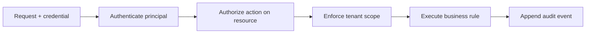
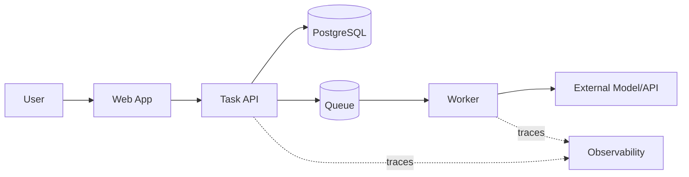

# 06 · 权限、质量属性与架构决策

> 一句话点题：架构不是“用了什么技术”，而是那些改错后代价很大、影响全局、必须在约束之间做取舍的决定；权限和质量属性让这些决定从审美变成可验证承诺。

<div class="lesson-meta"><span>SW14—SW16</span><span>必修核心</span><span>预计 5 × 45 分钟</span><span>前置：SW01—13</span></div>

## 本章可观察目标

你能区分认证、授权、租户隔离和审计；能把“安全、快速、可靠”改写成场景化指标；能用 C4/数据流和 ADR 记录架构边界、权衡、风险、验证与触发演进的量化信号。

## SW14 · 身份、权限、租户与审计是四个问题

- **认证（Authentication）**：你是谁，凭证是否有效；
- **授权（Authorization）**：这个主体能否对这个资源执行这个动作；
- **租户隔离**：即使同样有读取权限，也不能跨工作区看到别人的数据；
- **审计**：谁在何时基于什么授权做了什么，结果如何。



只在前端隐藏按钮不是授权；只检查 `user.role === admin` 也不够，因为还要确认目标资源属于允许的租户/范围。更稳的授权输入是 `(principal, action, resource, context)`，输出允许/拒绝和理由。默认拒绝，权限尽量最小，服务端每个入口都执行。

### 多租户最危险的是漏掉过滤条件

`SELECT * FROM tasks WHERE id=?` 即使 ID 难猜也可能越权；应把 `workspace_id` 作为访问路径一部分：`WHERE workspace_id=? AND id=?`。可在 repository 接口要求 workspace、使用数据库 Row Level Security 或每租户数据库等不同隔离强度。

| 隔离方式 | 优点 | 代价 | 适合 |
|---|---|---|---|
| 共享表＋tenant_id | 成本低、运营简单 | 漏过滤风险、噪声邻居 | 大量中小租户 |
| 独立 schema | 隔离更清晰 | 迁移/连接管理复杂 | 中等隔离要求 |
| 独立数据库/账户 | 故障与合规边界强 | 成本、运维和升级复杂 | 大客户/强监管 |

审计日志不能只写“用户操作成功”。至少记录主体、动作、资源、租户、决策、关键前后状态、request ID 和时间；避免记录密钥和完整敏感输入。审计应尽量追加而不是允许普通业务更新。

## SW15 · 质量属性必须写成可测试场景

“高性能、高可用、安全、可扩展”没有决策价值。使用场景化格式：

```text
来源：工作区用户
刺激：工作日上午批量提交任务
环境：数据库正常，单区域运行
对象：创建任务 API
响应：接受或明确限流，不重复创建
度量：100 RPS 下 p95 < 300ms，错误率 < 1%，重复效果为 0
```

常见质量属性会冲突：更强一致性增加协调延迟；更多冗余提高可用性但增加成本和状态复杂度；更严格权限增加操作摩擦；缓存降低延迟却引入旧数据和失效问题。架构不是把每项都拉满，而是根据业务损失排序。

### 先写失败预算

可用性 99.9% 看起来很高，但按 30 天约有 43 分钟不可用预算（仅作换算示例，实际 SLO 需定义窗口和统计口径）。如果业务可以接受每月 4 小时维护，就不必为五个九设计多区域；如果支付重复一次就产生真实损失，正确性可能优先于部分可用性。

威胁模型同理：资产是什么、攻击者是谁、入口在哪里、最坏影响和可接受风险。安全不是上线前扫一次漏洞，而是贯穿身份、数据流、依赖、日志、发布和恢复。

## SW16 · 架构图与 ADR 让判断可追溯

C4 用不同缩放级别沟通：System Context 说明系统与人/外部系统；Container 说明可部署单元和数据存储；Component 只在需要时展开内部模块；Code 层通常由 IDE/源码承担。不要在一张图里同时画公司、线程和类。



图必须写信任边界、数据分类、同步/异步、主要协议和事实源，否则只是方框装饰。再用 ADR 记录一个重要决定：

```markdown
# ADR-007：任务提交采用数据库 + outbox
状态：Accepted
背景：创建成功后必须最终触发 worker；数据库与队列不能共享事务
决策：业务写和 outbox 同事务，后台至少一次发布，消费者幂等
替代：先发消息、分布式事务、定时扫任务表
后果：增加 relay 与积压监控；买到不丢业务意图
验证：故障注入 100 次无丢失，重复效果为 0
触发复审：outbox 延迟 p99 > 5s 或日事件 > 1亿
```

ADR 不是事后作文。它要让后来者知道当时约束、为什么放弃其他方案、怎样验证、什么时候结论会过期。

### 演进靠触发信号，不靠想象十年后

初版可以是模块化单体＋单数据库。只有出现量化信号才升级：数据库 CPU/锁长期饱和；某模块需独立伸缩；团队发布互相阻塞；合规要求物理隔离；故障半径不可接受。每次演进先找最小可逆步骤，例如抽取接口、影子流量、双写核对、绞杀旧路径，而不是“大重构后一次切换”。

## 贯穿案例：是否把 worker 拆成独立服务

背景：API 与 worker 在同一进程。任务高峰 CPU 密集导致 API p95 从 200ms 升到 3s。三种选择：

1. 同进程限制并发：改动小，但 CPU 仍共享；
2. 同仓库、独立进程部署：保留模块化单体代码边界，资源和故障隔离；
3. 独立服务/仓库：所有权与发布独立，但引入网络契约、版本、观测和跨服务一致性。

如果只有一个三人团队，选择 2 往往已经解决问题，没必要支付微服务组织成本。ADR 应写下基准、部署约束和未来何时再评估，而不是“微服务更先进”。

## 决策与权衡

<DecisionCard title="模块化单体，还是微服务？" left="模块化单体：调用直接、事务简单、部署和调试成本低。" right="微服务：独立所有权、发布、扩缩和故障边界，但引入网络与数据一致性复杂度。" verdict="默认模块化单体；只有独立伸缩、团队所有权、合规隔离或故障半径有明确证据时拆分。" />

## 会死在哪里

- 认证成功就默认可访问所有资源；每次操作做资源级授权和租户范围。
- tenant_id 只在 controller 过滤，后台任务/导出漏掉；让隔离进入仓储接口与测试。
- 质量属性只有形容词；写刺激、环境、响应和数值阈值。
- 图与部署不一致；把架构图纳入变更审查并定期核对。
- ADR 只有“决定用 X”；缺背景、替代、后果和复审触发器。
- 为未来规模预建复杂平台；用当前信号渐进演进并保留退出路线。

## 与 AI 协作模板

```text
请作为架构审查者，不要按流行度推荐技术：
1. 列出主体、动作、资源、租户边界和审计事件；
2. 把性能/可用性/安全/成本写成场景与阈值；
3. 画 System Context、Container 和关键数据流，标出事实源与信任边界；
4. 对每个重要决策给 2—3 个替代、收益、代价、风险和退出条件；
5. 输出 ADR，包含验证方法与触发复审的量化信号；
6. 检查方案是否在解决当前证据，而不是想象中的规模。
```

## 练习：完成一次小型架构评审

为任务运行器画 Context/Container 图和一张敏感数据流；写“跨租户读取必须为零”的授权测试；把“可靠”改写成三个 SLO/不变量场景；对“worker 是否独立部署”写 ADR 并做一次 CPU 压力实验。最后让另一个人只看图和 ADR，复述系统边界与最大风险，记录他理解错的地方并修图。

## 常见误区

前端隐藏等于授权；角色检查等于资源授权；所有租户共享查询却忘记作用域；审计记录敏感全文；架构图追求好看不标数据流；质量属性都是“高”；ADR 只记结果；看到大公司架构就复制；把不可逆大重构当演进。

<Quiz question="一个三人团队因 worker CPU 抢占导致 API 变慢，最小合理演进通常是什么？" :options="['立即拆成十个微服务', '先让 worker 独立进程/部署并用指标验证隔离效果', '把所有代码重写成另一语言']" :answer="1" explanation="问题是资源与故障隔离，独立部署可能已解决；微服务组织和数据复杂度需要额外证据。" />

## 本章小结

- 认证、授权、租户隔离和审计回答不同问题，必须在服务端和所有入口一致执行。
- 质量属性只有写成刺激、环境、响应和度量，才能驱动设计和测试。
- C4 展示不同尺度，数据流和信任边界让图具有审查价值。
- ADR 保存背景、替代、后果、验证与复审信号，使判断可追溯。
- 架构演进应由当前量化瓶颈触发，优先最小、可逆、可验证的步骤。

<EvidenceTracker lesson="software-06-architecture" />

## 本章完成标准

为一个真实系统交付资源级授权/租户测试、三条可测质量属性、Context/Container/数据流图和一份含替代与复审信号的 ADR；能说明选择放弃了什么。最近评估平均至少 7/10。

<div class="source-note">主要来源（核验于 2026-08-31）：<a href="https://c4model.com/">C4 Model</a>、<a href="https://adr.github.io/">Architecture Decision Records</a>、<a href="https://owasp.org/www-project-application-security-verification-standard/">OWASP ASVS</a>、<a href="https://sre.google/sre-book/service-level-objectives/">Google SRE: SLO</a>。框架需按项目风险裁剪，详见<a href="../../sources/software">来源目录</a>。</div>
