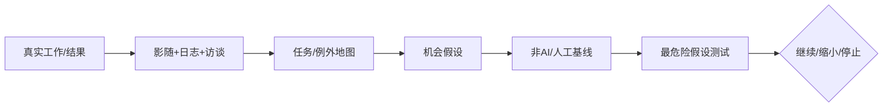

# 01 · 问题发现与机会判断

> 一句话点题：AI 产品的起点是值得改善的决策或工作，不是模型演示；一个高价值但不可评测、不可恢复的任务，通常不应先自动化。

<div class="lesson-meta"><span>AIPM01—AIPM02—AIPM03</span><span>核心主线</span><span>预计 6 × 45 分钟</span><span>证据截止 2026-08-30</span></div>

## 解锁与跳过

选择一个你能接触真实用户、现有流程和结果数据的问题；不要从‘做一个 Agent’开始。 即使你使用 AI 完成实现，也不能跳过本章的变量定义、反例和评测设计；这些部分决定你是否有能力发现一个“运行正常但结论错误”的系统。

## 本章可观察目标

完成后你能：区分用户任务、业务结果与模型能力；量化频率、价值、可行性和失败成本；建立非 AI、人工增强与自动化三层机会基线。阅读完成不计掌握；至少需要一次不看答案的解释、一次实际应用和一次边界判断。

## 研究问题：什么问题值得用 AI，什么问题只是被模型演示诱导？

销售团队说想要‘自动写跟进邮件’，真实瓶颈可能是客户信息散落、审批慢或不知道下一行动。若只生成文案，发送量上升却转化下降。应追踪从准备、查证、起草、审批、发送到结果的完整任务，并比较搜索模板、结构化表单、AI 草拟与自主发送。

问题必须被写成“输入、状态、动作/输出、损失、约束、证据和停止条件”的组合。只写“提升效果”会把数据、算法、交互与业务结果混在一起，也无法设计反事实或消融。

## 三个知识节点怎样连接

| 节点 | 核心对象 | 最小充分解释 | 必须支持的决策 |
|---|---|---|---|
| AIPM01 | 问题空间 | 用户在特定情境下为取得进展而完成的任务链 | 痛点是否真实、频繁且可行动 |
| AIPM02 | AI 适配度 | 输入可观察性、输出可评测性和错误可恢复性共同决定可行性 | 是否真的需要概率模型 |
| AIPM03 | 机会组合 | 按价值、频率、数据、风险和变更成本排序候选 | 先验证哪一个最危险假设 |

三者不是并列名词：第一个节点通常建立对象和假设，第二个节点解释机制，第三个节点把机制放进测量或交付边界。缺任何一层，都容易把局部指标误当成系统结论。

## 核心机制：机会评分与反事实基线

先用访谈、影随和日志还原 current-state；把机会写成角色—触发—输入—判断—动作—结果—例外。AI 适合高变异输入、可形成反馈且错误可检测/恢复的环节。对每个方案定义‘若不用 AI 会怎样’的基线，避免把自然趋势或流程整理的收益归功于模型。

理解机制时要区分三种量：**被设计者直接控制的变量**、**环境或数据生成过程决定的变量**、**只能通过代理指标观测的潜变量**。可靠实验一次只改变主要因子，其余配置进入版本化运行记录。

## 关键公式、假设与推导

机会分不是伪精确排名，而是显式假设：$O=F\times V\times P(success)-C_{build}-P(error)C_{error}$。其中频率 $F$、单次价值 $V$、成功概率、实施成本和风险成本都用区间/情景分析；高风险尾部不能被平均价值抵消。

公式不是装饰。逐项检查：

- 用户说想要的功能与真实任务是否一致
- 价值是否有可观测代理和时间窗口
- 错误能否发现、撤销和人工恢复
- 模型之外的数据/集成/变更成本是否计入

若假设不成立，正确做法不是继续套公式，而是换估计量、改采样/实验设计、缩小结论或明确拒绝自动决策。

## 证据拆解1：Stanford AI Index 2026

### 研究问题

快速变化的能力、成本和采用率怎样影响产品机会判断？

### 核心机制、实验与指标

报告综合研究、产业、投资、责任和政策数据，以年度口径呈现趋势，而非把单一模型发布当市场事实。

2026 版显示能力与部署继续扩张，但成本、地区、责任事件和评测差异并存。

### 真正贡献、局限与适用边界

为机会假设提供宏观先验和反宣传材料。 宏观统计不能替代目标用户研究；不同数据源的定义和滞后需逐项检查。

## 证据拆解2：Anthropic Economic Index 2026

### 研究问题

真实使用中 AI 更常增强还是自动化工作，任务分布怎样变化？

### 核心机制、实验与指标

报告使用聚合、隐私保护的产品使用数据，把会话映射到职业任务并区分 augmentation/automation。

结果提供任务层采用与交互模式的最新观察，而非仅调查意愿。

### 真正贡献、局限与适用边界

支持从具体任务而非职业标题寻找机会。 单一厂商用户有选择偏差，分类模型和产品设计也影响观测，不能外推全部经济。

## 从论文或标准到产品主张：证据审计

| 日期 | 一手来源 | 它真正回答的问题 | 不能据此外推什么 |
|---|---|---|---|
| 2026-04-06 | Stanford AI Index 2026 | 快速变化的能力、成本和采用率怎样影响产品机会判断？ | 宏观统计不能替代目标用户研究；不同数据源的定义和滞后需逐项检查。 |
| 2026-06-10 | Anthropic Economic Index 2026 | 真实使用中 AI 更常增强还是自动化工作，任务分布怎样变化？ | 单一厂商用户有选择偏差，分类模型和产品设计也影响观测，不能外推全部经济。 |

阅读来源时按四步记录：先抄下研究对象、比较基线、数据/场景和预算，再定位结果表或正式条文；随后区分作者直接观察、由结果支持的解释和你准备迁移到项目的推论；最后为推论写一个能推翻它的反例。**来源新并不等于证据强**：预印本、公司技术报告、正式标准、法规和独立复现承担的证明责任不同。数字必须连同分母、置信区间、硬件/本体、语言/人群与失败样本一起保存。

如果来源只证明组件指标改善，不得自动升级成端到端任务、真实用户价值、物理安全或合规结论。迁移到自己的项目时至少保留一个原方法基线、一个更简单基线和一个不使用该能力的基线；结果冲突时，优先检查任务定义、样本污染、资源预算、评价器偏差和运行边界，而不是挑选最符合预期的一项。

## 机制图：从输入到可验证结果



图中每条边都应能对应日志、数据版本、物理状态或人工记录；无法观测的边必须标为假设，不允许用模型的一段解释代替真实状态。

## 贯穿案例：销售跟进工作流机会判断

访谈 8 名销售和 2 名审批人，抽样 50 个机会单。发现 60% 时间花在找事实与确认权限而非写作。第一版只做证据聚合与草拟，禁止自动发送；主指标是合格跟进完成时间和后续行动率，护栏是事实错误、退订与人工修订。

案例的重点不是跑出最高分，而是保存“为什么选择这条路径”的证据：基线是什么、哪个假设最危险、失败怎样分层、什么条件触发降级或人工接管。

## 复现任务：最小因果链

1. 画现状任务链并标频率、等待、返工、例外和责任人
2. 列至少三个非 AI/流程替代并测现状基线
3. 为前两机会写价值区间、失败成本和退出条件
4. 用礼宾式或人工幕后原型验证最危险假设

复现不是成功运行作者代码。你必须固定数据/环境、预算和评价器，至少重复三次，报告均值、离散程度、失败样本和资源消耗；若只能跑一次，要把结论降级为演示证据。

## 三轮实验与消融路线

**第一轮：测量链校准。** 只运行最简单基线，检查输入单位、时间/坐标/权限、随机种子、日志和评价器。抽取成功与失败样本人工复核；若真值或测量本身不稳定，停止模型比较。输出必须能回答“同一次运行能否被另一人重放”。

**第二轮：机制消融。** 在同一数据、预算、硬件或运行条件下，一次只加入一个关键机制；对每次变化写预期影响、未变化项和失败阈值。除了主指标，还要检查最坏切片、过程约束、P95/P99、资源与人工成本。若提升只在一个方便切片出现，应缩小能力声明。

**第三轮：边界与迁移。** 有计划地改变本章公式假设或 ODD：时间、人群、语言、对象、气象、本体、延迟、权限或供应商至少选择两项；注入缺失、冲突和失效。记录系统是正确拒绝/降级/接管，还是带着错误自信继续。最终产物不是“最佳分数”，而是一个可复核的能力范围、反例集和下一次变更会触发的回归集合。

## 实验与指标

| 维度 | 至少记录什么 | 为什么 |
|---|---|---|
| 任务质量 | 主指标、分层指标、置信区间和失败类型 | 平均分不能说明关键场景是否可用 |
| 系统表现 | 端到端时延、成功率、降级/拒绝和人工介入 | 局部模型分数不是用户任务结果 |
| 资源经济 | 训练/推理/标注成本、吞吐、容量与能耗 | 确认改进在真实预算下仍成立 |
| 风险运维 | 漂移、越权、事故、恢复时间和残余风险 | 把一次实验转化成可持续服务 |

同时保留一个简单基线和一个“什么都不做/人工流程”基线。复杂方案只有在质量、成本、时延、风险或可扩展性至少一个维度形成可重复净收益时才晋级。

## 对产品、系统或研究架构的影响

- 机会卡必须写不用 AI 的方案
- 首版避开错误不可恢复动作
- 路线图按证据风险而非功能数量排序
- 没有结果观测和责任归属的需求暂缓

这些决策应进入 PRD、实验卡、接口契约、安全案例或 ADR，而不只留在学习笔记。模型、数据、提示、硬件、环境与评价器任何一个升级，都要能触发有范围的回归测试。

## 会死在哪里

- 从竞品功能反推用户问题
- 把节省点击当业务价值
- 只访谈管理者不观察执行者
- 忽略例外与责任转移
- 用宏观 AI 数据代替本地验证

失败分析要写“触发条件—可观测信号—影响—检测—缓解—残余风险”。只写“模型可能出错”没有工程价值。

## 与 AI 协作模板

```text
作为 AI 产品机会审查员，把需求重写为角色、触发、现状步骤、等待/返工、输入可观察性、输出可评测性、错误可恢复性和真实结果；给三个非 AI 基线、价值区间、最危险假设与停止条件。
```

使用模板后仍需检查 AI 是否虚构来源、混用时间口径、悄悄改变任务定义，或把模拟结果外推到真实系统。

## 练习：提交一张机会证伪卡

观察一个真实流程至少三次，写任务链和五个例外；比较流程改造、AI 辅助和自动化，选择首个实验并解释为什么其失败最有信息量。

提交物必须包含一个反例或失败样本。只有成功案例会让你误以为已经掌握；边界证据才能说明你知道方法何时不该用。

## 常见误区

所有重复劳动都适合 AI；用户要助手就是机会成立；模型能力等于产品价值；节省时间必然带来结果；越自主越先进。共同根因是把一个条件成立时的局部结论，扩张成不带条件的能力判断。

## 自测

<Quiz question="用户频繁要求自动写邮件，但观察发现时间主要耗在查找可信客户事实，首版优先做什么？" :options='["自动发送","证据聚合与可追溯草拟","训练更有文采的模型"]' :answer="1" explanation="先解决主瓶颈并保持高风险动作可审查。" />

## 本章小结

- 从任务和结果而非 AI 形态出发
- 机会同时受价值、可评测和恢复性约束
- 非 AI 基线防止错误归因
- 先测最危险假设

<EvidenceTracker lesson="field-ai-product-01-problem-opportunity" />

## 本章完成标准

不看正文解释 问题价值与 AI 适配度的区别；完成 一张含基线的机会卡；能指出 一个不应自动化的高价值任务。最近相关题平均至少 7/10 才标记为 basic；跨日期完成变式任务并达到 8.5/10，才标记为 proficient。

<div class="source-note">主要来源（证据截止 2026-08-30）：<a href="https://hai.stanford.edu/assets/files/ai_index_report_2026.pdf">AI Index 2026</a>、<a href="https://www.anthropic.com/research/economic-index-june-2026-report">Economic Index 2026</a>。数字只描述来源中的实验设置；标准、法规与产品能力均按页面版本和适用范围解释。</div>
