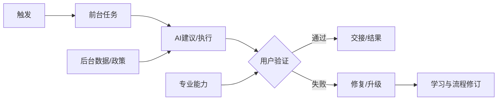

# 02 · 用户研究与工作流建模

> 一句话点题：AI 不只是缩短一个步骤，它会重分配认知、核验和责任；产品研究必须观察工作怎样完成以及失败后谁来收拾。

<div class="lesson-meta"><span>AIPM04—AIPM05—AIPM06</span><span>核心主线</span><span>预计 6 × 45 分钟</span><span>证据截止 2026-08-30</span></div>

## 解锁与跳过

已有一个通过初筛的任务和可接触的执行者。 即使你使用 AI 完成实现，也不能跳过本章的变量定义、反例和评测设计；这些部分决定你是否有能力发现一个“运行正常但结论错误”的系统。

## 本章可观察目标

完成后你能：用情境访谈和日志还原真实而非理想流程；建模角色、信息、例外、责任和交接；识别新手/专家从 AI 获益不同的机制。阅读完成不计掌握；至少需要一次不看答案的解释、一次实际应用和一次边界判断。

## 研究问题：用户说想要助手时，真正需要改善的是哪段工作与责任？

专家使用代码 Agent 能给清晰任务、检查架构和发现隐蔽错误，新手可能快速产出却无法审查。若只看完成速度，产品会奖励表面产出并积累维护债务。需要按技能层级、任务复杂度和后续质量分层。

问题必须被写成“输入、状态、动作/输出、损失、约束、证据和停止条件”的组合。只写“提升效果”会把数据、算法、交互与业务结果混在一起，也无法设计反事实或消融。

## 三个知识节点怎样连接

| 节点 | 核心对象 | 最小充分解释 | 必须支持的决策 |
|---|---|---|---|
| AIPM04 | 情境研究 | 在任务发生处观察工具、绕行和判断依据 | 需求来自行为还是表态 |
| AIPM05 | 服务蓝图 | 前台交互、后台系统、人工与责任在时间线上连接 | AI 插入后谁的工作发生变化 |
| AIPM06 | 专业能力差异 | 领域知识改变问题分解、验证与接管能力 | 同一功能需怎样分层控制 |

三者不是并列名词：第一个节点通常建立对象和假设，第二个节点解释机制，第三个节点把机制放进测量或交付边界。缺任何一层，都容易把局部指标误当成系统结论。

## 核心机制：工作流、认知卸载与互补性

影随记录触发、工具切换、信息来源、决策点、例外和交接；认知任务分析追问专家如何察觉异常。AI 可能自动化 execution、增强 judgment 或把验证劳动转移给下游。服务蓝图把模型不可见等待与人工审查一起建模。

理解机制时要区分三种量：**被设计者直接控制的变量**、**环境或数据生成过程决定的变量**、**只能通过代理指标观测的潜变量**。可靠实验一次只改变主要因子，其余配置进入版本化运行记录。

## 关键公式、假设与推导

端到端周期 $T=\sum_i service_i+\sum_j wait_j+rework$；自动化率不等于价值。分层处理效应 $\tau(s)=E[Y(1)-Y(0)|skill=s]$ 可揭示专家/新手差异；还应量化 review debt 和返工在后续周期的滞后成本。

公式不是装饰。逐项检查：

- 是否观察实际工作而非回忆
- 技能层级用行为证据还是职位
- 任务难度和资料完整度是否平衡
- 短期速度与长期维护是否同窗观测

若假设不成立，正确做法不是继续套公式，而是换估计量、改采样/实验设计、缩小结论或明确拒绝自动决策。

## 证据拆解1：Agentic Coding Expertise Study

### 研究问题

专业知识怎样改变 Agentic coding 的成功？

### 核心机制、实验与指标

研究分析约 40 万次编码会话，以行为信号比较不同专业程度用户的问题分解、工具使用和结果。

报告显示领域/工具熟练度与成功存在显著联系，专家更能分解、验证和恢复。

### 真正贡献、局限与适用边界

支持 AI 产品按用户能力设计脚手架和权限，而非假设工具抹平差距。 观察性产品数据存在选择与代理测量限制，不能直接推断培训的因果效果。

## 证据拆解2：AI Assistance and Coding Skills RCT

### 研究问题

AI 加速任务时是否会削弱学习？

### 核心机制、实验与指标

随机对照实验比较 AI 辅助与对照组完成编程任务后的知识测验和行为。

研究报告 AI 组技能掌握约低 17%，同时不同使用方式有差异。

### 真正贡献、局限与适用边界

提醒产品同时优化产出与能力保持。 样本、任务和短期测验限制外推；17% 不是所有工作常数。

## 从论文或标准到产品主张：证据审计

| 日期 | 一手来源 | 它真正回答的问题 | 不能据此外推什么 |
|---|---|---|---|
| 2026-06-16 | Agentic Coding Expertise Study | 专业知识怎样改变 Agentic coding 的成功？ | 观察性产品数据存在选择与代理测量限制，不能直接推断培训的因果效果。 |
| 2026-01-29 | AI Assistance and Coding Skills RCT | AI 加速任务时是否会削弱学习？ | 样本、任务和短期测验限制外推；17% 不是所有工作常数。 |

阅读来源时按四步记录：先抄下研究对象、比较基线、数据/场景和预算，再定位结果表或正式条文；随后区分作者直接观察、由结果支持的解释和你准备迁移到项目的推论；最后为推论写一个能推翻它的反例。**来源新并不等于证据强**：预印本、公司技术报告、正式标准、法规和独立复现承担的证明责任不同。数字必须连同分母、置信区间、硬件/本体、语言/人群与失败样本一起保存。

如果来源只证明组件指标改善，不得自动升级成端到端任务、真实用户价值、物理安全或合规结论。迁移到自己的项目时至少保留一个原方法基线、一个更简单基线和一个不使用该能力的基线；结果冲突时，优先检查任务定义、样本污染、资源预算、评价器偏差和运行边界，而不是挑选最符合预期的一项。

## 机制图：从输入到可验证结果



图中每条边都应能对应日志、数据版本、物理状态或人工记录；无法观测的边必须标为假设，不允许用模型的一段解释代替真实状态。

## 贯穿案例：代码助手的新手与专家工作流

让两组用户完成同难度真实变更，记录计划、上下文选择、接受修改、测试、返工与一周后维护。专家模式可批量执行，新手模式强制预测输出、展示 diff 和解释风险；指标含完成、缺陷、理解测验和复现能力。

案例的重点不是跑出最高分，而是保存“为什么选择这条路径”的证据：基线是什么、哪个假设最危险、失败怎样分层、什么条件触发降级或人工接管。

## 复现任务：最小因果链

1. 影随 5—8 名执行者完成同类真实任务
2. 画主路径、例外、交接、系统和责任泳道
3. 按可观察技能行为分层，不用自我评价代替
4. 验证 AI 前后等待、审查、返工与学习变化

复现不是成功运行作者代码。你必须固定数据/环境、预算和评价器，至少重复三次，报告均值、离散程度、失败样本和资源消耗；若只能跑一次，要把结论降级为演示证据。

## 三轮实验与消融路线

**第一轮：测量链校准。** 只运行最简单基线，检查输入单位、时间/坐标/权限、随机种子、日志和评价器。抽取成功与失败样本人工复核；若真值或测量本身不稳定，停止模型比较。输出必须能回答“同一次运行能否被另一人重放”。

**第二轮：机制消融。** 在同一数据、预算、硬件或运行条件下，一次只加入一个关键机制；对每次变化写预期影响、未变化项和失败阈值。除了主指标，还要检查最坏切片、过程约束、P95/P99、资源与人工成本。若提升只在一个方便切片出现，应缩小能力声明。

**第三轮：边界与迁移。** 有计划地改变本章公式假设或 ODD：时间、人群、语言、对象、气象、本体、延迟、权限或供应商至少选择两项；注入缺失、冲突和失效。记录系统是正确拒绝/降级/接管，还是带着错误自信继续。最终产物不是“最佳分数”，而是一个可复核的能力范围、反例集和下一次变更会触发的回归集合。

## 实验与指标

| 维度 | 至少记录什么 | 为什么 |
|---|---|---|
| 任务质量 | 主指标、分层指标、置信区间和失败类型 | 平均分不能说明关键场景是否可用 |
| 系统表现 | 端到端时延、成功率、降级/拒绝和人工介入 | 局部模型分数不是用户任务结果 |
| 资源经济 | 训练/推理/标注成本、吞吐、容量与能耗 | 确认改进在真实预算下仍成立 |
| 风险运维 | 漂移、越权、事故、恢复时间和残余风险 | 把一次实验转化成可持续服务 |

同时保留一个简单基线和一个“什么都不做/人工流程”基线。复杂方案只有在质量、成本、时延、风险或可扩展性至少一个维度形成可重复净收益时才晋级。

## 对产品、系统或研究架构的影响

- 权限与自主度随任务风险和能力分层
- 把验证步骤设计为产品体验
- 交接产物包含来源、假设和未决项
- 培训目标进入采用指标

这些决策应进入 PRD、实验卡、接口契约、安全案例或 ADR，而不只留在学习笔记。模型、数据、提示、硬件、环境与评价器任何一个升级，都要能触发有范围的回归测试。

## 会死在哪里

- 只优化单步耗时
- 把确认按钮当有效审查
- 对所有用户给同自主度
- 把下游返工排除在成功外
- 用职位代表能力

失败分析要写“触发条件—可观测信号—影响—检测—缓解—残余风险”。只写“模型可能出错”没有工程价值。

## 与 AI 协作模板

```text
把该工作画成服务蓝图：角色、触发、资料、判断、AI 行为、人工验证、例外、交接、责任和最终结果；按新手/熟练/专家设计不同脚手架与权限，并写长期技能护栏。
```

使用模板后仍需检查 AI 是否虚构来源、混用时间口径、悄悄改变任务定义，或把模拟结果外推到真实系统。

## 练习：完成一次情境工作研究

观察至少两人各完成一次任务，记录屏幕/工具切换、说出声判断和异常；提交服务蓝图、三处隐性知识和一个 AI 可能转移而非消除的成本。

提交物必须包含一个反例或失败样本。只有成功案例会让你误以为已经掌握；边界证据才能说明你知道方法何时不该用。

## 常见误区

用户说法等于真实行为；自动化一步就缩短全流程；专家不需要 UX；新手有 AI 就能审查专家产物；采用率高等于能力提高。共同根因是把一个条件成立时的局部结论，扩张成不带条件的能力判断。

## 自测

<Quiz question="AI 让新手更快但理解测验和维护质量下降，应怎样处理？" :options='["只看速度继续扩大","加入预测/解释/验证脚手架并同时设能力保持指标","隐藏所有模型输出"]' :answer="1" explanation="产品目标需同时覆盖即时产出与后续掌握/维护。" />

## 本章小结

- 工作流研究关注行为、例外和责任
- AI 会重新分配验证劳动
- 专业能力影响互补收益
- 长期技能也是产品护栏

<EvidenceTracker lesson="field-ai-product-02-users-workflows" />

## 本章完成标准

不看正文解释 自动化率与端到端价值的差异；完成 一张带责任的服务蓝图；能指出 AI 提速却应限制采用的条件。最近相关题平均至少 7/10 才标记为 basic；跨日期完成变式任务并达到 8.5/10，才标记为 proficient。

<div class="source-note">主要来源（证据截止 2026-08-30）：<a href="https://www.anthropic.com/research/claude-code-expertise">Claude Code Expertise</a>、<a href="https://www.anthropic.com/research/AI-assistance-coding-skills">AI Skills RCT</a>。数字只描述来源中的实验设置；标准、法规与产品能力均按页面版本和适用范围解释。</div>
