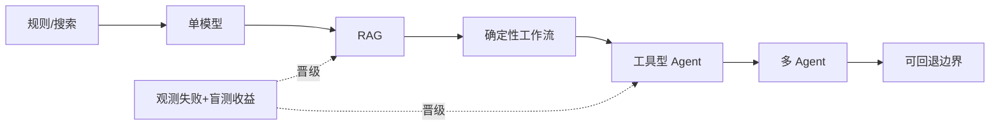

# 03 · 能力边界与方案选型

> 一句话点题：模型强不等于系统应复杂；每增加检索、工具或自主循环，都必须由一种已观测失败和一套新评价证据来购买。

<div class="lesson-meta"><span>AIPM07—AIPM08—AIPM09</span><span>核心主线</span><span>预计 6 × 45 分钟</span><span>证据截止 2026-08-30</span></div>

## 解锁与跳过

已冻结任务、用户层级、输入输出和失败成本。 即使你使用 AI 完成实现，也不能跳过本章的变量定义、反例和评测设计；这些部分决定你是否有能力发现一个“运行正常但结论错误”的系统。

## 本章可观察目标

完成后你能：用复杂度阶梯选择 prompt、RAG、workflow、agent 或训练；画能力矩阵与系统责任边界；做 build/buy 与退出可逆性决策。阅读完成不计掌握；至少需要一次不看答案的解释、一次实际应用和一次边界判断。

## 研究问题：Prompt、RAG、工作流、Agent、微调应按什么证据升级？

团队把 FAQ 直接设计成多 Agent，结果延迟、费用和不可复现错误暴涨。真正需求是版本化知识检索加三个确定性动作。应先用单调用+约束输出，只有跨步骤环境反馈确实必要才引入 Agent 循环。

问题必须被写成“输入、状态、动作/输出、损失、约束、证据和停止条件”的组合。只写“提升效果”会把数据、算法、交互与业务结果混在一起，也无法设计反事实或消融。

## 三个知识节点怎样连接

| 节点 | 核心对象 | 最小充分解释 | 必须支持的决策 |
|---|---|---|---|
| AIPM07 | 能力阶梯 | 确定性流程到开放 Agent 的不确定性逐级增加 | 最小方案能否达成任务 |
| AIPM08 | 系统架构边界 | 模型、知识、工具、状态、策略和安全控制分层 | 错误由哪一层检测和恢复 |
| AIPM09 | Build/Buy/Portability | 能力、数据权、锁定、成本和运营共同决定选型 | 供应商变化时能否迁移 |

三者不是并列名词：第一个节点通常建立对象和假设，第二个节点解释机制，第三个节点把机制放进测量或交付边界。缺任何一层，都容易把局部指标误当成系统结论。

## 核心机制：从调用到 Agent 的复杂度晋级

层级可写为规则/搜索→单模型结构输出→RAG→确定性 workflow→带工具单 Agent→多 Agent。知识放外部可更新层，权限由工具网关控制，状态与模型上下文分离，关键策略用代码/政策执行。每层绑定失败本体、增量收益和回退路径。

理解机制时要区分三种量：**被设计者直接控制的变量**、**环境或数据生成过程决定的变量**、**只能通过代理指标观测的潜变量**。可靠实验一次只改变主要因子，其余配置进入版本化运行记录。

## 关键公式、假设与推导

用 Pareto 而非单分：方案 $s$ 的向量 $(quality,latency,cost,risk,operability)$。复杂度净值 $NV_s=\Delta V_s-\Delta C_s-\Delta R_s$；当更复杂方案在盲测与线上都无可重复净优势时被支配并淘汰。

公式不是装饰。逐项检查：

- 任务是否真的需要环境反馈循环
- 知识更新频率与模型截止差异
- 工具写权限和幂等/撤销能力
- 供应商数据留存、可观测和出口能力

若假设不成立，正确做法不是继续套公式，而是换估计量、改采样/实验设计、缩小结论或明确拒绝自动决策。

## 证据拆解1：Building Effective Agents

### 研究问题

什么时候使用 workflow，什么时候使用 agent？

### 核心机制、实验与指标

文章区分预定义代码路径的 workflow 与模型动态决定过程的 agent，并给出 routing、parallelization、orchestrator-worker 等模式。

实践建议从简单可组合模式开始，只在任务需要时增加自主性。

### 真正贡献、局限与适用边界

形成产品/架构共同的复杂度语言。 厂商实践文章不是独立对照实验，模式须用本地任务证据选择。

## 证据拆解2：Model Cards

### 研究问题

购买或集成模型时需要什么能力边界？

### 核心机制、实验与指标

模型卡记录用途、非用途、评测条件、群体表现和限制。

案例说明单一榜分不足以支持部署选择。

### 真正贡献、局限与适用边界

把供应商模型能力主张转成可审查输入。 卡片由提供方编写，需独立验证且常缺系统级风险。

## 从论文或标准到产品主张：证据审计

| 日期 | 一手来源 | 它真正回答的问题 | 不能据此外推什么 |
|---|---|---|---|
| 2024-12-19 | Building Effective Agents | 什么时候使用 workflow，什么时候使用 agent？ | 厂商实践文章不是独立对照实验，模式须用本地任务证据选择。 |
| 2019-01-28 | Model Cards | 购买或集成模型时需要什么能力边界？ | 卡片由提供方编写，需独立验证且常缺系统级风险。 |

阅读来源时按四步记录：先抄下研究对象、比较基线、数据/场景和预算，再定位结果表或正式条文；随后区分作者直接观察、由结果支持的解释和你准备迁移到项目的推论；最后为推论写一个能推翻它的反例。**来源新并不等于证据强**：预印本、公司技术报告、正式标准、法规和独立复现承担的证明责任不同。数字必须连同分母、置信区间、硬件/本体、语言/人群与失败样本一起保存。

如果来源只证明组件指标改善，不得自动升级成端到端任务、真实用户价值、物理安全或合规结论。迁移到自己的项目时至少保留一个原方法基线、一个更简单基线和一个不使用该能力的基线；结果冲突时，优先检查任务定义、样本污染、资源预算、评价器偏差和运行边界，而不是挑选最符合预期的一项。

## 机制图：从输入到可验证结果



图中每条边都应能对应日志、数据版本、物理状态或人工记录；无法观测的边必须标为假设，不允许用模型的一段解释代替真实状态。

## 贯穿案例：企业 FAQ 到工单 Agent

先用检索+引用回答，写操作必须经三个固定 workflow。只有当用户目标需跨系统追踪且预定流程覆盖率不足时，试验工具 Agent；写动作 sandbox、权限最小化、幂等键、预览确认和审计齐备。比较任务成功、人工分钟、P95、严重错误和恢复时间。

案例的重点不是跑出最高分，而是保存“为什么选择这条路径”的证据：基线是什么、哪个假设最危险、失败怎样分层、什么条件触发降级或人工接管。

## 复现任务：最小因果链

1. 列出每个失败应由知识、模型、流程或权限哪层处理
2. 从最低复杂度实现可运行基线
3. 每次只加一层并做盲测/成本消融
4. 演练供应商不可用、模型降级和数据迁移

复现不是成功运行作者代码。你必须固定数据/环境、预算和评价器，至少重复三次，报告均值、离散程度、失败样本和资源消耗；若只能跑一次，要把结论降级为演示证据。

## 三轮实验与消融路线

**第一轮：测量链校准。** 只运行最简单基线，检查输入单位、时间/坐标/权限、随机种子、日志和评价器。抽取成功与失败样本人工复核；若真值或测量本身不稳定，停止模型比较。输出必须能回答“同一次运行能否被另一人重放”。

**第二轮：机制消融。** 在同一数据、预算、硬件或运行条件下，一次只加入一个关键机制；对每次变化写预期影响、未变化项和失败阈值。除了主指标，还要检查最坏切片、过程约束、P95/P99、资源与人工成本。若提升只在一个方便切片出现，应缩小能力声明。

**第三轮：边界与迁移。** 有计划地改变本章公式假设或 ODD：时间、人群、语言、对象、气象、本体、延迟、权限或供应商至少选择两项；注入缺失、冲突和失效。记录系统是正确拒绝/降级/接管，还是带着错误自信继续。最终产物不是“最佳分数”，而是一个可复核的能力范围、反例集和下一次变更会触发的回归集合。

## 实验与指标

| 维度 | 至少记录什么 | 为什么 |
|---|---|---|
| 任务质量 | 主指标、分层指标、置信区间和失败类型 | 平均分不能说明关键场景是否可用 |
| 系统表现 | 端到端时延、成功率、降级/拒绝和人工介入 | 局部模型分数不是用户任务结果 |
| 资源经济 | 训练/推理/标注成本、吞吐、容量与能耗 | 确认改进在真实预算下仍成立 |
| 风险运维 | 漂移、越权、事故、恢复时间和残余风险 | 把一次实验转化成可持续服务 |

同时保留一个简单基线和一个“什么都不做/人工流程”基线。复杂方案只有在质量、成本、时延、风险或可扩展性至少一个维度形成可重复净收益时才晋级。

## 对产品、系统或研究架构的影响

- 政策/权限不用 prompt 保证
- 状态独立于上下文窗口持久化
- 供应商合同覆盖数据权、日志和退出
- 多 Agent 需要证明优于单 Agent/工作流

这些决策应进入 PRD、实验卡、接口契约、安全案例或 ADR，而不只留在学习笔记。模型、数据、提示、硬件、环境与评价器任何一个升级，都要能触发有范围的回归测试。

## 会死在哪里

- 把 Agent 当默认 UI
- 模型同时承担策略与执行授权
- 工具无幂等和撤销
- 只看 token 单价不看总拥有成本
- 架构绑定供应商私有状态

失败分析要写“触发条件—可观测信号—影响—检测—缓解—残余风险”。只写“模型可能出错”没有工程价值。

## 与 AI 协作模板

```text
针对任务给出规则、单模型、RAG、workflow、单 Agent、多 Agent 六层方案；逐层写它解决的已知失败、增量评测、成本、风险、回退和淘汰门槛，选择最小未被支配方案。
```

使用模板后仍需检查 AI 是否虚构来源、混用时间口径、悄悄改变任务定义，或把模拟结果外推到真实系统。

## 练习：完成一次复杂度消融

对同一任务实现或详细设计简单方案和 Agent 方案；用 30 条盲测比较质量、延迟、成本、恢复，写出是否允许晋级的 ADR。

提交物必须包含一个反例或失败样本。只有成功案例会让你误以为已经掌握；边界证据才能说明你知道方法何时不该用。

## 常见误区

Agent 比 workflow 更先进；模型卡等于独立验证；多模型投票必然可靠；Build 可避免锁定；Prompt 能执行权限。共同根因是把一个条件成立时的局部结论，扩张成不带条件的能力判断。

## 自测

<Quiz question="固定三步审批流程被设计成自由 Agent，最合理的初始替代是什么？" :options='["更多 Agent","确定性 workflow，仅让模型处理非结构输入","去掉审批"]' :answer="1" explanation="固定控制路径应由代码执行，模型处理确需概率判断的部分。" />

## 本章小结

- 复杂度必须由失败证据购买
- 架构分离知识、状态、策略和权限
- Pareto 选型包含运营与退出
- 自主性越高门禁越强

<EvidenceTracker lesson="field-ai-product-03-capability-architecture" />

## 本章完成标准

不看正文解释 workflow 与 agent 的责任差异；完成 一份复杂度阶梯 ADR；能指出 多 Agent 不值得使用的任务。最近相关题平均至少 7/10 才标记为 basic；跨日期完成变式任务并达到 8.5/10，才标记为 proficient。

<div class="source-note">主要来源（证据截止 2026-08-30）：<a href="https://www.anthropic.com/research/building-effective-agents">Building Effective Agents</a>、<a href="https://arxiv.org/abs/1810.03993">Model Cards</a>。数字只描述来源中的实验设置；标准、法规与产品能力均按页面版本和适用范围解释。</div>
