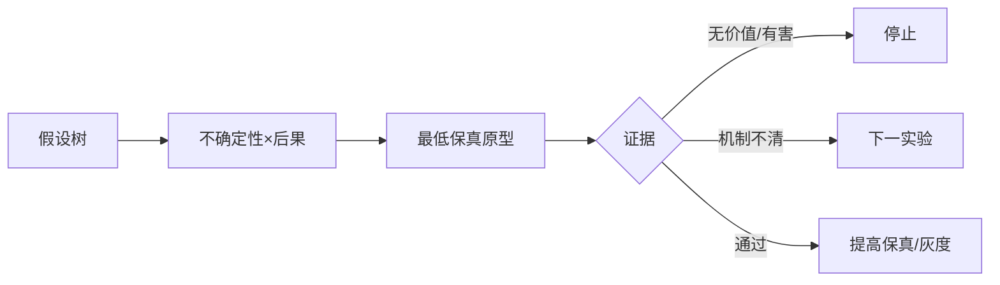

# 05 · 原型、实验与需求收敛

> 一句话点题：MVP 不是功能最少的产品，而是用最低成本产生最大决策信息的实验；高保真代码常常是最昂贵的学习方式。

<div class="lesson-meta"><span>AIPM13—AIPM14—AIPM15</span><span>核心主线</span><span>预计 6 × 45 分钟</span><span>证据截止 2026-08-30</span></div>

## 解锁与跳过

有评测合同和至少一个高风险未知。 即使你使用 AI 完成实现，也不能跳过本章的变量定义、反例和评测设计；这些部分决定你是否有能力发现一个“运行正常但结论错误”的系统。

## 本章可观察目标

完成后你能：选择验证最高风险假设的最小原型；区分可用性、能力和价值实验；预注册样本量、停止与回滚。阅读完成不计掌握；至少需要一次不看答案的解释、一次实际应用和一次边界判断。

## 研究问题：如何用最小原型验证风险最高的假设，而非堆功能？

自主行程规划看似需要全栈 Agent，但最大未知是用户是否愿意授权自动预订。可先由人工幕后生成方案、只让用户审阅模拟确认；若信任与控制失败，就无需先做复杂工具链。

问题必须被写成“输入、状态、动作/输出、损失、约束、证据和停止条件”的组合。只写“提升效果”会把数据、算法、交互与业务结果混在一起，也无法设计反事实或消融。

## 三个知识节点怎样连接

| 节点 | 核心对象 | 最小充分解释 | 必须支持的决策 |
|---|---|---|---|
| AIPM13 | 风险优先原型 | 用最小保真度验证最不确定且最致命假设 | 该做纸面、礼宾、Wizard-of-Oz 还是代码 |
| AIPM14 | 因果实验 | 对照、随机化和干扰控制识别产品改变的效果 | 观察提升是否真由系统造成 |
| AIPM15 | 停止规则 | 在实验前定义成功、无效、有害与资源上限 | 何时停止堆功能 |

三者不是并列名词：第一个节点通常建立对象和假设，第二个节点解释机制，第三个节点把机制放进测量或交付边界。缺任何一层，都容易把局部指标误当成系统结论。

## 核心机制：假设树、原型保真与顺序实验

把结果拆为 desirability、feasibility、viability、safety 假设，按不确定性×后果排序。纸面测理解，Wizard-of-Oz 测交互价值，离线回放测能力，影子模式测真实分布，受控灰度测行为结果。每阶段只增加回答下一个问题所需保真。

理解机制时要区分三种量：**被设计者直接控制的变量**、**环境或数据生成过程决定的变量**、**只能通过代理指标观测的潜变量**。可靠实验一次只改变主要因子，其余配置进入版本化运行记录。

## 关键公式、假设与推导

最小样本由基线 $p_0$、最小可接受效应 $\delta$、显著性和功效决定；顺序检验必须使用有效边界，不能每天偷看后随意停止。决策价值可近似 $VOI=E[value\ after\ info]-value\ now-cost\ experiment$。

公式不是装饰。逐项检查：

- 实验是在测可用性、模型能力还是业务因果
- 处理组和对照组是否同时期可比
- 跨用户/团队是否有污染
- 伤害指标是否实时可停止

若假设不成立，正确做法不是继续套公式，而是换估计量、改采样/实验设计、缩小结论或明确拒绝自动决策。

## 证据拆解1：Wizard of Oz Method

### 研究问题

在能力尚未实现前能否研究人机交互？

### 核心机制、实验与指标

由人类在幕后模拟系统响应，让用户体验目标交互并暴露需求与控制问题。

方法成为语音、对话和智能系统早期研究经典工具。

### 真正贡献、局限与适用边界

把学习与昂贵实现解耦。 人工模拟可能比真实系统更聪明/一致，必须记录可自动化性和操作成本。

## 证据拆解2：Online Controlled Experiments

### 研究问题

产品改动如何通过随机实验识别因果效果？

### 核心机制、实验与指标

系统总结随机化单位、指标、方差、网络效应和实验诊断。

大量互联网实践表明预实验检查与护栏是可靠 A/B 基础。

### 真正贡献、局限与适用边界

为 AI 功能的价值验证提供因果骨架。 AI 输出非确定、稀有事故和长周期影响需要额外风险设计。

## 从论文或标准到产品主张：证据审计

| 日期 | 一手来源 | 它真正回答的问题 | 不能据此外推什么 |
|---|---|---|---|
| 1984-01-01 | Wizard of Oz Method | 在能力尚未实现前能否研究人机交互？ | 人工模拟可能比真实系统更聪明/一致，必须记录可自动化性和操作成本。 |
| 2017-05-01 | Online Controlled Experiments | 产品改动如何通过随机实验识别因果效果？ | AI 输出非确定、稀有事故和长周期影响需要额外风险设计。 |

阅读来源时按四步记录：先抄下研究对象、比较基线、数据/场景和预算，再定位结果表或正式条文；随后区分作者直接观察、由结果支持的解释和你准备迁移到项目的推论；最后为推论写一个能推翻它的反例。**来源新并不等于证据强**：预印本、公司技术报告、正式标准、法规和独立复现承担的证明责任不同。数字必须连同分母、置信区间、硬件/本体、语言/人群与失败样本一起保存。

如果来源只证明组件指标改善，不得自动升级成端到端任务、真实用户价值、物理安全或合规结论。迁移到自己的项目时至少保留一个原方法基线、一个更简单基线和一个不使用该能力的基线；结果冲突时，优先检查任务定义、样本污染、资源预算、评价器偏差和运行边界，而不是挑选最符合预期的一项。

## 机制图：从输入到可验证结果



图中每条边都应能对应日志、数据版本、物理状态或人工记录；无法观测的边必须标为假设，不允许用模型的一段解释代替真实状态。

## 贯穿案例：自动预订旅行助手

先用 Wizard-of-Oz 生成三个带证据方案，模拟但不真实下单；测用户理解、修改、授权边界与人工服务时间。只有愿意授权且后台处理可规模化才接工具 sandbox，先影子比较价格/约束，再小额可撤销灰度。

案例的重点不是跑出最高分，而是保存“为什么选择这条路径”的证据：基线是什么、哪个假设最危险、失败怎样分层、什么条件触发降级或人工接管。

## 复现任务：最小因果链

1. 画四类假设树并选最危险一个
2. 选择能产生反证的最低保真原型
3. 预注册主指标、护栏、样本和停止
4. 记录人工幕后工作，判断是否可自动化

复现不是成功运行作者代码。你必须固定数据/环境、预算和评价器，至少重复三次，报告均值、离散程度、失败样本和资源消耗；若只能跑一次，要把结论降级为演示证据。

## 三轮实验与消融路线

**第一轮：测量链校准。** 只运行最简单基线，检查输入单位、时间/坐标/权限、随机种子、日志和评价器。抽取成功与失败样本人工复核；若真值或测量本身不稳定，停止模型比较。输出必须能回答“同一次运行能否被另一人重放”。

**第二轮：机制消融。** 在同一数据、预算、硬件或运行条件下，一次只加入一个关键机制；对每次变化写预期影响、未变化项和失败阈值。除了主指标，还要检查最坏切片、过程约束、P95/P99、资源与人工成本。若提升只在一个方便切片出现，应缩小能力声明。

**第三轮：边界与迁移。** 有计划地改变本章公式假设或 ODD：时间、人群、语言、对象、气象、本体、延迟、权限或供应商至少选择两项；注入缺失、冲突和失效。记录系统是正确拒绝/降级/接管，还是带着错误自信继续。最终产物不是“最佳分数”，而是一个可复核的能力范围、反例集和下一次变更会触发的回归集合。

## 实验与指标

| 维度 | 至少记录什么 | 为什么 |
|---|---|---|
| 任务质量 | 主指标、分层指标、置信区间和失败类型 | 平均分不能说明关键场景是否可用 |
| 系统表现 | 端到端时延、成功率、降级/拒绝和人工介入 | 局部模型分数不是用户任务结果 |
| 资源经济 | 训练/推理/标注成本、吞吐、容量与能耗 | 确认改进在真实预算下仍成立 |
| 风险运维 | 漂移、越权、事故、恢复时间和残余风险 | 把一次实验转化成可持续服务 |

同时保留一个简单基线和一个“什么都不做/人工流程”基线。复杂方案只有在质量、成本、时延、风险或可扩展性至少一个维度形成可重复净收益时才晋级。

## 对产品、系统或研究架构的影响

- 原型保真度随证据升级
- 功能路线图改为假设队列
- 灰度前完成撤销、客服和赔付流程
- 无最小效应或超预算即停止

这些决策应进入 PRD、实验卡、接口契约、安全案例或 ADR，而不只留在学习笔记。模型、数据、提示、硬件、环境与评价器任何一个升级，都要能触发有范围的回归测试。

## 会死在哪里

- 把可点击原型当价值证据
- Wizard 人工服务不可规模化却忽略
- 频繁偷看 A/B
- 同时改多个因子
- 没有伤害停止开关

失败分析要写“触发条件—可观测信号—影响—检测—缓解—残余风险”。只写“模型可能出错”没有工程价值。

## 与 AI 协作模板

```text
把功能计划改写为 desirability/feasibility/viability/safety 假设树，按不确定性×后果排序；为首项给最低保真原型、反证、主指标、护栏、样本和停止规则。
```

使用模板后仍需检查 AI 是否虚构来源、混用时间口径、悄悄改变任务定义，或把模拟结果外推到真实系统。

## 练习：用一天实验替代一个月开发

选择一个 AI 功能，设计纸面或 Wizard-of-Oz 原型，实际找 3 人完成任务；提交观察、幕后成本、反证和下一步/停止决策。

提交物必须包含一个反例或失败样本。只有成功案例会让你误以为已经掌握；边界证据才能说明你知道方法何时不该用。

## 常见误区

MVP 就是功能少；越像真实产品学习越多；A/B 自然无偏；没有显著差异就证明等价；用户喜欢 demo 就会付费。共同根因是把一个条件成立时的局部结论，扩张成不带条件的能力判断。

## 自测

<Quiz question="最大未知是用户是否授权自动执行，最合适首个实验？" :options='["先接全部生产 API","模拟执行并明确授权/撤销，观察真实选择","训练更大模型"]' :answer="1" explanation="低保真可直接验证控制与信任假设。" />

## 本章小结

- 原型为决策信息服务
- 风险最高假设先测
- 因果实验需预注册和护栏
- 停止也是成功学习

<EvidenceTracker lesson="field-ai-product-05-prototype-experiment" />

## 本章完成标准

不看正文解释 MVP 与风险优先原型的区别；完成 一份预注册实验卡；能指出 高保真原型反而浪费的情形。最近相关题平均至少 7/10 才标记为 basic；跨日期完成变式任务并达到 8.5/10，才标记为 proficient。

<div class="source-note">主要来源（证据截止 2026-08-30）：<a href="https://dl.acm.org/doi/10.1145/800049.801973">Wizard of Oz</a>、<a href="https://experimentguide.com/">Experiment Guide</a>。数字只描述来源中的实验设置；标准、法规与产品能力均按页面版本和适用范围解释。</div>
