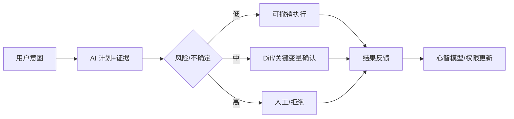

# 06 · AI UX、信任与人机控制

> 一句话点题：好的 AI UX 不是让模型永远显得聪明，而是让用户准确预测其能力、发现错误、保持控制并从失败中恢复。

<div class="lesson-meta"><span>AIPM16—AIPM17—AIPM18</span><span>核心主线</span><span>预计 6 × 45 分钟</span><span>证据截止 2026-08-30</span></div>

## 解锁与跳过

有可运行原型、错误本体和明确人工责任。 即使你使用 AI 完成实现，也不能跳过本章的变量定义、反例和评测设计；这些部分决定你是否有能力发现一个“运行正常但结论错误”的系统。

## 本章可观察目标

完成后你能：设计可预测、可检查、可撤销和可接管交互；校准信任而非最大化信任；保护用户技能、知情与决策自主。阅读完成不计掌握；至少需要一次不看答案的解释、一次实际应用和一次边界判断。

## 研究问题：不确定、等待、纠错、拒绝和人工接管应该怎样呈现？

界面给所有建议显示同样绿色勾，用户把语言流畅当可靠；确认弹窗重复出现后形成机械点击。应按动作风险设计渐进权限，在决策点展示来源/差异/不确定，并让确认包含真正可判断的信息。

问题必须被写成“输入、状态、动作/输出、损失、约束、证据和停止条件”的组合。只写“提升效果”会把数据、算法、交互与业务结果混在一起，也无法设计反事实或消融。

## 三个知识节点怎样连接

| 节点 | 核心对象 | 最小充分解释 | 必须支持的决策 |
|---|---|---|---|
| AIPM16 | 不确定性表达 | 用证据、范围和行动后果呈现系统不知道什么 | 何时回答、请求信息或拒绝 |
| AIPM17 | 人机控制 | 预览、确认、撤销、权限和接管形成可恢复闭环 | 高风险动作需要多少摩擦 |
| AIPM18 | 信任与技能 | 用户依据反馈形成依赖和验证习惯 | 产品是否造成过度依赖或能力退化 |

三者不是并列名词：第一个节点通常建立对象和假设，第二个节点解释机制，第三个节点把机制放进测量或交付边界。缺任何一层，都容易把局部指标误当成系统结论。

## 核心机制：信任校准与可逆行动

展示 uncertainty 要连接下一动作：缺资料→请求，低置信/高风险→人工，来源冲突→并列，系统限制→拒绝。预览以 diff、证据和后果呈现；确认不是‘是否继续’，而是让用户验证关键变量。可撤销、幂等与审计让错误恢复真实存在。

理解机制时要区分三种量：**被设计者直接控制的变量**、**环境或数据生成过程决定的变量**、**只能通过代理指标观测的潜变量**。可靠实验一次只改变主要因子，其余配置进入版本化运行记录。

## 关键公式、假设与推导

信任校准可看 reliance 与 correctness 的匹配：过度依赖 $OR=P(accept|wrong)$，低度依赖 $UR=P(reject|right)$。UX 优化需同时降低两者和任务成本；仅提升 accept rate 会鼓励错误目标。

公式不是装饰。逐项检查：

- 置信来自校准概率还是装饰性措辞
- 用户是否有足够信息审查
- 撤销在真实系统是否完整生效
- 长期技能与短期速度是否并测

若假设不成立，正确做法不是继续套公式，而是换估计量、改采样/实验设计、缩小结论或明确拒绝自动决策。

## 证据拆解1：People + AI Guidebook

### 研究问题

人机 AI 产品有哪些可复用交互问题？

### 核心机制、实验与指标

指南覆盖用户需求、数据、心智模型、解释、反馈、错误与控制，并以活动帮助团队落地。

大量案例把抽象责任原则转为界面和流程检查。

### 真正贡献、局限与适用边界

提供 AI PM/设计/工程共同语言。 实践指南不是因果证据；具体模式需在用户和风险场景验证。

## 证据拆解2：AI Assistance Coding Skills RCT

### 研究问题

产品使用方式怎样影响学习？

### 核心机制、实验与指标

随机实验在任务后测技能，并分析不同 AI 交互策略。

平均技能掌握下降约 17%，但主动提问、解释等模式更有利。

### 真正贡献、局限与适用边界

支持把认知参与设计成体验指标。 短期编码任务不应外推所有知识工作。

## 从论文或标准到产品主张：证据审计

| 日期 | 一手来源 | 它真正回答的问题 | 不能据此外推什么 |
|---|---|---|---|
| 2019-01-01 | People + AI Guidebook | 人机 AI 产品有哪些可复用交互问题？ | 实践指南不是因果证据；具体模式需在用户和风险场景验证。 |
| 2026-01-29 | AI Assistance Coding Skills RCT | 产品使用方式怎样影响学习？ | 短期编码任务不应外推所有知识工作。 |

阅读来源时按四步记录：先抄下研究对象、比较基线、数据/场景和预算，再定位结果表或正式条文；随后区分作者直接观察、由结果支持的解释和你准备迁移到项目的推论；最后为推论写一个能推翻它的反例。**来源新并不等于证据强**：预印本、公司技术报告、正式标准、法规和独立复现承担的证明责任不同。数字必须连同分母、置信区间、硬件/本体、语言/人群与失败样本一起保存。

如果来源只证明组件指标改善，不得自动升级成端到端任务、真实用户价值、物理安全或合规结论。迁移到自己的项目时至少保留一个原方法基线、一个更简单基线和一个不使用该能力的基线；结果冲突时，优先检查任务定义、样本污染、资源预算、评价器偏差和运行边界，而不是挑选最符合预期的一项。

## 机制图：从输入到可验证结果



图中每条边都应能对应日志、数据版本、物理状态或人工记录；无法观测的边必须标为假设，不允许用模型的一段解释代替真实状态。

## 贯穿案例：财务报销审核助手

低风险归类可批量预览撤销；金额、税务主体和疑似欺诈只给证据并转人工。界面高亮原文差异、显示规则来源和缺失材料，不展示未经校准百分比。测错误建议接受率、人工时间、撤销成功与一月后政策理解。

案例的重点不是跑出最高分，而是保存“为什么选择这条路径”的证据：基线是什么、哪个假设最危险、失败怎样分层、什么条件触发降级或人工接管。

## 复现任务：最小因果链

1. 列出每个 AI 状态用户需知道和能做什么
2. 按动作后果设计自动/预览/确认/人工层级
3. 用错误模型原型做可用性测试，不只测成功
4. 记录 accept/reject 与真实正确性构成校准矩阵

复现不是成功运行作者代码。你必须固定数据/环境、预算和评价器，至少重复三次，报告均值、离散程度、失败样本和资源消耗；若只能跑一次，要把结论降级为演示证据。

## 三轮实验与消融路线

**第一轮：测量链校准。** 只运行最简单基线，检查输入单位、时间/坐标/权限、随机种子、日志和评价器。抽取成功与失败样本人工复核；若真值或测量本身不稳定，停止模型比较。输出必须能回答“同一次运行能否被另一人重放”。

**第二轮：机制消融。** 在同一数据、预算、硬件或运行条件下，一次只加入一个关键机制；对每次变化写预期影响、未变化项和失败阈值。除了主指标，还要检查最坏切片、过程约束、P95/P99、资源与人工成本。若提升只在一个方便切片出现，应缩小能力声明。

**第三轮：边界与迁移。** 有计划地改变本章公式假设或 ODD：时间、人群、语言、对象、气象、本体、延迟、权限或供应商至少选择两项；注入缺失、冲突和失效。记录系统是正确拒绝/降级/接管，还是带着错误自信继续。最终产物不是“最佳分数”，而是一个可复核的能力范围、反例集和下一次变更会触发的回归集合。

## 实验与指标

| 维度 | 至少记录什么 | 为什么 |
|---|---|---|
| 任务质量 | 主指标、分层指标、置信区间和失败类型 | 平均分不能说明关键场景是否可用 |
| 系统表现 | 端到端时延、成功率、降级/拒绝和人工介入 | 局部模型分数不是用户任务结果 |
| 资源经济 | 训练/推理/标注成本、吞吐、容量与能耗 | 确认改进在真实预算下仍成立 |
| 风险运维 | 漂移、越权、事故、恢复时间和残余风险 | 把一次实验转化成可持续服务 |

同时保留一个简单基线和一个“什么都不做/人工流程”基线。复杂方案只有在质量、成本、时延、风险或可扩展性至少一个维度形成可重复净收益时才晋级。

## 对产品、系统或研究架构的影响

- 不确定性必须触发具体可选动作
- 确认展示关键差异而非通用警告
- 权限从只读逐级获得且可撤销
- 技能保持进入长期产品指标

这些决策应进入 PRD、实验卡、接口契约、安全案例或 ADR，而不只留在学习笔记。模型、数据、提示、硬件、环境与评价器任何一个升级，都要能触发有范围的回归测试。

## 会死在哪里

- 用语气表达置信
- 弹窗疲劳代替控制
- 解释太长却无可行动证据
- 接受率当信任成功
- 人工接管没有上下文

失败分析要写“触发条件—可观测信号—影响—检测—缓解—残余风险”。只写“模型可能出错”没有工程价值。

## 与 AI 协作模板

```text
审查 AI 交互的每个状态：用户看见什么、能验证什么、错误后能否撤销、何时接管；输出自动/预览/确认/拒绝权限矩阵，并设计过度依赖与技能保持指标。
```

使用模板后仍需检查 AI 是否虚构来源、混用时间口径、悄悄改变任务定义，或把模拟结果外推到真实系统。

## 练习：设计一次失败也可用的体验

为一个写动作画正常、低置信、来源冲突、工具失败和越权五条流程；让 3 人判断是否执行，比较其选择与真实正确性。

提交物必须包含一个反例或失败样本。只有成功案例会让你误以为已经掌握；边界证据才能说明你知道方法何时不该用。

## 常见误区

用户越信任越好；显示百分比就是透明；确认一步保证责任；可撤销按钮等于后端可恢复；解释越详细越安全。共同根因是把一个条件成立时的局部结论，扩张成不带条件的能力判断。

## 自测

<Quiz question="用户总接受流畅但错误建议，应该优化什么？" :options='["接受率","错误时接受概率与关键证据/控制设计","回答长度"]' :answer="1" explanation="目标是信任与正确性匹配，而不是最大化依赖。" />

## 本章小结

- 信任要校准不是最大化
- 不确定性连接行动
- 高风险动作需要真实可逆与接管
- 产品也要保护用户能力

<EvidenceTracker lesson="field-ai-product-06-ux-trust-control" />

## 本章完成标准

不看正文解释 过度依赖和低度依赖；完成 一个风险分级控制矩阵；能指出 解释不能解决的控制风险。最近相关题平均至少 7/10 才标记为 basic；跨日期完成变式任务并达到 8.5/10，才标记为 proficient。

<div class="source-note">主要来源（证据截止 2026-08-30）：<a href="https://pair.withgoogle.com/guidebook/">PAIR Guidebook</a>、<a href="https://www.anthropic.com/research/AI-assistance-coding-skills">AI Skills RCT</a>。数字只描述来源中的实验设置；标准、法规与产品能力均按页面版本和适用范围解释。</div>
