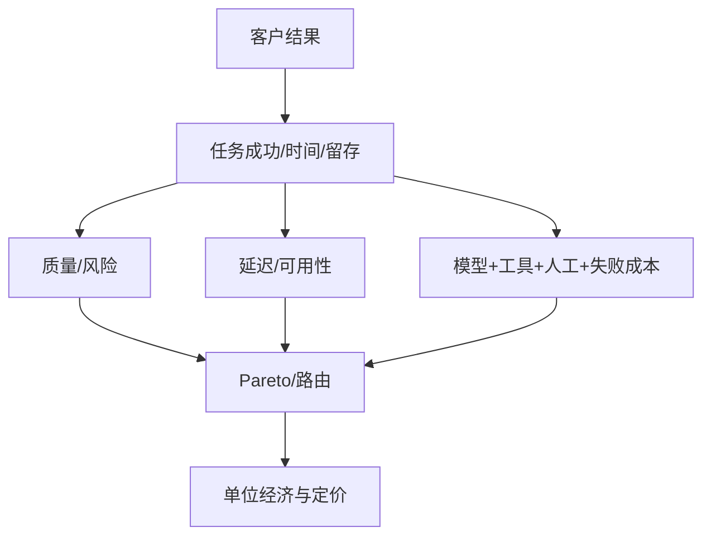

# 07 · 指标、成本与单位经济

> 一句话点题：Token 便宜不等于产品经济性改善；更长上下文、更高重试、人工审查和失败补偿可能把单次调用降价全部吃掉。

<div class="lesson-meta"><span>AIPM19—AIPM20—AIPM21</span><span>核心主线</span><span>预计 6 × 45 分钟</span><span>证据截止 2026-08-30</span></div>

## 解锁与跳过

已有任务成功指标、风险护栏和候选架构。 即使你使用 AI 完成实现，也不能跳过本章的变量定义、反例和评测设计；这些部分决定你是否有能力发现一个“运行正常但结论错误”的系统。

## 本章可观察目标

完成后你能：建立结果—任务—系统三层指标树；测质量、延迟、成本与容量 Pareto；计算含人工、失败和平台成本的单位经济。阅读完成不计掌握；至少需要一次不看答案的解释、一次实际应用和一次边界判断。

## 研究问题：Token 成本下降时，为什么产品毛利和用户价值仍可能恶化？

摘要模型单次成本降 50%，但新版本输出更长、重试更多、人工修订没有下降，客户成功团队还需处理更多争议。若只报每百万 token 价格，会错误扩张。应算每个通过质量门槛的成功任务成本。

问题必须被写成“输入、状态、动作/输出、损失、约束、证据和停止条件”的组合。只写“提升效果”会把数据、算法、交互与业务结果混在一起，也无法设计反事实或消融。

## 三个知识节点怎样连接

| 节点 | 核心对象 | 最小充分解释 | 必须支持的决策 |
|---|---|---|---|
| AIPM19 | 指标树 | 业务结果由用户任务和系统行为逐层连接 | 哪个领先指标可驱动迭代 |
| AIPM20 | 质量成本延迟 | 模型、检索、缓存与路由形成多目标前沿 | 何时用更强模型 |
| AIPM21 | 单位经济 | 每个成功任务的全部可变与分摊成本 | 规模增加会改善还是放大亏损 |

三者不是并列名词：第一个节点通常建立对象和假设，第二个节点解释机制，第三个节点把机制放进测量或交付边界。缺任何一层，都容易把局部指标误当成系统结论。

## 核心机制：指标树与成功任务成本

North Star 连接客户结果，任务层记录完成/时间/修订，系统层记录召回、模型、工具、延迟和失败。路由器按风险/难度选择模型，缓存和批处理降低成本，但不能改变语义版本。容量模型用到达率、并发和服务时间预测 P95 与降级。

理解机制时要区分三种量：**被设计者直接控制的变量**、**环境或数据生成过程决定的变量**、**只能通过代理指标观测的潜变量**。可靠实验一次只改变主要因子，其余配置进入版本化运行记录。

## 关键公式、假设与推导

单位成功成本 $C_s=(C_{model}+C_{retrieval}+C_{tools}+C_{human}+C_{failure}+C_{platform})/N_{successful}$；毛利 $GM=(Revenue-variable\ cost)/Revenue$。Little 定律 $L=\lambda W$ 帮助估算并发，但长尾和限流需排队仿真。

公式不是装饰。逐项检查：

- 成功分母是否通过质量与风险门槛
- 人工审查和返工是否计入
- token 价格是否含缓存/批量/区域差异
- 高峰 P95 和故障降级是否可承受

若假设不成立，正确做法不是继续套公式，而是换估计量、改采样/实验设计、缩小结论或明确拒绝自动决策。

## 证据拆解1：AI Index 2026: Cost Trends

### 研究问题

推理成本和能力趋势怎样改变产品选型？

### 核心机制、实验与指标

报告按可比较能力与时间整理训练、推理与产业数据。

显示部分能力价格快速下降，同时高端训练、能耗和采用结构继续变化。

### 真正贡献、局限与适用边界

支持动态路由和持续重算商业模型。 公开价格不等于企业实际总成本，质量基准也未必匹配产品。

## 证据拆解2：Economic Index 2026

### 研究问题

AI 使用的任务结构与自动化程度怎样影响价值估算？

### 核心机制、实验与指标

任务级使用数据揭示不同职业、地区与交互形式的采用差异。

真实使用并非均匀自动化，许多场景仍是增强与多轮协作。

### 真正贡献、局限与适用边界

提醒容量和价值模型基于任务结构。 厂商平台样本与分类口径限制整体经济推断。

## 从论文或标准到产品主张：证据审计

| 日期 | 一手来源 | 它真正回答的问题 | 不能据此外推什么 |
|---|---|---|---|
| 2026-04-06 | AI Index 2026: Cost Trends | 推理成本和能力趋势怎样改变产品选型？ | 公开价格不等于企业实际总成本，质量基准也未必匹配产品。 |
| 2026-06-10 | Economic Index 2026 | AI 使用的任务结构与自动化程度怎样影响价值估算？ | 厂商平台样本与分类口径限制整体经济推断。 |

阅读来源时按四步记录：先抄下研究对象、比较基线、数据/场景和预算，再定位结果表或正式条文；随后区分作者直接观察、由结果支持的解释和你准备迁移到项目的推论；最后为推论写一个能推翻它的反例。**来源新并不等于证据强**：预印本、公司技术报告、正式标准、法规和独立复现承担的证明责任不同。数字必须连同分母、置信区间、硬件/本体、语言/人群与失败样本一起保存。

如果来源只证明组件指标改善，不得自动升级成端到端任务、真实用户价值、物理安全或合规结论。迁移到自己的项目时至少保留一个原方法基线、一个更简单基线和一个不使用该能力的基线；结果冲突时，优先检查任务定义、样本污染、资源预算、评价器偏差和运行边界，而不是挑选最符合预期的一项。

## 机制图：从输入到可验证结果



图中每条边都应能对应日志、数据版本、物理状态或人工记录；无法观测的边必须标为假设，不允许用模型的一段解释代替真实状态。

## 贯穿案例：企业文档审核 SaaS

按简单分类、普通抽取和高风险审查三类路由。分母只计算满足准确、证据和时限的任务；成本含 OCR、检索、模型、人工复核、重试与客户补偿。用真实到达曲线压测并设高峰降级：延迟超限转小模型/队列，高风险不降级为自动通过。

案例的重点不是跑出最高分，而是保存“为什么选择这条路径”的证据：基线是什么、哪个假设最危险、失败怎样分层、什么条件触发降级或人工接管。

## 复现任务：最小因果链

1. 画结果—任务—系统指标树
2. 逐请求追踪 token、工具、重试和人工成本
3. 按质量门槛画候选方案 Pareto
4. 用高峰到达与故障场景做容量/毛利敏感性

复现不是成功运行作者代码。你必须固定数据/环境、预算和评价器，至少重复三次，报告均值、离散程度、失败样本和资源消耗；若只能跑一次，要把结论降级为演示证据。

## 三轮实验与消融路线

**第一轮：测量链校准。** 只运行最简单基线，检查输入单位、时间/坐标/权限、随机种子、日志和评价器。抽取成功与失败样本人工复核；若真值或测量本身不稳定，停止模型比较。输出必须能回答“同一次运行能否被另一人重放”。

**第二轮：机制消融。** 在同一数据、预算、硬件或运行条件下，一次只加入一个关键机制；对每次变化写预期影响、未变化项和失败阈值。除了主指标，还要检查最坏切片、过程约束、P95/P99、资源与人工成本。若提升只在一个方便切片出现，应缩小能力声明。

**第三轮：边界与迁移。** 有计划地改变本章公式假设或 ODD：时间、人群、语言、对象、气象、本体、延迟、权限或供应商至少选择两项；注入缺失、冲突和失效。记录系统是正确拒绝/降级/接管，还是带着错误自信继续。最终产物不是“最佳分数”，而是一个可复核的能力范围、反例集和下一次变更会触发的回归集合。

## 实验与指标

| 维度 | 至少记录什么 | 为什么 |
|---|---|---|
| 任务质量 | 主指标、分层指标、置信区间和失败类型 | 平均分不能说明关键场景是否可用 |
| 系统表现 | 端到端时延、成功率、降级/拒绝和人工介入 | 局部模型分数不是用户任务结果 |
| 资源经济 | 训练/推理/标注成本、吞吐、容量与能耗 | 确认改进在真实预算下仍成立 |
| 风险运维 | 漂移、越权、事故、恢复时间和残余风险 | 把一次实验转化成可持续服务 |

同时保留一个简单基线和一个“什么都不做/人工流程”基线。复杂方案只有在质量、成本、时延、风险或可扩展性至少一个维度形成可重复净收益时才晋级。

## 对产品、系统或研究架构的影响

- 用每成功任务成本而非每调用成本
- 高风险路由不以便宜覆盖安全
- 定价与价值单位而非 token 绑定
- 成本/质量漂移触发路由回归

这些决策应进入 PRD、实验卡、接口契约、安全案例或 ADR，而不只留在学习笔记。模型、数据、提示、硬件、环境与评价器任何一个升级，都要能触发有范围的回归测试。

## 会死在哪里

- 忽略人工与失败成本
- 用平均延迟替代 P95/P99
- 缓存跨权限/版本复用
- 把拒绝算失败但不看风险
- 规模预测假设重试率不变

失败分析要写“触发条件—可观测信号—影响—检测—缓解—残余风险”。只写“模型可能出错”没有工程价值。

## 与 AI 协作模板

```text
建立 AI 产品指标树与单位经济：结果、任务、系统；计算每成功任务的模型/检索/工具/人工/失败/平台成本，按风险切片画质量—P95—成本 Pareto，并做 2× 流量和故障敏感性。
```

使用模板后仍需检查 AI 是否虚构来源、混用时间口径、悄悄改变任务定义，或把模拟结果外推到真实系统。

## 练习：算清一项 AI 功能的真实毛利

采样 50 次任务，记录完整成本和是否通过验收；比较两模型与一路由方案，提交每成功任务成本、P95 和三种流量情景。

提交物必须包含一个反例或失败样本。只有成功案例会让你误以为已经掌握；边界证据才能说明你知道方法何时不该用。

## 常见误区

Token 降价等于毛利提升；平均成本足够；大模型只用于高价值就合理；缓存不影响正确性；拒答一定降低价值。共同根因是把一个条件成立时的局部结论，扩张成不带条件的能力判断。

## 自测

<Quiz question="单次调用降价但人工修订增加，应看哪个核心量？" :options='["每百万 token 价","每个通过质量门槛的成功任务总成本","模型参数"]' :answer="1" explanation="单位经济必须把人工和失败纳入同一分母。" />

## 本章小结

- 指标树连接系统与结果
- 选型是多目标 Pareto
- 单位成功成本含隐藏劳动
- 容量与降级必须情景化

<EvidenceTracker lesson="field-ai-product-07-metrics-economics" />

## 本章完成标准

不看正文解释 调用成本与成功任务成本；完成 一份端到端单位经济模型；能指出 不能为成本自动降级的请求。最近相关题平均至少 7/10 才标记为 basic；跨日期完成变式任务并达到 8.5/10，才标记为 proficient。

<div class="source-note">主要来源（证据截止 2026-08-30）：<a href="https://hai.stanford.edu/assets/files/ai_index_report_2026.pdf">AI Index 2026</a>、<a href="https://www.anthropic.com/research/economic-index-june-2026-report">Economic Index 2026</a>。数字只描述来源中的实验设置；标准、法规与产品能力均按页面版本和适用范围解释。</div>
