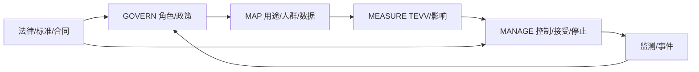

# 08 · 安全、隐私与治理

> 一句话点题：治理不是上线前填表，而是把允许用途、数据、动作、责任、证据和退出持续编码进产品与组织。

<div class="lesson-meta"><span>AIPM22—AIPM23—AIPM24</span><span>核心主线</span><span>预计 6 × 45 分钟</span><span>证据截止 2026-08-30</span></div>

## 解锁与跳过

已有数据流、动作权限、目标市场和风险分级。 即使你使用 AI 完成实现，也不能跳过本章的变量定义、反例和评测设计；这些部分决定你是否有能力发现一个“运行正常但结论错误”的系统。

## 本章可观察目标

完成后你能：把 NIST 风险流程映射到产品生命周期；建立 ISO 42001 式责任与证据体系；按 EU AI Act 等适用规则做义务分析。阅读完成不计掌握；至少需要一次不看答案的解释、一次实际应用和一次边界判断。

## 研究问题：谁能批准模型接触哪些数据、做哪些动作、承担什么后果？

招聘助手处理简历并排序，涉及敏感信息、潜在高风险用途、供应商模型和人工决策。删姓名不足以消除代理偏差；免责声明也不能替代影响评估、数据权利、监督有效性与日志。

问题必须被写成“输入、状态、动作/输出、损失、约束、证据和停止条件”的组合。只写“提升效果”会把数据、算法、交互与业务结果混在一起，也无法设计反事实或消融。

## 三个知识节点怎样连接

| 节点 | 核心对象 | 最小充分解释 | 必须支持的决策 |
|---|---|---|---|
| AIPM22 | AI 风险管理 | 治理、映射、测量、处置形成持续闭环 | 哪些风险被接受、缓解或禁止 |
| AIPM23 | 隐私与安全 | 数据最小化、权限、攻击面和供应链共同决定控制 | 模型能看到和做什么 |
| AIPM24 | 合规治理 | 角色、用途和地区触发不同义务与证据 | 谁负责批准、监测和报告 |

三者不是并列名词：第一个节点通常建立对象和假设，第二个节点解释机制，第三个节点把机制放进测量或交付边界。缺任何一层，都容易把局部指标误当成系统结论。

## 核心机制：Govern—Map—Measure—Manage 与管理体系

NIST AI RMF 用 GOVERN 贯穿 MAP/MEASURE/MANAGE；GAI Profile 增补生成 AI 特有风险。ISO/IEC 42001 以管理体系要求组织建立政策、角色、目标、风险、运行控制、审计和改进。法律分析先判角色、系统/用途、地区、禁止或高风险分类，再映射技术/流程证据。

理解机制时要区分三种量：**被设计者直接控制的变量**、**环境或数据生成过程决定的变量**、**只能通过代理指标观测的潜变量**。可靠实验一次只改变主要因子，其余配置进入版本化运行记录。

## 关键公式、假设与推导

风险登记至少含 $risk=(hazard,affected,scenario,severity,likelihood,controls,evidence,residual,owner)$。数据权限可用主体×资源×动作×目的×时间矩阵；残余风险超容忍阈值时必须缩小用途或停止，不能用收益平均。

公式不是装饰。逐项检查：

- 法律适用日期与过渡条款
- 提供者/部署者/进口商等角色
- 人工监督是否真有时间与能力
- 第三方模型/数据/插件供应链责任

若假设不成立，正确做法不是继续套公式，而是换估计量、改采样/实验设计、缩小结论或明确拒绝自动决策。

## 证据拆解1：NIST AI RMF Generative AI Profile

### 研究问题

生成 AI 风险怎样落入可执行风险管理？

### 核心机制、实验与指标

Profile 在 AI RMF 四函数下组织内容来源、虚构、隐私、信息安全、人机配置等风险与行动。

提供跨行业自愿框架，可转为风险登记、TEVV 和治理控制。

### 真正贡献、局限与适用边界

建立生成 AI 产品通用风险词汇。 非强制且不替代地区法律、领域标准或具体安全论证。

## 证据拆解2：ISO/IEC 42001

### 研究问题

组织怎样建立可审计 AI 管理体系？

### 核心机制、实验与指标

标准规定 AI 管理体系的建立、实施、维护和持续改进要求。

可用于把政策、职责、风险与内部审核制度化。

### 真正贡献、局限与适用边界

治理从单项目文档提升为组织能力。 标准付费正文且认证不证明单个模型安全或合法。

## 证据拆解3：EU AI Act applicability

### 研究问题

欧盟 AI Act 到 2026 年的适用节奏与分类是什么？

### 核心机制、实验与指标

官方页面说明风险分级、治理结构与分阶段适用；多数规定自 2026-08-02 起适用，高风险部分另有延展。

为面向欧盟产品提供当前日期基线。

### 真正贡献、局限与适用边界

必须把产品角色/用途映射到具体义务和时间。 官方概览不是法律意见；修订、指南与成员国执行需持续核对。

## 从论文或标准到产品主张：证据审计

| 日期 | 一手来源 | 它真正回答的问题 | 不能据此外推什么 |
|---|---|---|---|
| 2024-07-26 | NIST AI RMF Generative AI Profile | 生成 AI 风险怎样落入可执行风险管理？ | 非强制且不替代地区法律、领域标准或具体安全论证。 |
| 2023-12-18 | ISO/IEC 42001 | 组织怎样建立可审计 AI 管理体系？ | 标准付费正文且认证不证明单个模型安全或合法。 |
| 2026-08-02 | EU AI Act applicability | 欧盟 AI Act 到 2026 年的适用节奏与分类是什么？ | 官方概览不是法律意见；修订、指南与成员国执行需持续核对。 |

阅读来源时按四步记录：先抄下研究对象、比较基线、数据/场景和预算，再定位结果表或正式条文；随后区分作者直接观察、由结果支持的解释和你准备迁移到项目的推论；最后为推论写一个能推翻它的反例。**来源新并不等于证据强**：预印本、公司技术报告、正式标准、法规和独立复现承担的证明责任不同。数字必须连同分母、置信区间、硬件/本体、语言/人群与失败样本一起保存。

如果来源只证明组件指标改善，不得自动升级成端到端任务、真实用户价值、物理安全或合规结论。迁移到自己的项目时至少保留一个原方法基线、一个更简单基线和一个不使用该能力的基线；结果冲突时，优先检查任务定义、样本污染、资源预算、评价器偏差和运行边界，而不是挑选最符合预期的一项。

## 机制图：从输入到可验证结果



图中每条边都应能对应日志、数据版本、物理状态或人工记录；无法观测的边必须标为假设，不允许用模型的一段解释代替真实状态。

## 贯穿案例：招聘排序助手的风险控制

用途限制为给招聘员整理证据，禁止自动淘汰；删除非必要敏感字段但审计代理变量。建立候选人通知/申诉、分群性能、人工覆盖、供应商数据留存、提示注入和越权测试。法务确认角色和适用地区；高风险结论保留来源和决策者。

案例的重点不是跑出最高分，而是保存“为什么选择这条路径”的证据：基线是什么、哪个假设最危险、失败怎样分层、什么条件触发降级或人工接管。

## 复现任务：最小因果链

1. 画数据、模型、工具、第三方和人类决策流
2. 建立风险场景/受影响者/控制/证据/owner 登记
3. 将 NIST 函数、ISO 管理项和适用法律映射
4. 桌面演练泄露、歧视、越权与供应商中断

复现不是成功运行作者代码。你必须固定数据/环境、预算和评价器，至少重复三次，报告均值、离散程度、失败样本和资源消耗；若只能跑一次，要把结论降级为演示证据。

## 三轮实验与消融路线

**第一轮：测量链校准。** 只运行最简单基线，检查输入单位、时间/坐标/权限、随机种子、日志和评价器。抽取成功与失败样本人工复核；若真值或测量本身不稳定，停止模型比较。输出必须能回答“同一次运行能否被另一人重放”。

**第二轮：机制消融。** 在同一数据、预算、硬件或运行条件下，一次只加入一个关键机制；对每次变化写预期影响、未变化项和失败阈值。除了主指标，还要检查最坏切片、过程约束、P95/P99、资源与人工成本。若提升只在一个方便切片出现，应缩小能力声明。

**第三轮：边界与迁移。** 有计划地改变本章公式假设或 ODD：时间、人群、语言、对象、气象、本体、延迟、权限或供应商至少选择两项；注入缺失、冲突和失效。记录系统是正确拒绝/降级/接管，还是带着错误自信继续。最终产物不是“最佳分数”，而是一个可复核的能力范围、反例集和下一次变更会触发的回归集合。

## 实验与指标

| 维度 | 至少记录什么 | 为什么 |
|---|---|---|
| 任务质量 | 主指标、分层指标、置信区间和失败类型 | 平均分不能说明关键场景是否可用 |
| 系统表现 | 端到端时延、成功率、降级/拒绝和人工介入 | 局部模型分数不是用户任务结果 |
| 资源经济 | 训练/推理/标注成本、吞吐、容量与能耗 | 确认改进在真实预算下仍成立 |
| 风险运维 | 漂移、越权、事故、恢复时间和残余风险 | 把一次实验转化成可持续服务 |

同时保留一个简单基线和一个“什么都不做/人工流程”基线。复杂方案只有在质量、成本、时延、风险或可扩展性至少一个维度形成可重复净收益时才晋级。

## 对产品、系统或研究架构的影响

- 风险 owner 与功能 owner 同期任命
- 权限最小化并按目的/时间限制
- 高风险用途保留申诉和人工有效监督
- 合规结论记录日期、角色和法源

这些决策应进入 PRD、实验卡、接口契约、安全案例或 ADR，而不只留在学习笔记。模型、数据、提示、硬件、环境与评价器任何一个升级，都要能触发有范围的回归测试。

## 会死在哪里

- 匿名化等于无偏
- 免责声明替代控制
- 证书等于产品安全
- 人类在环只有确认按钮
- 用旧法律摘要做永久判断

失败分析要写“触发条件—可观测信号—影响—检测—缓解—残余风险”。只写“模型可能出错”没有工程价值。

## 与 AI 协作模板

```text
为该 AI 产品建立风险登记：用途/非用途、受影响者、数据流、权限、威胁、伤害情景、控制、验证、残余风险和 owner；映射 NIST AI RMF、ISO 42001 与目标地区当前法律，标注证据日期和需法律确认项。
```

使用模板后仍需检查 AI 是否虚构来源、混用时间口径、悄悄改变任务定义，或把模拟结果外推到真实系统。

## 练习：完成一次影响评估

选一个涉及个人数据或决策的功能，画数据/动作流，写至少 10 个风险场景和控制证据；用一场桌面事故演练验证接管与通知。

提交物必须包含一个反例或失败样本。只有成功案例会让你误以为已经掌握；边界证据才能说明你知道方法何时不该用。

## 常见误区

合规是法务最后负责；去标识化消除所有隐私；有人工就不是高风险；NIST/ISO 自动满足法律；日志越多越安全。共同根因是把一个条件成立时的局部结论，扩张成不带条件的能力判断。

## 自测

<Quiz question="招聘模型最后由人点击确认，是否自动构成有效监督？" :options='["是","否，还需时间、信息、能力与拒绝/纠正权","只要写免责声明即可"]' :answer="1" explanation="形式上的人类在环不等于能够发现和改变错误。" />

## 本章小结

- 治理贯穿生命周期
- 风险场景连接伤害、控制和证据
- 标准、法律和产品角色需映射
- 残余风险可要求缩小或停止

<EvidenceTracker lesson="field-ai-product-08-safety-privacy-governance" />

## 本章完成标准

不看正文解释 框架、管理体系与法律的差异；完成 一份有 owner 的风险登记；能指出 必须寻求法务/领域授权的判断。最近相关题平均至少 7/10 才标记为 basic；跨日期完成变式任务并达到 8.5/10，才标记为 proficient。

<div class="source-note">主要来源（证据截止 2026-08-30）：<a href="https://www.nist.gov/publications/artificial-intelligence-risk-management-framework-generative-artificial-intelligence">NIST GAI Profile</a>、<a href="https://www.iso.org/standard/42001">ISO 42001</a>、<a href="https://digital-strategy.ec.europa.eu/en/policies/regulatory-framework-ai">EU AI Act</a>。数字只描述来源中的实验设置；标准、法规与产品能力均按页面版本和适用范围解释。</div>
