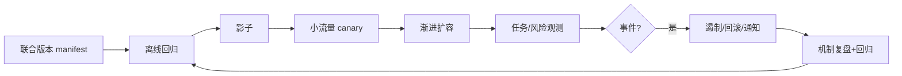

# 09 · 交付、运营与持续改进

> 一句话点题：AI 产品不是发布一次，而是多个不稳定依赖持续变化的运行系统；运营核心是让每次变化可观察、可比较、可回退。

<div class="lesson-meta"><span>AIPM25—AIPM26—AIPM27</span><span>核心主线</span><span>预计 6 × 45 分钟</span><span>证据截止 2026-08-30</span></div>

## 解锁与跳过

评测、权限、风险与回滚均有明确 owner。 即使你使用 AI 完成实现，也不能跳过本章的变量定义、反例和评测设计；这些部分决定你是否有能力发现一个“运行正常但结论错误”的系统。

## 本章可观察目标

完成后你能：建立多组件变更的发布门禁；设计反馈分流、事件响应和恢复；用观测性把线上失败连回可复现回归。阅读完成不计掌握；至少需要一次不看答案的解释、一次实际应用和一次边界判断。

## 研究问题：模型、提示、数据和政策同时变化时怎样安全发布？

供应商静默升级模型后，工具调用 JSON 合法率下降；知识库同时更新使团队无法定位。若没有联合 manifest、影子流量和组件消融，只能凭感觉改 prompt，事故会反复。

问题必须被写成“输入、状态、动作/输出、损失、约束、证据和停止条件”的组合。只写“提升效果”会把数据、算法、交互与业务结果混在一起，也无法设计反事实或消融。

## 三个知识节点怎样连接

| 节点 | 核心对象 | 最小充分解释 | 必须支持的决策 |
|---|---|---|---|
| AIPM25 | 版本与发布 | 模型、prompt、知识、工具、策略和评价器组成联合版本 | 哪些变更需哪些回归 |
| AIPM26 | 运行反馈 | 用户反馈、系统信号和业务结果按机制分流 | 哪些数据值得进入学习闭环 |
| AIPM27 | 事件与恢复 | 检测、遏制、回滚、通知和复盘限制伤害 | 故障时系统怎样安全降级 |

三者不是并列名词：第一个节点通常建立对象和假设，第二个节点解释机制，第三个节点把机制放进测量或交付边界。缺任何一层，都容易把局部指标误当成系统结论。

## 核心机制：联合版本、灰度门禁与事件闭环

Release manifest 记录模型快照、prompt、检索、索引、工具 schema、策略、依赖与评价器。离线门禁→影子→内部→小流量→扩容，每阶段有主指标、护栏与自动停止。事件先冻结证据、限制权限/流量、回退稳定组合，再做无责机制复盘。

理解机制时要区分三种量：**被设计者直接控制的变量**、**环境或数据生成过程决定的变量**、**只能通过代理指标观测的潜变量**。可靠实验一次只改变主要因子，其余配置进入版本化运行记录。

## 关键公式、假设与推导

变更风险 $R_c=blast\ radius\times uncertainty\times irreversibility$ 决定灰度比例。SLO 以任务成功、P95、严重错误和恢复时间定义；error budget 用于平衡发布速度，但安全/合规事故不被普通可用性预算抵消。

公式不是装饰。逐项检查：

- 供应商快照是否真的固定
- 日志能否重放且遵守隐私
- 回滚是否覆盖索引/状态迁移
- 用户反馈是否有选择与表达偏差

若假设不成立，正确做法不是继续套公式，而是换估计量、改采样/实验设计、缩小结论或明确拒绝自动决策。

## 证据拆解1：The ML Test Score

### 研究问题

怎样评价机器学习系统的生产就绪而非离线分数？

### 核心机制、实验与指标

Rubric 覆盖数据、模型、基础设施与监控测试，并以等级推动工程成熟。

大量生产经验展示技术债来自跨组件依赖和变化。

### 真正贡献、局限与适用边界

为 AI 发布门禁提供经典骨架。 生成式系统、Agent 权限与现代供应链需扩充，分数不等于安全认证。

## 证据拆解2：Independent Research on Real-World AI Use

### 研究问题

如何让外部研究者持续评估真实 AI 使用和影响？

### 核心机制、实验与指标

公告提供截至 2026-08 的研究访问/合作方向，强调隐私保护、独立研究与真实使用证据。

说明前沿产品治理正从内部指标扩展到外部可审查证据。

### 真正贡献、局限与适用边界

支持运营数据的独立验证与透明机制。 项目机制和可访问数据范围仍受平台约束，不能替代产品自己的监控。

## 从论文或标准到产品主张：证据审计

| 日期 | 一手来源 | 它真正回答的问题 | 不能据此外推什么 |
|---|---|---|---|
| 2017-03-01 | The ML Test Score | 怎样评价机器学习系统的生产就绪而非离线分数？ | 生成式系统、Agent 权限与现代供应链需扩充，分数不等于安全认证。 |
| 2026-08-26 | Independent Research on Real-World AI Use | 如何让外部研究者持续评估真实 AI 使用和影响？ | 项目机制和可访问数据范围仍受平台约束，不能替代产品自己的监控。 |

阅读来源时按四步记录：先抄下研究对象、比较基线、数据/场景和预算，再定位结果表或正式条文；随后区分作者直接观察、由结果支持的解释和你准备迁移到项目的推论；最后为推论写一个能推翻它的反例。**来源新并不等于证据强**：预印本、公司技术报告、正式标准、法规和独立复现承担的证明责任不同。数字必须连同分母、置信区间、硬件/本体、语言/人群与失败样本一起保存。

如果来源只证明组件指标改善，不得自动升级成端到端任务、真实用户价值、物理安全或合规结论。迁移到自己的项目时至少保留一个原方法基线、一个更简单基线和一个不使用该能力的基线；结果冲突时，优先检查任务定义、样本污染、资源预算、评价器偏差和运行边界，而不是挑选最符合预期的一项。

## 机制图：从输入到可验证结果



图中每条边都应能对应日志、数据版本、物理状态或人工记录；无法观测的边必须标为假设，不允许用模型的一段解释代替真实状态。

## 贯穿案例：工具型客服 Agent 的安全发布

每次发布绑定 8 个组件哈希。影子重放去隐私任务，5% 灰度只读工具；写动作要预览确认。严重错误、工具越权或支持率跌破下界自动断写切换检索回答。事故保留 trace、输入/输出、政策版本与工具返回，24 小时内补回归。

案例的重点不是跑出最高分，而是保存“为什么选择这条路径”的证据：基线是什么、哪个假设最危险、失败怎样分层、什么条件触发降级或人工接管。

## 复现任务：最小因果链

1. 建立联合版本清单和可重放 trace
2. 按风险定义离线/影子/灰度门禁
3. 演练供应商变化、索引损坏和工具超时
4. 把反馈按数据/检索/模型/工具/UX/政策归因

复现不是成功运行作者代码。你必须固定数据/环境、预算和评价器，至少重复三次，报告均值、离散程度、失败样本和资源消耗；若只能跑一次，要把结论降级为演示证据。

## 三轮实验与消融路线

**第一轮：测量链校准。** 只运行最简单基线，检查输入单位、时间/坐标/权限、随机种子、日志和评价器。抽取成功与失败样本人工复核；若真值或测量本身不稳定，停止模型比较。输出必须能回答“同一次运行能否被另一人重放”。

**第二轮：机制消融。** 在同一数据、预算、硬件或运行条件下，一次只加入一个关键机制；对每次变化写预期影响、未变化项和失败阈值。除了主指标，还要检查最坏切片、过程约束、P95/P99、资源与人工成本。若提升只在一个方便切片出现，应缩小能力声明。

**第三轮：边界与迁移。** 有计划地改变本章公式假设或 ODD：时间、人群、语言、对象、气象、本体、延迟、权限或供应商至少选择两项；注入缺失、冲突和失效。记录系统是正确拒绝/降级/接管，还是带着错误自信继续。最终产物不是“最佳分数”，而是一个可复核的能力范围、反例集和下一次变更会触发的回归集合。

## 实验与指标

| 维度 | 至少记录什么 | 为什么 |
|---|---|---|
| 任务质量 | 主指标、分层指标、置信区间和失败类型 | 平均分不能说明关键场景是否可用 |
| 系统表现 | 端到端时延、成功率、降级/拒绝和人工介入 | 局部模型分数不是用户任务结果 |
| 资源经济 | 训练/推理/标注成本、吞吐、容量与能耗 | 确认改进在真实预算下仍成立 |
| 风险运维 | 漂移、越权、事故、恢复时间和残余风险 | 把一次实验转化成可持续服务 |

同时保留一个简单基线和一个“什么都不做/人工流程”基线。复杂方案只有在质量、成本、时延、风险或可扩展性至少一个维度形成可重复净收益时才晋级。

## 对产品、系统或研究架构的影响

- 发布单位是系统组合而非单模型
- 高风险写权限单独开关
- 事件先遏制后根因分析
- 复盘行动必须对应 owner、期限和回归

这些决策应进入 PRD、实验卡、接口契约、安全案例或 ADR，而不只留在学习笔记。模型、数据、提示、硬件、环境与评价器任何一个升级，都要能触发有范围的回归测试。

## 会死在哪里

- 同时变更多个组件
- 回滚只换模型不换索引
- 把 thumbs-down 当真值
- 日志无法复现或泄露敏感信息
- 事故归因‘模型幻觉’后结束

失败分析要写“触发条件—可观测信号—影响—检测—缓解—残余风险”。只写“模型可能出错”没有工程价值。

## 与 AI 协作模板

```text
为这次 AI 系统发布生成 manifest、分层回归、影子/canary 流量、SLO、严重错误停止、降级/回滚和事件演练；把每项监测绑定组件与 owner。
```

使用模板后仍需检查 AI 是否虚构来源、混用时间口径、悄悄改变任务定义，或把模拟结果外推到真实系统。

## 练习：做一次桌面发布与事故演练

模拟模型+知识库更新，写发布清单并注入工具超时/错误权限；记录检测、遏制、回滚和补测用时，输出改进项。

提交物必须包含一个反例或失败样本。只有成功案例会让你误以为已经掌握；边界证据才能说明你知道方法何时不该用。

## 常见误区

模型 API 名称就是固定版本；灰度只看可用性；用户差评都是模型问题；有日志即可重放；回滚天然无状态风险。共同根因是把一个条件成立时的局部结论，扩张成不带条件的能力判断。

## 自测

<Quiz question="模型与知识库同时更新后质量下降，最大流程缺陷是什么？" :options='["用户太少","联合版本与单因子/影子证据不足","模型温度低"]' :answer="1" explanation="无法确定变化来源会阻碍可靠回退和修复。" />

## 本章小结

- 联合版本是发布对象
- 灰度需质量与风险门禁
- 反馈先归因再学习
- 事件闭环以可恢复和回归结束

<EvidenceTracker lesson="field-ai-product-09-delivery-operations" />

## 本章完成标准

不看正文解释 模型版本与系统版本的差异；完成 一份含演练的发布 runbook；能指出 不能自动降级的安全条件。最近相关题平均至少 7/10 才标记为 basic；跨日期完成变式任务并达到 8.5/10，才标记为 proficient。

<div class="source-note">主要来源（证据截止 2026-08-30）：<a href="https://research.google/pubs/the-ml-test-score-a-rubric-for-ml-production-readiness-and-technical-debt-reduction/">ML Test Score</a>、<a href="https://www.anthropic.com/research/enabling-independent-research">Independent AI Research 2026</a>。数字只描述来源中的实验设置；标准、法规与产品能力均按页面版本和适用范围解释。</div>
