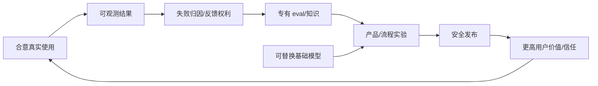

# 10 · 战略、护城河与组织能力

> 一句话点题：当基础模型能力和价格快速商品化，持续优势来自嵌入真实工作、拥有合法反馈、能测量结果并比别人更快安全学习，而不是一组 prompt。

<div class="lesson-meta"><span>AIPM28—AIPM29—AIPM30</span><span>核心主线</span><span>预计 6 × 45 分钟</span><span>证据截止 2026-08-30</span></div>

## 解锁与跳过

完成从机会、评测、经济、治理到运营的闭环。 即使你使用 AI 完成实现，也不能跳过本章的变量定义、反例和评测设计；这些部分决定你是否有能力发现一个“运行正常但结论错误”的系统。

## 本章可观察目标

完成后你能：区分短期模型优势与可累积系统资产；设计数据权利、评测和工作流复利；把组织学习速度变成战略指标。阅读完成不计掌握；至少需要一次不看答案的解释、一次实际应用和一次边界判断。

## 研究问题：模型能力快速商品化后，什么才会形成可持续复利？

竞品可在一周内复制界面和接入同一模型；若产品没有独特分发、系统集成、领域协议、评测资产与反馈权利，先发只是短暂。相反，服务一个窄流程可积累异常、rubric、信任和转换成本。

问题必须被写成“输入、状态、动作/输出、损失、约束、证据和停止条件”的组合。只写“提升效果”会把数据、算法、交互与业务结果混在一起，也无法设计反事实或消融。

## 三个知识节点怎样连接

| 节点 | 核心对象 | 最小充分解释 | 必须支持的决策 |
|---|---|---|---|
| AIPM28 | 护城河资产 | 专有工作流、合法数据、评价器、分发与信任能随使用增值 | 什么资产竞争者难以复制 |
| AIPM29 | 学习飞轮 | 使用产生可归因失败，失败改善评测、系统和流程 | 反馈是否真的提升下一轮 |
| AIPM30 | 组织能力 | 跨产品、领域、工程、风险的决策节奏与责任 | 团队能否比模型变化更快学习 |

三者不是并列名词：第一个节点通常建立对象和假设，第二个节点解释机制，第三个节点把机制放进测量或交付边界。缺任何一层，都容易把局部指标误当成系统结论。

## 核心机制：从使用到可归因学习的复利

有效飞轮是：真实任务→可观测结果→按机制归因→高价值失败入评测→方案实验→安全发布→更好结果/更多合意使用。任一环缺失都会变成数据堆积。组织用同一证据包做产品、架构、风险和商业决策，缩短 learning cycle time。

理解机制时要区分三种量：**被设计者直接控制的变量**、**环境或数据生成过程决定的变量**、**只能通过代理指标观测的潜变量**。可靠实验一次只改变主要因子，其余配置进入版本化运行记录。

## 关键公式、假设与推导

学习复利可用 $A_{t+1}=A_t+q\cdot f\cdot r-c$ 描述：有效资产由反馈质量 $q$、频率 $f$、可归因/转化率 $r$ 增长并扣治理成本。战略看 cohort 结果、评测预测线上相关、修复 lead time 和迁移成本，不只看 MAU。

公式不是装饰。逐项检查：

- 反馈是否获合法权利且代表目标用户
- 错误能否归因到可修改层
- 改进是否通过盲测与真实结果验证
- 资产是否可迁移到模型/供应商变化

若假设不成立，正确做法不是继续套公式，而是换估计量、改采样/实验设计、缩小结论或明确拒绝自动决策。

## 证据拆解1：Economic Index 2026

### 研究问题

哪些任务和协作方式在真实使用中形成采用？

### 核心机制、实验与指标

任务级观测展示 AI 使用嵌入不同职业活动的深度和差异。

采用集中在具体可数字化任务，增强与自动化并存。

### 真正贡献、局限与适用边界

支持以工作流深度而非通用聊天流量评估战略。 单平台选择偏差与短期使用不能直接证明长期生产率。

## 证据拆解2：Agentic Coding Expertise

### 研究问题

工具能力相同为何结果仍因用户专业度不同？

### 核心机制、实验与指标

对大规模会话分析任务分解、验证和工具行为与成功的关系。

专家更能把模型能力转成可靠结果。

### 真正贡献、局限与适用边界

表明组织流程、领域知识和使用习惯本身是互补资产。 观察性关联不证明单一培训干预会产生同等收益。

## 证据拆解3：AI Index 2026

### 研究问题

基础模型能力、成本与产业竞争怎样变化？

### 核心机制、实验与指标

年度数据汇总模型、投资、采用、责任与政策。

快速能力扩散与价格变化削弱静态模型接入的长期稀缺性。

### 真正贡献、局限与适用边界

支持把战略重心移到互补资产和学习速度。 宏观趋势不决定单个市场，需结合客户集中与单位经济。

## 从论文或标准到产品主张：证据审计

| 日期 | 一手来源 | 它真正回答的问题 | 不能据此外推什么 |
|---|---|---|---|
| 2026-06-10 | Economic Index 2026 | 哪些任务和协作方式在真实使用中形成采用？ | 单平台选择偏差与短期使用不能直接证明长期生产率。 |
| 2026-06-16 | Agentic Coding Expertise | 工具能力相同为何结果仍因用户专业度不同？ | 观察性关联不证明单一培训干预会产生同等收益。 |
| 2026-04-06 | AI Index 2026 | 基础模型能力、成本与产业竞争怎样变化？ | 宏观趋势不决定单个市场，需结合客户集中与单位经济。 |

阅读来源时按四步记录：先抄下研究对象、比较基线、数据/场景和预算，再定位结果表或正式条文；随后区分作者直接观察、由结果支持的解释和你准备迁移到项目的推论；最后为推论写一个能推翻它的反例。**来源新并不等于证据强**：预印本、公司技术报告、正式标准、法规和独立复现承担的证明责任不同。数字必须连同分母、置信区间、硬件/本体、语言/人群与失败样本一起保存。

如果来源只证明组件指标改善，不得自动升级成端到端任务、真实用户价值、物理安全或合规结论。迁移到自己的项目时至少保留一个原方法基线、一个更简单基线和一个不使用该能力的基线；结果冲突时，优先检查任务定义、样本污染、资源预算、评价器偏差和运行边界，而不是挑选最符合预期的一项。

## 机制图：从输入到可验证结果



图中每条边都应能对应日志、数据版本、物理状态或人工记录；无法观测的边必须标为假设，不允许用模型的一段解释代替真实状态。

## 贯穿案例：垂直合规审查产品的三年飞轮

第一年只覆盖一个高频文档，积累专家 rubric、条款版本和错误本体；第二年把评测预测到修订时间和事故率，扩展相邻流程；第三年用同一安全/证据底座切换模型。护城河指标是回归资产覆盖、专家分钟下降、事故修复速度、客户流程嵌入和数据授权续约。

案例的重点不是跑出最高分，而是保存“为什么选择这条路径”的证据：基线是什么、哪个假设最危险、失败怎样分层、什么条件触发降级或人工接管。

## 复现任务：最小因果链

1. 列当前资产并区分可复制功能与可复利资产
2. 画反馈获得、授权、归因、验证和发布链
3. 给每个资产定义增长/衰减指标
4. 模拟基础模型免费、供应商中断和强竞品复制

复现不是成功运行作者代码。你必须固定数据/环境、预算和评价器，至少重复三次，报告均值、离散程度、失败样本和资源消耗；若只能跑一次，要把结论降级为演示证据。

## 三轮实验与消融路线

**第一轮：测量链校准。** 只运行最简单基线，检查输入单位、时间/坐标/权限、随机种子、日志和评价器。抽取成功与失败样本人工复核；若真值或测量本身不稳定，停止模型比较。输出必须能回答“同一次运行能否被另一人重放”。

**第二轮：机制消融。** 在同一数据、预算、硬件或运行条件下，一次只加入一个关键机制；对每次变化写预期影响、未变化项和失败阈值。除了主指标，还要检查最坏切片、过程约束、P95/P99、资源与人工成本。若提升只在一个方便切片出现，应缩小能力声明。

**第三轮：边界与迁移。** 有计划地改变本章公式假设或 ODD：时间、人群、语言、对象、气象、本体、延迟、权限或供应商至少选择两项；注入缺失、冲突和失效。记录系统是正确拒绝/降级/接管，还是带着错误自信继续。最终产物不是“最佳分数”，而是一个可复核的能力范围、反例集和下一次变更会触发的回归集合。

## 实验与指标

| 维度 | 至少记录什么 | 为什么 |
|---|---|---|
| 任务质量 | 主指标、分层指标、置信区间和失败类型 | 平均分不能说明关键场景是否可用 |
| 系统表现 | 端到端时延、成功率、降级/拒绝和人工介入 | 局部模型分数不是用户任务结果 |
| 资源经济 | 训练/推理/标注成本、吞吐、容量与能耗 | 确认改进在真实预算下仍成立 |
| 风险运维 | 漂移、越权、事故、恢复时间和残余风险 | 把一次实验转化成可持续服务 |

同时保留一个简单基线和一个“什么都不做/人工流程”基线。复杂方案只有在质量、成本、时延、风险或可扩展性至少一个维度形成可重复净收益时才晋级。

## 对产品、系统或研究架构的影响

- 优先拥有 eval、工作流与结果反馈接口
- 合同明确衍生数据和退出权
- 组织节奏围绕学习周期而非发布数量
- 不形成资产的定制需求谨慎承接

这些决策应进入 PRD、实验卡、接口契约、安全案例或 ADR，而不只留在学习笔记。模型、数据、提示、硬件、环境与评价器任何一个升级，都要能触发有范围的回归测试。

## 会死在哪里

- 把 prompt 当护城河
- 收集大量不可归因日志
- 以锁定客户代替创造价值
- 追逐每次模型发布重写产品
- 组织只奖励上线不奖励证伪

失败分析要写“触发条件—可观测信号—影响—检测—缓解—残余风险”。只写“模型可能出错”没有工程价值。

## 与 AI 协作模板

```text
审查我的 AI 产品战略：列可一周复制的功能与会随合意使用复利的资产；为工作流、数据权、eval、分发、信任、组织能力画飞轮，给增长/衰减指标和模型商品化压力测试。
```

使用模板后仍需检查 AI 是否虚构来源、混用时间口径、悄悄改变任务定义，或把模拟结果外推到真实系统。

## 练习：写一份反模型战略备忘录

假设明天同等模型免费且竞品复制 UI，列出仍存在的三项优势；若没有，设计未来 90 天可合法积累的最小评测/工作流资产。

提交物必须包含一个反例或失败样本。只有成功案例会让你误以为已经掌握；边界证据才能说明你知道方法何时不该用。

## 常见误区

先发接模型就是护城河；用户数据天然归产品所有；锁定越强越有价值；模型越大战略越稳；功能数量形成复利。共同根因是把一个条件成立时的局部结论，扩张成不带条件的能力判断。

## 自测

<Quiz question="竞品能接同一模型并复制 UI，最难复制的合理资产是什么？" :options='["系统 prompt","与真实结果绑定、合法持续更新的领域评测和工作流","更多按钮"]' :answer="1" explanation="可归因反馈和深度流程嵌入会随使用增值且支持切换模型。" />

## 本章小结

- 模型接入是可替换投入
- 护城河来自互补和可复利资产
- 反馈只有归因/授权/验证后才有价值
- 组织学习速度是战略能力

<EvidenceTracker lesson="field-ai-product-10-strategy-moat-organization" />

## 本章完成标准

不看正文解释 功能优势与复利资产的区别；完成 一张有指标的学习飞轮；能指出 看似数据飞轮其实不增值的链。最近相关题平均至少 7/10 才标记为 basic；跨日期完成变式任务并达到 8.5/10，才标记为 proficient。

<div class="source-note">主要来源（证据截止 2026-08-30）：<a href="https://hai.stanford.edu/assets/files/ai_index_report_2026.pdf">AI Index 2026</a>、<a href="https://www.anthropic.com/research/economic-index-june-2026-report">Economic Index 2026</a>、<a href="https://www.anthropic.com/research/claude-code-expertise">Claude Code Expertise</a>。数字只描述来源中的实验设置；标准、法规与产品能力均按页面版本和适用范围解释。</div>
